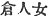
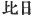
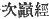
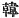

  
[Intangible Textual Heritage](../../index)  [Shinto](../index) 
[Index](index)  [Previous](kj129)  [Next](kj131) 

------------------------------------------------------------------------

[Buy this Book at
Amazon.com](https://www.amazon.com/exec/obidos/ASIN/B0028Y4SZY/internetsacredte)

------------------------------------------------------------------------

  
*The Kojiki*, translated by Basil Hall Chamberlain, \[1919\], at
Intangible Textual Heritage

------------------------------------------------------------------------

p. 340

## \[SECT. CXXIII. EMPEROR NIN-TOKU PART V.—THE EMPRESS RETIRES TO YAMASHIRO).\]

After this time the Empress made a progress to the land of Ki in order
to pluck aralia-leaves for a copious feast; [1](#fn_2063) and in the mean while the Heavenly
Sovereign wedded Yata-no-waki-iratsume. Hereupon, when the Empress was
returning in her august vessel loaded full

p. 341

of aralia-leaves, a coolie from Kozhima [2](#fn_2064) in the land of Kibi, who was in the
service of the Superintendent of the Water-Directors, [3](#fn_2065) being on his way off to his own
country, met at the great passage [4](#fn_2066) of Naniha the vessel of a lady of the
train [5](#fn_2067) who had got behind, and
forthwith told her, saying: "The Heavenly Sovereign has \[274\]
recently [6](#fn_2068) wedded
Yata-no-waki-iratsume, and plays with her day and night. It must
probably be because the Empress has not heard of this thing, that she
quietly makes progress for pleasure." Then the lady of the train, having
heard this narrative, forthwith pursued and reached the august vessel,
and reported everything exactly as the coolie had told it. Hereupon the
Empress, greatly vexed and angry, threw away into the sea all the
aralia-leaves which she had put on board the august vessel. So the
place,\[where she did so\] is called by the name of Cape Mitsu. [7](#fn_2069) Forthwith without entering the palace,
but taking her august vessel \[from it\] [8](#fn_2070) and ascending the channel [9](#fn_2071) against the current, she made a
progress up into Yamashiro by the river; [10](#fn_2072) At this time she sang, saying:

"Oh! the river of Yamashiro where the seedlings grow in succession! As I
ascend, ascend the river, oh! on the bank of the river \[there\] stands
growing a *sashibu!*—a *sashibu*-tree; below it stands growing a
broad-foliaged five hundred\[-fold branching\] true camellia-tree; oh!
he who is brilliant like its blossoms, widely powerful like its foliage,
is the great lord." [11](#fn_2073)

Forthwith going round by Yamashiro, [12](#fn_2074) and arriving at \[275\] the entrance
of the [Nara](errata.htm#83) Mountain, [13](#fn_2075) she sang, saying:

p. 342

"Oh! the river of Yamashiro where the seedlings grow in succession! As I
ascend, ascend to Miya, I pass Nara, I pass Yamato with its shield of
mountains; and the country I fain would see is Takamiya in Kadzuraki,
the neighbourhood of my home." [14](#fn_2076)

\[276\] Having sung thus, she returned and entered for some time into
the house of a person from Kara [15](#fn_2077)
named Nurinomi [16](#fn_2078) at
Tsutsuki. [17](#fn_2079)

p. 343

------------------------------------------------------------------------

### Footnotes

[340:1](kj130.htm#fr_2068) See Sect. CVII,
Note 7.

[341:2](kj130.htm#fr_2069) *I.e.*, "small
island." It is first mentioned in Sect V (Note 29).

[341:3](kj130.htm#fr_2070) See Sect. XLVII,
Note 18.

[341:4](kj130.htm#fr_2071) *Oho watari*. The
mouth of the River Yedo is meant to be designated by this name.

[341:5](kj130.htm#fr_2072) The original,
expression *kuru-bito-me* (
) is obscure, being met with nowhere else in Japanese
literature. Motowori conjectures that the function exercised by this
lady. was one connected with the Emperor's privy purse.

[341:6](kj130.htm#fr_2073) The text has the
character  , "all," which
make no sense; and Motowori (following Mabuchi) reasonably emends it to
 , "recently," "just now."

[341:7](kj130.htm#fr_2074) *Mitsu no saki*.
*Mitsu*, signifying "three," is supposed by the author to refer to the
three-cornered leaves of the aralia (the name of the latter being
*mitsuna gashiha*); but a more likely opinion is that which would have
us take *mitzu* as two words, in the sense of "august harbour." In the
parallel passage of the "Chronicles," we are told that the place was
called *Kashiha no watari*, *i.e.*, "Oak passage."

[341:8](kj130.htm#fr_2075) *I.e.*, going on up
the river without stopping at Naniha where the palace was.

[341:9](kj130.htm#fr_2076) Jr., ,the
artificial bed of the river mentioned in Sect. CXX, Note, 8.

[341:10](kj130.htm#fr_2077) *I.e.*, the river
Yodo.

[341:11](kj130.htm#fr_2078) The meaning of
this Song is: "As I make my way up the river by boat, I see a *sashibu*
(the name of a tree which cannot now be identified), below which,—that
is to say nearer to the water,—there grows a p.
343 camellia-tree, wide-spreading and full of blossoms. Ah! how
the sight of the sturdy brilliant beauty of this camellia-tree brings
back my lord and master to my mind!"—It must be remembered that in Japan
the camellia-trees grow to a size far superior to that reached by their
representatives in Europe. *Tsuginefu*, rendered according to the view
taken by Motowori and Moribe by the phrase "where the seedlings grow in
succession," is the Pillow-Word for Yamashiro, and its import is
disputed. The interpretation here adopted considers it to refer to the
regular succession of young trees planted on a mountain's side when a
tract of older timber has been cut down. Mabuchi, in his "Dictionary of
Pillow-Words," sees in it, on the contrary, a reference to the rising of
peak upon peak in a mountainous district (*tsugi-ne fu*— ). Both interpretations rest on
the connection between this term and *yama*, the first half of the name
of the province of Yamashiro, which it qualifies. "Five
[hundred](errata.htm#84)\[-fold-branching\]"and "true" are ornamental
epithets applied by the poetess to the camellia-tree. Moribe would take
the syllable *ma*, "true," in the sense of *ha*, "leaf but this seems
less good.

[341:12](kj130.htm#fr_2079) For the straight
road from Naniha in Settsu-to Nara in Yamato would have taken her
through the province of Kafuchi. and not through Yamashiro.

[341:13](kj130.htm#fr_2080) *I.e.*, the pass
or hill leading from the district of Sagara in Yamashiro to Nara in
Yamato. For Nara see Sect. LXXII, Note 23.

[342:14](kj130.htm#fr_2081) This Song
expresses the Empress's desire to return to her parental house at
Takamiya in the district of Kadzuraki,—a desire which, however, her
restless frame of mind did not allow her to fulfil.—The Pillow-Word for
Yamashiro, which here recurs, has already been discussed in Note 11.
There are two other Pillow-Words in this Song,—*awoniyoshi*, which is
prefixed to Nara, and *wo-date* (or *wo-date-yama* according to the old
reading, or *wo-date tatsu* according to another reading), which is
prefixed to Yamato. The former of these is so obscure that, rather than
attempt to render it into English, the translator prefers to refer the
student to the remarks of the various commentators,—Mabuchi *s.v.* in
his "Dictionary of Pillow-Words," Motowori in his Commentary, Vol.
XXXVI, pp. 22-24, and Moribe *in loco*. *Wodate* \[-*yama*\] seems to
refer undoubtedly to the circle of mountains that guard the approach to
the province of Yamato, and it has been rendered accordingly. The great
difficulty of the Song lies in the line rendered "ascend to Miya," and
the commentators from Keichiū downwards make all sorts of efforts to
explain it. Moribe's view, according to which the word should be
regarded p. 344 as a familiar abbreviation of
Takamiya, naturally used by one whose native place it was, seems the
most acceptable. Motowori takes the line to signify: "When I ascend past
the palace \[of Naniha\]."

[342:15](kj130.htm#fr_2082)  , *i.e.*, Korea.

[342:16](kj130.htm#fr_2083) For *Nuri no omi*,
*i.e.*, "the Grandee of Nuri." Nuri is probably a corrupt form of some
Korean name.

[342:17](kj130.htm#fr_2084) Or Tsudzuki, in
Yamashiro. Etymology obscure.

------------------------------------------------------------------------

[Next: Section CXXIV.—Emperor Nin-toku (Part VI.—He Follows the Empress
into Yamashiro)](kj131)
