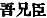

  
[Intangible Textual Heritage](../../index)  [Shinto](../index) 
[Index](index)  [Previous](kj134)  [Next](kj136) 

------------------------------------------------------------------------

[Buy this Book at
Amazon.com](https://www.amazon.com/exec/obidos/ASIN/B0028Y4SZY/internetsacredte)

------------------------------------------------------------------------

  
*The Kojiki*, translated by Basil Hall Chamberlain, \[1919\], at
Intangible Textual Heritage

------------------------------------------------------------------------

p. 353

## \[SECT. CXXVIII.—EMPEROR NIN-TOKU (PART IX.—A WILD-GOOSE LAYS AN EGG).\]

Another time, the Heavenly Sovereign, when about to hold a copious
feast, [1](#fn_2117) made a progress to the
Island of Hime, [2](#fn_2118) just when a
wild-goose had laid an egg on that island. Then, sending for His
Augustness the Noble Takeuchi, he asked him in a Song about the laying
of an egg by a wild goose. This Song said:

"Court Noble of Uchi! thou indeed art a long-lived person. Hast thou
\[ever\] heard of a wild-goose laying an egg in the land of
Yamato?" [3](#fn_2119)

Hereupon the Noble Take-uchi spoke in a song, saying: \[284\]

"August Child of the high-shining Sun, it is indeed natural that thou
shouldest deign to ask, it is indeed right that thou shouldest ask. I
indeed am a long-lived person, \[but\] have not yet heard of a wild
goose laying an egg in the land of Yamato." [4](#fn_2120)

Having thus spoken, he was granted the august [5](#fn_2121) lute and sang saying:

"Oh thou prince! the wild goose must have laid the egg because thou wilt
at last rule." [6](#fn_2122)

This is a Congratulatory Incomplete Song. [7](#fn_2123)

p. 354

------------------------------------------------------------------------

### Footnotes

[353:1](kj135.htm#fr_2122) p. 353 See Sect. CVII, 7.

[353:2](kj135.htm#fr_2123) *Hime-shima*,
*i.e.*, "Princess Island." The name is supposed to be connected with
that of the goddess of Himegoso mentioned near the end of Sect. CXIV,
and first occurs in Sect. V (Note 33).

[353:3](kj135.htm#fr_2124) The wild-goose goes
far north at the approach of spring, and the translator is informed by
Capt. Blakiston that the latter has not known p.
354 of any breeding even on the island of Yezo. The Emperor was
therefore naturally astonished at so strange an occurrence as that of a
wild-goose laying an egg in Yamato, and asks the Noble Take-uchi whether
he had ever heard of the like of it before, Take-uchi being at that time
more than two hundred years old (!) according to the chronology of the
"Chronicles," and therefore the oldest and most experienced man in the
Empire.—"Court Noble" represents the Japanese word *Aso* (for *Asomi*,
believed by Motowori and Moribe to be derived from *a se omi*  , lit, "my elder brother
minister" but used simply as a title), The words Uchi and Yamato are
preceded in the original by their respective Pillow-Words *tamaki-haru*
and *soramitsu*, whose force it is impossible to render in English, and
whose origin indeed is obscure. The words rendered "laying an egg "are
literally "giving birth to a child."

[353:4](kj135.htm#fr_2125) This Song is too
clear to need explanation. As in the preceding one, Yamato is
accompanied by the Pillow-Word *sora-mitsu*.

[353:5](kj135.htm#fr_2126) Or, "Imperial."

[353:6](kj135.htm#fr_2127) *I.e.*, say
Motowori and Moribe, who refer this episode to a time previous to
Nin-toku's accession, "The wild-goose has laid an egg in token of the
future accession to the throne." The translator prefers the view
expressed by Keichiū in his *Kō-Gan Shō*, and adopted in the
"[Explanation](errata.htm#86) of the Songs in the Chronicles of Japan,"
that the words *tsuki na* "at last," must here be taken in the sense of
"long," and the Song interpreted to mean "The wild-goose lays an egg as
an omen that thy reign will be a long one." This view is supported by
the story in the "Chronicles," which places the Song in the Emperor's
fiftieth year and gives him thirty-six years of subsequent existence,
thus making the prophecy amply fulfil itself, as one would expect that
it should do in the pages of such a work. According to the other view,
the text of the "Chronicles" calls for emendation.

[353:7](kj135.htm#fr_2128) *Hogi-uta no
kata-uta*. For "Incomplete Song" see Sect. LXXXIX, Note 14.

------------------------------------------------------------------------

[Next: Section CXXIX:—Emperor Nin-toku (Part X.—A Vessel Is Made Into A
Lute)](kj136)
