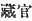
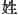

  
[Intangible Textual Heritage](../../index)  [Shinto](../index) 
[Index](index)  [Previous](kj140)  [Next](kj142) 

------------------------------------------------------------------------

[Buy this Book at
Amazon.com](https://www.amazon.com/exec/obidos/ASIN/B0028Y4SZY/internetsacredte)

------------------------------------------------------------------------

  
*The Kojiki*, translated by Basil Hall Chamberlain, \[1919\], at
Intangible Textual Heritage

------------------------------------------------------------------------

p. 363

## \[SECT. CXXXIV.—EMPEROR RI-CHIU (PART IV.—VARIOUS DEEDS).\]

The Heavenly Sovereign thereupon first appointed the Suzerain of Achi to
the office of Treasurer, [1](#fn_2168) and
likewise bestowed on him domains. [2](#fn_2169) Again in this august reign the name of
Waka-sakura Tribe [3](#fn_2170) was granted to
the Grandees of the Waka-sakura Tribe. [4](#fn_2171) Again the gentile name [5](#fn_2172) of Dukes of Himeda [6](#fn_2173) was granted to the Dukes of Himeda.
Again the Ihare Clan [7](#fn_2174) was
established.

------------------------------------------------------------------------

### Footnotes

[363:1](kj141.htm#fr_2173) p. 363 In Japanese the same word is used for a
"store-house" and for the "treasury." But the appointment here mentioned
would seem really to correspond to what we should call Lord of the
Treasury or Minister of Finance. The characters in the original are
 .

[363:2](kj141.htm#fr_2174) Literally, "ration
grounds."

[363:3](kj141.htm#fr_2175) *Waka-sakura-be*.

[363:4](kj141.htm#fr_2176) *Waka-sakura-be no
omi*. Conf. Sect. CXXXI, Note 1.

[363:5](kj141.htm#fr_2177) All the editors
agree in here reading as *kabane* ("gentile name," see Sect. XIV, Note
5) the character  , which
signifies properly "family name."

[363:6](kj141.htm#fr_2178) *Himeda no kimi*.
Nothing is known of this family.

[363:7](kj141.htm#fr_2179) *Ihare-be*. For
Ihare see Sect. XLIII, Note 6. It will be remembered that the Emperor of
whose reign the present Section forms part held his court at Ihare.

------------------------------------------------------------------------

[Next: Section CXXXV.—Emperor Ri-chiu (Part V.—His Age and Place of
Burial)](kj142)
