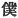

  
[Intangible Textual Heritage](../../index)  [Shinto](../index) 
[Index](index)  [Previous](kj148)  [Next](kj150) 

------------------------------------------------------------------------

[Buy this Book at
Amazon.com](https://www.amazon.com/exec/obidos/ASIN/B0028Y4SZY/internetsacredte)

------------------------------------------------------------------------

  
*The Kojiki*, translated by Basil Hall Chamberlain, \[1919\], at
Intangible Textual Heritage

------------------------------------------------------------------------

p. 371

## \[SECT. CXLII.—EMPEROR IN-GIYŌ (PART VI.—WAR BETWEEN PRINCE KARU AND PRINCE ANAHO).\]

Therefore all the officials [1](#fn_2218) and
likewise the people of the Empire turned against the Heir Apparent Karu,
and towards the August Child Anaho. Then the Heir Apparent Karu, being
alarmed, fled into the house of the Grandee the Noble Oho-mahe
Wo-mahe, [2](#fn_2219) and made a provision of
implements of war. (The arrows made at this \[298\]
time [3](#fn_2220) were provided with copper
arrow-insides: [4](#fn_2221) so those arrows
are called by the name of Karu arrows.) Prince Anaho likewise
made implements of war. (The arrows made by this
Prince were just the arrows of the present time: [5](#fn_2222) they are called Anaho arrows.)
Thereupon Anaho raised an army, and beleaguered the house of the noble
Oho-make Wo-mahe. Then, when he reached the gate, heavy ice-rain [6](#fn_2223) was falling. So he sang, saying:

"Come thus under cover of the metal gate of the Noble Oho-mahe Wo-mahe!
We will stand till the rain stops." [7](#fn_2224)

Then the Noble Oho-mahe came singing, lifting his hands, striking his
knees, dancing, and waving his arms. The Song said:

"The courtiers are tumultuous, \[saying\] that the small bell of the
garter of the courtiers has fallen off. Country-people, too,
beware!" [8](#fn_2225)

This Song is of a Courtier's Style. [9](#fn_2226) Singing thus, he \[299\] came near and
said: "August Child of our Heavenly Sovereign! Come not with arms
against the King thine elder brother. If thou shouldst come against him
with arms, people will surely laugh. I [10](#fn_2227) will secure him and

p. 372

present him to thee." [11](#fn_2228) The
Prince Anaho disbanded his troops and went away. So the Noble Oho-make
Wo-mahe secured Prince Karu, and led him forth, and presented him \[to
Prince Anaho\]. The captive Prince sang, saying:

"Maiden of heaven-soaring Karu! if thou cry violently, people will know.
Cry quietly like the doves on Mount Hasa." [12](#fn_2229)

Again he sang:

"Maiden of heaven-soaring Karu! Come and sleep, and \[then\] pass on, oh
maiden of Karu!" [13](#fn_2230)

 

p. 373

------------------------------------------------------------------------

### Footnotes

[371:1](kj149.htm#fr_2223) p. 372 See Sect. CXII, Note 4.

[371:2](kj149.htm#fr_2224) *Oho-mahe Wo-make
sukune no omi* (according to the old reading *Oho-saki Wo-saki*, etc.
Motowori considers this double name to denote two brothers, the words
*oho* and *wo* ("great "and "small") naturally lending themselves to the
interpretation of "elder" and "younger." Moribe, on the contrary, thinks
that there was but one, and is supported both by the authority of the
"Chronicles of Japan" and by the fact that, except in the "Chronicles of
Old Matters of Former Ages." which is believed to be a forgery, no
second brother is anywhere mentioned. He explains the use of the double
name in the prose text as having crept in through the influence of the
text of the following Song (see Note 7 below). This seems to the
translator the better view.

[371:3](kj149.htm#fr_2225) *I.e.*, "on this
occasion."

[371:4](kj149.htm#fr_2226) There is here an
evident corruption of the text, and Motowori aptly conjectures that
arrow-heads, or, as they are called in Japanese, arrow-points, are
intended. He adds that up till then arrow-heads had always been made of
iron.

[371:5](kj149.htm#fr_2227) The author's style
is here rather at fault; for he apparently wishes to say that the arrows
employed by Prince Anaho were those which had been used in ancient times
and were still the most universally employed—that, in fact, they were
the usual style of arrow in contradistinction to those of Prince Karu's
invention.

[371:6](kj149.htm#fr_2228) See Sect, LXXXVIII,
Note 5.

[371:7](kj149.htm#fr_2229) p. 373 The prince, in this Song, bids his troops
follow his example, and take refuge from the rain under cover of the
gate of Oho-mahe's house. Such, at least, is the actual sense of the
words used; but Motowori sees in them nothing less than a slightly
veiled exhortation to his followers to attack the castle, while Moribe,
on the other hand, thinks they were meant to convey to Oho-mahe a hint
of his presence, and enable the beleaguered prince, for whom (as being
his elder brother) Prince Anaho retained a great affection and respect,
to devise some method of escape. This seems extremely far-fetched.—The
word "metal" probably refers only to the fastenings of the gate, and not
to its whole structure.

[371:8](kj149.htm#fr_2230) The exact purport
and application of this Song is disputed, but this much seems clear:
that the composer of it seeks to quiet both the besieging army (out of
politeness called courtiers), and the peasants who had joined the fray,
by making light of the whole occurrence, which he compares to so trivial
an accident as the falling of a bell from a man's "garter" or
"leggings." The custom of ornamenting this article of dress with a smell
bell is, however, not mentioned elsewhere. The word *yume*, which
concludes the Song and is here rendered "beware," is identified by
Motowori and Moribe with the Imperative of the Verb *iwu* "to avoid,"
"to shun," "not to do."

[371:9](kj149.htm#fr_2231) *Miya-hito-buri*.
This is one of the cases which lend support to Motowori's view that the
names of the so called styles of Songs are derived from their initial
words.

[371:10](kj149.htm#fr_2232) Written with the
humble character  ,
"servant."

[372:11](kj149.htm#fr_2233) The word used in
the text, here and also in the next sentence, is that which properly
denotes the presenting of tribute.

[372:12](kj149.htm#fr_2234) Another reading
gives this sense:

"As, if the maiden of heaven-soaring Karu cried violently, people would
know, she cries quietly like the doves on Mount Hasa."

\[paragraph continues\] According to this
reading, the poet simply explains the reason of the undemonstrativeness
of his mistress's grief; according to that in the text, he implores her
not to weep too passionately.—*Amadamu* or *amadamu ya*,
"heaven-soaring, "is the Pillow-Word for Karu, applied to it punningly
on account of its similarity in sound to the word *kari*, "a wild.
goose," which well deserves the epithet "heaven-soaring." Of Mount Hasa
nothing is known.

[372:13](kj149.htm#fr_2235) p. 374 Rendered thus according to Moribe's
exegesis, which quite approves itself to the translator's mind, this
Song signifies: "Oh! maiden of Karu! come and sleep with me but once,
before my impending banishment renders it hard for us to meet again."
Motowori chooses to interpret *nete* as a crasis of *nayete*, "bending."
and sees in the Song an invitation to the maiden to come quietly so as
not to attract observation.—The final word, translated "maiden," is
*wotome-domo*, properly a Plural, but here used in a Singular sense, as
*watakuski-domo*, "I" (properly "we"), so constantly is in the modern
Colloquial Dialect. For the Pillow-Word "heaven-soaring "see preceding
Note.

------------------------------------------------------------------------

[Next: Section CXLIII.—Emperor In-giyō (Part VII.—Death of Prince Karu
and Princess So-tohoshi)](kj150)
