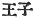

  
[Intangible Textual Heritage](../../index)  [Shinto](../index) 
[Index](index)  [Previous](kj155)  [Next](kj157) 

------------------------------------------------------------------------

[Buy this Book at
Amazon.com](https://www.amazon.com/exec/obidos/ASIN/B0028Y4SZY/internetsacredte)

------------------------------------------------------------------------

  
*The Kojiki*, translated by Basil Hall Chamberlain, \[1919\], at
Intangible Textual Heritage

------------------------------------------------------------------------

## \[SECT. CXLIX.—EMPEROR AN-KŌ (PART VI.—FLIGHT OF PRINCES OHOKE AND WOKE)\].

Hereupon King Ichi-no-be's children [1](#fn_2286) King Ohoke and King Woke (two
Deities), having heard of this affray, fled away. So when they reached
Karibawi [2](#fn_2287) in Yamashiro and were
eating their august provisions, an old man with a tattooed face came and
seized the provisions. Then the two Kings said: "We do not grudge the
provisions. But

p. 387

who art thou? "He replied, saying: "I am a boar-herd in Yamashiro." So
they fled across the River Kusuba, [3](#fn_2288) reached the land of Harima, [4](#fn_2289) entered the house of a native of that
country named Shizhimu, [5](#fn_2290) hid
their persons, and worked as grooms and cow-herds.

------------------------------------------------------------------------

### Footnotes

[386:1](kj156.htm#fr_2291) p. 387 Literally "prince" ( ). Their names apparently
signify "big basket" and "little basket."

[386:2](kj156.htm#fr_2292) Known in later
times as Kaniha and Kabawi. The name signifies (if the characters with
which it is written may be relied on) "the well where the leaves were
cut."

[387:3](kj156.htm#fr_2293) See Sect. LXVI.
Note 19.

[387:4](kj156.htm#fr_2294) See Sect. LX, Note
19.

[387:5](kj156.htm#fr_2295) Or Shizhimi.
Properly the name of a village, it is here used as the name of a man.
The etymology is obscure.

------------------------------------------------------------------------

[Next: Section CL.—Emperor Yū-riyaku, (I.—Genealogies)](kj157)
