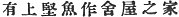
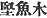
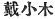
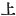

  
[Intangible Textual Heritage](../../index)  [Shinto](../index) 
[Index](index)  [Previous](kj158)  [Next](kj160) 

------------------------------------------------------------------------

[Buy this Book at
Amazon.com](https://www.amazon.com/exec/obidos/ASIN/B0028Y4SZY/internetsacredte)

------------------------------------------------------------------------

  
*The Kojiki*, translated by Basil Hall Chamberlain, \[1919\], at
Intangible Textual Heritage

------------------------------------------------------------------------

p. 389 \[311\]

## \[SECT CLII.—EMPEROR YŪ-RIYAKU (PART III.—THE ROOF OF THE HOUSE OF THE GREAT DEPARTMENTAL LORD OF SHIKI).\]

In the beginning, when the Empress [1](#fn_2298) dwelt at Kusaka, [2](#fn_2299) \[the Heavenly Sovereign\] made a
progress in Kafuchi by way of the Tadagoye [3](#fn_2300) road at Kusaka. Then, on climbing to
the top of the mountain and gazing on the interior of the country, \[he
perceived that\] there was a house built with a raised roof-frame. [4](#fn_2301) The Heavenly Sovereign sent to ask
\[concerning\] that house, saying: "Whose roof with a raised frame is
that?" The answer was: "It is the house of the great Departmental Lord
of Shiki." [5](#fn_2302) Then the Heavenly
Sovereign said: "What! a slave builds his own house in imitation of the
august abode of the Heavenly Sovereign!" . . . . and forthwith he sent
men to burn the house \[down\], when the Great Departmental Lord, with
trembling and dread, bowed his head, [6](#fn_2303) saying: "Being a slave, I like a slave
did not understand, and have built overmuch. I am in great dread." [7](#fn_2304) So the thing that he presented as an
august offering \[in token\] of his entreaty was a white dog \[312\]
clothed in cloth [8](#fn_2305) and with a bell
hung \[round its neck\]; and he made a kinsman of his own, named
Koshihaki, [9](#fn_2306) lead it by a string
and present it \[to the Heavenly Sovereign\]. So the Heavenly Sovereign
ordered them to desist from burning \[the house\].

------------------------------------------------------------------------

### Footnotes

[389:1](kj159.htm#fr_2303) p. 389 *I.e.*, *Waka-kusaka-be*.

[389:2](kj159.htm#fr_2304) See Sect. XLIV,
Note 31. The Kusaka here mentioned is that in Kafuchi.

[389:3](kj159.htm#fr_2305) From *tada*,
"straight "and *koyuru* "to cross," this being a short cut over the
mountains.

[389:4](kj159.htm#fr_2306) The original of
this clause is  , which is
read *katsuwo wo agete ya wo tsukureru ihe ari*. The *katsuwo* (properly
p. 390 *katsuwo-gi*  ) is the name of the uppermost
portion of the roof in modern Shinto temples, and apparently in ancient
times also in houses that were not devoted to religious purposes. The
difficulty is not with the sense, but with the derivation of the word
*katsuwo-gi*. Following the characters with which it is here and
elsewhere written, Motowori sees in it a reference to the shape of the
blocks of wood resembling "dried bonitoes," which is the modern
signification of *katsuwo*. But Moribe, in his "Examination of Difficult
Words," proposes a derivation which approves itself more to the present
writer's mind, viz., *kadzuku wo-gi* (
), "small timbers atop" (see "Examination of Difficult
Words," *s.v.*). Motowori's Commentary, Vol. XLI, pp. 11-14, should be
consulted for a discussion of the whole question of the use of these
frames in ancient times, and for the special force to be attributed to
the word "raised" ( ) in
this passage.

[389:5](kj159.htm#fr_2307) *Shiki no
oho-agata-nushi*. For Shiki see Sect. LXIII, Note 1.

[389:6](kj159.htm#fr_2308) *i.e.*, did humble
obeisance by prostrating himself on the ground.

[389:7](kj159.htm#fr_2309) Or, according to
the older reading, "This *i.e.*, thy command) \[is to be received with\]
awe."

[389:8](kj159.htm#fr_2310) Or, "tied with \[a
string of\] cloth." The translation follows Motowori's interpretation.

[389:9](kj159.htm#fr_2311) The name signifies
"loin-girded," *i.e.*, as may be presumed, "wearing a sword."

------------------------------------------------------------------------

[Next: Section CLIII.—Emperor Yū-riyaku (Part IV.—He Wooes Princess
Waka-kusaka-be)](kj160)
