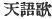
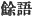
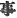

  
[Intangible Textual Heritage](../../index)  [Shinto](../index) 
[Index](index)  [Previous](kj166)  [Next](kj168) 

------------------------------------------------------------------------

[Buy this Book at
Amazon.com](https://www.amazon.com/exec/obidos/ASIN/B0028Y4SZY/internetsacredte)

------------------------------------------------------------------------

  
*The Kojiki*, translated by Basil Hall Chamberlain, \[1919\], at
Intangible Textual Heritage

------------------------------------------------------------------------

## \[SECT. CLX.—EMPEROR YŪ-RIYAKU (PART XI.—THE LEAF IN THE CUP).\]

Again when the Heavenly Sovereign made a copious feast under a
hundred-branching *tsuki*-tree [1b](#fn_2344)
at Hatsuse, a female attendant from Mihe [2b](#fn_2345) in the land of Ise lifted

p. 402

up the great august cup, and presented it to him. Then from the
hundred-branching *tsuki*-tree there fell a leaf and floated in the
great august cup. The female attendant, not knowing that the fallen leaf
was floating in the cup, did not desist from presenting [3](#fn_2346) the great august liquor to the
Heavenly Sovereign, who, perceiving the leaf floating in the cup,
knocked the female attendant down, put his sword to her neck, and was
about to cut off her head, when the female attendant spoke to the
Heavenly Sovereign, saying: "Slay me not! There is something that I must
say to thee:" and forthwith she sang, saying:

"The palace of Hishiro at Makimuku is a palace where shines the morning
sun, a palace where glistens the evening sun, a palace plentifully
rooted as the root of the bamboo, a palace with spreading roots like the
roots of the trees, a palace pestled with oh! eight hundred \[loads of\]
earth, As for the branches of the hundred-fold flourishing *tsuki*-tree
growing by the house of new licking at the august gate \[made of\]
\[322\] *chamæcyparis* \[wood\], the uppermost branch has the sky above
it, the middle branch has the east above it, the lowest branch has the
country above it. A leaf from the tip of the uppermost branch falls
against the middle branch; a leaf from the tip of the middle branch
falls against the lowest branch; a leaf from the tip of the lowest
branch, falling into the oil floating in the fresh jewelled goblet which
the maid p. 403 of Mihe is lifting up, all
\[goes\] curdle-curdle. Ah! this is very awful, August Child of the
High-Shining Sun! The tradition of the thing, too this!" [4](#fn_2347)

So on her presenting this Song, her crime was \[323\] pardoned. Then the
Empress sang. Her Song said:

"Present the luxuriant august liquor to the august child of the
high-shining sun, who is broad like the leaves, who is brilliant like
the blossoms of the broad-foliaged five hundred\[-fold branching\] true
camellia-tree that stands growing by the house of new licking in this
high metropolis of Yamato, on this high-timbered mound of the metropolis
The tradition of this thing, too this!" [5](#fn_2348)

Forthwith the Heavenly Sovereign sang, saying: \[324\]

"The people of the great palace, having put on scarfs like the
quail-birds having put their tails together like wagtails' and
congregated together like the yard-sparrows, may perhaps to-day be truly
steeped in liquor,—the people of the palace of the high-shining sun. The
tradition of the thing, too, this." [6](#fn_2349)

These three Songs are Songs of Heavenly Words. [7](#fn_2350) \[325\] So at this copious feast this
female attendant from Mihe was praised and plentifully endowed.

p. 404 p. 405
p. 406

------------------------------------------------------------------------

### Footnotes

[401:1b](kj167.htm#fr_2349) p. 403 Said to be scarcely distinguishable from the
*keyaki* (*Zelkowa keaki*)

[401:2b](kj167.htm#fr_2350) See Sect. LXXXIX,
Note 7.

[402:3](kj167.htm#fr_2351) Literally "still
presented."

[403:4](kj167.htm#fr_2352) p. 404 To understand the allusion at the beginning
of this Song to the palace of Hishiro at Makimuku, which had been the
residence of the Emperor Kei-kō (See Sect. LXXVI, Note 1), it must be
known that in the account of the reign of that monarch as given in the
"Chronicles" there is a story which, like that in the text, turns on
carelessness in dealing with a goblet,—carelessness which Kei-kō
graciously pardoned. Moreover the scene of the incident here related was
in the immediate neighbourhood of the old palace of Hishiro. There was
therefore a double reason for referring to that place; and the
under-current of insinuation is, that as Kei-kō in the olden time
forgave the courtiers who forgot his goblet, will not the present
Sovereign forgive the maid of Mihe for letting a leaf fall into his? The
poetess, after describing the splendour and solidity of the Imperial
abode, passes on to a mention of the luxuriant and many-branching
*tsuki*-tree growing near "the house of new licking," *i.e.*, the sacred
hall where the Sovereign performed each year the ceremony of tasting the
first-fruits of the harvest. The "gate" may either be taken in its
literal acceptation, or else regarded as used by metonymy for the palace
itself. The description of that which the middle and lowest branches
"have above them" is somewhat obscure, and perhaps the words should not
be too strictly pressed for a perfectly rational meaning, their chief
use being as metrical parallelisms. The supposition of the commentators
is however that the poetess, in speaking of this immense tree, meant to
say that the middle branch (or branches) spread eastward, and the lowest
branches westward. Next we are told of the fall of the fatal leaf into
the oil, *i.e.*, into the liquor, contained in the Imperial goblet; and
the poetess, before acknowledging the awfulness of her misdemeanour,
skilfully brings in an allusion to the Japanese account of the creation,
when the drops that fell from the spear used by the creator and creatrix
Izanagi and Izanami to make the brine "go curdle-curdle" did very good
work indeed; for they were piled up and became the first-formed island
for the Japanese archipelago (see Sect. III): for drops to fall down, or
for leaves to fall into drops (of wine), must therefore surely be a good
omen rather than a crime. Conformably with the hesitating nature of her
allusion, the maiden leaves it quite uncertain what is conceived of as
"going curdle-curdle" in the present instance. In fact, neither must the
thought be pressed too far, nor the sentence searched too rigorously
from a grammatical point of view. Such intentional vagueness is one of
the specific characteristics of a great deal of the poetry of Japan. The
words "the tradition of the thing, p. 405
too, this!", which conclude the poem, are obscure in another and more
usual sense; but, having been already treated of in Note 4 to Sect.
XXIV, they need not detain us here. They do not affect the sense of the
rest of the poem. Two points more remain to be noticed: one is that the
word *Mihe* and *hi no mi hado* ("august gate of
[chamæcyparis](errata.htm#105)") are respectively preceded by the
Pillow-Words *ariginu no*, whose signification is disputed, and
*makisaku*, which signifies "splitting true trees;" the other, that the
original of the word "glistens" near the commencement of the poem only
has that sense if, following [Moribe](errata.htm#106), we identify
*hi-gakeru* with *hi-kagayakeru*. As it stands, the word *kakeru* lends
itself more naturally to the interpretation of "sets." But the logical
difficulty of accepting the phrase "where the sun sets" in such a
context, where on the contrary some phrase of good omen is alone
appropriate, seems greater than the philological difficulty of deriving
*hi-gakeru* by a process of contraction from *hi-kagayakeru*. The
designation of the Emperor or Heir Apparent by the title of "august
child of the high-shining sun" has been met with before, and needs no
explanation when the solar ancestry claimed by the Japanese monarchs is
called to mind.

[403:5](kj167.htm#fr_2353) The gist of this
Song, which must be supposed to be addressed to the female attendant, is
simply: "Present the goblet full of liquor to the Emperor."—In
accordance with the rules of Japanese construction the Imperative
"present," which is the chief Verb of the sentence, comes last, and is
preceded by the comparison of the Monarch to the leaves and flowers of
the camellia-tree, while the comparatively unimportant words describing
the position of the tree come at the beginning. Thus in a literal
English translation the climax is necessarily spoilt through the
reversal of the order of the words. The "broad-leafed camellia "has
already appeared in Sect. CXXIII, Note 11, the "house of new licking"
has been explained in the note immediately preceding the present one,
and the incomprehensible concluding exclamation has been discussed in
Sect. XXIV, Note 4. The "high metropolis "of Yamato is of course the
then capital. There is however some doubt whether the word take-chi,
which is here thus rendered, should not rather be considered as a proper
name. The expression *ko-dakaru*, rendered "high-timbered." is also
doubtful. Motowori interprets it simply as "slightly high." Moribe seems
right in explaining the word *tsukasa* to mean "a mound."

[403:6](kj167.htm#fr_2354) This Song is here
out of place, and is supposed by Motowori to have been composed, not by
the Emperor, but by some court-lady who was absent from the feast. The
meaning simply is: "Ah yes," ’tis to-day that the court ladies are
"drinking their fill of rice-liquor\[.—and p.
406 would that I were with them)!"—The picture here presented of
the manners of the court is not attractive; but the comparison of the
ladies' appearance with that of various birds is quaint. The
commentators tell us that [the](errata.htm#107) appropriateness of the
use of the word "scarfs" as applied to the quail lies in the peculiar
plumage of that bird, which makes it look as if it had a scarf on.
"Having put their tails together" means "standing with their trains in a
row." The epithet "yard "applied to the sparrows paints the habits of
that bird. The words "great palace" are in the original preceded by the
Pillow-Word *momoshiki no*, whose signification is disputed. After lines

*Kefu mo ka mo*  
     *Saka-mi-dzuku-rashi*.

rendered "may perhaps to day be truly steeped in liquor," Moribe would
like to consider the lines

Asu ma koma  
     *Saka-mi-dzuku-rashi*,

*i.e.*, "may perhaps to-morrow be truly steeped in liquor" to have been
accidentally omitted. There is no doubt but that their insertion would
add to the effect of the poem from the point of view of style.

[403:7](kj167.htm#fr_2355)  , read *ama-koto-uta*. This
expression is altogether obscure, and the commentators differ in their
interpretations of it. Mabuchi, following the characters, sees in them
an allusion to the words "august child of the high-shining sun" which
recurs in each of the three Songs thus bracketed together. Motowori
thinks that *ama-koto* should be regarded as standing for *amari-goto*
( ) "surplus words," in
allusion to the meaningless *refrain* with which the Songs in question
terminate. Other Songs, however, which end in the same manner, are not
thus designated. Moribe's exegesis, though founded on Motowori's is
preferable to it. Accepting *ama-koto* as a contraction of *amari-goto*,
he would take the second half of the compound in the sense of "things,"
not "words" (  not  ), and regard the whole as
signifying that the Songs were composed or sung after the conclusion of
the actual feast. Against this view must be set the fact that the
Chinese characters lend it no support. The translator, has, as usual
when in doubt, preferred to adhere to the sense given by the characters.

------------------------------------------------------------------------

[Next: Section CLXI.—Emperor Yū-riyaku (Part XII.—Songs by the Emperor
and Princess Wodo)](kj168)
