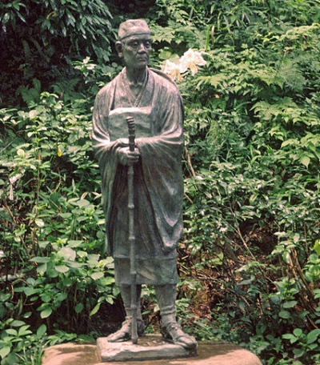

  
[Intangible Textual Heritage](../../index)  [Japan](../index)  [Wisdom
of the East](../../woe/index) 

------------------------------------------------------------------------

<table width="75%">
<colgroup>
<col style="width: 50%" />
<col style="width: 50%" />
</colgroup>
<tbody>
<tr class="odd">
<td width="50%" data-valign="TOP"></td>
<td width="50%" data-valign="CENTER"><h1 id="the-master-singers-of-japan" data-align="CENTER">The Master-Singers of Japan</h1>
<h2 id="by-clara-a.-walsh" data-align="CENTER">by Clara A. Walsh</h2>
<h4 id="section" data-align="CENTER">[1914]</h4></td>
</tr>
</tbody>
</table>

------------------------------------------------------------------------

[Contents](#contents)    [Start Reading](msj00)    [Page
Index](pageidx)    [Text \[Zipped\]](msj.txt.gz)

------------------------------------------------------------------------

This is a selection of Japanese classical poetry, including the
classical Tanka form, translated as part of the Wisdom of the East
Series. She includes numerous poems from such works as the Maniyoshu,
plus several more modern compositions such as the Japanese National
Anthem. The collection has been broken down into about two dozen
arbitrary sections. Sometimes these sections correspond to a particular
writer, sometimes not.

------------------------------------------------------------------------

 [Title Page](msj00)  
[Contents](msj01)  
[Editorial Note](msj02)  
[Introduction](msj03)  
[I.](msj04)  
[II.](msj05)  
[III.](msj06)  
[IV.](msj07)  
[V.](msj08)  
[VI.](msj09)  
[VII.](msj10)  
[VIII.](msj11)  
[IX.](msj12)  
[XII.](msj13)  
[XIII.](msj14)  
[XIV.](msj15)  
[XV.](msj16)  
[XVI.](msj17)  
[XVII.](msj18)  
[XVIII.](msj19)  
[XIX.](msj20)  
[XX.](msj21)  
[XXI.](msj22)  
[XXII.](msj23)  
[XXIII.](msj24)  
