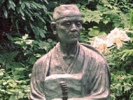

  
[Intangible Textual Heritage](../../index)  [Japan](../index)  [Wisdom
of the East](../../woe/index)  [Index](index)  [Previous](msj23) 

------------------------------------------------------------------------

  
*The Master-Singers of Japan*, by Clara A. Walsh, \[1914\], at
Intangible Textual Heritage

------------------------------------------------------------------------

### BUSHIDŌ

(Rendered into English by S. Uchida,
Esq.)

By Tenshu Nishimura

Our Sunrise Land hath been from ancient times  
Founded on valour, built on chivalry.  
Three sister-virtues, moulded into one,  
Wisdom, and Courage, and Humanity:  
These laid the corner-stone, and reared the frame,  
Yamato's Spirit, and her "warrior-way"!

Three heav’nly gifts to our Imperial Line  
Have been the source and sign of our ideal:  
The polished Mirror, emblem of the mind,  
The keen-edged Sword, for valour's dauntless heart,  
The precious Gem, for human kindliness.  
These treasures three have long in symbol taught  
The threefold virtue of the warrior-way!

p. 113

Wisdom dwells oft in warriors, and therewith  
Courage to face alone a thousand men!  
But dull is wit and brutal bravery  
That knows not mercy—source of all true deeds.  
For even war at last doth serve her ends,  
The people's safety. So the saying is,  
"Who knows not pity is no warrior!"  
Behold the men, whom deep we reverence,  
As showing forth our country's "Knightly Way."

The elder Kusunoki wise and brave,  
And yet withal so sweet compassionate,  
That o’er the grave of vanquished enemies  
Re read the service for departed souls.

Like him, his son the brave Masatsura,  
When there came word of his advancing foes.  
’Twas in the frost of Autumn's latest moon),  
Undaunted by their greater force he led  
His horsemen resolutely to the field.

Raising their shouts of war, the armies met,  
Fierce surged the wave of battle up and down.  
Here, with a merry song upon his lips,  
Enters a valiant youth amid the fray;  
Yonder a priest in arms, a giant form,  
His ten-foot spear propped on his stallion's neck,  
Charging across the field to right and left,  
Lays six-and-thirty horsemen on the ground.

p. 114

The clanging sabres echo to the skies!  
The foaming war-steeds shake the very earth!

With seven wounds from deadly sword and spear,  
The foemen's Leader turns, his men with him,  
And madly spur their weary steeds to flight,  
Till, hot-pursued and pressed, their vanguard crowds  
Into the turbulent November stream:  
Five hundred perished in the river there.

At such a time no idle pity serves!  
Compassionately then Masatsura  
Came to the rescue of his drowning foes,  
And brought them safe to land, dressing their wounds,  
And warmed and fed them in his kindly camp,  
Until, with crown of knightly courtesy,  
He sent them forth, all mounted and with arms,  
Both friend and foe acclaimed his nobleness!

Then was there too that Chief of Satsuma  
Who from Korea came in triumph home,  
And raised a stone in memory of the dead,  
Or friend or foe—and made his offerings  
That thus their souls might find the way to peace.

Such are the men whom warriors emulate,  
Such too the meaning of the Cross of Red—  
Emblem of love in lands beyond the sea.

p. 115

Ah! human kindness hath been from of old!  
And such the Truth our ancient "Knightly Way"  
Hath handed down to us in every age.

O precious Truth bound with our country's life!  
Now is the time for warrior souls to rise!  
Now is the time for warlike zeal to glow!  
As mirror, sword and gem have taught our land,  
Of wisdom, valour and humanity;  
This threefold glory of our chivalry,  
O Nation! keep unsullied as of old!

Still let our country's honour sound abroad!  
Still let our country's glory shine afar!

### LOYAL UNTO DEATH

At the Battle of Nanshan an officer lay dead with
what seemed a bit of towelling wound round his head. It proved to be the
Sun-Flag of Japan, which he had thus preserved from capture in the
Russian trenches. When it was unwound, the following lines, stained with
blood, were found written by the hand of the dead hero. [\*](#fn_8)

Though our life vanish with the morrow's dew,  
O Sovereign Prince! yet loyally and true  
Thy Standard still, for ever shall we guard!

p. 116

### H.I.M. THE EMPEROR OF JAPAN

LITERARY ACCOMPLISHMENTS OF H.I.M. THE EMPEROR AND H.I.M. THE EMPRESS

Both the Emperor and Empress of Japan are highly
accomplished in the art of Poetry. His Imperial Majesty is said to
devote a part of every evening to the writing of Tanka, and has composed
many thousand thirty-one-syllable odes. The Empress also is considered
by poetic experts to show particular talent in these compositions. Every
New Year a certain theme is chosen by His Imperial Majesty, on which
Emperor, Empress, and other high personages write odes. The whole
nation, irrespective of rank, is invited to compete and send in
compositions by a certain date. The Master of the Court Composers then
makes a selection of the best and reads them before their Imperial
Majesties. Afterwards the selected odes have the high honour of
appearing in the Government *Gazette* with those of the Emperor,
Empress, and other distinguished personages.

### LINES WRITTEN BY H.I.M. THE EMPEROR OF JAPAN DURING THE RUSSO-JAPANESE WAR

The night is dark and long,  
Mosquito's shrilling song  
  And petty stings  
Persistent, break my rest,  
And sleep forsakes my brow.  
   .    .    .    .    .    .    .  
Under the chill night sky,  
On what dark field may lie  
My soldiers now!

p. 117

### IN TIME OF PEACE

by H.I.M. The Emperor

Peace rules Our country, and Our people there  
Greet the delights the budding year can bring.  
I too am happy since my heart can share  
My people's pleasure in the joys of Spring I

### FUJI

by H.I.M. The Emperor

Glorious is Fuji's summit, shining white  
Into the rare and cloudless morning blue;  
Let us attain the same majestic height  
In our hearts' aspirations, noble, true!

### THE SHRINE

by H.I.M. The Empress of Japan

Into the frosty night the deep-toned bell  
Thrills, with a sad, heart-penetrating sound,  
From the far Temple precincts, wherein dwell,  
Through the chill darkness, solemn and profound,  
The faithful Guardians of the Sacred Shrine,  
Watching through silent hours the place divine!

p. 118

### THE RIVER

by H.I.M. The Empress

A people's heart restrained too sternly  
May overflow and burst all barriers,  
As the heart of a river, overflowing,  
Swells, and sweeps away all boundaries,

### IN SPRING

by H.I.M. The Empress

When in the Spring I pass through mountain ways,  
I see camellia blooms all scattered lie  
In dewy beauty on the paths. A haze  
Of drizzling rain obscures the weeping sky!

p. 119

### THE NATIONAL ANTHEM OF JAPAN

("Kimi Ga Yo")

Through countless ages yet unborn,  
Still may our Lord's Dominion last,  
Till by each streamlet, water-worn,  
The tiny pebbles that each morn  
Scarce in the sunlight shadows cast,  
Grow into boulders, mossy, vast! [\*](#fn_9)

or, Literal Translation:

  May our Lord's Empire  
Live, through a thousand ages,  
  Till tiny pebbles  
Grow into giant boulders  
Covered with emerald mosses!\]

p. 120

### Envoy

### THE EAST TO THE WEST

(Remarks of a Japanese Scholar rendered into verse from Lafcadio Hearn's
" Unfamiliar Japan")

You, of the West, still ask the "Eternal Why?"  
Probing the mist-wreaths of religious thought.  
We, of the East, have sounded depth on depth,  
Only to find beneath the deeper depths  
Still others, dark, unfathomed and profound!  
Out to the farthest limits thought can reach,  
Through Buddhism we voyaged—but to see  
Ever the far horizon, far recede.  
As children playing by a little stream,  
Familiar with the still dark pools that lie  
Beneath the willows, and the flattening whirl  
Of waters, a sharp gust sends shivering by,  
And all the noisy babble over stones,  
With the white foam of miniature cascades.  
These for a thousand years you played with, knew—  
But of the bourne to which that streamlet runs  
Knew not. And only now, by winding paths  
Different to ours, you reach the Ocean's shore,  
And stand like startled children, all amaze  
To you, the vastness is a wonder new,  
And you would sail to—nowhere—since you saw  
The Infinite across the sands of Time!

 

 

 

\_\_\_\_\_\_\_\_\_\_\_\_\_\_\_\_\_\_\_\_\_\_\_\_\_\_\_\_\_\_\_\_\_\_\_\_\_\_\_\_\_\_\_\_\_\_\_\_\_\_\_\_\_\_\_\_\_\_\_\_  
*Printed by Hazell, Watson & Viney, Ld.., London and Aylesbury,
England*.

 

 

 

------------------------------------------------------------------------

### Footnotes

[115:\*](msj24.htm#fr_8) From Bennet-Burleigh's
"Empire of the East "

[119:\*](msj24.htm#fr_9) The words of the Anthem
are part of a very ancient Uta, alluded to in the preface to the
"Kokinshiu." The author is unknown. It was put to the present music, I
understand, by a French (?) musician attached to the Imperial Court,
about twenty years ago.

 
