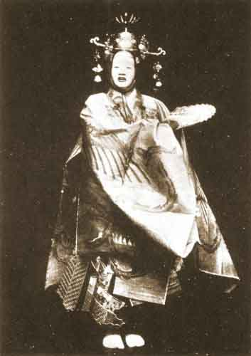

  
[Intangible Textual Heritage](../../index)  [Shinto](../index) 
[Buddhism](../../bud/index) 

------------------------------------------------------------------------

<table width="75%">
<colgroup>
<col style="width: 50%" />
<col style="width: 50%" />
</colgroup>
<tbody>
<tr class="odd">
<td data-valign="CENTER" width="50%"></td>
<td data-valign="CENTER" width="50%"><h1 id="the-nō-plays-of-japan" data-align="CENTER">The Nō Plays of Japan</h1>
<h2 id="by-arthur-waley" data-align="CENTER">By Arthur Waley</h2>
<h4 id="section" data-align="CENTER">[1921]</h4></td>
</tr>
</tbody>
</table>

------------------------------------------------------------------------

Nō (also spelled [Noh](mstknoh)) drama incorporates folk-tales, poetry,
and dance in an exquisite, very formalized setting. These works are of
interest beyond their artistic appeal, because they are interwoven with
Buddhist (and to a lesser extent, Shinto) traditions and beliefs, and
provide deep insight into Japanese culture.

------------------------------------------------------------------------

[Title Page](npj00)  
[Contents](npj01)  
[Illustrations](npj02)  
[Plan I](npj03)  
[Plan II](npj04)  
[Introduction](npj05)  
[Note on Buddhism](npj06)  

### Chapter I

[Chapter I](npj07)  
[Atsumori](npj08)  
[Ikuta](npj09)  
[Tsunemasa](npj10)  

### Chapter II

[Chapter II](npj11)  
[Kumasaka](npj12)  
[Eboshi-ori](npj13)  
[Benkei on the Bridge](npj14)  

### Chapter III.

[Chapter III](npj15)  
[Kagekiyo](npj16)  
[Hachi no Ki](npj17)  
[Note on Komachi](npj18)  
[Sotoba Komachi](npj19)  

### Chapter IV

[Chapter IV](npj20)  
[Note on Ukai](npj21)  
[Ukai (the Cormorant-Fisher)](npj22)  
[Aya no Tsuzumi (The Damask Drum)](npj23)  
[Note On Aoi no Uye](npj24)  
[Aoi no Uye (Princess Hollyhock)](npj25)  

### Chapter V

[Chapter V](npj26)  
[Note On Kantan](npj27)  
[Kantan](npj28)  
[The Hōka Priests](npj29)  
[Note on Hagoromo](npj30)  
[Hagoromo](npj31)  

### Chapter VI

[Chapter VI](npj32)  
[Note on Tanikō and Ikeniye](npj33)  
[Tanikō (The Valley-Hurling)](npj34)  
[Ikeniye (The Pool-Sacrifice)](npj35)  
[Hatsuyuki (Early Snow)](npj36)  
[Haku Rakuten](npj37)  

### Chapter VII: Summaries

[Chapter VII: Summaries](npj38)  
[Hanakatami (The Flower Basket](npj39)  
[Ominameshi](npj40)  
[Matsukaze](npj41)  
[Shunkwan](npj42)  
[Ama (The Fisher-Girl)](npj43)  
[Take no Yuki (Snow on the Bamboos)](npj44)  
[Tori-oi](npj45)  
[Yuya](npj46)  
[Tango-Monogurui](npj47)  
[Ikkaku Sennin](npj48)  
[Yamauba (The Dame of the Mountains)](npj49)  
[Hotoke no Hara](npj50)  
[Mari (The Football)](npj51)  
[Tōru](npj52)  
[Mai-Guruma (The Dance Waggons)](npj53)  

### Chapter VIII: Kyōgen

[Chapter VIII: Kyōgen (Farcical Interlude)](npj54)  
[Short Bibliography](npj55)  
[Appendix I](npj56)  
[Appendix II](npj57)  
