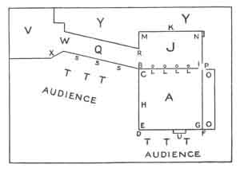

  
[Intangible Textual Heritage](../../index)  [Shinto](../index) 
[Buddhism](../../bud/index)  [Index](index)  [Previous](npj03) 
[Next](npj05) 

------------------------------------------------------------------------

p. 14

# KEY TO PLAN II

### MODERN STAGE

A The Stage.

B The *shite's* Pillar.

C *Shite's* seat, also called "Name-saying seat."

D *Metsuke-bashira*, Pillar on which the actor fixes his eye.

E *Sumi*, the corner.

F *Waki's* Pillar, also called the Prime Minister's Pillar.

G *Waki's* seat.

H *Waki's* direction-point. (The point he faces when in his normal
position.)

I Flute-player's Pillar.

J *Atoza*, the Behind-space.

K *Kagami-ita*, the back-wall with the pine-tree painted on it.

L The musicians. (Represented by the four small circles.)

M The stage-attendant's place. (A stage-hand in plain clothes who
fetches and carries.)

N *Kirido*, "Hurry-door," also called "Forgetting-door" and
"Stomach-ache door"; used by the chorus and occasionally by actors
making a hurried exit. *Vide Hōkazō*, p. 205.

O Chorus, the leader sits near P.

P The Nobles' door (now seldom used).

Q The *Hashigakari*.

R The *kyōgen's* seat.

S The three pine-branches.

T *Shirasu*, a gravel-path.

U *Kizahashi*, steps from stage to auditorium, formerly used by an actor
summoned to speak with the Shōgun.

V Actors' dressing-room.

W Curtain between Q and V.

X Dressing-room window.

Y Musicians' room.

p. 15

 

  
Plan II: Modern Stage

 

------------------------------------------------------------------------

[Next: Introduction](npj05)
