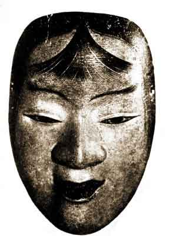

  
[Intangible Textual Heritage](../../index)  [Shinto](../index) 
[Buddhism](../../bud/index)  [Index](index)  [Previous](npj12) 
[Next](npj14) 

------------------------------------------------------------------------

p. 69

### EBOSHI-ORI

### By MIYAMASU (sixteenth century?)

PERSONS

KICHIJI and HIS BROTHER KICHIROKU Gold-merchants.  
USHIWAKA.  
MESSENGER.  
HATMAKER.  
HATMAKER'S WIFE.  
INNKEEPER.  
KUMASAKA.  
BRIGANDS.  
CHORUS.

KICHIJI.

We as travellers dressed--  
Our weary feet upon the Eastern road  
For many days must speed.

I am Sanjō no Kichiji. I have now amassed a great store of treasure and
with my brother Kichiroku am going to take it down to the East. Ho!
Kichiroku, let us get together our bundles and start now.

KICHIROKU.

I am ready. Let us start at once.

USHIWAKA.

Hie, you travellers! If you are going up-country, please take me with
you.

KICHIJI.

That is a small thing to ask. Certainly we would take you with us ....
but by the look of you, I fancy you must be an apprentice playing truant
from your master. If that is so, I cannot take you.

USHIWAKA.

I have neither father nor mother, and my master has turned me adrift.
Please let me go with you.

p. 70

KICHIJI.

If that is so, I cannot any longer refuse to take you with me.
(*Describing his own action*.)  
Then he offered the boy a broad-brimmed hat.

USHIWAKA.

And Ushiwaka eagerly grasped it.  
To-day, he said, begins our troublous journey's toil.

CHORUS (*describing the journey and speaking for* USHIWAKA).

Past the creek of Awata, to Matsusaka,  
To the shore of Shinomiya I travel.  
Down the road to the barrier of Osaka walking behind pack-ponies,  
How long shall I serve in sadness these hucksters of gold?  
Here where once the blind harper [1](#fn_47) lay
sorrowing  
On a cottage-bed, far away from the City,  
Thinking perhaps some such thoughts as I do now.  
We have passed the plain of Awazu. Over the long bridge of Seta  
The hoofs of our ponies clank.  
We cross the hill of Moru, where the evening dew  
Lies thick on country paths and, caught in the slanting light,  
Gleams on the under-leaves till suddenly night  
Comes on us and in darkness we approach  
The Mirror Inn.

KICHIJI.

We have travelled so fast that we have already reached the Mirror Inn.
Let us rest here for a little while.

MESSENGER.

I am a servant in the Palace of Rokuhara. I have been sent to fetch back
young Ushiwaka, Lord Yoshitomo's son, who has escaped from the Temple of
Kurama. It is thought that he has taken service with the merchant
Kichiji and has gone up-country with him; so they sent me to bring him
back. Why, I believe that is he! But perhaps he is not alone. I cannot
be sure. I had better go home and fetch help, for if I were one against
many, how could I hope to take him?

USHIWAKA.

I think it is about me that this messenger is speaking. I must not

 

  
YOUNG MAN'S MASK

 

p. 71

let him know me. I will cut my hair and wear an *eboshi*, [1](#fn_48) so that people may think I am an Eastern
boy.

(*He goes to the curtain which separates the green-room from the
entrance-passage. This represents for the moment the front of the
hatmaker's shop*.)

May I come in? (*The curtain is raised*.)

HATMAKER.

Who is it?

USHIWAKA.

I have come to order an *eboshi*.

HATMAKER.

An *eboshi* at this time of night? I will make you one to-morrow, if you
like.

USHIWAKA.

Please make it now. I am travelling in a hurry and cannot wait.

HATMAKER.

Very well then; I will make it now. What size do you take?

USHIWAKA.

Please give me an *eboshi* of the third size, folded to the left.

HATMAKER.

I am afraid I cannot do that. They were worn folded to the left in the
time of the Minamotos. But now that the Tairas rule the whole land it
would not be possible to wear one folded so.

USHIWAKA.

In spite of that I beg of you to make me one. There is a good reason for
my asking.

HATMAKER.

Well, as you are so young there cannot be much harm in your wearing it.
I will make you one.

(*He begins to make the hat*.)

 

p. 72

There is a fine story about these left-folded eboshi and the luck they
bring. Shall I tell it you?

USHIWAKA.

Yes, pray tell me the story.

HATMAKER.

My grandfather lived at Karasu-maru in the Third Ward.  
It was the time when Hachimantarō Yoshi-iye, having routed [1](#fn_49) the brothers Sadatō and Munetō,  
Came home in triumph to the Capital.  
And when he was summoned to the Emperor's Palace, he went first to my
grandfather and ordered from him  
A left-folded *eboshi* for the Audience. And when he was come before the
Throne  
The Emperor welcomed him gladly  
And as a token of great favour made him lord  
Of the lands of Outer Mutsu.  
Even such an *eboshi* it is that I am making now,  
A garment of good omen.  
Wear it and when into the world

CHORUS.

When into the world you go, who knows but that Fate's turn  
May not at last bring you to lordship of lands,  
Of Dewa or the country of Michi.  
And on that day remember,  
Oh deign to remember, him that now with words of good omen  
Folds for you this *eboshi*.  
On that day forget not the gift you owe!  
But alas!  
These things were, but shall not be again.  
The time of the left-folded *eboshi* was long ago:  
When the houses of Gen and Hei [2](#fn_50) were
in their pride,  
like the plum-tree and cherry-tree among flowers,  
Like Spring and Autumn among the four seasons.  
Then, as snow that would outsparkle the moonlight,  
Gen strove with Hei; and after the years of Hōgen, [3](#fn_51) p. 73  
The house of Hei prevailed and the whole land was theirs.  
So is it now.  
But retribution shall come; time shall bring  
Its changes to the world and like the cherry-blossom  
This *eboshi* that knows its season  
Shall bloom again. Wait patiently for that time!

HATMAKER.

And while they prayed

CHORUS.

Lo! The cutting of the *eboshi* was done.  
Then he decked it brightly with ribbons of three colours,  
Tied the strings to it and finished it handsomely.  
"Pray deign to wear it," he cried, and set it on the boy's head.  
Then, stepping back to look,  
"Oh admirable skill! Not even the captain of a mighty host  
Need scorn to wear this hat!"

HATMAKER.

There is not an *eboshi* in the land that fits so well.

USHIWAKA.

You are right; please take this sword in payment for it.

HATMAKER.

No, no! I could not take it in return for such a trifle.

USHIWAKA.

I beg you to accept it.

HATMAKER.

Well, I cannot any longer refuse. How glad my wife will be! (*Calling*.)
Are you there?

WIFE.

What is it? (*They go aside*.)

HATMAKER.

This young lad asked me to make him an *eboshi*, and when it was made he
gave me this sword as a present. Is it not a noble payment? p. 74 Here, look at it. (*The wife takes the sword
and when she has examined it bursts into tears*.) Why, I thought you
would treasure it like a gift matter? from Heaven. And here you are
shedding tears over it! What is the matter?

WIFE.

Oh! I am ashamed. When I try to speak, tears come first and choke the
words. I am going to tell you something I have never told you before. I
am the sister of Kamada Masakiyo who fell at the Battle of Utsumi in the
country of Noma. At the time when Tokiwa bore Ushiwaka, her third son,
the lord her husband sent her this weapon as a charm-sword, and I was
the messenger whom he charged to carry it. Oh were he in the world
again; [1](#fn_52) then would our eyes no longer
behold such misery. Oh sorrow, sorrow!

HATMAKER.

You say that you are the sister of Kamada Masakiyo?

WIFE.

I am.

HATMAKER.

How strange, how strange! I have lived with you all these years and
months, and never knew till now. But are you sure that you recognize
this weapon?

WIFE.

Yes; this was the sword they called Konnentō.

HATMAKER.

Ah! I have heard that name. Then this must be the young Lord Ushiwaka
from Kurama Temple. Come with me. We must go after him and give him back
the sword at once. Why, he is still there! (*To* USHIWAKA.) Sir, this
woman tells me she knows the sword; I beg of you to take it back.

USHIWAKA.

Oh! strange adventure; to meet so far from home  
With humble folk that show me kindness!

p. 75

HATMAKER and WIFE.

My Lord, forgive us! We did not know you; but now we see in you Lord
Ushiwaka, the nursling of Kurama Temple.

USHIWAKA.

I am no other. (*To the* WIFE.) And you, perhaps, are some kinswoman of
Masakiyo? [1](#fn_53)

WIFE.

You have guessed wisely, sir; I am the Kamada's sister.

USHIWAKA.

Lady Akoya?

WIFE.

I am.

USHIWAKA.

Truly I have reason to know. . . . And *I* 

CHORUS.

Am Ushiwaka, fallen on profitless days.  
Of whom no longer you may speak  
As master, but as one sunk in strange servitude.  
Dawn is in the east; the pale moon fades from the sky, as he sets forth
from the Mirror Inn.

HATMAKER and WIFE.

Oh! it breaks my heart to see him! A boy of noble name walking barefoot
with merchants, and nothing on his journey but cloth of Shikama to
clothe him. Oh! piteous sight!

USHIWAKA.

Change rules the world for ever, and Man but for a little while. What
are fine clothes to me, what life itself while foemen flaunt?

HATMAKER.

As a journey-present to speed you on the Eastern road . . .

 

p. 76

CHORUS.

So he spoke and pressed the sword into the young lord's hands. And the
boy could not any longer refuse, but taking it said, "If ever I come
into the World [1](#fn_54) again, I will not
forget." And so saying he turned and went on his way m company with the
merchants his masters. On they went till at last, weary with travel,
they came to the Inn of Akasaka in the country of Mino.

KICHIJI (the merchant).

We have come so fast that here we are at the Inn of Akasaka.

(*To his* BROTHER.)

Listen, Kichiroku, you had better take lodging for us here.

KICHIROKU.

I obey. (*Goes towards the hashigakari or actors' entrance-passage*.)  
May I come in?

INNKEEPER.

Who are you? Ah! it is Master Kichiroku. I am glad to see you back again
so soon.

(*To* KICHIJI.)

Be on your guard, gentleman. For a desperate gang has got wind of your
coming and has sworn to set upon you to-night.

KICHIJI.

What are we to do?

KICHIROKU.

I cannot tell.

USHIWAKA (*comes forward*).

What are you speaking of?

KICHIJI.

We have heard that robbers may be coming to-night. We were wondering
what we should do. . . .

USHIWAKA.

Let them come in what force they will; yet if one stout soldier go p. 77 to meet them, they will not stand their
ground, though they be fifty mounted men.

KICHIJI.

These are trusty words that you have spoken to us. One and all we look
to you. . . .

USHIWAKA.

Then arm yourselves and wait. I will go out to meet them.

CHORUS.

And while he spoke, evening passed to darkness. "Now is the time," he
cried, "to show the world those arts of war that for many months and
years upon the Mountain of Kurama I have rehearsed."

Then he opened the double-doors and waited there for the slow incoming
of the white waves. [1](#fn_55)

BRIGANDS.

Loud the noise of assault. The lashing of white waves against the rocks,
even such is the din of our battle-cry.

KUMASAKA.

Ho, my man! Who is there?

BRIGAND.

I stand before you.

KUMASAKA.

How fared those skirmishers I sent to make a sudden breach? Blew the
wind briskly within?

BRIGAND.

Briskly indeed; for some are slain and many grievously wounded.

KUMASAKA.

How can that be? I thought that none were within but the merchants,
Kichiji and his brother. Who else is there?

 

p. 78

BRIGAND.

By the light of a rocket [1](#fn_56) I saw a lad
of twelve or thirteen years slashing about him with a short-sword; and
he was nimble as a butterfly or bird.

KUMASAKA.

And the brothers Surihari?

BRIGAND.

Stood foster-fathers [1](#fn_56) to the
fire-throwers and were the first to enter.

But soon there meets them this child I tell of and with a blow at each
whisks off their heads from their necks.

KUMASAKA.

Ei! Ei! Those two, and the horsemen that were near a hundred
strong,--all smitten! The fellow has bewitched them!

BRIGAND.

When Takase saw this, thinking perhaps no good would come of this
night-attack, he took some seventy horsemen and galloped away with them.

KUMASAKA.

Ha! It is not the first time that lout has played me false.

How fared the torch-diviners? [1](#fn_56)

BRIGAND.

The first torch was slashed in pieces; the second was trampled on till
it went out; the third they caught and threw back at us, but it too went
out, There are none left.

KUMASAKA,

Then is all lost. For of these torch-diviners they sing that the first
torch is the soul of an army, the second torch is the wheel of Fate, and
the third torch--Life itself. All three are out, and there is no hope
left for this night's brigandage.

BRIGAND.

It is as you say. Though we were gods, we could not redeem our plight.
Deign to give the word of retreat.

 

p. 79

KUMASAKA.

Why, even brigands must be spared from slaughter. Come, withdraw my
men--

BRIGAND.

I obey.

KUMASAKA.

Stay! shall Kumasaka Chōhan be worsted in to-night's affray? Never!
Where could he then hide his shame? Come, robbers, to the attack!

CHORUS.

So with mighty voice he called them to him, and they, raising their
war-cry, leapt to the assault.

(*Speaking for* USHIWAKA.)

"Hoho! What a to-do! Himself has come, undaunted by the fate of those he
sent before him. Now, Hachiman, [1](#fn_57) look
clown upon me, for no other help is here." So he prayed, and stood
waiting at the gap.

(*Speaking for* KUMASAKA.)

"Sixty-three years has Kumasaka lived, and to-day shall make his last
night-assault." [2](#fn_58) So he spoke and
kicking off his iron-shoes in a twinkling he levelled his great
battle-sword that measured five foot three, and as he leapt forward like
a great bird pouncing on his prey, no god or demon had dared encounter
him.

(*Speaking for* USHIWAKA.)

"Ha, bandit! Be not so confident! These slinking night-assaults
displease me"; and leaving him no leisure, the boy dashed in to the
attack. Then, Kumasaka, deeply versed in use of the battle-sword, lunged
with his left foot and in succession he executed The Ten-Side Cut, The
Eight-Side Sweep, The Body Wheel, The Hanyū Turn, The Wind Roll, The
Blade Drop, The Gnashing Lion, The Maple-Leaf Double, The Flower Double.

Now fire dances at the sword-points;

 

p. 80

Now the sword-backs clash.

At last even the great battle-sword has spent its art. Parried by the
little belt-sword of Zōshi, [1](#fn_59) it has
become no more than a guard-sword.

(*Speaking for* KUMASAKA.)

"This sword-play brings me no advantage; I will close with him and try
my strength!"  
Then he threw down his battle-sword and spreading out his great hands
rushed wildly forward. But Ushiwaka dodged him, and as he passed mowed
round at his legs.  
The robber fell with a crash, and as he struggled to rise  
The belt-sword of Ushiwaka smote him clean through the waist.  
And Kumasaka that had been one man  
Lay cloven in twain.

------------------------------------------------------------------------

### Footnotes

[70:1](npj13.htm#fr_47) Semimaru.

[71:1](npj13.htm#fr_48) A tall, nodding hat.

[72:1](npj13.htm#fr_49) 1064 A. D.

[72:2](npj13.htm#fr_50) I.e. Minamoto and Taira.

[72:3](npj13.htm#fr_51) 1156-1159 A.D.

[74:1](npj13.htm#fr_52) Yoshi-iye.

[75:1](npj13.htm#fr_53) Ushiwaka had not heard
this conversation between the hatmaker and his wife, which takes place
as an "aside."

[76:1](npj13.htm#fr_54) I.e. into power.

[77:1](npj13.htm#fr_55) I.e. robbers. A band of
brigands who troubled China in 184 A. D. were known as the White Waves,
and the phrase was later applied to robbers in general.

[78:1](npj13.htm#fr_58) Torches were thrown
among the enemy to discover their number and defences.

[79:1](npj13.htm#fr_59) God of War and clan-god
of the Minamotos.

[79:2](npj13.htm#fr_60) He feels that he is too
old for the work.

[80:1](npj13.htm#fr_61) I.e. Ushiwaka.

------------------------------------------------------------------------

[Next: Benkei on the Bridge](npj14)
