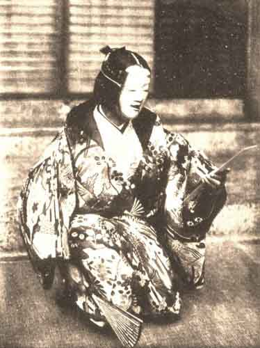

  
[Intangible Textual Heritage](../../index)  [Shinto](../index) 
[Buddhism](../../bud/index)  [Index](index)  [Previous](npj43) 
[Next](npj45) 

------------------------------------------------------------------------

p. 237

### TAKE NO YUKI

(SNOW ON THE BAMBOOS)

By SEAMI

PERSONS

TONO-I.  
TSUKIWAKA (his son by the first wife).  
HIS FIRST WIFE.  
TSUKIWAKA'S SISTER.  
HIS SECOND WIFE.  
A SERVANT.  
CHORUS.

TONO-I.

My name is Tono-i. I live in the land of Echigo. I had a wife; but for a
trifling reason I parted from her and put her to live in the House of
the Tall Pines, which is not far distant from here. We had two children;
and the girl I sent to live with her mother at the House of the Tall
Pines, but the boy, Tsukiwaka, I have here with me, to be the heir of
all my fortune.

And this being done, I brought a new wife to my home. Now it happens
that in pursuance of a binding vow I must be absent for a while on
pilgrimage to a place not far away. I will now give orders for the care
of Tsukiwaka, my son. Is my wife there?

SECOND WIFE.

What is it?

TONO-I.

I called you to tell you this: in pursuance of a vow I must be absent on
pilgrimage for two or three days. While I am away, I beg you to tend my
child Tsukiwaka with loving care. Moreover I must tell you that the snow
falls very thick in these parts, and when it piles up upon the bamboos
that grow along the four walls of the yard, it weighs them down and
breaks them to bits.

I don't know how it will be, but I fancy there is snow in the air now.
If it should chance to fall, pray order my servants to brush it from the
leaves of the bamboos.

p. 238

SECOND WIFE.

What? A pilgrimage, is it? Why then go in peace, and a blessing on your
journey. I will not forget about the snow on the bamboos. But as for
Tsukiwaka, there was no need for you to speak. Do you suppose I would
neglect him, however far away you went?

TONO-I.

No, indeed. I spoke of it, because he is so very young. . . .

But now I must be starting on my journey. (*He goes*.)

SECOND WIFE.

Listen, Tsukiwaka! Your father has gone off on a pilgrimage. Before he
went, he said something to me about you. "Tend Tsukiwaka with care," he
said. There was no need for him to speak. You must have been telling him
tales about me, saying I was not kind to you or the like of that. You
are a bad boy. I am angry with you, very angry! (She turns away.)

TSUKIWAKA *then runs to his mother at the House of the Tall Pines. A
lyric scene follows in which* TSUKIWAKA *and his mother* (*the* CHORUS
*aiding*) *bewail their lot*.

Meanwhile the SECOND WIFE *misses* TSUKIWAKA.

SECOND WIFE.

Where is Tsukiwaka? What can have become of him? (*She calls for a
servant*.) Where has Tsukiwaka gone off to?

SERVANT.

I have not the least idea.

SECOND WIFE.

Why, of course! I have guessed. He took offence at what I said to him
just now and has gone off as usual to the Tall Pines to blab to his
mother. How tiresome! Go and tell him that his father has come home and
has sent for him; bring him back with you.

SERVANT.

I tremble and obey. (*He goes to the "hashigakari" and speaks to*
TSUKIWAKA *and the* FIRST WIFE.) The master has come back and sent for
you, Master Tsukiwaka! Come back quickly!

 

  
YŪYA READING THE LETTER

 

p. 239

FIRST WIFE.

What? His father has sent for him? What a pity; he comes here so seldom.
But if your father has sent for you, you must go to him. Come soon again
to give your mother comfort!

(*The* SERVANT *takes* TSUKIWAKA *back to the* SECOND WIFE.)

SERVANT.

Madam, I have brought back Master Tsukiwaka.

SECOND WIFE.

What does this mean, Tsukiwaka? Have you been blabbing again at the
House of the Tall Pines? Listen! Your father told me before he went away
that if it came on to snow, I was to tell some one to brush the snow off
the bamboos round the four walls of the yard.

It is snowing very heavily now. So be quick and brush the snow off the
bamboos. Come now, take off your coat and do it in your shirt-sleeves.

(*The boy obeys*. The CHORUS *describes the "sweeping of the bamboos."
It grows colder and colder*.)

CHORUS.

The wind stabbed him, and as the night wore on,  
The snow grew hard with frost; he could not brush it away.  
"I will go back," he thought, and pushed at the barred gate.  
"Open!" he cried, and hammered with his frozen hands.  
None heard him; his blows made no sound.  
"Oh the cold, the cold! I cannot bear it.  
Help, help for Tsukiwaka!"  
Never blew wind more wildly!

(TSUKIWAKA *falls dead upon the snow*.)

The servant finds him there and goes to the House of the Tall Pines to
inform the mother. A scene of lament follows in which mother, sister and
chorus join. The father comes home and hears the sound of weeping. When
he discovers the cause, he is reconciled with the first wife (the second
wife is not mentioned again), and owing to their pious attitude, the
child returns to life.

 

------------------------------------------------------------------------

[Next: Tori-oi](npj45)
