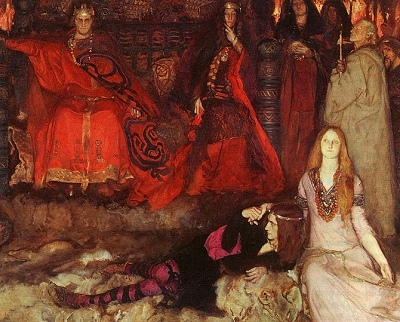

  
[Intangible Textual Heritage](../../index)  [Shakespeare](../index) 

------------------------------------------------------------------------

[Buy this Book at
Amazon.com](https://www.amazon.com/exec/obidos/ASIN/B0029F209I/internetsacredte)

------------------------------------------------------------------------

<table width="75%">
<colgroup>
<col style="width: 50%" />
<col style="width: 50%" />
</colgroup>
<tbody>
<tr class="odd">
<td width="50%" data-valign="TOP"></td>
<td width="50%" data-valign="CENTER"><h1 id="folk-lore-of-shakespeare" data-align="CENTER">Folk-lore of Shakespeare</h1>
<h2 id="by-t.f.-thiselton-dyer" data-align="CENTER">by T.F. Thiselton Dyer</h2>
<h4 id="section" data-align="CENTER">[1883]</h4></td>
</tr>
</tbody>
</table>

------------------------------------------------------------------------

[Contents](#contents)    [Start Reading](flos00)    [Page
Index](pageidx)    [Text \[Zipped\]](flos.txt.gz)

------------------------------------------------------------------------

|                                                                                                                           |
|---------------------------------------------------------------------------------------------------------------------------|
|  |

This is a comprehensive studies of the folklore aspects of Shakespeare,
providing a full-spectrum exposure to the cultural background of
Elizabethan society. The Reverend Dyer, who also wrote [Folk-lore of
Women](../../wmn/fow/index), delves into the source of innumerable
passages in Shakespeare which were mysterious even back in Victorian
times. Although usually he manages to clear up the mystery, in few
instances he has to admit defeat.

This book is vital if you want to really understand Shakespeare's
cultural context and times. He covers everything from the supernatural
(fairies, witches, mermaids) to the mundane: games, weddings, dance,
punishments, proverbs, animal lore. You can read it straight through,
but it is also a browser's delight; you never know what bit of the bard
lodged in your mind he will shed light on next.--J.B. Hare, April 16th,
2009.

*Production Notes:* due to the number of quotes in this book, paragraphs
and paragraphs continuations are marked explicitly by indentation.

------------------------------------------------------------------------

 [Title Page](flos00)  
[Preface](flos01)  
[Contents](flos02)  
[Chapter I. Fairies](flos03)  
[Chapter II. Witches](flos04)  
[Chapter III. Ghosts](flos05)  
[Chapter IV. Demonology and Devil Lore](flos06)  
[Chapter V. Natural Phenomena](flos07)  
[Chapter VI. Birds](flos08)  
[Chapter VII. Animals](flos09)  
[Chapter VIII. Plants](flos10)  
[Chapter IX. Insects and Reptiles](flos11)  
[Chapter X. Folk Medicine](flos12)  
[Chapter XI. Customs Connected with the Calendar](flos13)  
[Chapter XII. Birth and Baptism](flos14)  
[Chapter XIII. Marriage](flos15)  
[Chapter XIV. Death and Burial](flos16)  
[Chapter XV. Rings and Precious Stones](flos17)  
[Chapter XVI. Sports and Pastimes](flos18)  
[Chapter XVII. Dances](flos19)  
[Chapter XVIII. Punishments](flos20)  
[Chapter XIX. Proverbs](flos21)  
[Chapter XX. Human Body](flos22)  
[Chapter XXI. Fishes](flos23)  
[Chapter XXII. Sundry Superstitions](flos24)  
[Chapter XXIII. Miscellaneous Customs, etc.](flos25)  
[Index](flos26)  
