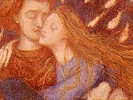

  
[Intangible Textual Heritage](../../index)  [Sub Rosa](../index) 
[Index](index)  [Previous](botd05)  [Next](botd07) 

------------------------------------------------------------------------

[Buy this Book at
Amazon.com](https://www.amazon.com/exec/obidos/ASIN/1434485382/internetsacredte)

------------------------------------------------------------------------

  
*Brother of the Third Degree*, by Will L. Garver, \[1894\], at
Intangible Textual Heritage

------------------------------------------------------------------------

p. 64

### CHAPTER V.

#### MORE MYSTERY.

That night sleep was a stranger to my
agitated soul; vainly did I try to control my restless and wandering
mind, but all of no avail.

What mystery surrounded me! Mother alive!! what of Esmeralda? And this
mysterious man, Albarez. She awaits me in the Brotherhood. What did it
all mean? Twelve chimes told the beginning of another day.
One—two—three, and still I rolled and tossed, my mind run wild—beyond
control. Four. At last I sank into a troubled sleep; and, as though to
add still greater mystery to that already around me, I dreamed, as eight
years before I had of monastery court among mountains wild. But this
time it was my father who was led by monks in robes of indigo before the
Radiant One. And, as before, a fog came over the scene and left the end
unknown; and I was lost in sleep.

I awoke somewhat refreshed, but filled with a

p. 65

restless agitation. I was all on fire with an inward energy.

"She awaits me in the Brotherhood; then will I meet her," I said, with a
determination that brought my teeth together. What is the meaning of
this dream? Has this mysterious adept anything to do with it? He was
present when I had the other. Thus I continued to soliloquize.

For one year I had patiently waited in silence without hearing a word
from my application. M. Durant vouchsafed no information, and in answer
to my questions replied aphoristically—"Everything comes to those who
wait."

But I had waited long enough; and, having now received first-grade
certificates in law and medicine, I would know the reason if I waited
any longer.

As I paced up and down my room, I only grew more restless. Something
seemed to say, "You are right; you are right. Go on! Go on!" Filled with
these thoughts I went down to breakfast, fully determined to have an
interview with M. Durant immediately it was over.

By a kind of tacit consent they said nothing of the events of the night
before, Camille complimenting me on my excellent graduation grades.
After breakfast, and before I could ask for an interview, M. Durant said
he wished to see me in his study. Having reached his study and entered,
he closed the door with his usual caution and

p. 66

motioned me to a seat opposite him at the center-table. Then without a
word ha handed me two letters, all the time scrutinizing my features.

The letters were postmarked—City of Mexico, and one was in the
handwriting of my father, while the other I did not recognize.

As it was unusual for me to receive strange letters from Mexico, I
opened it first.

It contained a newspaper clipping, a bank certificate of deposit, and a
written sheet which read as

follows:

City of Mexico, Mexico,

August 15th, 18—

Senor Alphonso Colono,  
Dear Sir:—

Your father, Ferdinand Colono, you will see from the enclosed clipping,
has mysteriously disappeared. Where he has gone or what has become of
him no one knows. The day before he disappeared he sold his property for
cash, and deposited the proceeds, together with all other available
assets, amounting in all to 500,000 francs, with us, requesting that we
transfer it to your credit in the Bank of France.

In compliance with this request we herewith send you a certificate of
deposit for said amount. Trusting everything will be found satisfactory,
and that your father will soon return, we respectfully solicit your
business in this part of the world in the future.

Respectfully,                                
CARLOS SANDOL Y CIA,        
BANKERS.

Nervously I took up the clipping and read:

p. 67

Mysterious Disappearance.

Don Ferdinand Colono, Government physician and one of the most prominent
men in Mexico, has mysteriously disappeared without any apparent cause,
and without leaving a word of explanation, but evidently with
aforethought and premeditation; for on the day before the one on which
he was last seen, he sold all his property and transferred everything he
possessed to his son, now in Paris.

Senor Colono was learned, wealthy, influential, and highly respected;
and these facts, together with his almost universal popularity, would
not lead us to suspect foul play.

So far as can be ascertained, he was last seen near the Hotel Iturbid,
in company with a tall, cloaked stranger.

It is said by those who appear to know, that Senor Colono was a member
of some mysterious Occult or Masonic Brotherhood, and that his
disappearance is in some way connected with this organization; but
nothing can be learned concerning it.

Ever since the departure of his son, over a year ago, Senor Colono has
been frequently seen with a cloaked stranger, but who this man is, no
one knows.

Any information concerning Senor Colono will be thankfully received by
his many friends in this city. We hope his absence is only temporary,
and ill that he will soon return.

"The mystery deepens," I muttered between my set teeth, as by a mighty
effort I restrained my feelings.

I handed the clipping and letter across the table

p. 68

to M. Durant, and as he took them opened the letter from my father. It
read as follows:

My dear son and brother,
Alphonso:  
I have at last, after years of waiting, been given an opportunity to
pass on. Eight years ago your mother passed; but I, for certain
weaknesses, failed. Now it is my privilege to join her in the higher
ranks. We shall never meet in this world again, unless it be in the
Brotherhood, which, in the degrees where I go, is not of this world.
When you receive this, I will be with your mother and far away—

I jumped up; I could not contain myself any longer. "What does it mean?"
I cried. "Join my mother, whom I saw here last night, in Paris, and yet
far away. I do not understand it," I exclaimed, pressing my brow in
excitement.

"Read on," said M. Durant coolly, "distance is not a thing of miles. The
prisoner in his cell is far away from the flowers that fill the lawn
around him. That which seems farthest is, in reality, the nearest."

Surprised at seeing M. Durant thus cold and unsympathetic, in marked
contrast to his usual nature, I took up the letter and continued:

Remember the teachings of your youth, and work with all your energies
for the higher life.

Remember the unsatisfactory and delusive nature of all things earthly,
and seek only the eternal.

p. 69

My son, I see dark clouds now hanging around you, but it is necessary
that it should be so. For, if thou wouldst join the Souls who love, thou
must pass through trials, for it is only thus that strength is gained.

The time will come, yea, even now is near, when uncertainty will wrap
you in the gloom of night, and doubts and fears harass your soul. Then
be patient, and rely upon the guide that never fails if thy motive be
but pure—that is the Spirit Self.

When all forsake thee, and thou knowest not whom to trust, go to
thyself. Fast, seek solitude and meditate; then, if thy soul is pure,
the light will surely come.

Trust those who would lead thee to the Brotherhood; show no fear; suffer
no delays, and we will meet again, brothers of that Universal Band whose
members live in the Eternal.

Farewell! my son and brother; though far away, ours and the Masters'
love surrounds thee! Farewell!

Thy father—brother,                            
FERDINAND COLONO. ?t?r?i

As I finished the letter, all the tender memories of my loving parents
rushed upon me, tears welled in my eyes, and a deep sigh broke from my
lips.

But I had never seen M. Durant so cold before; he seemed cruelly
unsympathetic and severe.

"Control yourself," he said, "the wise restrain their feelings."

I looked at him reproachfully, but his piercing black eyes never winced;
when, having read

p. 70

the letter which I handed him, he spoke as follows:

"Alphonso Colono, son of Ferdinand Colono, high initiate, if you would
follow in the footsteps of your most exalted parents you must master and
control your feelings. For, cruel as it may seem, in the Brotherhood
into which you seek admission, joy and sorrow, pleasure and pain,
happiness and misery are one. Where is your strength?"

He spoke with a coolness I had never beard before, and his tones goaded
me to desperation. I bit my tongue, and with gritting teeth answered: "I
have all strength; I am controlled."

I thought I detected a gleam of satisfaction in his eyes, but his face
remained as impassive as a sphinx. Reaching into his inner pocket he
handed me another letter.

"There," he said, "don't open that until you get to your room. I have
done as you requested and had your application presented. That is, in
all probability, your answer. What it contains I know not; but whether
it be much or little, I now demand of you the most inviolable secrecy as
to its contents and everything you may hereafter learn that pertains to
the Brotherhood."

"You have it," I replied, with hand raised as if to swear.

"Very well," he answered, "take this as a memorandum; if you are
accepted they will want

p. 71

to know the day and hour of your birth. Your parents, knowing the great
truths or esoteric astrology, preserved this information in a register
kept for that purpose, and I there obtained it."

He handed me a slip of paper on which was written—"June 5th—7:45 A. M.
18— Leo—"

"Now you can go maintain secrecy and consider yourself free to act
without any explanations to us."

------------------------------------------------------------------------

[Next: Chapter VI. The Woman in Black](botd07)
