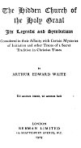
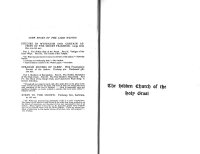

  
[Intangible Textual Heritage](../../index)  [Sub Rosa](../index) 
[Index](index)  [Next](hchg01) 

------------------------------------------------------------------------

[Buy this Book at
Amazon.com](https://www.amazon.com/exec/obidos/ASIN/1589639057/internetsacredte)

------------------------------------------------------------------------

# The Hidden Church of the Holy Graal

### Its Legends and Symbolism

##### Considered in their Affinity with Certain Mysteries

##### of Initiation and other Traces of a Secret

##### Tradition in Christian Times

###### BY

## ARTHUR EDWARD WAITE

##### Vel sanctum invenit, vel sanctum facit

#### LONDON

#### REBMAN LIMITED

#### 129 SHAFTESBURY AVENUE, W.C,

#### \[1909\]

**NOTICE OF ATTRIBUTION**  
Scanned at Intangible Textual Heritage, May, 2006. Proofed and formatted
by John Bruno Hare. This text is in the public domain in the United
States because it was first published prior to January 1st, 1923. These
files may be used for any non-commercial purpose, provided this notice
of attribution is left intact in all copies.

[  
Click to enlarge](img/title.jpg)  
Title Page  

[  
Click to enlarge](img/verso.jpg)  
Verso  

p. ii

The following advertisements appeared in the original book. They are
included for completeness--JBH

<table data-border="0">
<colgroup>
<col style="width: 100%" />
</colgroup>
<tbody>
<tr class="odd">
<td data-valign="top" width="426">
<em>SOME BOOKS BY THE SAME WRITER</em>

STUDIES IN MYSTICISM AND CERTAIN ASPECTS OF THE SECRET TRADITION. Large demy 8vo, 10s. 6d. net.

Part I. The Hither Side of the Portal. Part II. Vestiges of the Outer Ways. Part III. The Courts of the Temple. 
"Mr. Waite has penetrated very near to the heart of his subject."--<em>Saturday Review</em>. 
"A strange and challenging book."--<em>The Outlook</em>. 
"There is hidden treasure in Mr. Waite's pages."--<em>Guardian</em>.

STRANGE HOUSES OF SLEEP. With Frontispiece Portrait of the Author. Foolscap 4to. Parchment gilt. 12s. net.

Part I. Shadows of Sacraments. Part II. The Hidden Sacrament of The Holy Graal. Part III. The Poor Brother's Mass Book. Part IV. The Book of the King's Dole, and Chantry for Plain Song: A Greater Initiation.

"Through all one comes in touch with a fine spirit, alive to the glory of the world and all that charms the heart and sense of man, yet seeing past these with something of the soul of Galahad. . . . Rich in memorable verse and significant thought, so closely wedded to emotion that each seems either."--<em>Glasgow Herald</em>.

STEPS TO THE CROWN. Foolscap 8vo, buckram, 2s. 6d. net.

"Mr. Waite has presented his philosophy of life in a series of aphorisms. The author of this volume is well known as one of the best living authorities on the history of mysticism, and the point of view here maintained is that of an initiate. Man's highest destiny lies--as St. Augustine taught many centuries ago--in his ultimate union with the Divine Nature. There are several hundreds of aphorisms in this slender volume, all of them terse and pregnant."--<em>The Tribune</em>.
</td>
</tr>
</tbody>
</table>

 

------------------------------------------------------------------------

[Next: Preface](hchg01)
