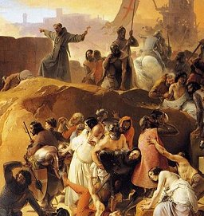

  
[Intangible Textual Heritage](../../index)  [Sub Rosa](../index) 

------------------------------------------------------------------------

[Buy this Book on
Kindle](https://www.amazon.com/exec/obidos/ASIN/B002RHOUAK/internetsacredte)

------------------------------------------------------------------------

<table width="75%">
<colgroup>
<col style="width: 50%" />
<col style="width: 50%" />
</colgroup>
<tbody>
<tr class="odd">
<td width="50%" data-valign="TOP"> 
Detail of Crusaders Thristing near Jerusalem, by Francesco Hayez, 1836-50 (Public Domain Image)</td>
<td width="50%" data-valign="CENTER"><h1 id="the-history-of-the-knights-templar" data-align="CENTER">The History of the Knights Templar</h1>
<h2 id="by-charles-g.-addison" data-align="CENTER">by Charles G. Addison</h2>
<h4 id="section" data-align="CENTER">[1842]</h4></td>
</tr>
</tbody>
</table>

------------------------------------------------------------------------

[Contents](#contents)    [Start Reading](hkt00)    [Page
Index](pageidx)    [Text \[Zipped\]](hkt.txt.gz)

------------------------------------------------------------------------

|                                                                                                                           |
|---------------------------------------------------------------------------------------------------------------------------|
|  |

This is a mainstream history of the Knights Templars, written in the
19th century. Addison details the rise of the Templars to become,
essentially, the first multinational corporation. The Templars were
entrusted by the Church and States of Europe to be the spearhead of the
crusades. In the process they gained immense wealth and influence,
although individual Templars took a vow of poverty. Jerusalem was won
and lost several times by the crusaders through the 12th and 13th
centuries. Addison notably cites eye-witness descriptions from both the
Crusaders and their Moslem opponents to give a well-rounded picture.
After the crusades, and the loss of the Holy Land, the Templars began a
quick decline from which they never recovered. Accused of heresy and
bizarre secret rituals, the Templars were subjected to torture and the
stake.

The second portion of the book focuses on Temple Church in London, the
English headquarters of the Templars in their prime. Addison details the
architecture and history of this edifice. The Temple Church eventually
became the center of the legal profession in the City of London, a
hostel and school for lawyers. Addison mentions on the title page that
he is a member of the 'Inner Temple,' which doesn't mean that he was
part of a secret society, but instead qualified to practise law in
England.

Addison quotes liberally from contemporary accounts in Latin, Norman
French, and Early Modern English (which he thankfully occasionally
translates), and includes extensive citations of source documents. If
you want to learn the fascinating history of the Knights Templars
without any extraneous theorizing, this is an excellent book to start
with.

------------------------------------------------------------------------

 [Title Page](hkt00)  
[Preface](hkt01)  
[Contents](hkt02)  

### The Knights Templars

[Chapter I](hkt03)  
[Chapter II](hkt04)  
[Chapter III](hkt05)  
[Chapter IV](hkt06)  
[Chapter V](hkt07)  
[Chapter VI](hkt08)  
[Chapter VII](hkt09)  
[Chapter VIII](hkt10)  
[Chapter IX](hkt11)  
[Chapter X](hkt12)  

### The Temple Church

[Chapter XI](hkt13)  
[Chapter XII](hkt14)  
[Chapter XIII](hkt15)  
[Chapter XIV](hkt16)  
