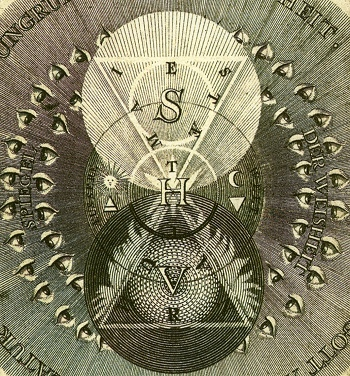

  
[Intangible Textual Heritage](../../index)  [Sub Rosa](../index) 

------------------------------------------------------------------------

[Buy this Book at
Amazon.com](https://www.amazon.com/exec/obidos/ASIN/B0021YV3F4/internetsacredte)

------------------------------------------------------------------------

<table width="75%">
<colgroup>
<col style="width: 50%" />
<col style="width: 50%" />
</colgroup>
<tbody>
<tr class="odd">
<td width="50%" data-valign="TOP"></td>
<td width="50%" data-valign="CENTER"><h1 id="code-of-the-illuminati" data-align="CENTER">Code of the Illuminati</h1>
<h6 id="part-iii-of" data-align="CENTER">Part III of</h6>
<h4 id="memoirs-illustrating-the-history-of-jacobinism" data-align="CENTER">Memoirs Illustrating the History of Jacobinism</h4>
<h2 id="by-abbé-barreul" data-align="CENTER">by Abbé Barreul</h2>
<h5 id="tr.-by-robert-edward-clifford" data-align="CENTER">tr. by Robert Edward Clifford</h5>
<h4 id="section" data-align="CENTER">[1798]</h4></td>
</tr>
</tbody>
</table>

------------------------------------------------------------------------

[Contents](#contents)    [Start Reading](mhj300)    [Page
Index](pageidx)    [Text \[Zipped\]](mhj3.txt.gz)

------------------------------------------------------------------------

|                                                                                                                           |
|---------------------------------------------------------------------------------------------------------------------------|
|  |

This is the third part (of four) of Abbé Barreul's massive polemic
history of the French Revolution. This portion of this book is of
interest because it contains extensive quotes from the actual literature
of the Bavarian Illuminati. This is the most comprehensive work in
English on the historical theory, structure and practice of the Bavarian
Illuminati. It complements Robison's [Proofs of a
Conspiracy](../pc/index), the other major contemporary account.

Founded in 1776, shortly before the American Revolution, the Bavarian
Illuminati were a secret society with a revolutionary ideology, and a
centralized structure. According to Abbé Barreul, they subverted the
Masonic lodges of Europe, and were one of the key driving forces behind
the French Revolution. New members were gradually initiated into the
group's radical ideas, which, according to Barreul, were atheist and
anarchist in essence.

Barreul was very conservative, and his translator, Robert Edward
Clifford, likewise. However, Barreul was a serious historian, even
though he wrote from a decidedly non-neutral point of view. As a
contemporary, he was able to view the primary source documents and
interview participants. As such this book is today, in and of itself, a
primary source.

Today, civil society in Europe and America has enshrined the ideas of
'Liberty and Equality' that Barreul thought would lead to the complete
breakdown of civilization. The Bavarian Illuminati are considered by
some to be the forerunners of the Communist and Fascist movements.
However, as I have stated before, this is probably parallel evolution.
The more paranoid believe that the Illuminati (or some equivalent, such
as a cabal of reptilian shape-shifters) are still in business and
manipulating, *e.g.*, world leaders, the education system, and mass
movements. But this is for the individual reader to decide... *--J.B.
Hare, May 11th, 2008.*

------------------------------------------------------------------------

 [Title Page](mhj300)  

### Part III. The Antisocial Conspiracy

[Preliminary Observations](mhj301)  
[Chapter I. Spartacus-Weishaupt, Founder of the Illuminees](mhj302)  
[Chapter II. Code of the Illuminees](mhj303)  
[Chapter III. Of the Brother Insinuator, or the Recruiter](mhj304)  
[Chapter IV. First Preparatory Degree: Novice](mhj305)  
[Chapter V. Second Preparatory Degree: The Brethren of
Minerva](mhj306)  
[Chapter VI. Third Preparatory Degree: The Minor Illuminee](mhj307)  
[Chapter VII. Fourth Preparatory Degree: The Major Illuminee, or the
Scotch Novice](mhj308)  
[Chapter VIII. Intermediate Class: The Scotch Knight](mhj309)  
[Chapter IX. The Lesser Mysteries; The Epopt or Priest of
Illuminism](mhj310)  
[Chapter X. Continuation of the Discourse on the Lesser
Mysteries](mhj311)  
[Chapter XI. The Regent, or the Prince Illuminee](mhj312)  
[Chapter XII. Class of Grand Mysteries; the Mage or the Philosopher, and
the Man King](mhj313)  
[Chapter XIII. Government of the Order](mhj314)  
[Chapter XIV. Of the Government and Political Instructions for the
Epopts](mhj315)  
[Chapter XV. Instructions for the Regent or Prince Illuminee, on the
Government of the Order](mhj316)  
[Chapter XVI. Continuation of the Instructions on the Government of the
Illuminees](mhj317)  
[Chapter XVII. Instructions for the Provincial](mhj318)  
[Chapter XVIII. Of the National Directors, of the Areopagites, and of
the General of Illuminism](mhj319)  
