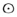
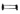

  
[Intangible Textual Heritage](../../index)  [Sub Rosa](../index) 
[Index](index)  [Previous](mhj304)  [Next](mhj306) 

------------------------------------------------------------------------

[Buy this Book at
Amazon.com](https://www.amazon.com/exec/obidos/ASIN/B0021YV3F4/internetsacredte)

------------------------------------------------------------------------

  
*Code of the Illuminati: Part III of Memoirs Illustrating the History of
Jacobinism*, by A Barruel, tr. Robert Edward Clifford \[1798\], at
Intangible Textual Heritage

------------------------------------------------------------------------

p. 427

### CHAP. IV.

#### Second Part of the Code of the Illuminees—First preparatory Degree, of the Novice and of his Teacher.

In the early stages of Illuminism the
duration of the time of trial for the Novice was three years for those
who were not eighteen years of age; two years for those between eighteen
and twenty-four; and one year for those who were near thirty. [1](#fn_68) Circumstances have since occasionally
caused the time to be abridged; but, whatever may be the dispositions of
the Novice, though the time may be dispensed with, he must go through
the different trials, or have got the start of them before he is
admitted into the other degrees. During the interval he has no other
superior but the Insinuator to whom he is indebted for his vocation, and
during the whole time of the noviciate, the Insinuator is expressly
forbidden to inform his pupil of any other member of the Order. This law
was made to skreen the order from the dangers which might result from an
indiscretion of the Novice, and to render the Insinuator alone
responsible in such cases; for, should the Novice unfortunately be an
indiscreet talker, the code expressly says, his imprudence would at most
betray only one of the brethren. [2](#fn_69) The
first lessons of the Insinuator (in future his teacher) treat entirely
on the importance and the inviolability of the secrecy which is to be
observed in Illuminism. He will begin by telling his Novice, "Silence
*and secresy are the very soul of the Order*, and you will carefully
observe this silence as well with those whom you may have only reason to
suppose are already initiated, as with those whom you may hereafter know
really to belong to the Order. You will remember, that it is a constant
principle among us, that *ingenuousness is only a virtue with respect to
our superiors, but that distrust and reserve are the fundamental
principles*. You will never reveal to any person, at present or
hereafter, the slightest circumstance relative to your admission into
the order, the degree you have received, nor the time when admitted; in
a word, you will never speak of any object relating to the order even
before Brethren, without the strongest necessity." [3](#fn_70)

Under the restrictions of this severe law, one Illuminee will often be a
stranger to another; and the Novice will see in this no more than a
measure of safety for the order, which might be ruined by the least
indiscretion. [4](#fn_71)

More certainly to assure himself of the discretion of the Novice, the
Insinuator will give him no further insight, nor entrust him with any
writing

p. 428

relative to the order, until he has obtained the following declaration:
"I, the undersigned, promise upon my honour, and without any
reservation, never to reveal either by words, signs, or actions, or in
any possible manner, to any person whatever, either relations, allies,
or most intimate friends, any thing that shall be entrusted to me by my
Introducer relative to my entrance into a *secret society*; and this
whether my reception shall take place or not. I subject myself the more
willingly to this secresy, as my *Introducer assures me that nothing is
ever transacted in this society hurtful to religion, morals, or the
state*. With respect to all writings which I may be entrusted with, any
letters which I may receive concerning the same object, I engage myself
to return them, after having made for my sole use the necessary
extracts." [5](#fn_72)

These writings or books relative to the order are only lent to the
Novice at first in small numbers, and for a short time; and then he must
promise to keep them out of the reach of the prophane; but as he is
promoted in rank, he may preserve them for a longer time, and is
intrusted with a larger quantity; though not without having informed the
Order of the precautions he shall have taken, lest in case of his death
any of these writings should fall into prophane hands. [6](#fn_73) He will afterwards learn, that the
Brotherhood take many other precautions for secresy, not only respecting
the statutes, but even with regard to the very existence of the Order.
He will see, for example, in its laws, that should any of the
brotherhood fall sick, the other brethren are assiduously to visit him,
in the first place *to fortify* him, that is to say, to hinder him from
making any declarations at the hour of his death; and secondly, to carry
away whatever writings relative to the Order the sick man may have had
in his possession, as soon as any symptoms of danger appear. [7](#fn_74)

He will at length learn, that to frustrate all attempts to trace even
their very existence, the *Order does not exist every where* under the same name, but that they are to
assume the name of *some other Order*, perhaps even of a literary
society, or meet without any name which can attract the attention of the
public.

The first writing delivered to the Novice, to accustom him to profound
secrecy, is what may be called the Dictionary of Illuminism. He must
begin by learning the language of the Sect, that is to say, the art of
communicating with the superiors and other adepts without the
possibility of being understood by the prophane. By means of this
language, the Illuminees are to be able to correspond with each other,
without running the risk of its being discovered of what Brother they
speak; from what place, in what language, at what period, and to whom,
or by whom the letter is written.

To avoid the discovery of persons, the Novice will learn, that no
Brother bears the same name in the Order which he does in the world;
indeed, had he been initiated in the higher degrees of Masonry, he would
have seen the same precaution taken, where the Rosicrucians receive what
they call *their Characteristic* or their adoptive name. The Novice will
receive the characteristic immediately on his admission, and it will in
some measure imply the parts which he is in future to act in the general
conspiracy. It will be his task

p. 429

hereafter to study and write the history of his new patron he will by
this method recognize in the qualities and actions of his hero the
particular services which the order will expect from him. [8](#fn_75) This name will be chosen as conformably as
possible to the dispositions observed in him. Has he shown any
propensity to repeat the impieties of Philosophism against the Gospel,
he will be classed with the Celsi and Porphirii, or with the Tindals and
Shaftsburys; should his turn be toward the hatred of Kings, or should
his talents be judged useful for the polity of the Order, then his
characteristic will be of the Brutus, Cato, or Machiavel tribe. He will
not be told what he is to do to deserve his name, but they will contrive
that it shall occur to him. Neither will he be told why Weishaupt
assumed the name of Spartacus (a name so famous in Rome because he waged
the war of the slaves against their masters); but should he ever be
admitted to the higher mysteries, he will easily recognize the
reason. [9](#fn_76)

The place from whence they write, as well as the persons of whom or to
whom they write, is in like manner to be kept secret; a new Geography is
therefore taught the Novice. He will thence learn, that *Bavaria*, the
country of their founder, is denominated *Achaia*; *Swabia, Pannonia;
Franconia, Austria, and Tyrol* are denoted by *Illyria, Egypt, and
Peloponnesus*; *Munich* is called *Athens*; *Bamberg*, *Antioch*;
*Inspruck*, *Samos*; *Vienna* in Austria, *Rome*; *Wurtzburg*,
*Carthage*; *Frankfort on the Mein* becomes *Thebes*; and *Heidelberg*,
*Utica*. *Ingolstadt*, the natal soil of the Order, was not sufficiently
denoted by *Ephesus*; this privileged town was to be decorated with a
more mysterious name, and the profound adepts bestowed on it that of
*Eleusis*.

Should the Novice ever be sent on a mission out of his own country, or
to distant shores, he will then receive further instructions in the
Geography of the Sect. [10](#fn_77)

He must also learn how to date his letters, and be conversant with the
Illuminized Hegira or Calendar; for all letters which he will receive in
future will be dated according to the Persian era,
[called](errata.htm#12) *Jezdegert* and beginning A.D. 630. The year
begins with the Illuminees on the first of *Pharavardin*, which answer
to the 21st of March. Their first month has no less than forty-one days;
the following months, instead of being called May, June, July, August,
September, and October, are *Adarpahascht*, *Chardad*, *Thirmeh*,
*Merdedmeh*, *Shaharimeh*, *Meharmeh:* November and December are
*Abenmeh*, *Adameh:* January and February, *Dimeh*, and *Benmeh:* The
month of March only has twenty days, and is called *Asphandar*. [11](#fn_78)

The Novice must next learn how to decypher the letters he may receive;
in order to which, he must make himself master of that cypher, which is
to serve him until initiated into the higher degrees, when he will be
entrusted with the hieroglyphics of the Order. [12](#fn_79)

He will also remember, that he is never to write the name of his Order;
so venerable a word cannot be exposed to prophane eyes, and a circle
  with a point in the
middle of it will supply this sacred word, and a long square or
parallelogram   will
denote the word Lodge.

p. 430

After these preliminary studies, the young brother receives a part of
the code, under the title of *Statutes of the Illuminees*. But these
first statutes are nothing more than a snare, and the young Novice, with
pleasure no doubt, sees them begin with the following words:

"For the tranquillity and security of all the Brethren, whether Novices
or active Members of the Society, and to prevent all ill-grounded
suspicions, or disagreeable doubts, the venerable Order declares, that
it absolutely has *in view no project, enterprize, or undertaking
hurtful to the state, to religion, or to good morals; and that it
favours nothing of that nature in any of its members*. Its designs, all
its toils, solely tend to inspire men with a zeal for the perfection of
their moral characters, to impregnate them with humane and sociable
sentiments, to counteract the plans of the wicked, to succour oppressed
and suffering virtue, to favour the advancement of men of merit, and to
render those sciences universal which are as yet hidden from the
generality of men. Such is not the coloured pretext, but the real object
of the order." [13](#fn_80)

Even should the Novice not have entirely laid aside all suspicions
respecting the intentions of the Order, still so positive a declaration
he must think would guarantee him as to all obligations which might be
imposed upon him. His grand aim is to be, to *form his heart* in such a
maner as to gain not only the affection of his friends but even of his
enemies. He is positively ordered to endeavour *with all his might to
acquire both interior and exterior perfection*. It is true, he is soon
after as positively ordered *to study the arts of dissimulation and
disguise*; but then the Brother Insinuator is at his elbow to explain to
him how that art coincides with true perfection, and thus suppress any
suspicions which might arise from a comparison of these two injunctions.
Beside, the Novice has many other duties to fulfil, which will deprive
him of opportunity for such reflections.

He is next told, that the Brethren must have but one mind, one will, and
similar sentiments; that, to effectuate this, the Order has made choice
of certain works, to which he must apply with the greatest attention.
Should the Novice be one of those men whom an attachment to the Gospel
rendered more circumspect as to the snares laid for his belief, the very
choice of the books would suffice to show him, that the first object of
the Insinuator was to persuade him, that it is not even necessary to be
a Christian to acquire the perfection enjoined by the statutes. The
*Morality* he is taught is that of *Epictetus*, *Seneca*, *Antoninus*,
and *Plutarch*, all foreign to Christianity. He will also receive the
works of modern Sophisters, such as *Wieland*, *Meiners*, and
*Bassadows*, who by no means make perfection to consist in Christianity.
Under the soothing and mellifluous language of a moderate and specious
Philosophy, he will be led to lubricity and impiety, traced by the
sophisticated pen of Helvetius in his celebrated work *De
L’Esprit*. [14](#fn_81) But the Insinuator must
previously have sufficiently studied the dispositions of his pupil to
know whether such propositions would any longer startle him. Beside,
nothing is better calculated to dissipate all such fears, than the
constant application that is required to those books which are put into
the hands of the Novice, added

p. 431

to the care taken to deprive him of all such as might inspire him with
contrary ideas. The Teacher is carefully to attend to all the rules laid
down in the code on this subject, and to see that his Novices fulfil the
intentions of the Order in this respect. He is frequently to converse
with them; he is to mark out their occupations for them; he is even to
make them unexpected visits to surprize them, and thus to see in what
manner they apply to the code and other writings with which the Order
has entrusted them. He is to require an account of what they have read,
and extracts from the different works; he will assist them by his
explanations; in short, nothing is to be neglected which can secure
their progress in the spirit and morals of the Order. [15](#fn_82)

An object of far greater importance next attracts the attention of the
Novice; it is that which the code calls *the greatest of all;* it is,
*the knowledge of men*. The teacher will represent this to his pupil *as
the most interesting of all sciences*. [16](#fn_83) To make himself master of this science,
the Novice receives the model of a journal in the form of tablets, and
his teacher shows him how they are to be used. Provided with this
journal, he is to make his observations on every body he finds himself
in company with; he is to trace their characters, and account to himself
every thing he has seen or heard. Lest his memory should fail him, he
must always be provided with a loose paper or small tablets, on which he
may at all hours note his observations, which he is afterwards carefully
to digest in his journal. To be certain of the Novice's attention to
this point, the Brother Teacher will examine his tablets and his journal
from time to time. To render him more expert in the art of drawing the
characters of the living, he will exercise the Novices on ancient
authors, and on the heroes of antiquity. No study or custom is so
frequently recommended as this in all the code of Illuminism. It is to
be the grand study of the Novice, and the prime occupation of every
degree. [17](#fn_84)

It is by his assiduity in this great art that the Novice will learn how
to distinguish those whom he may hereafter judge proper to be admitted
into or rejected from the Order; and it is with that view that the
Preceptor perpetually presses him *to propose those whom he may think
fit for the Order*. [18](#fn_85) By this means a
double object is attained; first, the propagation of the Order; and,
secondly, a knowledge of its friends or enemies; the dangers it may be
threatened with; and the means to be adopted, or the persons to be
gained or courted, to avert the impending storm; in fine, of extending
its conquests. Whether the Illuminee be a Novice, or in any other
degree, he is bound by the laws of the Order to make his report in the
prescribed forms at least once a month. [19](#fn_86)

While the Novice is perpetually making researches of this nature, he is
not aware that he is as carefully watched by his Insinuator, who on his
side notes and writes down every thing that he observes either as to the
failings or the progress, the strong or weak side of his pupil, and
these he as regularly transmits to the superiors. [20](#fn_87)

The pupil little suspects that the grand object of his
[Insinuator](errata.htm#13) is to *bind him* in such a maner to
Illuminism, *even long before he is acquainted with its secrets*, that
it shall be impossible for him to break those bonds which fear and tenor

p. 432

shall have imposed upon him, should he ever wish to shrink from the
horrid plots and systems which he might thereafter discover.

This profound policy of binding the Novices to Illuminism consists,
first, in giving them a magnificent idea of the grandeur of the projects
of the Sect, and, secondly, in a vow of *blind obedience* to the
superiors in every thing which they judge conducive to the ends of the
Order, which vow the Insinuator is to find means of extorting from his
pupil.

It is here particularly that Weishaupt appears to wish to assimilate the
government of his Sect to that of the religious orders, and especially
to that of the Jesuits, by a total sacrifice of their own will and
judgment, which he exacts of the adepts; and to the exercising of the
Novices in this point, he expressly adverts in his instructions to the
Insinuators. [21](#fn_88) But this is precisely
the place to remark on the amazing difference between the illuminized
and the religious obedience. Of that immense number of religious who
follow the institutes of St. Basil, St. Benedict, St. Dominic, or St.
Francis, there is not one who is not thoroughly convinced that there
exists a voice far more imperious than that of his superior, the voice
of his conscience, of the Gospel, and of his God. There is not one of
them who, should his superior command any thing contrary to the duties
of a Christian, or of an honest man, would not immediately see that such
a command was a release from his vow of obedience. This is frequently
repeated and clearly expressed in all religious institutes, and no where
more explicitly or positively than in those of the Jesuits. They are
ordered to obey their superior, but in cases only where such obedience
is not sinful, *ubi non cerneretur peccatum*. [22](#fn_89) It is only in cases where such obedience
can have no sinful tendency whatever, *ubi definiri non possit aliquod
peccati genus intercedere*. [23](#fn_90) And, as
if this were not sufficiently expressed, we hear their founder, at the
very time when he recommends obedience to his religious, expressly
saying, *but remember that your vow is binding only when the commands of
man are not contrary to those of God, ubi Deo contraria non præcipit
homo*. [24](#fn_91) All those person therefore
who, like Mirabeau, surmised certain coincidences, or as he calls them
*points of contact*, between the religious institutes and the code of
the Illuminees, should have begun by observing, that religious obedience
is in its very essence an obligation of doing all the good which may be
prescribed without the least taint of harm. It was easy for them on the
contrary to demonstrate, that the obedience sought for by Weishaupt's
code was a [disposition](errata.htm#14) to obey every order received
from the superior in spite of conscience, and unheedful of the most
iniquitous guilt, provided it tended to the good of the Order. "Our
society (for such are the expressions of the code) exacts from its
members the sacrifice of their liberty, not only with respect to all
things, *but absolutely with respect to* every
means *of attaining its end*. Yet the presumption on the goodness
of the *means prescribed is always in favour of the orders given by the
superiors*. They are clearer-sighted on this object; they are better
acquainted with it; and it is on this very account that they are
nominated superiors It is their business to lead you through the
labyrinth of

p. 433

errors and darkness; and in such a case obedience is not only a duty,
but an object for grateful acknowledgment." [25](#fn_92)

Such is the obedience of the Illuminees; nor is there a single exception
to be found in all their code. We shall see the Novice, before he
terminates his trials, obliged to explain himself explicitly with
respect to orders which he may receive from his superiors, and which he
may think contrary to his conscience. In the first place his teacher is
to intangle him, and make himself perfectly master of his most secret
thoughts. Under the pretence of knowing himself better, while studying
the art of knowing others, the Novice is to draw a faithful picture of
himself, to unfold his interests and connections, as well as those of
his family.

Here again the Insinuator furnishes him with the tablets in the
requisite form, that he may give this new proof of confidence to the
Order; but this will neither be the last nor the most important one for
which he will be called upon.

On these tablets, the Novice is to write down his name, age, functions,
country, and abode; the species of study in which he occupies himself,
*the books of which his library is composed*, and the secret writings of
which he may be in possession; his revenue, his friends, his enemies,
and the reason of his enmities; in fine, his acquaintances and his
protectors.

To this table he is to subjoin a second, explaining the same objects
with respect to his father, his mother, and all their other children. He
is to be very explicit with respect *to the education they received, to
their passions and prejudices, to their strong and weak sides*.

We will exemplify this second table by an extract from the Original
Writings, by which the reader will perceive that parents are not very
much favoured—"The Novice, Francis Antony St . . . . . aged 22,
represents his father as *violent, and of soldierlike manners*; his
mother as *a little avaricious*; the weak side of both to be flattery
and interest; both living after the old fashion, and with an antiquated
frankness; in their devotion, headstrong, arrogant; with difficulty
abandoning an ill-conceived project, and still more unforgiving to their
enemies; that they nevertheless were little hated, because little
feared; and hardly in the way of doing any body any harm."

While the Novice is thus occupied in revealing all his secrets, and
those of his family, the Insinuator on his side is drawing up a new
statement of every thing he has been able to discover during the whole
time of his pupil's trial, either with respect to him or to his
relations.

On comparing the two statements, should the superior approve of the
admission of the Novice to the last proofs, he is then to answer the
grand questions. It is by these questions that the Novice is to judge of
the extent of the sacrifice he is about to make, and of the awful
subjection of his whole will, conscience, and person, to Illuminism, if
he wishes to gain admittance.

The Questions are twenty-four in number, and couched in the following
terms:

p. 434

I. Are you still desirous of being received into the Order of the
Illuminees?

II\. Have you seriously reflected on the importance of the step you
take, *in binding yourself by engagements that are unknown to you?*

III\. What hopes do you entertain, or, by what reasons are you induced
to enter among us?

IV\. Would you still persevere in that wish, though you should find that
we had no other object or advantage whatever in view but the perfection
of mankind?

V. What would be your conduct should the Order be of new invention?

VI\. *Should you ever discover in the Order any thing wicked, or unjust
to be done, what part would you take*; Wenn unanstandige, ungerechte
sachen vorkamen, wie er sich verhalten wurde?

VII\. *Can you and will you look upon the welfare of the Order as your
own?*

VIII\. We cannot conceal from you, that Members, entering into our Order
without any other motive than to acquire power, greatness, and
consideration, are not those whom we prefer. In many cases one must know
how to lose in order to gain. Are you aware of all this?

IX\. Can you love all the Members of the Order, even such of your
enemies as may be members of it?

X. Should it so happen that you should be obliged to do good to your
enemies who are of the Order, to recommend them, for example, or extol
them; would you be disposed to do so?

XI\. *Do you, moreover, grant the* power of life
and death *to our Order or Society?* On what grounds would you
refuse, or recognize in it such a right; *Ob er dieser geselschaft, oder
order auch das* jus vitæ et necis, *aus
was grnden, oder nich zugestehe?*

XII\. *Are you disposed on all occasions to give the preference to men
of our Order, over all other men?*

XIII\. How would you wish to revenge yourself of any injustice, either
great or small, which you may have received from strangers or from any
one of our Brethren?

XIV\. What would be your conduct should you ever repent of having joined
our Order?

XV\. Are you willing to share with us happiness and misfortune?

XVI\. Do you renounce the idea of ever making your birth, employment,
station, or power, serve to the prejudice or contempt of any one of the
Brethren?

XVII\. Are you, or have you any idea of becoming a Member of any other
society?

XVIII\. Is it from levity, or in hopes of soon being acquainted with our
constitution, that you so easily make these promises?

XIX\. Are you fully determined to observe our laws?

p. 435

XX\. *Do you subject yourself to a* blind
obedience without any restriction whatever? *And do you know the
strength of such an engagement*? Ober unbedingten gehorsam angelobe, und
wisse was das sey?

XXI\. Is there no consideration that can deter you from entering into
our Order?

XXII\. *Will you, in case it is required, assist in the propagation of
the Order, support it by your counsels, by your money, and by all other
means?*

XXIII\. Had you any expectation that you would have to answer any of
these questions; and if so, which question was it?

XXIV\. What security can you give us that you will keep these promises;
and to what punishment will you subject yourself in case you should
break any of them? [26](#fn_93)

In order to judge of the nature of the answers written and signed by the
Novice, and confirmed by his oath, it will be sufficient to cast our
eyes on the account of the reception of two Brethren, as it is contained
in the archives of the Sect. To the VIth [question](errata.htm#15),
*should you ever discover in the Order any thing wicked, or unjust to be
done, what part would you take?* The first of these two Novices, aged
22, and named *Francis Anthony St. . . . answers, swears, and signs*, "I
would certainly execute those things, if so commanded by the Order,
because it may be very possible that I am not capable of judging of what
is just or unjust. Besides, should they be unjust under one aspect,
*they would cease to be so as soon as they became a means of attaining
happiness, the general end*."

The Novice Francis Xaverius B. . . . answers, swears, and signs, in like
manner, "I would not refuse to execute those things (wicked and unjust)
provided they contributed to the general good."

To the XIth question, *on life and death*, the first Novice answers with
the same formalities, "Yes, I acknowledge this right in the Order of
Illuminées; and why should I refuse it to the Order, should it ever find
itself necessitated to exercise it, as perhaps without such a right it
might have to fear *its awful ruin. The state would lose little by it,
since the dead man would be replaced by so many others*. Besides, I
refer to my answer to question VI.;" that is to say, where he promised
to execute whatever was just or unjust, provided it was with the
approbation or by order of the Superiors.

The second answers, swears, and signs to the same question, "The same
reason which makes me recognize the right of life and death in the
governors of nations, leads me to recognize most willingly the same
power in my Order, which really contributes to the happiness of mankind
as much as governors of nations ought to do."

On the XXth question, on *blind obedience without restriction*, one
answers, "Yes, without doubt, *the promise is of the utmost importance;
nevertheless I look upon it as the only possible means by which the
Order can gain its ends*." The second is less precise: "When I consider
our Order as of modern invention and as little extended, I have a sort
of repugnance in binding myself by so formidable a promise; because in
that case I am justified in doubting whether a want of knowledge or even
some domineering passion might not sometimes occasion

p. 436

things to be commanded totally opposite to the proposed object of the
general welfare. But when I suppose the order to be more
[universally](errata.htm#16) spread, I then believe, that in a society
comprehending men of such different stations, from the higher to the
lower, those men are best enabled to know the course of the world, and
how to distinguish the means of accomplishing the laudable projects of
the Order."

This doubt of the Novice as to the antiquity of the Order must have
displeased Weishaupt, who spared no pains to make it appear that
Illuminism was of ancient date, the better to excite the curiosity and
the veneration of the pupils; being content to enjoy the glory of his
invention with his profound adepts, to whom only he revealed the secret
of the invention of the highest degrees and the last mysteries. But our
Novice went on to say, that on the whole he rather believed the Order to
be of ancient than of modern invention; and, like his fellow Novice, he
"promises to be faithful to all the laws of his Order, to support it
with his counsels, his fortune, and all other means; and he finishes by
*subjecting himself to forfeit his honour, and even his* life, *should he ever break his promise*. [27](#fn_94)

When the Insinuator has found means of binding the Novice to the Order
by such oaths, and especially when the young candidate shall have
recognized without hesitation that strange and awful right which
subjects the life of every citizen to the satellites of Illuminism,
should any be unfortunate enough to displease its Superiors; when the
Novice is blinded to such a degree as not to perceive that this
pretended right, far from implying a society of sages, only denotes a
band of ruffians and a federation of assassins like the emissaries of
the Old Man of the Mountain; when, in short, he shall have submitted
himself to this terrible power, the oath of the modern *Seyde* is sent
to the archives of the Order. His dispositions then prove to be such as
the superiors required to confer on him the second degree of the
preparatory class; and the Insinuator concludes his mission by the
introduction of his pupil.

At the appointed time in the dead of the night, the Novice is led to a
gloomy apartment, where two men are waiting for him, and, excepting his
Insinuator, these are the first two of the Sect with whom the Novice is
made acquainted. The Superior or his Delegate holds a lamp in his hand
half covered with a shade; his attitude is severe and imperious; and a
naked sword lies near him on the table. The other man, who serves as
Secretary, is prepared to draw up the act of initiation. No mortal is
introduced but the Novice and his Insinuator, nor can any one else be
present. A question is first asked him, whether he still perseveres in
the intention of entering the Order. On his answering in the
affirmative, he is sent by himself into a room perfectly dark, there to
meditate again on his resolution. Recalled from thence, he is questioned
again and again on his firm determination blindly to obey all the laws
of the Order. The Introducer answers for the dispositions of his pupil,
and in return requests the protection of the Order for him.

"Your request is just," replies the Superior to the Novice. "In the name
of the most Serene Order from which I hold my powers, and in the name of

p. 437

all its Members, I promise you protection, justice, and help. Moreover,
I protest to you once more, *that you will find nothing among us hurtful
to Religion, to Morals, or to the State*;"—here the Initiator takes in
his hand the naked sword which lay upon the table, and, pointing it at
the heart of the Novice, continues, "but should you ever be a traitor or
a perjurer, assure yourself that every Brother will be called upon to
arm against you. Do not flatter yourself with the possibility of
escaping, or of finding a place of security.—Wherever thou mayst be, the
rage of the Brethren, shame and remorse shall follow thee, and prey upon
thy very entrails."—He lays down the sword.—"But if you persist in the
design of being admitted into our Order, take this oath:"

The oath is conceived in the following teens:

"In presence of all powerful God, and of you Plenipotentiaries of the
most high and most excellent Order into which I ask admittance, I
acknowledge my natural weakness, and all the insufficiency of my
strength. I confess that, notwithstanding all the privileges of rank,
honours, titles, or riches which I may possess in civil society, I am
but a man like other men; that I may lose them all by other mortals, as
they have been acquired through them; that I am in absolute want of
their approbation and of their esteem; and that I must do my utmost to
deserve them both. I never will employ either the power or consequence
that I may possess to the prejudice of the general welfare. I will, on
the contrary, resist with all my might the enemies of human nature, and
*of civil society*." Let the reader observe these last words; let him
remember them when reading of the mysteries of Illuminism; he will then
be able to conceive how, by means of this oath, *to maintain civil
society*, Weishaupt leads the adepts to the oath of eradicating even the
last vestige of society. "I promise," continues the adept, "ardently to
seize every opportunity of serving humanity, of improving my mind and my
will, of employing all my useful accomplishments for the general good,
*in as much as the welfare and the statutes of the society shall require
it of me*.

"*I vow* (ich gelobe) *an eternal silence, an inviolable obedience and
fidelity to all my superiors and to the statutes of the Order*. With respect to what may be the object of the
Order *I fully and absolutely renounce my own penetration and my
own judgment*.

"I promise to look upon the interests of the Order as my own; and as
long as I shall be a Member of it, *I promise to serve it with my life,
my honour, and my estates*. Should I ever, through imprudence, passion,
or wickedness, act contrary to the laws or to the welfare of the Serene
Order, *I then subject myself to whatever punishment it may please to
inflict upon me*.

"I also promise to help the Order, to the best of my power, and
according to my conscience, with my counsels and my actions, and without
the least attention to my personal interest; also, to look upon all
friends and enemies of the Order as my own, and to behave to them as the
Order shall direct. I am equally disposed to labour with all my might
and all my means at the propagation and advancement of the Order.

p. 438

"*In these promises I renounce every secret reservation, and engage to
fulfill them all, according to the true purport of the words, and
according to the signification attached to them by the Order when it
prescribed the Oath—*

"*So help me God*." *N. N.*

The oath being signed by the Novice, and enregistered in the minutes of
the Order, the Initiator declares his admission, telling him at the same
time that he is not to expect to know all the members, but those only
who, being of the same degree, are under the same Superior.—From that
moment advanced to the degree of *Minerval*, he is instructed in the
signs of his new degree, which are much of the same nature as those of
Masonry. He is then enjoined to give an exact *list of all his books*,
particularly of those which might be precious or useful to the Order. He
also receives the following questions which he is to answer in writing.

I. What should you wish to be the object of our Order?

II\. What means, either primary or secondary, do you think most
conducive to the attainment of that object?

III\. What other things would you wish to find among us?

IV\. What men do you either hope to meet, or not to meet, among
us? [28](#fn_95)

The answers given to these questions will enable the Superiors to judge
how far the young adept has imbibed the principles of the Order. But
other helps are preparing for him, that he may be able to demonstrate by
his answers both the progress he has made and that which he may be
expected to make.

Thus admitted to the degree of *Minerval*, he will find himself in
future a Member of the Academy of the Sect. Let us then observe well
both the Scholars and their Masters; for they still belong to the class
of preparation.

p. 439

------------------------------------------------------------------------

### Footnotes

[438:1](mhj305.htm#fr_68) The Statutes reformed,
No. 7.

[438:2](mhj305.htm#fr_69) The Statutes reformed,
No. 16.

[438:3](mhj305.htm#fr_70) Original Writings,
Statutes, No. 20. Statutes reformed, No. 27. True Illuminism, General
Statutes, No. 31, 32.

[438:4](mhj305.htm#fr_71) Summary of the
Statutes, No. 15. B.

[438:5](mhj305.htm#fr_72) Original Writings, and
the true Ilium. Art. Reverse.

[438:6](mhj305.htm#fr_73) Institutes of the
Insinuated, No 8. Orig. Writ. the real Illuminee No. 7.

[438:7](mhj305.htm#fr_74) Statutes of the
Minerval, No. 12.

[438:8](mhj305.htm#fr_75) Original Writings,
Vol. I. Instructions for the Insinuated, No. 7, and Vol. II. Let 13.

[438:9](mhj305.htm#fr_76) Original Writings,
Vol. I. Sec. 4.

[438:10](mhj305.htm#fr_77) Original Writings,
Sect. 2 and 3.

[438:11](mhj305.htm#fr_78) See the real
Illuminee first degree.

[438:12](mhj305.htm#fr_79) The common cypher of
the Illuminees consist in *numbers* corresponding to letters in the
following order:

|      |      |      |      |      |      |      |      |      |      |      |      |
|------|------|------|------|------|------|------|------|------|------|------|------|
| 12\. | 11\. | 10\. | 9\.  | 8\.  | 7\.  | 6\.  | 5\.  | 4\.  | 3\.  | 2\.  | 1\.  |
| a\.  | b\.  | c\.  | d\.  | e\.  | f\.  | g\.  | h\.  | i\.  | k\.  | l\.  | m\.  |
| 13\. | 14\. | 15\. | 16\. | 17\. | 18\. | 19\. | 20\. | 21\. | 22\. | 23\. | 14\. |
| n\.  | o\.  | p\.  | q\.  | r\.  | s\.  | t\.  | u\.  | w\.  | x\.  | y\.  | z\.  |

p. 439

  [  
Click to enlarge](img/pl01.jpg)  
Illuminati Cryptogram  

The hieroglyphics are contained in the opposite Plate, and are copied
from those published at the end of the degree of Scotch Knight or
Directing Illuminee. There is a third cypher, but that has never been
published.

[439:13](mhj305.htm#fr_80) The True Illuminee,
General Statutes—Original Writings, Vol. 1. Sect. 8.

[439:14](mhj305.htm#fr_81) See the list of these
works in the Original Writings in the Statutes reformed, No. 25.

[439:15](mhj305.htm#fr_82) See Instructiones pro
Insinuantibus et Recipientibus.

[439:16](mhj305.htm#fr_83) The true Illuminee.
Instructions on the Art of forming Pupils, No. 12.

[439:17](mhj305.htm#fr_84) See Ibid. No.
13,—Original Writings, the Statutes, reformed, No. 9, 10, 13,
14.—Instructiones pro Insinuantibus, No. 5, pro Recipientibus, No. 16,
&c. &c.

[439:18](mhj305.htm#fr_85) Instructiones pro
Recipientibus, No 13.

[439:19](mhj305.htm#fr_86) Instructions for the
Insinuated, No. 5. C. and Original Writings, &c.

[439:20](mhj305.htm#fr_87) Instructions for the
Insinuator, No. 3 and 4.—The real Illuminee, Instructions on the Art of
forming the Brethren, No. 1, 2.

[439:21](mhj305.htm#fr_88) Mirabeau, Monarchie
Prussienne, Vol. V. and Essay on the Illuminées, Chap. III.—Last
Observations by Philo, page 61.

[439:22](mhj305.htm#fr_89) Constitution of the
Jesuits, Part. III. Chap. I. Parag. 2, Vol. I. Edition of Prague.

[439:23](mhj305.htm#fr_90) Ibid. Part VI. Chap.
I.

[439:24](mhj305.htm#fr_91) Epist. Ignatii De
Obedientia.

[439:25](mhj305.htm#fr_92) Statutes reformed,
No. 1, 4, and 25.—The true Illuminee, General Statutes, No. 11, 12.

[439:26](mhj305.htm#fr_93) Original Writings.
The account of the reception of two Novices, Vol. I. Sect. 17.

[439:27](mhj305.htm#fr_94) See the two accounts.

[439:28](mhj305.htm#fr_95) True Illuminee, 1st
initiation, Page 51 and following. Original Writings, Vol. I. Sect. 15.

------------------------------------------------------------------------

[Next: Chapter V. Second Preparatory Degree: The Brethren of
Minerva](mhj306)
