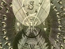

  
[Intangible Textual Heritage](../../index)  [Sub Rosa](../index) 
[Index](index)  [Previous](mhj305)  [Next](mhj307) 

------------------------------------------------------------------------

[Buy this Book at
Amazon.com](https://www.amazon.com/exec/obidos/ASIN/B0021YV3F4/internetsacredte)

------------------------------------------------------------------------

  
*Code of the Illuminati: Part III of Memoirs Illustrating the History of
Jacobinism*, by A Barruel, tr. Robert Edward Clifford \[1798\], at
Intangible Textual Heritage

------------------------------------------------------------------------

p. 440

### CHAP. V.

#### Third Part of the Code of the Illuminees—Second preparatory Degree—The Academy of Illuminism, or the Brethren of Minerva.

Weishaupt, ruminating on what turn he
should give to his Code of Illuminism, that its progress might be more
subtile and infallible, expresses himself in the following terms, on the
preparatory degrees which were to succeed to the novitiate of his
pupils. "I am thinking of establishing, in the next degree, a sort of an
academy of Literati. My design would include the study of the Ancients,
and an application to the art of observing and drawing characters (even
those of the living); and treatises and questions, proposed for public
compositions, should form the occupations of our pupils.—*I should wish,
more especially, to make them spies over each other in particular, and
over all in general*. It is from this class that I would select those
who have shown the greatest aptness for the Mysteries. My determination,
in short, is, that in this degree they shall labour at the discovery and
extirpation of prejudices. Every pupil (for example) shall declare, at
least once a month, all those which he may have discovered in himself;
which may have been his principal one, and how far he has been able to
get the better of it."

Ever influenced by a bitter hatred against the Jesuits, he does not
blush to say—"I mean that this declaration shall be among us, what
confession was among them." Her was, however, unfortunate in his
application; for in the Order of the Jesuits, no superior could ever
hear the confessions of the Inferiors; and thus their very institutes
rendered impossible the horrid abuse, under which Weishaupt affected to
cloak the abominable breach of confidence with respect to his pupils,
when he says, "by these means I shall discern those who show
dispositions *for certain special Doctrines relative to Government or to
Religion*." [1](#fn_96)

The statutes of their Minerval degree are drawn up with a little more
circumspection, and simply declare, "that the Order in that degree
wishes to be considered only as a learned society or academy,
consecrating its toils to form the hearts and minds of its young pupils
both by example and precept." [2](#fn_97) These
are called the Brethren of *Minerva*, and are under the direction of the
*Major or Minor Illuminees*. The academy properly so called is composed
of ten,

p. 441

twelve, and sometimes fifteen *Minervals*, under the direction and
tuition of a *Major Illuminee*.

In the kalendar of the Sect, the days on which the academy meets are
called *holy*, and its sittings are generally held twice a month; always
at the new moon. The place where they meet is called, in their language,
*a Church*. It must always be [preceded](errata.htm#17) by an
anti-chamber, with a strong door armed with bolts, which is to be shut
during the time of the meeting; and the whole apartment is to be so
disposed, that it shall be impossible for intruders either to see or
hear any thing that is going forward. [3](#fn_98)

At the commencement of each sitting, the President is always to read,
and, after his fashion, comment on some chosen passages of the bible, or *Seneca*, of *Epictetus*, *Marcus
Aurelius*, or *Confucius*. [4](#fn_99) The care
he takes to give to all these works the same weight and authority, will
be sufficient to make the pupils view the *Bible* in a similar light
with the works of the Pagan Philosophers.

This lecture over, each pupil is questioned "as to the books which he
has read since the last meeting; on the observations or discoveries he
may have made; and on his labours or services toward the progress of the
Order."

Nor are the studies and the books of which the Brethren are to give an
account, left to their own choice. To each of these academies there is
appropriated a particular library, whenever circumstances will permit,
calculated to insure the spirit of the Order; and this collection the
Sect takes care to furnish. By three different means it is accomplished.
First, by the money which the Brethren contribute; secondly, by the list
of his own private Library, which is exacted from each candidate, who is
obliged to furnish therefrom such books as may be required of him; the
third means is derived from Weishaupt's grand principle, that every thing which is useful is an act of
virtue. Now as it would be very useful for the Order to get
possession of those rare books and precious manuscripts which Princes,
Nobles, and Religious Orders keep shut up among their archives or in
their libraries; all Illuminees acting as librarians or archive-keepers
are admonished, exhorted, and seriously pressed not to make any scruple
of secretly stealing such books or manuscripts, and putting them into
the possession of the Sect. This is one of the most explicit lessons
that Weishaupt gives to his adepts; at one time telling them not *to
make a case of conscience* of giving to the Brethren what they may have
belonging *to the library of the Court*; at another, sending a list of
what should be stolen from that of the Carmes, he says, "*all these
would be of much greater use if they were in our hands.—What do those
rascals do with all those books?*" [5](#fn_100)

Yet, notwithstanding the caution with which the founder as yet withholds
certain books from the hands of the *Minerval*, it is clear from the
very assortment of the libraries of the Order, that he does not hesitate
at giving the pupils a certain number directly tending to the grand
object, and particularly those which may create a contempt for religion.
He wishes much to see *an impartial history of the Church*; and he even
proposes hereafter to

p. 442

publish one himself, or at least to contribute many articles toward such
a work. He calls the attention of the young adepts to *Sarpi*, to *Le
Bret's arsenal of calumnies*, and in short to all that has been written
against Religious Orders. [6](#fn_101) He had
even put on the list those impious works which appeared under the name
of *Freret*. He seemed to have forgotten for a moment his ordinary
prudence; but, warned of it by *Knigge*, he corrected his error. [7](#fn_102) Many other books, however, were to be
comprehended in the Minerval library, which were to disguise the object
of it; and it was one duty of the Presiding Illuminee to select such as
would gradually direct his pupils to the grand object of the Sect;
always remembering, that the most impious and seditious *were reserved
for the higher degrees*. Should the President chance to find *the System
of Nature, Natural Polity, Helvetius on Man*, or other such books, in
the hands of his pupil, *he was to avoid showing his pleasure or
displeasure*, and leave them. [8](#fn_103) In
short, it is in the Minerval schools that the teachers are in a
particular manner to practise that great art of making the adepts rather
as it were *invent* than learn the principles of the Order; because they
will then, looking upon them as the offspring of their own genius, more
strongly adhere to them.

There is yet another scheme in these schools for attaching the young
adepts to the Order.—Every brother is, at his first reception, to
declare to what art or science he means principally to apply, unless his
station, genius, or particular circumstances, debar him from the
literary career; in which latter case, *pecuniary contributions* are to
be an equivalent for those services which his talents cannot
contribute. [9](#fn_104) If the Brethren adopt
literary pursuits, then the Order enters into engagements to furnish
them with all possible assistance to forward their undertakings in the
art or science on which they shall have determined; unless they should
have chosen *Theology* or *Jurisprudence*, two sciences which the Order
absolutely excepts from any such agreement. [10](#fn_105)

Their succours for the Minerval have a two-fold tendency. On the one
side, they serve to prove that the adept does not *neglect* the science
he has determined on, as he is to give an annual account of the
discoveries he has made, and of the authors from which he has made
selections. On the other hand, the brethren following the same branches
of study are desired to help him with all the means in their power.
Should he meet with difficulties which he cannot solve, he may apply to
his Superior, who will either solve them himself, or send them to other
members of the Order, who, better versed in those sciences, and bound to
enlighten their Brethren, will send the required solutions. [11](#fn_106)

That his degree of Minveral may have all the appearances of a literary
society, the Superiors annually propose some question for a public
composition. The answers or dissertations are judged as in academies,
and the discourse which obtains the prize is printed at the expence of
the Order. The same advantages are held out to all adepts who wish to
publish their works, provided they are not foreign to the views of the
Founder. [12](#fn_107)—They are sure to
coincide with his intentions should they be of the nature of those which
he calls *pasquils*, or such as would create mirth among the people at
the expense

p. 443

of the priesthood, and of *religious truths; such as parodies on the
Lamentations of Jeremiah, or burlesque imitations of the Prophets;* in a
word, all such satires as dispose the people to the grand object of the
Sect. The Minerval can give no better proofs than these of his progress.
The Sect has booksellers who put these works into circulation, and the
profits are transmitted to the coffers of the Order.

It is, however, to be observed, that should a *Minerval*, or any other
of the Brethren, make a discovery in any art or lucrative science, he is
obliged, under pain of being looked upon as a false Brother, to impart
the secret to the Order, who will look upon itself as proprietor of such
secrets should they have been discovered by a Brother after his
admission among them. [13](#fn_108)

Lest he should be unobserved *when travelling*, the *Minerval* is never
to undertake any journey without previously informing his superiors, who
will send him letters of recommendation for different Brethren on the
road. He, in return, must carefully report every thing that he shall
discover during his travels, which may be to the advantage or
disadvantage of the Order. [14](#fn_109)

But we must not forget to mention, that during the academic sittings,
the presiding Illuminee is at least once a month to take a review of the
principal faults which he may have observed in any of his pupils. He is
to interrogate them concerning those which they may have observed
themselves; "and it would be unpardonable neglect," says the statutes,
"should any pupil pretend that during the space of a whole month he had
remarked nothing reprehensible. This would be a proof of the *utmost
negligence in the training of his mind to observation; and the Superior
must not suffer it to pass without reprehension*. He must also make his
observations in such a manner as to excite their serious attention, and
effectually to impress them with proper notions, so that each on
returning home shall be ready to put in practice his advice for the
advantage of the Order. [15](#fn_110) Beside,
the Superior is as much as possible to avoid letting a day pass without
seeing his pupils, either he visiting them, or they him. [16](#fn_111)

But what can be the object of such vigilance, such unremitting attention
to the *Minerval* Academy? A single word from the adept who, under the
inspection of Weishaupt, organized its laws, will explain the enigma. It
is, to adopt *Knigge's* expressions, by the works required of the young
Academicians that the Order will be able to judge whether they are *of
that sort of stuff* (that is to say of that turn of mind, susceptible of
all the principles of Impiety and Anarchy) which is necessary for the
higher degrees. After all these labours, should the *Minerval adept*
still retain any of what they call *religionist inclinations*, he will
then receive the three first Masonic degrees, and in them he may moulder
during the rest of his life *in the insignificant study of all their
hieroglyphics*. He will indeed still continue under the inspection of
the Superiors of the Order; but he may rest assured, that he will always
remain a *Minerval*, with a brevet of imbecility, on the registers of
the Sect. [17](#fn_112) On the contrary, should
he have shown a sufficient want of attachment to religion or to his
Prince; should he enthusiastically imbibe the principles of Illuminism,
he will certainly be promoted to higher degrees. During his academical
course the

p. 444

\[paragraph continues\] Sect has had
unerring means of judging him; viz. by the questions he has solved (and
which were put by the Order, not so much with a view of exercising his
talents as of prying into his opinions), and by the statements delivered
in by the *Scrutators*, of the impression made by the different
principles which they had disseminated either in the shape of
conversation, or by way of refutation, to try the young *Minerval*.

The questions which he has had to investigate during his course
sometimes regarded the secret of the Sect; at others, the security of
the adepts, and of the Superiors. To envelop the chiefs in impenetrable
darkness, and that their asylum may be proof against all attempts, death
itself is to be divested of its horrors. The *Minerval* must not finish
his Academical course till he has shown how far such fears have lost
their influence over him; he shall declare whether he is ready to submit
to every torture, rather than give the least information concerning the
Order; or even evade the temptation by poison or suicide. A dissertation
upon *Cato*, for example, will be given him as a task, and his
management of it will show whether he is ready to fall by his own hand
for the preservation of the Brethren. The *patet exitus*, or the *exit
is free*, that is to say, that every man is free to leave this life at
his pleasure, is one of those grand principles which must be advanced;
it must be commented on and discussed by the young adept; and should any
of those puerile ideas appear, which lead to believe in a God the
avenger of suicide, he is not the man to be entrusted with the secret,
and he shall be rejected. [18](#fn_113)

Many other questions are proposed in order to convince the Sect of the
principles of the young Academician. It must sound his opinions on the
means it employs, and on those in which he may hereafter be
instrumental. He will be ordered to discuss Weishaupt's famous doctrine,
that *the end sanctifies the means*; that is to say, that there are no
means, not even theft, poison, homicide, or calumny, but are just and
laudable when used for the attainment of objects which the Order may
chuse to style just or holy. [19](#fn_114)

After all this, the *Minerval* shall furnish some dissertation from
which his opinions on Kings and Priests may be ascertained; [20](#fn_115) but the presiding adept must carefully
avoid compromising himself; he must not openly applaud the epigrams,
sarcasms, or even blasphemies of his pupils; that must be left to the
brethren visitors, who will insinuate and encourage them without ever
hinting that they are in perfect unison with the mysteries of the Order.
He must not fail, however, to observe which of his pupils are the most
zealous for such doctrines, and who complacently repeat these sarcasms
or blasphemies; those, in short, who enthusiastically blend them in
their Academical compositions. This accomplished, they have run their
Academic career, and are next promoted to the degree of *Minor
Illuminee*.

p. 445

------------------------------------------------------------------------

### Footnotes

[444:1](mhj306.htm#fr_96) Orig. Writ. Vol.
I.—Let. 4, to Cato.

[444:2](mhj306.htm#fr_97) Statutes of the
Minveral, No. 16.

[444:3](mhj306.htm#fr_98) See the Minerval
Ritual.

[444:4](mhj306.htm#fr_99) Ibid.

[445:5](mhj306.htm#fr_100) p. 455 Orig. Writ. Vol. I. Let. 4.

[445:6](mhj306.htm#fr_101) Ibid.

[445:7](mhj306.htm#fr_102) Letter of Philo to
Cato.

[445:8](mhj306.htm#fr_103) Letter 3, to Cato.

[445:9](mhj306.htm#fr_104) Orig. Writ. Vol.
I.—Summary of the Institute, No. 9.

[445:10](mhj306.htm#fr_105) Statutes of the
Minerval, No. 1.

[445:11](mhj306.htm#fr_106) Ibid. No. 2.

[445:12](mhj306.htm#fr_107) Statutes of the
Minerval Nos 6, and 10.

[445:13](mhj306.htm#fr_108) Summary of the
Institutes, No. 11.—The true Illuminee.

[445:14](mhj306.htm#fr_109) Statutes of the
Minerval, No. 11.

[445:15](mhj306.htm#fr_110) Instructions for
the Minerval, No. 4.

[445:16](mhj306.htm#fr_111) Ibid. No. 3.

[445:17](mhj306.htm#fr_112) Last word from
Philo, Page. 90.

[445:18](mhj306.htm#fr_113) See hereafter the
Chapter on Juridical Depositions, in Vol. IV.

[445:19](mhj306.htm#fr_114) Ibid.

[445:20](mhj306.htm#fr_115) Ibid.

------------------------------------------------------------------------

[Next: Chapter VI. Third Preparatory Degree: The Minor
Illuminee](mhj307)
