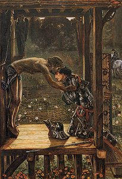

  
[Intangible Textual Heritage](../../index)  [Sub Rosa](../index) 

------------------------------------------------------------------------

[Buy this Book on
Kindle](https://www.amazon.com/exec/obidos/ASIN/B002RHOOXI/internetsacredte)

------------------------------------------------------------------------

<table width="75%">
<colgroup>
<col style="width: 50%" />
<col style="width: 50%" />
</colgroup>
<tbody>
<tr class="odd">
<td width="50%" data-valign="TOP"> 
The Merciful Knight, by Edward Burne-Jones [1893] (Public Domain Image)</td>
<td width="50%" data-valign="CENTER"><h1 id="traces-of-a-hidden-tradition-in-masonry-and-medieval-mysticism" data-align="CENTER">Traces of a Hidden Tradition in 
Masonry and Medieval Mysticism</h1>
<h2 id="by-isabel-cooper-oakley" data-align="CENTER">by Isabel Cooper-Oakley</h2>
<h4 id="section" data-align="CENTER">[1900]</h4></td>
</tr>
</tbody>
</table>

------------------------------------------------------------------------

[Contents](#contents)    [Start Reading](mmm00)    [Page
Index](pageidx)    [Text \[Zipped\]](mmm.txt.gz)

------------------------------------------------------------------------

|                                                                                                                           |
|---------------------------------------------------------------------------------------------------------------------------|
|  |

This is a set of essays by Isabel Cooper-Oakley, an early member of the
Theosophists. She connects the dots between ancient wisdom schools and
modern Freemasonry. At the root of this tree are a set of ideas from
Hinduism, Zororastrianism, Gnosticism and early Christianity. Along the
way she connects a number of links such as the Knights-Templars, the
Troubadours and the Rosicrucians. She names dozens of even more obscure
secret societies, heresies and conspiracies. The book finishes with an
analysis of the Grail myth.

Cooper-Oakley writes from an openly Theosophical world-view. However,
she is a more than competent historical writer, and quotes extensively
from primary and secondary sources to make her point. This book provides
abundant background information that anyone trying to understand this
topic should have a grasp of.

------------------------------------------------------------------------

 [Title Page](mmm00)  
[Contents](mmm01)  
[Introduction](mmm02)  
[Towards the Hidden Sources of Masonry](mmm03)  
[The Traditions of the Templars Revived in Masonry](mmm04)  
[The Troubadours, the Singing Messengers from East to West](mmm05)  

### The Heavenly Kingdom of the Holy Grail

[Part I](mmm06)  
[Part II.](mmm07)  
[Part III.](mmm08)  
