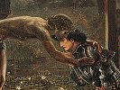

  
[Intangible Textual Heritage](../../index)  [Sub Rosa](../index) 
[Index](index)  [Previous](mmm01)  [Next](mmm03) 

------------------------------------------------------------------------

[Buy this Book on
Kindle](https://www.amazon.com/exec/obidos/ASIN/B002RHOOXI/internetsacredte)

------------------------------------------------------------------------

  
*Traces of a Hidden Tradition in Masonry and Medieval Mysticism*, by
Isabel Cooper-Oakley, \[1900\], at Intangible Textual Heritage

------------------------------------------------------------------------

p. 5

### INTRODUCTION.

THE series of sketches which are now brought together appeared
originally as detached articles in the pages of the *Theosophical
Review*, written, however, with the object of demonstrating to students
of Theosophy that a definite design could be traced beneath the
apparently disconnected mystic doctrines held by the many occult
brotherhoods, heretic sects and mystic associations which cluster so
thickly together as we glance along the historical by-ways of religious
thought during the Middle Ages. That object becomes clearer when they
appear as they do now in closer juxtaposition.

To those who wish to understand the reason of this steady recurrence of
mystic tradition in every century, these studies may be of some use.
They will serve as literary landmarks to guide the seeker to

p. 6

those distant sources whence flow faint echoes of divine truths—the
heritage of the divine human race; truths that bring dim memories to the
soul which are its highest impulse, and give the clue that guides it to
the inner "science of the soul"—the mystic quest of all the saints, and
the hidden truth that all religions have tried to teach, and which only
a few in each religion have ever realized.

Mystics, visionaries, dreamers of vain dreams have been the names which
the scoffers have always thrown at those who counted the world as nought
compared with the treasure of the unseen life, and who devoted their
lives to this divine science, and tried to reach an understanding of its
laws. And as we trace out the records of the past it will be clearly
seen that the Theosophical development is but another link in a wondrous
chain of mystic teaching which stretches far back into the night of
time.

Such a claim must be proved and its pretensions shown to be accurate,
but it is only by careful researches in the historical dust-bins of the
middle-ages that these data can be disinterred, and the chain of
evidence rendered complete. Then it becomes evident that Theosophy is
that glorious wisdom-religion which includes in its scope all religions
and all philosophies.

And as we piece together the fragments of these historical relics, they
waken delicate memories of the divine dreamer Dionysius the Areopagite,
hallowed echoes of John Scotus Erigena, and thus we come

p. 7

face to face with the holy secrets of tender mystical souls who sought
the true meaning of life. We get strange glimpses of the intense
devotion of the scholastic divines, and monks to whom the unseen life
was an intense and vital reality. The thoughts of Averroes and the
Arabian mystics emerge—they who brought much of the Eastern truth and
who founded the great occult schools of the once glorious Toledo, whence
flowed a stream of thought, which formed the very life and soul of the
heresies—so-called—of the Middle Ages. Nor may we omit the lore of the
Eastern and Syrian monasteries to whom the books of Dionysius had taken
the wisdom of Plotinus. Nor can the troubadours be passed by, the
singers of mystic songs, and carriers of occult knowledge.

Singers, scholars, saints, and martyrs, a goodly array of men and women,
all seeking the soul, and the soul's true world. Looked at from without,
such a view appears like a worn mosaic pavement, broken, defaced, with
many gaps lacking to make a perfect picture, and yet as we search and
piece the apparently broken fragments the design begins to unfold
itself, and finally the picture may be traced in perfect outline. For at
the back of all these varying streams of thought there may be found one
centre whence all diverge, and that great fount was named in ancient
India, Brahma-Vidyâ, the Theosophia of the Neo-Platonists.

This ancient Wisdom Religion is the "thread-soul" on which are strung
all the various incarnations

p. 8

and encasements of the religious life, adapted to the changing
conditions and developments of humanity in its growth from childhood to
manhood.

Begotten by that spiritual Hierarchy in whose guardianship is the
evolution of the human race, brought forth from them, they, the
guardians of the mystic tradition, give to those children of men who are
strong enough for the burden, a portion of the real teaching of the
Divine Science [\*](#fn_0) concerning God and
man, and the wonderful relationship that exists between the two.

With the passing of time the old orders changed, old forms perished, and
the divine Sun that shone on the ever-changing screen of time veiled
itself in new hues, and gathered into new groupings the humanity of the
Western races, and each century which rolled by evolved a new phase of
the ancient mystic tradition.

In the olden days men fought for their faiths, for they identified the
form with that divine Life which lies at the back of all forms, and the
changing of an outward veil shook their belief in the Holy Spirit, which
it did but shroud. They feared change and sought to crystallize the
Spirit, and this fear of change gave rise to that tenacious hold on
outward ceremonies which has wrought so much evil in all the religions
of the world.

p. 9

Religious parties, secret societies, sects of every description, such is
the shifting panorama of the religious life of Europe during the last
eighteen hundred years, and as we glance back from our present
standpoint, it is difficult at times to discern the mystic traditions,
so loud is the clamour of contending sects over their formal doctrines,
the outward expressions of their inner faith.

A word may here be said to guard against one error that might arise with
regard to the spiritual Hierarchy before mentioned, the guardians of the
world's religions. It is from this great communion that the
World-Saviours have from time to time come forth, and from this centre
have sprung all the "Sons of God."

The inception of all religions is from them, but lesser men build up the
body; like wise teachers, they do not force dogmas on a child humanity.
We see ordinary mankind prolific in building moulds for their faiths,
heaping dogma upon dogma; but in tracing back all the religions to their
founders, it may be seen that at the beginning the outward observances
were ever subordinated to the inner life, the forms and ceremonies in
fact, were merely organized in order to turn the attention of man to the
inner and spiritual aspect of life. This method of training receives its
completest exposition in the ancient code of Manu, where the whole daily
life of ancient India was directed, by its very organization, towards
the religious aspect. In the West this ideal

p. 10

was revived under the monastic orders, but since it was chiefly done
under the rigid doctrinal supervision of the Catholic Church, the ideal
of the simple spiritual life was crushed.

For the building of form—even religious form—is materializing in its
tendency, and thus we see that in all the centuries subsequent to the
inception of Christianity, the tendency of every "reformation" has been
to throw back, if possible, to the original standard erected by the
Founder. On careful investigation, for instance, the Christ appears
responsible only for certain high and pure ideals, insistence being made
on a holy life leading to a divine goal. The doctrines and elaborations
which were later introduced arose in every case from the followers, who
brought in their more worldly aims, and transformed thereby the purity
and simplicity of the early ideal into an ornate body, [\*](#fn_1) with [worldly](errata.htm#0) passions and
constant strivings for mundane power.

Hence we find at the end of the nineteenth century, on one side the
Catholic Church, on the

p. 11

other the Protestant, and between the extremes of these doctrinal
communities, a fluctuating, ever-increasing body of thinkers, formed by
the mystics and idealists of both parties, who from century to century
have been at variance with their "orthodox" brethren, seeking a higher
truth, a purer ideal, than those offered by the dogmatists.

The doctrines hidden in the secret fraternities have been handed down in
regular succession from first to last. We can see that the esoteric
teachings in Egypt, in Persia, and in Greece, were kept from the ears of
an illiterate multitude precisely because it was known that they could
not, in their then uneducated and ignorant condition, understand the
deeper truth of Nature and of God. Hence the secrecy with which these
pearls of great price were guarded and handed on with slight
modifications into the possession of those grand early Christians, the
Gnostics, the so-called heretics; then straight from the Gnostic schools
of Syria and Egypt to their successors the Manichæans, and from these
through the Paulicians, Albigenses, Templars and other secret
bodies—these occult traditions have been bequeathed to the mystic bodies
of our own times. Persecuted by Protestants on one side and by Catholics
on the other, the history of mysticism is the history of martyrdom.

It is sometimes said that modern Theosophy is of sporadic growth and can
show no sure basis, no line of religious or spiritual ancestry. But very
little

p. 12

research proves the contrary, proves indeed that in spite of the many
forms—religious bodies, secret societies, occult groups, Protestant
reforms, and Catholic heresies—there is distinct evidence that there are
certain points on which all of the various orders meet in accord, and
that when these points are brought together, there appear self-revealed
the same underlying teachings which form the basis of the great Wisdom
Religion, parent and children standing out in unmistakable relation. For
as King truly remarks:

Hippolytus . . . . . was right in calling all these
heresies nothing better than the old philosophies disguised under new
names; his only error lay in not going back far enough to find their
ultimate source. [\*](#fn_2)

Let us turn to that great conception, the doctrine of reincarnation,
sometimes less correctly termed metempsychosis or transmigration. This
tenet is the basis of the old Wisdom Religion, or Brahma-Vidyâ, and can
be distinctly traced in all those mystic societies which draw their
spiritual life from Gnostic sources. As Lecky [†](#fn_3) says:

The doctrine of transmigration was emphatically
repudiated by the Catholics; the human race was isolated by the scheme
of redemption, more than ever from all other races,

and it was against this isolation that the mystics,

p. 13

or so-called heretics, struggled; this ancient doctrine of the
transmigration of the soul was one of the heretical opinions for which
the Cathari [\*](#fn_4) were persecuted by the
Catholic Church. It was very freely taught by the Troubadours in their
mystic poems; a monk in his attack on Troubadour heretics mentions this
doctrine with much scoffing and ridicule. We owe a debt of thanks to
many such opponents, for they often show us where traces of the "Secret
Doctrine " are to be found. For instance, it is to the orthodox and
pious Catholic, Eugène Aroux, that we owe a mass of most important and
valuable information on the Troubadours and their religious mission;
their connection with mystic bodies, and the esoteric interpretation of
their poems. Information as to their tenets which is not divulged by the
mystics themselves is often given to us by their opponents, whose
dissertations provide us with much evidence.

Such research indeed reveals a new phase, for out of the dim obscurity
which shrouds the early centuries, undoubted historic evidence can be
found of a wide-spread occult fraternity, which under various names has
introduced into many societies the hidden aspect of spiritual truths,
striving to avert the

p. 14

materializing tendency by turning the eyes of men to the inner instead
of the outer life.

Three principal streams of religious thought can be distinctly traced as
we struggle through the labyrinth of evidences, and these may not
inappropriately be termed the Petrine, Pauline, and Johannine doctrines,
the last being the fountain-head of all the later Christian mystical
heresies. The Johannine doctrine caused great excitement in the
fourteenth century, the details of which will be given when we come to
that period. It must be borne in mind that the true occultism, the real
mysticism, is essentially religious in its nature, and students of
Theosophy must not be surprised to find that some of the historical
religious sects [\*](#fn_5) have had their
foundation in occultism and Theosophy. Such for instance are the
Albigenses and the Waldenses, the forerunners of the Wesleyans, the
Quietists and Quakers. These appear side by side with the Rosicrucians,
the Knights Templars, the Fratres Lucis and many other sects who hold
the same religious tenets.

This view will necessarily arouse some criticism, for the standard
orthodox works on all the sects and heresies studiously omit every
reference to occultism, and in some cases the real tradition can
scarcely be

p. 15

found, so carefully is every reference to it extirpated from ordinary
history.

It is only by searching into the records themselves that the real
evidences of such esoteric doctrine are discovered, and it is in truth
somewhat startling to find so many, while the outside public is in total
ignorance of the very existence of a mystic tradition or a secret
doctrine, or a spiritual Hierarchy. On this point a well-known writer on
mysticism says:

The publication of the life and times of Reuchlin,
who exercised so marked an influence over Erasmus, Luther, Melancthon,
and the chief spirits of his age will, I trust, afford a key to many
passages of the German Reformation which have not yet been understood in
this country. They will reveal many of the secret causes, the hidden
springs, which were moving the external machinery of several
ecclesiastical reforms, which were themselves valuable rather as symbols
of a spiritual undercurrent than as actual institutions and
establishments. *Felix qui potuit rerum cognoscere causas*. Fortunate is
it for the student of truth when he can thus discover the causes of
effects, when he is allowed to examine the origin of those changes and
revolutions, which but for this intelligible process would look like
monstrous and unaccountable abortions, obeying no law and owning no
reason. Fortunate is he who is thus allowed to step behind the scenes of
the world's drama and hear the plans proposed and the pros and cons of
the councillors which give rise to lines of action. [\*](#fn_6)

Truly one could almost think a Theosophist was

p. 16

writing the paragraph just quoted. The whole of Reuchlin's period will,
we hope, be dealt with in due course, and a digest of the mysticism of
this period made.

As already said, the occult doctrines of the Gnostics were heirlooms and
sacred traditions from a very distant past, and when the early Christian
era dawned, the human race had long been plunged in the darkening and
materializing tendencies of the Black Age. [\*](#fn_7) Soon indeed, the Gnosis was rejected by the
orthodox church, and the sacred and secret teachings of the great Master
Jesus became materialized; they have, however, never been lost, and
traces of them can be discerned from epoch to epoch.

Says Marras [†](#fn_8) in his interesting study:

When therefore we speak of the continuation of their
doctrines during the Middle Ages, we mean only a secret transmission of
certain opinions, either in a number of families whose inner doctrines
did not correspond to their outward profession of faith, or in the midst
of certain sects which had had relations with the Gnostics  The vitality
of the Manichæans was wonderful; notwithstanding the severe persecution
they endured in the heathen as well as the Christian Roman Empire, they
survived both in the East and in the West, and often reappeared in the
Middle Ages in different parts of Europe. Manichæism dared to do what
Gnosticism had never ventured upon: it openly entered the lists against
the Church in the fifth century,

p. 17

but the civil authority came to aid the religious
authority in repressing it. The Manichæans wherever they appeared were
immediately attacked: they were condemned in Spain in the year 380, and
at Trèves in 385, in their representatives the Priscillianists; the
Empire seems determined to annihilate Manichæism [\*](#fn_9), as well as Gnosticism when suddenly the
latter arose under a new form and under a new name—that of
Paulicianism.

In order that our readers may follow this line of. study more clearly,
it will be well to group the evidences of each century together. We must
bear in mind that many of these societies stretch back through several
centuries, and are not limited to one date or confined to one period.
The consequent overlapping makes one of the difficulties of following
these evidences of the secret tradition. Sometimes a body will remain
the same, changing only its name, but keeping the same tenets. This is
markedly the case with the Albigenses, the Paulicians, the Waldenses,
and many of the middle age bodies—the Rosicrucians and others. Then
again, we find that the same terms are sometimes used for the highest
spiritual sciences and at others debased by the usage of charlatans.
Theurgy, alchemy, mysticism, occultism, theosophy, yoga, all these names
have

p. 18

been alternately used to indicate the purest and highest ideal of
development for man, and then adopted by those who sought in them but
their own selfish ends. To discriminate between these extremes, to find
the true and leave the false mysticism, is then the aim in view. It is
perhaps simplest to begin with the present era and trace the way back
through the darkness of the middle ages to the period when the Gnostic
schools still preserved to a great extent the sacred Eastern
traditions. [\*](#fn_10) The details of that
period must be left to hands more skilled to treat the subject.

Let us then take a survey of the last nine centuries of the Christian
era, and in a series of sketches substantiate with historical facts the
proposition here but briefly outlined: that the ancient Wisdom Religion,
or Theosophia, has had throughout these periods its votaries, teachers,
messengers and followers, that the Great Lodge has never been without
its representatives, and in truth that the guidance of the spiritual

p. 19

evolution of the world by this body of teachers can be discerned by
those who search the records.

The wave of gross materialism which swept over the Western world is now
but slowly rolling away. The deplorable scepticism of our own day is but
the result, and the natural result, of the methods adopted by the
Catholic and Protestant Churches in the struggles of the Middle Ages. It
has already been pointed out as one of the basic teachings of Theosophy
that part of the evolutionary progress is the breaking up of forms in
order that the spiritual nature of man may find wider conditions. In
both of these Churches the extremes of dogmatic limitation were reached,
the result being an ever increasing irritation of the more highly
educated people against dogmas which were contrary to reason, and forms
of faith which degraded the God they were supposed to uphold. For the
Protestants believed in the verbal inspiration of an inaccurately
translated Bible, claiming that their God gave his fiat in books whose
historical basis is now shown to be unreliable. All who refused the
letter of the law and sought the spirit which lay behind were cast out.
We have but to search the records of the Puritans and some other
Protestant bodies to see how rigid were their dealings with those who
rejected their narrow theological dogmas. [\*](#fn_11)

p. 20

The Catholic Church permitted no education, no freedom of religious
thought, and, knowing the unstable basis on which she stood, the
Dominicans in the early middle ages took up the very simple position of
entirely forbidding the reading of the Bible, except in such scamped
versions as were authorized; and all who did not obey were removed by
the Church. Indeed, the bloodiest and blackest records that history can
show us are the attacks of the Catholic Church on the mystics of all
these centuries.

"We do condemn to perpetual infamy the Cathari, the Patarines, the
Leonists, the Speronists, and the Arnoldists circumcised, and all other
heretics of both sexes by what name soever they are called. . . . And in
case any man by a presumptuous attempt, being instigated thereto by the
enemy of mankind, shall in any way endeavour the infraction of them
\[*i.e.*, the laws against the heretics\] let him be assured, that by so
doing, he will incur the indignation of Almighty God, and of the blessed
Apostles Peter and Paul!"

Thus thundered Pope Honorius III. in the fourteenth century. [\*](#fn_12) To give one solitary instance out of the
numerous condemnations that fluttered about the mystic path.

Indeed it is hardly credible, even with the records open before us, that
such inhuman tortures as were

p. 21

perpetrated on some of the mystic sects enumerated could have been
devised in the name of a Saviour of mercy and love. Such fiendish
barbarity, however, brought its own karma, a rich reward of hatred,
scepticism and unbelief. The education and knowledge that the Church
discountenanced and withheld were reached by natural evolution; the
priests who should have been the spiritual leaders were overthrown and
cast down, and the result was that education fell into the hands of
materialistic and rationalistic thinkers, and the spiritual aspect . of
life was crushed out.

During the dark days of the revolution in France, it was the mystics who
most bitterly deplored the growing scepticism. The materialists were the
enemies of mystics, occultists and religionists of every kind, Catholic
and Protestant. The Catholic party tried to father the outbreak of the
revolution on the mystics. The Abbé Barruel in his book on
Jacobinism [\*](#fn_13) has taken every pains to
do this, as also have the Abbé Migne and many others. But the appalling
corruption of the Catholic Church, conjoined with her insistence on the
ignorance of the people, was one of the great factors in that terrible
outbreak.

In a very interesting correspondence between the Baron Kirschberger de
Liebesdorf and Louis Claude de St. Martin, [†](#fn_14) the situation is most clearly described,

p. 22

and the following important extract shows the insidious method of work
adopted by the German materialistic school, the enemy alike of mystics
and Churches.

The Baron writes:

"MORAT, *June*, 1795.

". . . . Unbelief has actually formed a well-organized club; it is a
great tree which overshadows a considerable portion of Germany, bearing
very bad fruit, and pushing its roots even into Switzerland. The enemies
of the Christian religion have their affiliations, their lookers-out,
and a well-established correspondence; they have a provincial for each
department, who directs the subaltern agents; they control the principal
German newspapers; these newspapers are the favourite reading of the
clergy who do not like to study; in them they puff the writings which
air their views, and abuse all besides; if a writer ventures to rise
against this despotism, he can hardly find a publisher who will take
charge of his manuscript. This is what they can do in the literary way;
but they have much more in their power than this. If there is a place
vacant in the public instruction department . . . they have three or
four candidates all ready, whom they get presented through different
channels; . . . in this way is constituted the University of Göttingen.
. . . Another grand means which they employ is that of . . . calumny.
This is all the easier for them, that most of the Protestant
ecclesiastics, are, unhappily, their zealous agents; and as this class
has a thousand ways of mixing everywhere, they can at pleasure circulate
reports which are sure to hit their mark, before one knows anything
about it, or is able to defend oneself. This monstrous coalition has
cost its chief, an old man of letters at Berlin and at the same time one
of the most celebrated publishers of Germany, thirty years' labour.

p. 23

\[paragraph continues\]

He has edited the first journal of the country ever since 1765; his name
is Frederick Nicolaï. This *Bibliothèque Germanique* has, by its agents,
taken hold also of the spirit of the *Literary Gazette* of Jena, which
is very well got up, and circulates wherever the German language is
known. Besides this Nicolaï influences the *Berlin Journal*, and the
*Museum*, two works of repute. Political organization and affiliated
societies were established, when these journals had sufficiently
disseminated their venom. Nothing can equal the constancy with which
these people have followed their plan. They have moved slowly, but
surely; and, at the present hour, their progress has been so enormous,
and their influence become so frightful, that no effort can now avail
against them; Providence alone can deliver us from this plague.

At first, the march of the Nicolaïtes was very circumspect; they
associated the best heads of Germany in their *Bibliothèque
Universelle*, their scientific articles were admirable, and the reviews
of theological works occupied a considerable portion of every volume.
These reviews were composed with so much wisdom that our professors in
Switzerland recommended them in their public discourses to our young
Churchmen. But they let in the poison \[of materialism\] a little at a
time and very carefully. [\*](#fn_15)

This organized conspiracy was the result of the methods adopted by the
Catholic Church. Men demanded knowledge, sought knowledge, and attained
knowledge, but only of the material side of life. Shocked by the
barbaric superstitions and illogical dogmas insisted on by the Church,
the revolt of reason threw men back into a dogmatism which

p. 24

was scarcely less rigid than the one they had left. The study of
history, the knowledge of science, all tended to show the superficiality
of that basis on which the Catholic Church had reared herself, and the
leaders of thought who led this revolt, the Encyclopædists in France and
the Nicolaïtes in Germany, were the bitter fruit of Catholic karma. They
banded themselves together, and it was this body of sceptics and their
organized conspiracy for which the Abbé Barruel and others tried to make
the mystics responsible. The Church blamed others for the results of her
own work, and the poison of unbelief and deadly materialism was meantime
being slowly spread in Europe by the Nicolaïtes.

They tried to crush out all belief in or investigations into the unseen
life and its forces. Hence their bitter and criminal attacks upon the
Comte de St. Germain, Cagliostro, Saint Martin, and also upon the
various mystical secret societies and Freemasonry in general. Keeping
this powerful and malignant organization [\*](#fn_16) in view, we shall better understand the
charges brought against the various mystics above mentioned. It is only
in the course of research that it is possible to realize the
vindictiveness and argus-eyed watchfulness with which these Nicolaïtes
pursued mysticism and Freemasonry. Article after article, book upon
book, was produced, one and all from the same source, each teeming with
the same poisonous

p. 25

intent, the destruction of mysticism and the crushing out of the
spiritual life.

The eighteenth century is perhaps the most difficult in which to sift
the true tradition from the spurious; mushroom-like, semi-mystical
societies sprang up on all sides, claiming occult knowledge and mystic
teaching; but when these claims are sifted for verification they lack
the stamp of high morality and purity which is the ineffaceable mark of
all that emanates from the Great Lodge; hence in selecting the societies
and bodies which will be dealt with and studied in detail, only those
have been chosen in which outer and inner investigation proves their
unmistakable origin to be from a source whose ideals are pure and holy.

That there was definite connection between the various sects, societies,
and heresies, is evident; they had moreover a common language of signs,
by which they could make themselves known to each other. Says Rossetti,
speaking of the fourteenth century:

There are some events in history, whether literary,
or political, or ecclesiastical, which at first sight appear to us quite
enigmatical; but when once aware of the existence of the marked language
of the secret Anti-papal Sects (especially of the Society of the
Templars, and the Patarini, or Albigenses, or Cathari, with whom the
learned in Italy were then so strictly connected), we find them very
intelligible and clear. [\*](#fn_17)

I

p. 26

So that Rossetti speaks in the same manner as Barham in the passage
already cited about a secret force [\*](#fn_18)
permeating the outer society. Again he says:

Why were the Templars, who were members of the most
illustrious families in Europe, sacrificed by hundreds in different
countries? Why were the Patarini burned alive in almost every city?
History tells us: they belonged to secret societies, and professed
doctrines inimical to Rome. What those doctrines were is well known, as
far as regards the Patarini. [†](#fn_19)

Rossetti then proceeds to mention the Albigenses as a sect emanating
from the Templars, who themselves held Eastern doctrines, a fact not
found in the ordinary standard dictionaries of heresies, for the
connection between those religious bodies, the Templars, the
Rosicrucians, and the Freemasons is entirely suppressed, yet the
historical links are all to be found by the unprejudiced student.

The rough enumeration which now follows of the mystical societies and
so-called heresies serves only as a guide to where the evidence can be
found.

p. 27

They are, moreover, selected from many other bodies simply because in
their inception they fulfil the before-mentioned conditions of purity
and morality combined with occult knowledge. Some few societies, or
groups rather, have been omitted simply because they are so occult that
very little outer historical evidence is forthcoming. Facts are known
about them by a limited number of people; but they stand more as the
inspirers of the bodies here enumerated than in their ranks. A few names
of leading mystics are also given, so that students may be able to trace
the groups to which they are related.

Eighteenth century: The Fratres Lucis, or The Knights of Light; The
Rosicrucians; The Knights and Brothers Initiate of St. John the
Evangelist from Asia, or the Asiatische Brüder; The Martinists; The
Theosophical Society [\*](#fn_20); The
Quietists; The Knights-Templars; Some Masonic Bodies.

Seventeenth century: The Rosicrucians; The Templars; The Asiatische
Brüder; Academia di Secreti, at the home of John Baptista Porta; The
Quietists, founded by Michael de Molinos; and the whole group of Spanish
mystics.

Sixteenth century: The Rosicrucians became widely known; The Order of
Christ, derived from the Templars; Cornelius Agrippa, of Nettesheim, in
connection with a secret association; Saint Teresa;

p. 28

\[paragraph continues\] St. John of the
Cross; Philippe Paracelsus; The Fire Philosophers; Militia Crucifera
Evangelica, under Simon Studion; The Mysteries of the Hermetic Masters.

Fifteenth century: The Fratres Lucis at Florence, also the Platonic
Academy; The Alchemical Society; Society of the Trowel; The Templars;
The Bohemian Brothers, or Unitas Fratrum; The Rosicrucians.

Fourteenth century: The Hesychasts, or the precursors of the Quietists;
The Friends of God; German Mysticism, led by Nicholas of Basle; Johann
Tauler; Christian Rosencreutz; The great Templar persecution; The
Fraticelli.

Thirteenth century: The Brotherhood of the Winkelers; The Apostolikers;
The Beghards and the Beguinen; The Brothers and Sisters of the Free
Spirit; The Lollards; The Albigenses, crushed out by the Catholic
Church; The Troubadours.

Twelfth century: The Albigenses appear, probably derived from
Manichæans, who settled in Albi; The Knights Templars, publicly known;
The Cathari, widely spread in Italy; The Hermetists.

Eleventh century: The Cathari and Patarini, condemned by the .Roman
Church, both derived from Manichæans; The Paulicians with the same
tradition, also persecuted; The Knights of Rhodes and of Malta;
Scholastic Mystics.

Tenth century: Paulicians: Bogomiles; Euchites; Manichæans.

p. 29

From the Ninth century to the Third century the following organisations
and sects appear: Manichæans; Euchites; Magistri Comacini; [\*](#fn_21) Dionysian Artificers; Ophites;
Nestorians; Eutychians.

In the Fourth century the central figure for all occult students is the
great Iamblichus; the forerunner of the Rosicrucians; and in the Third
century we find Manes, the widow's son, the link for all of those who
believe in the great work done by the "Sons of the Widow" and the Magian
Brotherhood.

The various sects and bodies here detailed should not, of course, be
understood as belonging exclusively to the century under which they
appear in the above classification. All that this list is intended to
convey is that such sects were more markedly prominent during the
century in which they are placed.

The possibility of dealing with mysticism and the real mystic societies
consists in the fact that we are dealing with a certain definite
teaching, its difficulty consists in the fact that the outward
presentation is constantly changing according to the exigencies of

p. 30

the period. New teachers are sent to build new forms, for the tendency
to crystallize and to petrify is the natural inclination of the human
mind; the emotional nature clings fondly to familiar conditions, but
these belong to the "natural body" and we are following the evolution of
the "spiritual body." Through forms and phases many and painful does the
soul acquire experience. Hence all these many societies have been but
the schools through which the souls have been passing, and wherein they
have acquired knowledge.

Thus the study of mysticism in the Middle Ages places before us a
landscape flickering with shadow and with light, and the people who
travel across that tract are alternately in light and shade, and their
experiences, bitter as well as sweet, belong to all pilgrims who are
seeking truth in the perplexities of the changing phases of human life.

------------------------------------------------------------------------

### Footnotes

[8:\*](mmm02.htm#fr_0) This "Science of the Soul"
is the fact against which the Roman Church waged such bitter war, and
formed the basis for the attack upon the various sects such as the
Albigenses, Patarini, and Vaudois, all remnants of Gnostic sects.

[10:\*](mmm02.htm#fr_1) "The favour and success
of the Paulicians in the eleventh and twelfth centuries must be imputed
to the strong, though secret, discontent which armed the most pious
Christians against the Church of Rome. Her avarice was oppressive, her
despotism odious; less degenerate, perhaps, than the Greeks in the
worship of saints and images, her innovations were more rapid and
scandalous."—Gibbon (E.), *Decline and Fall of the Roman Empire*, Vol.
IX., chap. liv., p. 289. In Italy the descendants of the Manichæans were
termed Cathari, sometimes Gazari, or "The Pure." A good account, with
many references, is to be found in Fuesslins (Johann Conrad), *Neue and
unpartheyische Kirchen and Ketzerhistorie der Mittlern Zeit*. Frankfurt
u. Leipzig, 1770.

[12:\*](mmm02.htm#fr_2) King (C. W.), *The
Gnostics and their Remains*, p. 13. London, 1887.

[12:†](mmm02.htm#fr_3) Lecky (W. E., M.A.),
*History of European Morals*, Vol. II. p. 167. Third Edition. London,
1877.

[13:\*](mmm02.htm#fr_4) Says Lea: "Transmigration
provides for the future reward or punishment of deeds done in life." Lea
(Henry Charles), *A History of the Inquisition of the Middle Ages*, Vol.
I., p. 91, 98. Schmid (C.), *Histoire et Doctrine de la Secte des
Cathares ou Albigeois*, Vol. II., p. 256. Paris, 1849. Says: "La
Metempsycose enseignée par l’une les écoles Cathares se retrouve
également dans le Manichéisme."

[14:\*](mmm02.htm#fr_5) The principal secret
societies take St. John as their patron saint as we shall see when
dealing with the details of many of these bodies. Notably is this the
case with many of the Masonic bodies. See the articles on
"Johannesbrüder" and "Johanneschristen" in *Allgemeines Handbuch der
Freimaurerei*, Zweite völlig umgearbeitete Auflage; ii. p. 68. Leipzig,
1865.

[15:\*](mmm02.htm#fr_6) *The Life and Times of
John Reuchlin or Capnio*n, by Francis Barham (editor of the Hebrew and
English Bible. London, 1843), p. 17.

[16:\*](mmm02.htm#fr_7) The Kali-Yuga of the
Hindus.

[16:†](mmm02.htm#fr_8) Marras (P.), *Secret
Fraternities of the Middle Ages*, pp. 19-21. London, 1865.

[17:\*](mmm02.htm#fr_9) In his last years the
Pope had leisure to turn his arms against the Manichæan heretics, who,
starting from the mountains of Bulgaria, carried their pure but stern
religion westwards in a constant stream which never lost touch with its
fountain-head, and under the names of Paterini, Ketzer, and Albigenses,
earned the execration of their contemporaries, and the respect of
posterity. Browning (Oscar), *Guelphs and Ghibellines: a short History
of Mediæval Italy* from 1250-1409, p. 10, 1893.

[18:\*](mmm02.htm#fr_10) One curious fact which
makes a further identity between these bodies is given by H. C. Lea, in
his *History of the Inquisition of the Middle Ages*, Vol. I., p. 92.
London, 1888. "A further irrefragable evidence of the derivation of
Catharism from Manichæism is furnished by the Sacred thread and garment
which were worn by all the Perfect among the Cathari. This custom is too
peculiar to have had an independent origin, and is manifestly the
Mazdean *kosti* and *saddarah*, the sacred thread and shirt, the wearing
of which was essential to all' believers, and the use of which by both
Zends and Brahmins shows. that its origin is to be traced to the
prehistoric period anterior to the separation of those branches of the
Aryan family. Among the Cathari the wearer of the thread and vestment
was what was known among the inquisitors as the *hæreticus indutus* or
*vestitus*, initiated into all the mysteries of the heresy."

[19:\*](mmm02.htm#fr_11) See the execution and
trial of Servetus, 1553, Willis (R., M.D.) Servetus and Calvin. *A Study
of an important Epoch in the early History of the Reformation;* p. 480.
London, 1877.

[20:\*](mmm02.htm#fr_12) *History of the
Christian Church*, by the Rev. Henry Stebbing, A.M. (London, 1834), ii.,
301.

[21:\*](mmm02.htm#fr_13) Barruel: *Mémoires pour
servir à l’Histoire du Jacobinisme*, 4 vols. London, 1797.

[21:†](mmm02.htm#fr_14) Le Philosophe Inconnu,
the leader of the Martinists.

[23:\*](mmm02.htm#fr_15) *La Correspondance
inédite de L. C. Saint-Martin et Kirchoerger, Baron de Liebistorf*
(1792-1797). Paris, 1862; pp. 195, 196.

[24:\*](mmm02.htm#fr_16) The Nicolaïtes.

[25:\*](mmm02.htm#fr_17) *Disquisitions on the
Anti papal Spirit which produced the Reformation*, by Gabriele Rossetti,
Prof. of Italian Literature at King's College (London, 5834), ii. 156.
He is here referring to a secret language, the existence of which was
known to many writers.

[26:\*](mmm02.htm#fr_18) Says Lea in speaking of
Calabria: "The Heretics sought and obtained in 1497 from King Frederic
the confirmation by the crown of agreements. . . . They were visited
every two years by the travelling pastors or *barbes*, who came in
pairs, an elder known as the *reggitore*, and a younger, the
*coadiutore*, journeying with some pretence of occupation, finding in
every city the secret band of believers whom it was their mission to
comfort and keep steadfast in the faith  Everywhere they met friends
acquainted with their secret passwords, and in spite of ecclesiastical
vigilance there existed throughout Italy a subterranean network of
heresy disguised under outward conformity."—Lea (H. C.), *History of the
Inquisition of the Middle Ages;* II., pp. 268, 269. New York; 1888.

[26:†](mmm02.htm#fr_19) *Op. Cit.*, I. 148.

[27:\*](mmm02.htm#fr_20) Founded in London,
1767, by Benedicte Chastamer, a mystic mason.

[29:\*](mmm02.htm#fr_21) Llorente (J. A.).
*Hist. of the Inquisition*. London, 1826. Merzario (Giuseppe, Prof.); *I
Maestri Comacìni;* Milano; 1893. This author says: "In this darkness
which extended over all Italy, only one small lamp remained alight,
making a bright spark in the vast Italian necropolis. It was from the
*Magistri Comacini*. Their respective names are unknown, their
individual works unspecialized, but the breath of their spirit might be
felt all through those centuries, and their name collectively is legion.
We may safely say that of all the works of art between 800 and 1000, the
greater and better part are due to that brotherhood—always faithful and
often secret—of the *Magistri Comacini*."

------------------------------------------------------------------------

[Next: Towards the Hidden Sources of Masonry](mmm03)

