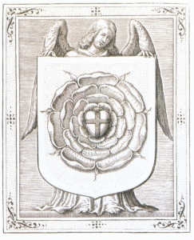

  
[Intangible Textual Heritage](../../index)  [Sub Rosa](../index) 
[Rosicrucians](../../eso/ros/index) 

------------------------------------------------------------------------

[Buy this Book at
Amazon.com](https://www.amazon.com/exec/obidos/ASIN/1419140671/internetsacredte)

------------------------------------------------------------------------

<table width="75%">
<colgroup>
<col style="width: 50%" />
<col style="width: 50%" />
</colgroup>
<tbody>
<tr class="odd">
<td width="50%" data-valign="TOP"></td>
<td width="50%" data-valign="CENTER"><h1 id="in-the-pronaos-of-the-temple-of-wisdom" data-align="CENTER">In the Pronaos of the Temple of Wisdom</h1>
<h2 id="by-franz-hartmann" data-align="CENTER">by Franz Hartmann</h2>
<h4 id="section" data-align="CENTER">[1890]</h4></td>
</tr>
</tbody>
</table>

------------------------------------------------------------------------

[Contents](#contents)    [Start Reading](ptw00)

------------------------------------------------------------------------

|                                                                                                                           |
|---------------------------------------------------------------------------------------------------------------------------|
|  |

Franz Hartmann, who also wrote the esoteric novella [With the
Adepts](../wta/index), published this short non-fiction summary of the
Rosicrucian question in 1890. He reviews the well-known history and
literature of the Rosicrucians. In the last two chapters Hartmann
presents what he believes to be the core doctrines of the 'true'
Rosicrucians.

------------------------------------------------------------------------

 [Title Page](ptw00)  
[Contents](ptw01)  
[Preface](ptw02)  
[Chapter One. Introduction](ptw03)  
[Chapter Two. The Hermetic Philosophy](ptw04)  
[Chapter Three. Mediaeval Philosophers](ptw05)  
[Chapter Four. Among the “Adepts.”](ptw06)  
[Chapter Five. The Rosicrucian “Orders.”](ptw07)  
[Chapter Six. Pseudo-Rosicrucians—Impostors And Fools](ptw08)  
[Appendix: The Principles of Yoga-Philosophy of the Rosicrucians and
Alchemists](ptw09)  
[Chapter Eight. Alchemy](ptw10)  
