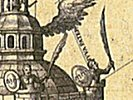

  
[Intangible Textual Heritage](../../index)  [Sub Rosa](../index) 
[Index](index)  [Previous](rhr01)  [Next](rhr03) 

------------------------------------------------------------------------

[Buy this Book at
Amazon.com](https://www.amazon.com/exec/obidos/ASIN/B0026L7FOU/internetsacredte)

------------------------------------------------------------------------

  
*The Real History of the Rosicrucians*, by Arthur Edward Waite,
\[1887\], at Intangible Textual Heritage

------------------------------------------------------------------------

p. 1

### PREFACE.

BENEATH the broad tide of human history there flow the stealthy
undercurrents of the secret societies, which frequently determine in the
depths the changes that take place upon the surface. These societies
have existed in all ages and among all nations, and tradition has
invariably ascribed to them the possession of important knowledge in the
religious scientific or political order according to the various
character of their pretensions. The mystery which encompasses them has
invested them with a magical glamour and charm that to some extent will
account for the extravagant growth of legend about the Ancient
Mysteries, the Templars, the Freemasons, and the Rosicrucians, above
all, who were the most singular in the nature of their ostensible claims
and in the uncertainty which envelopes them.

"A halo of poetic splendour," says Heckethorn, [1](#fn_0) "surrounds the Order of the Rosicrucians;
the magic lights of fancy play round their graceful day-dreams, while
the mystery in which they shrouded themselves lends additional
attraction to their history. But their brilliancy was that of a meteor.
It just flashed across the realms of imagination and intellect, and
vanished for ever; not, however, without leaving behind some permanent
and lovely traces of its hasty passage. . . . Poetry and romance are
deeply

p. 2

indebted to the Rosicrucians for many a fascinating creation. The
literature of every European country contains hundreds of pleasing
fictions, whose machinery has been borrowed from their system of
philosophy, though that itself has passed away."

The facts and documents concerning the Fraternity of the Rose Cross, or
of the Golden and Rosy Cross, as it is called by Sigmund Richter, [1](#fn_1) are absolutely unknown to English readers.
Even well-informed people will learn with astonishment the extent and
variety of the Rosicrucian literature which hitherto has lain buried in
rare pamphlets, written in the old German tongue, and in the Latin
commentaries of the later alchemists. The stray gleams of casual
information which may be gleaned from popular encyclopædias cannot be
said to convey any real knowledge, while the essay of Thomas De Quincey
on the "Rosicrucians and Freemasons," though valuable as the work of a
sovereign prince of English prose composition, is a mere transcript from
an exploded German savant, whose facts are tortured in the interests of
a somewhat arbitrary hypothesis. The only writer in this country who
claims to have treated the subject seriously and at length is Hargrave
Jennings, who, in "The Rosicrucians, their Rites and Mysteries," &c.,
comes forward as the historian of the Order. This book, however, so far
from affording any information on the questions it professes to deal
with, "keeps guard over " [2](#fn_2) the secrets
of the Fraternity, and is

p. 3

simply a mass of ill-digested erudition concerning Phallicism and
Fire-Worship, the Round Towers of Ireland and Serpent Symbolism, offered
with a charlatanic assumption of secret knowledge as an exposition of
Rosicrucian philosophy. [1](#fn_3)

The profound interest now manifested in all branches of mysticism, the
tendency, in particular, of many cultured minds towards those
metaphysical conceptions which are at the base of the alchemical system,
the very general suspicion that other secrets than that of manufacturing
gold are to be found in the Pandora's Box of Hermetic and Rosicrucian
allegories,  [2](#fn_4) make it evident that the
time has come to collect the mass of material which exists for the
elucidation of this curious problem of European history, and to depict
the mysterious Brotherhood as they are revealed in their own manifestos
and in the writings of those men who were directly or indirectly in
connection with them. Such a publication will take the subject out of
the hands of unqualified writers, and of the self-constituted pontiffs
of darkness and mystery who trade upon the ignorance and curiosity of
their readers.

As the result of conscientious researches, I have succeeded

p. 4

in discovering several tracts and manuscripts in the Library of the
British Museum, whose existence, so far as I am aware, has been unknown
to previous investigators, while others, including different copies and
accounts of the "Universal Reformation," as well as original editions of
the "Chymical Marriage of Christian Rosy Cross," which are not in the
Library Catalogue, though less generally obscure, I have met with in a
long series of German pamphlets belonging to the first quarter of the
seventeenth century. These, with all other important and available facts
and documents, I have carefully collected and now publish them in the
present volume, either summarised or *in extenso* according to their
value, and I offer for the first time in the literature of the subject
the Rosicrucians represented by themselves. I claim that I have
performed my task in a sympathetic but impartial manner, purged from the
bias of any particular theory, and above all uncontaminated by the
pretension to superior knowledge, which claimants have never been able
to substantiate.

------------------------------------------------------------------------

### Footnotes

[1:1](rhr02.htm#fr_0) "Secret Societies of all
Ages and Countries."

[2:1](rhr02.htm#fr_1) "Die Warhaffte and
vollkommene, Bereitung des Philosophischen Steins, der Bruderschafft aus
dem Orden des Gulden-und-Rosen Creutzes." 1710.

[2:2](rhr02.htm#fr_2) "No student of occult
philosophy need fear that we shall most carefully keep guard--standing
sentry (so to speak) over those other and more recondite systems which
are connected with our subject."

[3:1](rhr02.htm#fr_3) In reviewing an enlarged
edition of this work, published in 1879, the *Westminster Review*
remarks: "In the 'Rosicrucians' we have come across perhaps the most
absurd book that it has ever been our fortune to review. . . . It
affords a great deal of disjointed information on very many subjects, .
. . but the one subject on which we have vainly sought information in
its pages is the 'History of the Rosicrucians.' . . . The whole book is
an absurd jumble of passages and illustrations, for most of which no
authority is, or could be, given. And through the whole runs a very
unwholesome undercurrent."--W. R. N. S., vol. lvi. p. 256.

[3:2](rhr02.htm#fr_4) On this point see "A
Suggestive Inquiry into the Hermetic Mystery and Alchemy," published
anonymously in the year 1850, in London, and Hitchock's "Remarks on
Alchemy," also anonymous, New York, 1865.

------------------------------------------------------------------------

[Next: Introduction](rhr03)
