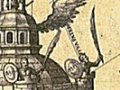

  
[Intangible Textual Heritage](../../index)  [Sub Rosa](../index) 
[Index](index)  [Previous](rhr15)  [Next](rhr17) 

------------------------------------------------------------------------

[Buy this Book at
Amazon.com](https://www.amazon.com/exec/obidos/ASIN/B0026L7FOU/internetsacredte)

------------------------------------------------------------------------

  
*The Real History of the Rosicrucians*, by Arthur Edward Waite,
\[1887\], at Intangible Textual Heritage

------------------------------------------------------------------------

p. 197

### CHAPTER VI.

#### ON THE CONNECTION OF THE ROSICRUCIAN CLAIMS WITH THOSE OF ALCHEMY AND MAGIC.

THE guise of antiquity being almost indispensable to the pretensions
contained in these singular documents, I have preferred presenting them
to my readers in the archaic form of the original English translations,
which, moreover, represent the Rosicrucian period in this country, than
to undertake the somewhat superfluous task of a new version.

If the "Fama" and "Confessio Fraternitatis" are to be taken in their
literal sense, the publication of these documents will not add new
lustre to Rosicrucian reputations. We are accustomed to regard the
adepts of the Rose-Cross as beings of sublime elevation and
preternatural physical powers, masters of Nature, monarchs of the
intellectual world, illuminated by a relative omniscience, and
absolutely exalted above all weakness and all prejudice. We imagine them
to be "holding no form of creed, but contemplating all" from the
solitary grandeur of the Absolute, and invested with the "sublime sorrow
of the ages as of the lone ocean." But here in their own acknowledged
manifestoes they avow themselves a mere theosophical offshoot of the
Lutheran heresy, acknowledging the spiritual supremacy of a temporal
prince, and calling the pope Antichrist. We have gauged in these days of
enlightenment and universal tolerance the intellectual capacities of all
professors, past

p. 198

and present, of that art prophetic which is represented by Baxter and
Cumming. We know the value of all the multitudinous speculations in the
theological no-man's land of the Apocalypse. We do not expect a new Star
of Jacob to rise out of the Galilee of religious intolerance, and out of
the frantic folly of sectarian squabblings. We do not calculate the
number of the beast, we do not denounce the Jesuits, we are not obsessed
by an infectious terror of papal power and its possible agressions; on
the contrary, we respect the associations connected with sovereign
pontiffs, grand lamas, and chief patriarchs. We have, most of us,
decided that the pope is neither God's vicar nor the Man of Sin; we
persistently refuse our adherence to any theory which connects *the
little horn* with Prince Jerome Napoleon, and we are not open to any
positive convictions on the identity of the Scarlet Woman, or of the
lost tribes of Israel. All persons possessed of such positive
convictions we justifiably regard as fanatics, and after due and
deliberate consideration of the Rosicrucian manifestoes, we do Dot feel
able to make an exception in favour of this Fraternity, whose

         "Manners have not that repose  
Which marks the caste of Vere de Vere."

\[paragraph continues\] In other words, we
find them intemperate in their language, rabid in their religious
prejudices, and, instead of towering giant-like above the intellectual
average of their age, we see them buffeted by the same passions and
identified with all the opinions of the men by whom they were environed.
The voice which addresses us behind the mystical mask of the Rose-Cross
does not come from an intellectual throne, erected on the pinnacles of
high thinking and surrounded by the serene and sunny atmosphere of a
far-sighted tolerance; it comes

p. 199

from the very heart of the vexatious and unprofitable strife of sects,
and it utters the war-cry of extermination. The scales fall from our
eyes, the romance vanishes; we find ourselves in the presence of some
Germans of the period, not of "the mystic citizens of the eternal
kingdom."

We are dejected and disillusioned, but we are thankful, notwithstanding,
to know the truth, as distinguished from the fictions of Mr Hargrave
Jennings and the glamorous fables of professed romancers. In this spirit
we proceed to a closer acquaintance with the Rosicrucians as represented
by themselves.

I have already said that "The Universal Reformation" has little internal
connection with the society which is supposed to have issued it in its
Teutonic dress. The conclusion which is reached in that curious tract
is, indeed, completely opposed to the expressed hopes of the Fraternity.
It illustrates the ludicrous futility and abortiveness of the attempt to
reform society, even when undertaken by the flower of the world's
"literati." It bids the reformers begin their work at home, and reduces
their Utopian scheming from the splendid scale of universal
reconstruction to appraising sprats and cabbages. It considers mankind
to be as good as his surroundings will allow him, and that "the height
of human wisdom lies in the discretion to be content with leaving the
world as they found it." On the other hand, the "Fama" and "Confessio"
invite "the learned of Europe to co-operate with a secret society for
the renovation of the age, the reform of philosophy," and to remedy "the
imperfection and inconsistencies of all the arts." The discrepancy is
singularly complete, and as "The Universal Reformation" throws no light
upon the history or the claims of the Rosicrucians, it

p. 200

need not detain us. "The Chymical Marriage of Christian Rosencreutz" I
shall also set aside for the present, because it is an allegorical
romance--*pace* Professor Buhle, as De Quincey hath it--though otherwise
of the first importance and interest.

From the "Fama" and "Confessio" we gather the religious opinions of the
Rosicrucian Fraternity, and classify them as follows:--

*a*. They acknowledge Jesus Christ as the Son of God.

*b*. Man is born into life by the power of God, falls asleep in Jesus,
and will rise again through the Holy Spirit.

*c*. They acknowledge a personal devil, the old enemy, who "hinders
every good purpose by his instruments."

*d*. They "use two Sacraments, as they are instituted with all Formes
and Ceremonies of the first and renewed Church."

*e*. It follows from this that they believe the Lutheran Reformation
restored the Christian Church to its primitive purity.

*f*. They consider "that from the beginning of the world there hath not
been given to man a more excellent, admirable, and wholesome book than
the Bible," which is "the whole sum" of their laws.

*g*. They call the pope Antichrist, a blasphemer against Christ. They
execrate him, and look forward to the time "when he shall be torn in
pieces with nails." They foretell his "final fall," with the assurance
of Brothers the prophet, and in the terminology of Mr Grattan-Guiness.

The philosophical and scientific opinions and pretensions

p. 201

of the Rosicrucian Society have more claim on our notice. As in their
theological views, so in these they are simply the representatives of a
certain school of thought current at their epoch. In its aspirations, as
distinguished from its methods, this school was considerably in advance
of the scientific orthodoxy of the moment. Looking with piercing glance

"Into great Nature's open eye,  
To see within it trembling lie  
The portrait of the Deity,"

they dreamed of a universal synthesis, and combining profound
contemplation with keen observant faculties, the experimental with a
priori methods, they sought to arrive at those realities which underlie
phenomena, "in more common but more emblematic words," they sought for
the substance which is at the base of all the vulgar metals. Mystics in
an age of scientific and religious materialism, they were connected by
an unbroken chain with the theurgists of the first Christian centuries;
they were alchemists in the spiritual sense and the professors of a
divine magic. Their disciples, the Rosicrucians, followed closely in
their footsteps, and the claims of the "Fama" and "Confessio" must be
viewed in the light of the great elder claims of alchemy and magic. In
these documents we find--I. The doctrine of the *microcosmus*, which
considers man as containing the potentialities of the whole universe, or
*macrocosmus*. According to Paracelsus, who first developed this
suggestive teaching from obscure hints in the Kabbalistic books, the
*macrocosmus* and the *microcosmus* are one. "They are one
constellation, one influence, one breath, one harmony, one time, one
metal, one fruit." Each part of the great organism acts upon "the
corresponding part of the small organism in the same sense as the
various organs of the human body are intimately

p. 202

connected with and influence each other." Every change that takes place
in the *macrocosmus* may be sensed by the spiritual body which surrounds
the spirit of the *minutum mundum*. The forces composing the one are
identical with those of the other. [1](#fn_54)

II\. We find, in the next place, the doctrine of Elemental spirits,
which it is a common error to suppose originated with the Rosicrucians.
This graceful and fanciful hypothesis also owes its development, if not
its invention, to the seer of Hohenheim. It was naturalised on French
soil by the author of the "Comte de Gabalis," and is known chiefly in
England through the preface to "The Rape of the Lock," and of later
years through the German "Romance of Undine," which has been many times
translated. "When you shall be numbered among the Children of the
philosophers," says the "Comte de Gabalis," "and when your eyes shall
have been strengthened by the use of the most sacred medecine, you will
learn that the Elements are inhabited by creatures of a singular
perfection, from the knowledge of, and communication with, whom the sin
of Adam has deprived his most wretched posterity. Yon vast space
stretching between earth and Heaven has far nobler dwellers than the
birds and the gnats; these wide seas hold other guests than the whales
and the dolphins; the depths of the earth are not reserved for the moles
alone; and that element of fire which is nobler than all the rest was
not created to remain void and useless." According to Paracelsus, "the
Elementals are not spirits, because they have flesh, blood, and bones;
they live and propagate offspring; they eat and talk, act and sleep, &c.
. . . They are beings occupying a place between

p. 203

men and spirits, resembling men and women in their organisation and
form, and resembling spirits in the rapidity of their locomotion." They
must not be confounded with the Elementaries which are the astral bodies
of the dead. [1](#fn_55) They are divided into
four classes. "The air is replete with an innumerable multitude of
creatures, having human shapes, somewhat fierce in appearance, but
docile in reality; great lovers of the sciences, subtle, serviceable to
the Sages, and enemies of the foolish and ignorant. Their wives and
daughters are beauties of the masculine type. . . . The seas and streams
are inhabited even as the air; the ancient Sages gave the names of
Undines or Nymphs to these Elementals. There are few males among them,
and the women are very numerous, and of extreme beauty; the daughters of
men cannot compare with them. The earth is filled by gnomes even to its
centre, creatures of diminutive size, guardians of mines, treasures, and
precious stones. They furnish the Children of the Sages with all the
money they desire, and ask little for their services but the distinction
of being commanded. The gnomides, their wives, are tiny, but very
pleasing, and their apparel is exceedingly curious. As to the
Salamanders, those fiery dwellers in the realm of flame, they serve the
Philosophers, but do not eagerly seek

p. 204

their company, and their wives and daughters are seldom visible. They
transcend all the others in beauty, for they are natives of a purer
element." [1](#fn_56)

III\. In the third place, the Rosicrucian manifestoes contain the
doctrine of the *signatura rerum*, which again is of Paracelsian origin.
This is the "magical writing" referred to in the "Fama," and the mystic
characters of that "Book of Nature" which, according to the "Confessio,"
stands open "for all eyes," but "can be read or understood by only a
very few." These characters are the seal of God imprinted "on the
wonderful work of creation, on the heavens, the earth, and on all
beasts." [2](#fn_57) This "signature of things"
is described by Paracelsus as "a certain organic vital activity," which
is frequently "expressed even in the exterior form of things; and by
observing that form we may learn something in regard to their interior
qualities, even without using our interior sight. We see that the
internal character of a man is often expressed in his exterior
appearance, even in the manner of his walking and in the sound of his
voice. Likewise the hidden character of things is to a certain extent
expressed in their outward forms. As long as man remained in a natural
state, he recognised the signatures of things and knew their true
character; but the more he diverged from the path of Nature, and the
more his mind became captivated by illusive external appearances, the
more this power became lost." [3](#fn_58) The
same doctrine is developed by the most distinguished disciple of
Paracelsus, the Kentish Rosicrucian, Robert Fludd. "There are other
invisible writings, secretly impressed on the leaves of

p. 205

\[paragraph continues\] Nature's book,
which are not to be read or comprehended save with the eyes of
understanding, being traced by the Spirit of the living God on the
hidden fleshly tablets of our own hearts. . . . These internal and
spiritual characters, constituting the interior writing, may also to the
bodily eyes be the cause and origin of the things which do
appear." [1](#fn_59) "It is manifest," he also
remarks, "that those vivific letters and characters impressed on the
Bible and on the great Book of Nature, and which we call arcane, because
they are understood only by the few, are one thing, and that the dead,
destroying letters of the same books, whose cortices contain the living
and spiritual characters, are another."

IV\. These speculative principles appear to have been united with some
form of practical magic. Now magic is a term which conjures up into the
mind of the ordinary reader some hazy notions either of gross imposture
or diabolical compacts and hellish rites; it seems necessary, therefore,
to state what it really was in the opinions of those who professed it.
According to Paracelsus, magic is that great and hidden wisdom which
discovers the interior constitution of everything. "It teaches the true
nature of the inner man as well as the organization of his outward
body." It includes "a knowledge of visible and invisible nature." It is
the only true teacher of the art of healing. If physicians possessed it,
their books might be burnt and their medicines be thrown into the ocean.
"Magic and sorcery are two entirely different things, and there is as
much difference between them as there is between light and darkness, and
between white and black." The same authority

p. 206

teaches that the great agent in magic is the imagination confirmed by
that faith which perfects will-power, and that the imagination thus
strengthened can create its own objects. "Man has a visible and
invisible workshop. The visible one is his body; the invisible one his
imagination. . . . The imagination is a sun in the soul of man, acting
in its own sphere as the sun of the earth acts in his. Wherever the
latter shines, germs planted in the soil grow, and vegetation springs
up; and the sun of the soul acts in a similar manner, and calls the
forms of the soul into existence. . . . The spirit is the master,
imagination the tool, and the body the plastic material. Imagination is
the power by which the will forms sidereal entities out of thoughts. It
is not *fancy*, which latter is the corner-stone of superstition and
foolishness. . . . The power of the imagination is a great factor in
medicine. It may produce diseases in man and in animals, and it may cure
them." [1](#fn_60) This theory covers all the
phenomena of visions, ecstacies, evocations, and other pseudo-miracles,
recognising that they are facts, and accounting for the futility of
their results.

V. Whether the Rosicrucians pretended to manufacture material gold is a
question which is difficult to decide from the materials contained in
their manifestoes. They acknowledge the fact of transmutation, and call
it a "great gift of God;" but "as it bringeth not always with it a
knowledge of Nature, while this knowledge bringeth forth both that and
an infinite number of other natural miracles, it is right that we be
rather earnest to attain to the knowledge of philosophy, nor tempt
excellent wits to the tincture of metals sooner then to the observation
of Nature." [2](#fn_61) Whatever may be thought
of this reasoning, it definitely places

p. 207

the Rosicrucians in that school of alchemy to which I made reference at
the close of the first chapter, and whose aim was to accomplish the
spiritual side of the *magnum opus*, or great work of alchemical
reconstruction. For them the transmutation of metals being no operation
of common chemistry, [1](#fn_62) both the "Fama"
and "Confessio" appear to condemn indiscriminately all professors of the
purely physical process, which they call "the ungodly and accursed
gold-making." Here, as in their other opinions, they echo Paracelsus.
"What shall I say to you about all your alchemical prescriptions, about
all your retorts and bottles, crucibles, mortars, and glasses; about all
your complicated processes of distilling, melting, cohibiting,
coagulating, sublimating, precipitating, and filtering, all the
tomfoolery for which you throw away your time and your money. All such
things are useless, and the labour over them is lost. They are rather an
impediment than a help to arrive at the truth." After the same fashion,
the "Confessio" denounces the "monstrous symbols and enigmas" by which
pseudo-chymists impose upon credulous curiosity. According to Dr
Hartmann, "Paracelsus asserts that it is possible to make gold and
silver by chemical means; still he condemns such experiments as useless,
and it seems to be more than probable that even in such chemical
experiments as may have succeeded, something more than merely chemical
manipulations was required to make them successful." [2](#fn_63) Éliphas Lévi, one of the most profound
commentators on Paracelsus, declares that "there is light in gold, gold
in light, and light in all things." Thus the first

p. 208

matter of the *magnum opus* is both within and about us, and "the
intelligent will, which assimilates light, directs the operations of
substantial form, and only employs chemistry as a very secondary
instrument." [1](#fn_64)

At the same time the Rosicrucians claimed to be in possession of "great
treasures of gold," and of the purse of Fortunatus. There seems no
special reason to doubt that they intended this to be literally
construed, and the "Fama" definitely states that it was a project of
their founder, C. R., to institute a society in Europe "which might have
gold, silver, and precious stones sufficient for to bestow them on
kings."

VI\. Closely connected with the secret of metallic transmutation is "the
supreme medicine of the world," the life-elixir, which, according to
Bernard-le-Trevisan (fifteenth century), is the reduction of the
Philosophical Stone into mercurial water. It cures all diseases, and
prolongs life beyond the normal limits. Without claiming to be actually
in possession of this

          "Wonderful Catholicon,  
Of very subtle and magical powers,"

the Rosicrucians come before us as essentially, or at least primarily, a
healing fraternity. "Their agreement was this . . . . That none of them
should profess any other thing than to cure the sick, and that
gratis." [2](#fn_65) Professor Buhle, in his
notice of the Rosicrucians and Freemasons, says that the evils of
Germany at this period were immense, that the land was overswept by a
"great storm of wretchedness and confusion." The science of medicine was
still in its infancy, the Lutheran Reformation, by spoliating
monasteries, had

p. 209

destroyed hospitals, [1](#fn_66) and the
diseases and miseries unavoidably consequent on unsanitary principles
and medical guesswork, were undoubtedly very widely spread. The utter
incompetence of the ancient methods led many others besides the
Rosicrucians to disregard and denounce the traditional authority, and in
the wide field of experimental research to lay the foundations of a new
and rational hypothesis. The germs of this revolution are found in
Paracelsus, and the practical theosophy--medicine itself being a branch
of mysticism from the standpoint of orthodox mystics--practised by
Rosicrucian adepts is their strongest claim on our favour, the one
golden link which joins their dissonant commonplace with the Orphean
harmonies of true and divine occultism.

It will be sufficient to enumerate only their belief in a secret
philosophy, perpetuated from primeval times, in ever-burning lamps, in
vision at a distance, and in the approaching end of the world. I have
shown indisputably that there was no novelty in the Rosicrucian
pretensions, and no originality in their views. They appear before us as
Lutheran disciples of Paracelsus; and, returning for a moment to the
problem discussed in the introduction, we find nothing in either
manifesto to connect them with the typology of a remote period. It is,
therefore, in modern, not ancient, times that we must seek an
explanation of the device of the Rose-Cross. A passage contained in "The
Chymical Marriage of Christian Rosencreutz" will assist in the solution
of this important point.

------------------------------------------------------------------------

### Footnotes

[202:1](rhr16.htm#fr_54) "Paracelsus," by Franz
Hartmann, M.D., p. 44.

[203:1](rhr16.htm#fr_55) According to Eliphas
Lévi, the Astral Light, *i.e.*, the substance diffused through infinity,
and which is the first matter of the material and psycho-material
universe, is "transformed at the moment of conception into human light,
and is the first envelope of the soul." In combination with fluids of
extreme subtlety, it becomes the astral, etherised, or sidereal body.
When a man dies and the divine spirit returns into the empyrean, it
leaves two corpses, one on the earth and one in the atmosphere, "one
already inert, the other still animated by the universal movement of the
soul of the world, but destined to die gradually, being absorbed by the
astral energies which produced it."--"Mysteries of Magic," pp. 97, 105.

[204:1](rhr16.htm#fr_56) "Comte de Gabalis."
Second Entretien.

[204:2](rhr16.htm#fr_57) "Confessio
Fraternatis," c. viii.

[204:3](rhr16.htm#fr_58) Hartmann's
"Paracelsus," pp. 51, 52.

[205:1](rhr16.htm#fr_59) Robertus de Fluctibus,
"Apologia Compendiana Fraternitatem de Rosea Cruce."

[206:1](rhr16.htm#fr_60) "Confessio
Fraternitatis," c. xi.

[206:2](rhr16.htm#fr_61) *Ibid*.

[207:1](rhr16.htm#fr_62) On this point see
"Mysteries of Magic," Biographical and Critical Preface, p. xliii.

[207:2](rhr16.htm#fr_63) Hartmann's
"Paracelsus," pp. 177, 178.

[208:1](rhr16.htm#fr_64) "Mysteries of Magic,"
p. 204.

[208:2](rhr16.htm#fr_65) "Fama Fraternitatis,"
p. 73.

[209:1](rhr16.htm#fr_66) "The origin of our
present hospitals must be looked for in monastic arrangements for the
care of the sick and indigent. Every monastery had its *infirmaria*,
managed by an *infirmarius*, in which not only were sick and
convalescents treated, but also the aged, the blind, the weak, &c., were
housed."--"Encyc. Brit.," 9th ed., s. v, "Hospitals."

------------------------------------------------------------------------

[Next: Chapter VII. Antiquity of the Rosicrucian Fraternity](rhr17)
