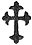

  
[Intangible Textual Heritage](../../index)  [Sub Rosa](../index) 
[Index](index)  [Previous](rhr20)  [Next](rhr22) 

------------------------------------------------------------------------

[Buy this Book at
Amazon.com](https://www.amazon.com/exec/obidos/ASIN/B0026L7FOU/internetsacredte)

------------------------------------------------------------------------

  
*The Real History of the Rosicrucians*, by Arthur Edward Waite,
\[1887\], at Intangible Textual Heritage

------------------------------------------------------------------------

p. 283

### CHAPTER XI.

#### ROSICRUCIAN APOLOGISTS: ROBERT FLUDD.

THE central figure of Rosicrucian literature, towering as an
intellectual giant above the crowd of *souffleurs*, theosophists, and
charlatanic professors of the *magnum opus*, who, directly or otherwise,
were connected with the mysterious Brotherhood, is Robertus de
Fluctibus, the great English mystical philosopher of the seventeenth
century, a man of immense erudition, of exalted mind, and, to judge by
his writings, of extreme personal sanctity. Ennemoser describes him as
one of the most distinguished disciples of Paracelsus, but refuses to
number him with "those consecrated theosophists who draw all wisdom from
the fountain of eternal light." He does not state his reasons for this
depreciatory judgment, and the brief and inadequate notice which he
gives of Fludd's system displays such a cursory acquaintance with the
works in which it is developed, that it is doubtful whether he had taken
pains to understand his author. I should rank the Kentish mystic second
to none among the disciples of the "divine" Theophrastus, while in the
profundity and extent of his learning, there can be no question that he
far surpassed his master, who is said to have known little but to have
divined almost everything, and who is, therefore, called *divinus*, in
the narrower sense of that now much abused term.

p. 284

Robert Fludd was born at Milgate House, [1](#fn_91) in the parish of Bersted, Kent, during the
year 1574. By his mother's side he was descended from the ancient family
of Andros of Taunton in Somerset. His father, Thomas Fludd, was a
representative of a Shropshire stock, and successively occupied several
high positions. He was victualler of Bewick, and then of Newhaven in
France; afterwards he was made Receiver of Kent, Sussex, and Surrey, and
being appointed treasurer of the army sent under Lord Willoughby to
Henry IV. of France, "he behaved so honourably that he was knighted, and
on his return to England was made treasurer of all her Majesty's forces
in the Low Countries." [2](#fn_92) This was in
the reign of Queen Elizabeth; he was constantly a justice of the peace
where he resided, and was also treasurer of the Cinque ports. "He bore
for his arms--vert, a chevron between three wolves’ heads erased,
argent, which coat, with his quarterings, was confirmed to him by Robert
Cook, Clar., Nov. 10, 1572." [3](#fn_93)

I have succeeded in compiling from various sources the following scanty
genealogy of the Fludd family:--

p. 285

 

  [  
Click to enlarge](img/28500.jpg)  
Robert Flood Genealogical Tree  

 

p. 286

According to this genealogy, Robert Fludd was the youngest of five sons.
He was entered of St John's College in the year 1591, at the age of
seventeen. Having graduated both in arts and medicine, he appears to
have travelled extensively, for the space of six years, in France,
Germany, Italy, and Spain. On his return to England, he was made a
member of the London College of Physicians, and took his degree of
Master in Arts in the year 1605. His first published work appeared in
1616, about which time he was visited by Michael Maier, by whom he was
probably acquainted with the Rosicrucian controversy, and with whom he
corresponded after the renowned German alchemist had returned to his own
country. Fludd appears to have resided chiefly in London, then as now
the great intellectual centre of England. He had a house in Fenchurch
Street, according to Fuller, [1](#fn_94) and
another in Coleman Street, where he died in the year 1637, on the 8th
day of September. He was buried in the chancel of Bersted Church, under
a tomb which he had previously erected--"An oblong square of dark,
slate-coloured marble, occupying a large space of the chancel wall on
the left as you stand before the altar, looking up the body of the small
church towards the door. There is a seated half-length figure of Fludd,
with his hand on a book, as if just raising his head from reading to
look at you. Upon the monument are two marble books inscribed *Misterium
Cabalisticum* and *Philosophia Sacra*. There were originally eight
books. The inscription to his memory is as follows:--

"'VIII. Die Mensis VII. Ao Dm, M.D.C.XXXVII. O
doribus vrua vaporat crypta tegit cineres nec speciosa tvos ovod mortale
minvs tibi. Te committimus vnvm ingenii vivent

p. 287

hic monumenta tui nam tibi qui similis scribit moriturque sepulchrum pro
tota eternum posteritate facit. Hoc monumentum Thomas Flood Gore Court
in oram apud Cantianos armiger infoelissimam in charissimi patrin sui
memoriam nexit, die Mensis Augusti M.D.C.XXXVII.'" [1](#fn_95)

Bersted Church is situated on high ground, at a small distance south of
Bersted Green. It is dedicated to the Holy Cross, and, according to
Hasted, [2](#fn_96) is a handsome building,
consisting of two aisles and two chancels, with a square beacon tower at
the west end of it. This is in the Perpendicular style, and at three
angles of the summit are three rude figures, said to be three dogs or
bears seiant, but so defaced by time that they cannot well be
distinguished.

The list of Fludd's works is as follows:--

Apologia Compendiaria Fraternitatem de Rosea Cruce suspicionis et
infamiæ maculis aspersam, veritatis quasi Fluctibus abluens et
abstergens. Leyden, 1616. 8vo.

Tractatus Apologeticus integritatem Societatis de Rosea Cruce defendens.
Lugduni Batavorum, 1617. 8vo. A duplicate of the preceding with a new
title.

Utriusque Cosmi majoris scilicet et minoris metaphysica, physica atque
technica historia in dua volumina secundum cosmi differentiam divisa. 2
tom. Oppenheimii, Francofurti, 1617-24. Fol.

Veritatis Proscenium . . . seu demonstratio quædam analytica, in qua
cuilibet comparationis particulæ, in appendice quadam à J. Kepplero,
nuper in fine Harmoniæ suæ Mundanæ edita, factæ inter Harmoniam suam
mundanam et illam R. F. ipsissimis veritatis argumentis respondetur.
Francofurti, 1621. Fol.

p. 288

Monochordum Mundi Symphoniacum, seu, Replicatio R. F. . . . ad apologiam
. . . J. Kepleri adversus demonstrationem suam analyticam nuperrime
editam in qua Robertus validioribus Joannis objectionibus Harmoniæ sum
legi repugnantibus, comiter respondere aggreditur. Francofurti, 1622.
4to.

Anatomiæ Amphitheatrum effigie triplici, more et conditione varia
designatam. Francfurte, 1623. Fol.

Philosophia Sacra et vere Christiana, seu Meteorologica Cosmica.
Francofurti, 1626. Fol.

Medecina Catholica, seu mysticum artis medicandi sacrarium. 5 parts.
Francofurti, 1629-31.

Sophiæ cum moria certamen, in quo, lapsis Lydius a falso structore . . .
M. Mersemio . . . reprobatus, celeberrima voluminis sui Babylonici
figmenta accurate examinat (Summum bonum, quod est verum subjectum veræ
magicæ, cabalæ, alchymiæ fratrum Roseæ Crucis verorum in dictarum
scientiarum laudem, et insignis calumniatoris . . . M. Mersenni dedecus
publicatum, per J. Frizium). 2 pt. Francofurti, 1629. Fol.

Doctor Fludd's Answer unto M. Foster, or the squesing of Parson Foster's
Sponge, ordained by him for the wiping away of the weapon-salve. London,
1631. 4to.

Clavis Philosophiæ et Alchymiæ. (A Reply to Father Gassendi.)
Francofurti, 1633. Fol.

Phylosophia Mosaica. In qua Sapientia et Scientia creationis et
creaturarum sacra vereque Christiana . . . ad amussim et enuncleate
explicatur. Goudæ, 1638. Fol.

It will be seen from this list that the Rosicrucian manifestoes found an
immediate defender in Robert Fludd, that is, if the "Apologia" which
bears his name is to be considered his work. There is some uncertainty
on this point,

p. 289

but it has been disputed on insufficient grounds, As a maiden effort, it
will not of course bear comparison with the dialectical skill of his
mature productions, but the principles it propounds are those of the
"Mosaicall Philosophy" and the "Tractatus Varii." "What was the
particular occasion of his own first acquaintance with Rosicrucianism is
not recorded," says Buhle. "All the books of Alchemy or other occult
knowledge, published in Germany, were at that time immediately carried
over to England--provided they were written in Latin; and if written in
German, were soon translated for the benefit of English students. He may
therefore have gained his knowledge immediately from the Rosicrucian
books, but it is more probable that he acquired it from his friend
Maier. . . . At all events, he must have been initiated into
Rosicrucianism at an early period."

By whomsoever written, the "Tractatus Apologeticus" is an exceedingly
curious work, so astonishing occasionally in the nature of its arguments
that it is difficult to suppose that they were put forward seriously. It
was called for by Andrew Libavius’ "searching and hostile analysis" of
the Rosicrucian Confession, and was written to clear the Society from
the *Infamiæ maculæ* cast on it by the accusations then brought forward,
and above all from the charges of detestable magic and diabolical
superstition. It is divided into three parts, and various chapters are
illustrated by appropriate quotations from the manifesto it is
defending, whose underlying principles are developed and explained. The
first part treats of the various departments of magical science, of the
Cabala, of the Books of God, both visible and invisible, of the secret
characters of Nature, and of the value of astrological portents. The
second part is devoted

p. 290

to a lugubrious consideration of the impediments and degeneracy of the
arts and sciences in modern times--*de scientiarum hodierno die in
scholis vigentium impedimentis*. It enlarges on the urgent necessity for
a reformation in Natural Philosophy, Medicine, and Alchemy.

Concerning the first, the author declares it to be impossible for any
one to attain to the supreme summit of the natural sciences unless he be
profoundly versed in the occult meaning of the ancient philosophers, but
the minute and most accurate observer who does achieve this height will
not find it difficult to adapt the materials which are prepared by
Nature in such a manner as to produce, by the application of actives to
passives, many marvellous effects before the time ordained by Nature;
and this, he adds, will be mistaken by the uninitiated for a miracle.

Like others of his school, he insists on the uncertainty of *à
posteriori* and experimental methods, to which he unhesitatingly
attributes all the errors of the natural sciences. "Particulars are
frequently fallible, but universals never. Occult philosophy lays bare
Nature in her complete nakedness, and alone contemplates the wisdom of
universals by the eyes of intelligence. Accustomed to partake of the
rivers which flow from the Fountain of Life, it is unacquainted with
grossness and with clouded waters."

In Medicine he laments the loss of that universal panacea referred to by
Hippocrates:--"But absolutely nothing remains of that one and only
medicament of which Hippocrates makes mention (darkly and mystically, I
admit) in several places, and still less are its operations understood,
inasmuch as no one now searches with lynx-like eyes into the profound
depths of true natural philosophy, to gain an accurate knowledge of its
composition and its virtues."

p. 291

Concerning Arithmetic, he asks mournfully, and with apparent
earnestness, "Which of us has, at this day, the ability to discover
those true and vivific numbers whereby the elements are united and bound
to one another?" And then, with regard to music, which, as he remarks,
*non aliter succedit Arithmeticæ quàm medicina Philosophiæ Naturali*, he
cries after the same fashion:--"But, good God, what is this when
compared with that deep and true music of the wise, whereby the
proportions of natural things are investigated, the harmonical concord
and the qualities of the whole world are revealed, by which also
connected things are bound together, peace established between
conflicting elements, and whereby each star is perpetually suspended in
its appointed place by its weight and strength, and by the harmony of
its lucent spirit." It is impossible to read without a smile when the
author urges the necessity for a musical reformation, on the ground that
we have lost that art of Orpheus by which he moved insensible stones,
and that of Arion by which the fishes were charmed.

The cursory review of alchemy is equally gloomy:--"The art, also, of
alchemy or chemistry is surrounded with such insoluble enigmas that we
can scarcely gain anything but ignorance therefrom, and *ignotum per
ignotius*." He enlarges on its fictitious vocabulary, and quotes
Maricinus as follows:--"The magisterium of the philosophers is hidden
and concealed, and wherever found is known by a thousand names;
moreover, it is surrounded by symbols and is revealed to the wise alone,
yet this is, notwithstanding, the one, only, and lineal way of the whole
operation." Then he himself continues:--"Neither common fire, but Nature
herself, neither artificial furnaces, but natural matrices, are needed
in this work, which is the work of Nature only, and

p. 292

wherein nothing is required save the brief co-operation of her minister,
by whom things natural to things also natural, and species to their
congruents, are duly and accurately applied." Mathematics, optics, and
astronomy he treats after the same fashion, comparing their tame and
commonplace frivolities with the sublime knowledge of the ancients.

The third part is entitled "De Naturæ Arcanis," and treats of the
mysteries of Light, &c., developing in a small space a curious and
profound philosophy. It describes God as the *ens entium*, eternal form,
inviolable, purely igneous, without any intermixture of material,
unmanifested before the creation of the universe, according to the maxim
of Mercurius Trismegistus, "*Monas generat molem, et in seipsum
reflectit ardorem suam*." Earth is defined to be a gross water, water a
gross air, air a gross fire, fire a gross ether, while the ether itself
is the grosser part of the empyrean, which is distinguished from the
ethereal realm, and is described as a water of extreme tenuity,
constituted of three parts of luminous substance to one aqueous part; it
is the purest essence of all substances, and is identical with the
luminiferous ether of the latest scientific hypothesis. Its place is the
medium mundi, wherein is the *sphæra æqualitatis*, in which the sun
performs its revolution. The sun itself is composed of equal parts of
light and water. Light is the cause of all energies--*nihil in hoc mundo
peractum fuerit, sine lucis mediatione aut actu divino*. "It is
impossible for man to desire more complete felicity than the admirable
knowledge of light and its virtues," by which the ancient magi
constructed their ever-burning lamps, forced fire out of stones and
wood, kindled tapers from the rays of stars, and naturally, by means of
its reflections, produced many wonders in the air,

p. 293

such as phantom writing, and, more than all, by the true use of the *lux
invisibilis*, made men themselves invisible.

The information scattered through the various parts of the apology on
the different departments of magic is also noteworthy. It distinguishes
between natural, mathematical, venific, necromantic, and thaumaturgie
magic. "That most occult and secret department of physics by which the
mystical properties of natural substances are extracted, we term Natural
Magic. The wise kings who (led by the new Star from the East) sought the
infant Christ, are called Magi, because they had attained a perfect
knowledge of natural things, whether celestial or sublunar. This branch
of the Magi also includes Salomon, since he was versed in the arcane
virtues and properties of all substances, and is said to have understood
the nature of every plant from the cedar to the hyssop. Magicians who
are proficient in the mathematical division construct marvellous
machines by means of their geometrical knowledge; such were the flying
dove of Archytas, and the brazen heads of Roger Bacon and Albertus
Magnus, which are said to have spoken. Venific magic is familiar with
potions, philtres, and with the various preparations of poisons; it is
in a measure included in the natural division, because a knowledge of
the properties of natural things is requisite to produce its results.
Necromantic Magic is divided into goëtic, maleficient, and Theurgic. The
first consists in diabolical commerce with unclean spirits, in rites of
criminal curiosity, in illicit songs and invocations, and in the
evocation of the souls of the dead. The second is the adjuration of the
devils by the Virtue of Divine Names. The third pretends to be governed
by good angels and the Divine Will, but its wonders are most

p. 294

frequently performed by evil spirits, who assume the names of God and of
the angels. This department of Necromancy n can, however, be performed
by natural powers, definite rites and ceremonies, whereby celestial and
divine virtues are reconciled and drawn to us; the ancient Magi
promulgated in their secret books many rules of this doctrine. The last
species of magic is the thaumaturgie, begetting illusory phenomena; by
this art the Magi produced their phantasms and other marvels."

When speaking of the wonders wrought mechanically by Roger Bacon,
Albertus Magnus, and Boëtius, the apologist of the Rosicrucians tells us
that he himself, by his assiduity in mechanical arts, constructed a
wooden bull which lowed and bellowed after the fashion of the living
animal; a dragon which flapped its wings, hissed, and vomited forth fire
and flames upon the bull; and a lyre which played melodies without human
intervention, as well as many other things, which by the simple
mathematical art, apart from natural magic, could not have been
accomplished.

The scientific and philosophical principles of Robert Fludd were
attacked by Father Mersenne, with special reference to his belief in the
Rosicrucian Society. Some twelve years had passed since the appearance
of the "Tractatus Apologeticus," which he probably no longer valued. He
replied to the attack in the work entitled "Sophiæ cum Moriâ Certamen,"
without mentioning the Rosicrucians. But the "Summum Bonum," by Joachim
Fritz, which accompanied this reply, contains an elaborate defence of
the Order, to which, in one of its phases, Fludd is said to have
belonged. The authorship of this defence he is supposed to have
disavowed. Buhle, however, points out that as "the principles, the
style, the animosity towards

p. 295

\[paragraph continues\] Mersenne, the
publisher, and the year, were severally the same as in the 'Sophiæ cum
Moriâ Certamen' which Fludd acknowledged, there cannot be much reason to
doubt that it was his." But as I am unwilling to consider that a man of
Fludd's high character would be guilty of deliberate falsehood, and as
it was not his habit to write either anonymously or pseudonymously, I
prefer the alternative offered by the German critic when he says, "If
not Fludd's, it was the work of a friend of Fludd's." In either case,
his opinions are represented. On the title-page of the "Summum Bonum,"
there is a large Rose on which two bees have alighted, with this motto
above--*Dat Rosa mel apibus*. The book treats of the noble art of magic,
the foundation and nature of the Cabala, the essence of veritable
alchemy, and of the *Causa Fratrum Roseæ Crucis*. It identifies the
palace or home of the Rosicrucians with the Scriptural house of wisdom.
*Ascendamus ad montem rationabilem, et ædificemus domum Sapientiæ*. The
foundation of the mountain thus referred to is declared to be the *Lapis
angularis*, the corner-stone, cut out of the mountain without hands.
This stone is Christ. It is the spiritual palace which the Rosicrucians
desire to reveal, and is therefore no earthly or material abode. There
is a long disquisition on the significance of the Rose and the Cross, a
purely spiritual interpretation being adopted. At the conclusion, the
writer anticipates the question whether he himself is a brother of the
Rose Cross, since he has settled all questions as to their religion and
symbolism. His answer is that he least of any has deserved such a grace
of God; if it have pleased God to have so ordained it, it is enough. To
satisfy, however, the curiosity of his readers, he supplies them with a
curious letter supposed to have

p. 296

emanated from the society, and which has been quaintly translated in a
manuscript of the seventeenth century.

This Epistle was written and sent by ye Brethren of R. C. to a certaine
Germaine, a coppy whereof Dr Flud obtained of a Polander of Dantziche
his friend, which he since printed in Latin at ye end of his tract,
intituled, *De Summo Bono*.

Venerable and Honourable Sr.

Seeing that this will be ye first yeare of thy nativity, wee pray that
thou mayst have from ye Most High God, a most happy entrance into and
departure from out of thy life, and because thou hast hitherto been with
a good mind a constant searcher of holy philosophy, well done! Proceed,
fear God, for thus thou mayest gaine Heaven. Get to thyself the most
true knowledge, for it is God who hath found out every way; it is God
who alone is circumference and centre. But draw thee neere, listen, take
this to thee  , for he who
increaseth knowledge increaseth sorrow, because that in much knowledge
is much griefe, wee speake by experience. For all worldlings, and
vaine-glorious, vauntinge boasters, gorgious men, talkers, and vaine
people doe unworthily scandalize, yea, and curse us for an unknown
matter. But we wonder not that ye ungrateful world doe persecute ye
professors of ye true Arts, together with ye truth itself. Yett for thy
sake wee shall briefly answer to these questions, viz.: What wee doe?
What can wee doe? Or whether are any such as wee? In John, therefore,
wee reade that God is ye Supreme Light, and in light wee walke, so that
wee exhibit light (although in a lanthern) to ye world. But thou man of
ye world that deniest this, thou knowest not or seest not it behoves
thee

p. 297

to know that in thy vile boddy Jesus dwelleth. This thou hast from ye
apostle. "And Jesus knew all their thoughts," to whom if thou adherest,
thou are at length made one spirit with Him, and being such, who
prohibeteth thee with Solomon to know as well ye wicked as good
contentions of men. And this thou mayest take from me out of ye
premises. And hence it is that wee doe not answer to all, viz., because
of the deceitfull minds of some. For whosoever are alienated from God
are contrary to us, and who is so foolish as to permit a new-come
stranger to enter into another man's house? But if thou objectest that
this union is onely to be expected in ye world to come, behold now in
this thou showest thyself for a worldling who extinguishest light by thy
ignorance. Also thou are not ashamed to make ye apostle a liar, in whom
those things are more clearly manifested in these wordes--"So that you
may be wanting in no grace, expectinge ye Revelation of our Lord Jesus
Christ." But thou sayest that this is not to be understood of this
inferiour life. What therefore does ye followinge verse intend? "Who
shall confirme you even to the end," for in the Kingdome of God there is
noe end, therefore in this temporall state will appear ye glory of ye
Lord, and Jesus glorified. If any thinge is further demanded concerning
our office, our endeavoure is to leade backe lost sheepe to ye true
sheepefold. You labore therefore in vaine, O miserable mortals, who
enter upon another way than that ye apostle wills by putinge off your
tabernacle, which way is not walked in through dyinge, but as Peter
willeth when he saith: "As Christ hath taught mee," viz., when he was
transfigured in ye mount, which laienge down, if it had not bine secret
and hidden, ye apostle had not saide, "as Jesus taught mee," neither had
ye

p. 298

\[paragraph continues\] Supreme Truth
saide: "Tell this to no man," for accordinge to ye vulgar way, vulgarly
to die was known to all men from ye beginninge of ye world. Be yee
changed therefore, be yee changed from dead stones into livinge
philosophical stones. The apostle shews ye way when he saith: "Lett the
same minde be in you as is in Jesus." Also he explains that minde in ye
followinge words, viz., when as beinge in ye form of God, he thought it
no robbery to be equal to God. Behould these things, O all you that
search into ye abstruse secrets of nature! Yee heare these matters, but
you believe them not, O miserable mortals, who doe so anxiously run into
youre own ruine, but wilt thou be more happy, O thou most miserable,
wilt thou be elevated above ye circles of ye world, O thou proud one,
wilt thou command in Heaven above, this earth, and thy darke body, O
thou ambitious, will yee performe all miracles, O yee unworthy? Know
yee, therefore, ye rejected, of what nature it is, before it is sought.
But thou, O Brother, hearken! I will speake with S. John, that thou
mayest have fellowshippe with us, and indeed our fellowshippe is with ye
Father and with Jesus, and wee write unto you that yee may rejoyce
because God is light, and in Him there is no darkness at all. But that
thou mayest come unto us, behould this light, for it is impossible for
thee to see us (unless when wee will) in another light. In this,
therefore, follow us, whereby thou mayest be made happy with us, for our
most immoveable pallace is ye centre of all things, likewise is it much
obscured, because covered with many names. Enter, enter into ye glory of
God and thy own salvation, ye gates and Schoole of Philosophicall Love,
in which is taught everlastinge charity and fraternall love, and that
some resplendent and invisible castle which is

p. 299

built upon the mountaine of ye Lord, out of whose roote goeth forth a
fountaine of livinge waters, and a river of love! Drinke, drinke, and
againe drinke, that thou mayest see all hidden things, and converse with
us! Againe beware! But what? For thou knowest very well that nature
receives nothing for nutriment but that which is subtile, the thick and
fœculent is cast out as excrements. It is also well disputed by thyself,
that those who will live in ye minde, rather than in ye body, take in
nourishment by ye spirit, not by ye mouth. As for example, it is lawful
to know Heaven by Heaven, not by earth, but ye virtues of this by ye
other, and if you understand me aright, no man ascends into Heaven,
which thou seekest, except He who descended from Heaven, which thou
seekest not, enlighteneth him first. Whatsoever therefore is not from
Heaven is a false immage, and cannot be called a virtue. Therefore, O
Brother, thou canst not be better confirmed then by virtue itselfe,
which is ye Supreame Truth, which if thou wilt religiously, and with all
thy might, endeavour to follow in all thy wordes and workes, it will
confirm thee, daily more and more, for it is a fiery spirite, a
glisteninge sparke, a graine impossible, never diinge, subliminge his
own body, dwellinge in every created beeinge, sustaininge and governinge
it, gold burninge, and by Christ purged, pure in ye fire, allwaye more
glorious and pure, jubilatinge without diminution, this shall (I say)
confirme thee daily, untill (as a certaine learned man saith) thou art
made like a lion in battle, and canst take away all ye strength of ye
world, and fearest not death, nor any violence whatsoever a divellish
tyranny can invent, viz., seeinge thou art become such a one as thou
desirest, a stone and a worke. And that God may bless thy labours which
thou shalt

p. 300

receive in most approved authors under a shaddow, for a wise man reads
one thinge and understands another. Art thou imperfect? Aspire after a
due perfection. Art thou foul and unclean? Purge thyself with teares,
sublime thyselfe with good manners and virtues, adorn and beautify
thyselfe with sacramentall graces! Make thy soule sublime and subtile
for ye contemplation of heavenly thinges, and conformable to angelicall
spirits, that it may vivify thy vile ashes and vulgar body, and make it
white, and render it altogether incorruptible and impassible by ye
resurrection of our Lord Jesus Christ. Doe these thinges, and thou wilt
confess that no man hath wrote more plainly then I. These thinges the
Lady Virtue hath commended should be told to thee, from (or by) whom,
accordinge to thy deserts, thou shalt hereafter be more largely taught,
these read, if thou wilt, as the apostle willeth, keepe that which is
committed to thy trust. Farewell.

F. T. F., in Light and C.

By his talents and intellectual ability, Robert Fludd is a character so
important in English Rosicrucian literature, that I propose to give a
short sketch or syllabus of his singular cosmical philosophy. The
substance will be taken from the "Mosaicall Philosophy," and the folio
volume entitled *Tractatus Varii*, and it will be rendered as far as
possible in the philosopher's own words.

The author distinguishes in several places between the Divine σοφία, the
eternal sapience, the heavenly wisdom, which is only mystically revealed
to mankind, and the wisdom which is derived from the invention and
tradition of men. He declares the philosophy of the Grecians, or the
ethnick philosophy, to be based only on the second, and to

p. 301

be terrene, animal, and diabolical, not being founded on the deific
corner-stone, namely, Jesus Christ, who is the essential substance and
foundation of the true science.

The original fountain of true wisdom is in God, the *natura naturans*,
the infinite, illimitable Spirit, beyond all imagination, transcending
all essence, without name, all wise, all-clement, the Father, the Word,
and the ineffable, Holy Spirit, the highest and only good, the
indivisible Trinity, the most splendid and indescribable light. This
Wisdom is the *vapor virtutis Dei*, and the stainless mirror of the
majesty and beneficence of God. All things, of what nature and condition
soever, were made in, by, and through this Divine Word or emanation,
which is God Himself, as it is the Divine Act, whose root is the Logos,
that is, Christ. This Eternal Wisdom is the fountain or corner-stone of
the higher arts, by which also all mysterious and miraculous discoveries
are effected and brought to light.

Before the spagirical separation which the Word of God, or divine
Elohim, effected in the six days of creation, the heavens and earth were
one deformed, rude, undigested mass, complicitly comprehended in one
dark abyss, but explicitly as yet nothing. This nothing is compared by
St Augustine to speech, which while it is in the speaker's mind is as
nothing to the hearer, but when uttered, that which existed complicitly
in *animo loquentis*, is explicitly apprehended by the hearer. This
*nihilum* or nothing is not a *nihilum negativum*. It is the First
Matter, the infinite, informal. primordial Ens, the *mysterium magnum*
of the Paracelsists. It existed eternally in God. If God had not
produced all things essentially out of Himself, they could not be
rightly referred to Him. The primeval darkness is the *potentia divina*
as light is the *actus divinus*--the *Aleph tenebrosum* and

p. 302

\[paragraph continues\] *Aleph lucidum*.
Void of form and life, it is still a material developing from
potentiality into the actual, and was informed by the Maker of the world
with a universal essence, which is the Light of Moses, and was first
evolved in the empyrean heaven, the highest and supernatural region of
the world, the *habitaculum fontis lucidi*, the region not of matter but
of form--form simple and spiritual beyond all imagination. There is a
second spiritual heaven, participating in the clarity and tenuity of the
first, of which it is the base; this is the medial heaven, called the
*sphæra æqualitatis* and it is corporeal in respect of the former. The
third heaven is the locality of the four elements. The progression of
the primordial light through the three celestial spaces was accomplished
during the first three days of creation. Christ the Wisdom and Word of
God, by His apparition out of darkness, that is, by the mutation of the
first principle from dark Aleph to light Aleph, revealed the waters
contained in the profound bosom of the abyss, and animated them by the
emanation of the spirit of eternal fire, and then by his admirable
activity distinguished and separated the darkness from the light, the
obscure and gross waters from the subtle and pure waters, disposing the
heavens and spheres, as above stated, and dividing the grosser waters
into sublunary elements. These elements are described as follows:--Earth
is the conglomeration of the material darkness and the refuse of the
heavens; Water is the more gross spirit of the darkness of the inferior
heaven, nearly devoid of light; Air is the spirit of the second heaven;
Fire, the spirit of the darkness of the Empyrean heaven.

Fludd's theory of the Macrocosmus is enunciated in the following manner.

p. 303

 

  [  
Click to enlarge](img/30300.jpg)  
DE MACROCOSMI PRINCIPIIS.  

 

p. 304

 

  [  
Click to enlarge](img/30400.jpg)  
DE MACROCOSMI FABRICA.  

 

p. 305

According to Fludd's philosophy, the whole universe was fashioned after
the pattern of an archetypal world which existed in the Divine ideality,
and was framed out of unity in a threefold manner. The Eternal Monad or
Unity, without any egression from his own central profundity, compasses
complicitly the three cosmical dimensions, namely, root, square, and
cube. If we multiply unity as a root, in itself, it will produce only
unity for its square, which being again multiplied in itself, brings
forth a cube which is one with root and square. Thus we have three
branches differing in formal progression, yet one unity in which all
things remain potentially, and that after a most abstruse manner. The
archetypal world was made by the egression of one out of one, and by the
regression of that one, so emitted, into itself by emanation. According
to this ideal image, or archetypal world, our universe was subsequently
fashioned as a true type and exemplar of the Divine Pattern; for out of
unity in his abstract existence, viz., as it was hidden in the dark
chaos, or potential mass, the bright flame of all formal being did shine
forth, and the Spirit of Wisdom, proceeding from them both, conjoined
the formal emanation with the potential matter, so that by the union of
the divine emanation of light and the substantial darkness, which was
water, the heavens were made of old, and the whole world.

God, according to these abstruse speculations, is that pure, catholic
unity which includes and comprehends all multiplicity, and which before
the objective projection of the cosmos must be considered as a
transcendent entity, reserved only in itself, in whose divine puissance,
as in a place without end or limit, all things which are now explicitly

p. 306

apparent were then complicitly contained, though in regard to our finite
faculties it can only be conceived as nothing--*nihil, non finis, non
ens, aleph tenebrosum*, the Absolute Monad or Unity.

Joined to the cosmical philosophy of Robert Fludd, there is an elaborate
system of spiritual evolution, and the foundation of both is to be
sought in the gigantic hypotheses of the Kabbalah. His angelology is
derived from the works of pseudo-Dionysius on the celestial hierarchies,
and he teaches the doctrine of the pre-existence of human souls, which
are derived from the vivifying emanation dwelling in the *Anima Mundi*,
the world's spiritual vehicle, the catholic soul, which itself is
inacted and preserved by the Catholic and Eternal Spirit, sent out from
the fountain of life to inact and vivify all things.

These mystical speculations, whatever their ultimate value, are sublime
flights of an exalted imagination, but they are found, in the writings
of Robert Fludd, side by side with the crudest physical theories, and
the most exploded astronomical notions. He denies the diurnal revolution
of the earth, and considers the light of all the stars to be derived
from the one "heavenly candle" of the sun. Rejecting the natural if
inadequate explanations of Aristotle and his successors, he presents the
most extravagant definitions of the nature of winds, clouds, snow, &c.
The last is described as a meteor which God draweth forth of His hidden
treasury in the form of wool, or as a creature produced out of the air
by the cold breath of the Divine Spirit to perform his will on earth.
Thunder is a noise which is made in the cloudy tent or pavilion of
Jehovah, lightning a certain fiery air or spirit animated by the

p. 307

brightness and burning from the face or presence of Jehovah. Literally
interpreting the poetic imagery of Scripture, he perceives the direct
interference of the Deity in all the phenomena of Nature, and denounces
more rational views as "terrene, animal, and diabolical."

------------------------------------------------------------------------

### Footnotes

[284:1](rhr21.htm#fr_91) The seat of Milgat was
formerly esteemed a manor. It was anciently possessed by the family of
Coloigne, one of whom, Robert de Coloigne, died feifed of it in the 35th
year of Edward III. In process of time his descendants came to be called
Coluney, one of whom, Thomas Coluney, as appears by an old survey of
Bersted, possessed it in the 14th year of Edward IV. In the beginning of
the reign of Henry VII. it was become the property of the family of
Stone-house, whose ancient seat was at Hazelwood, Boughton Malherbe
(Philpot, p. 68). Robert Stonehouse was of Bersted, Esquire, at the
latter end of Henry VIII. His son George, at the beginning of Queen
Elizabeth's reign, alienated this seat to Thomas Fludd, Esquire,
afterwards knighted, and who considerably improved and augmented it."
One corner of this edifice is still said to remain built in the
manor-house erected on its site when the old house fell into
ruins.--Hasted, "History of Kent," vol. ii., pp. 486, 487.

[284:2](rhr21.htm#fr_92) Hasted's "History of
Kent," vol. ii., p. 486.

[284:3](rhr21.htm#fr_93) "Visitation of County
of Kent, 1574 and 1619."

[286:1](rhr21.htm#fr_94) "Worthies of Great
Britain," p. 78 of the second part.

[287:1](rhr21.htm#fr_95) Hargrave Jennings, "The
Rosicrucians, &c.," p. 364.

[287:2](rhr21.htm#fr_96) "History of Kent," vol.
ii., p. 489.

------------------------------------------------------------------------

[Next: Chapter XII. Rosicrucian Apologists: Thomas Vaughan](rhr22)
