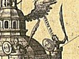

  
[Intangible Textual Heritage](../../index)  [Sub Rosa](../index) 
[Index](index)  [Previous](rhr31)  [Next](rhr33) 

------------------------------------------------------------------------

[Buy this Book at
Amazon.com](https://www.amazon.com/exec/obidos/ASIN/B0026L7FOU/internetsacredte)

------------------------------------------------------------------------

  
*The Real History of the Rosicrucians*, by Arthur Edward Waite,
\[1887\], at Intangible Textual Heritage

------------------------------------------------------------------------

p. 431

### CONCLUSION.

"THERE is a point," quoth a grandiloquent pseudo-Rosicrucian in an
impressive and tragedy voice, "there is a point," he repeated in the
conventional whisper of the unexplainable mystic, "beyond which we
inevitably must keep silence. We are driven to take refuge in portentous
darkness and in irretrievable mystery." The godless and incorrigible
scepticism of a coarse, unsubdued intelligence, surrendered to a
reprobate sense, and basely and wilfully grovelling in the blind alleys
of natural causes, begs leave to believe that this is because extremes
meet, that the heights of the inexpressible are closely approximate to
the abysmal depths of bathos. But the unsubdued intelligence is known to
have covered the shame of its naked ignorance with the "filthy rags" of
*a posteriori* methods. Anathema maranatha. Let it have no part in the
life to come! Nevertheless, I have found it superfluous to "keep guard
over" the secrets of the Rosicrucians, or to veil their mysteries in
inviolable silence, and this is for a simple reason, namely, that they
have never revealed any. If the manifestoes I have published emanated in
reality from a secret society, it has stood guard over its own
treasures, and as neither Mr Hargrave Jennings nor myself can "boast of
having ever--really and in fact--seen or known any supposed (or
suspected) member in the flesh," we have nothing to reveal or to
withhold. "The recondite systems connected

p. 432

with the illustrious Rosicrucians" are, of course, enveloped in
darkness, and, in common with other students of esoteric lore, I am
inclined to consider that this darkness does cover a real and, possibly,
a recoverable knowledge. But it is not of our making and in our age,
which has nothing to fear from the rack or the faggot, and but little
from the milder agonies of eternal Coventry, it is no longer worth
preserving. *Nihil est opertum quod non revelabitur, et occultum quod
non scietur*. The time has come when that which was muttered in darkness
may be declared plainly in the full face of day, and when that which was
whispered in the ear can be proclaimed on the house-top. The tremendous
secrets of spiritual alchemy are about to surrender at discretion to the
searching investigations of the sympathetic and impartial student at
work in the cause of truth. On the faith of a follower of Honnes, I can
promise that nothing shall be held back from those true Sons of the
Doctrine, the sincere seekers after light who are prepared to approach
the supreme arcana of the psychic world with a clean heart and an
earnest aim. True Rosicrucians and true alchemical adepts, if there be
any in existence at this day, will not resent a new procedure when
circumstances have been radically changed. The pontiffs of darkness and
mystery will probably discover that it is too late to make use of that
policy of assassination which is supposed to have been applied in the
case of the Abbé de Villars. I appeal, therefore, to those students of
occultism who are men of method as well as of imagination, of reason as
well as of intuition, to assist me in clearing away the dust and rubbish
which have accumulated during centuries of oblivion, misrepresentation,
and calumny in the silent sanctuaries of the transcendental sciences,
that the traditionary secrets of Nature

p. 433

unencumbered by evasive veils, which preserved them perhaps in the past
from the violence of tyrants and intellectual task-masters in the high
places of religion and science, but which are rent on every side, and
"execrable from the moment that they are useless," may shine forth in
the darkness of doubt and uncertainty, to illuminate the strait and
narrow avenues which communicate between the seen and the unseen.

While this work was passing through the press, Mr Hargrave Jennings has
issued the third edition of "The Rosicrucians, their Rites and
Mysteries." It is spread over the space of two large volumes of an
imposing and handsome appearance. It embodies some new but wholly
irrelevant materials, and does not contain one syllable of additional
information on its ostensible subject. The additional illustrations are
quite beside the question, having no reference, however esoteric and
remote, to the Rosicrucian mystery. This edition, in fact, justifies
still further the severe criticism which I have been forced to make on
the purposeless and rambling speculations of its eccentric author.

------------------------------------------------------------------------

[Next: Additional Notes](rhr33)
