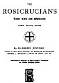

  
[Intangible Textual Heritage](../../index)  [Sub Rosa](../index) 
[Index](index)  [Next](rrm01) 

------------------------------------------------------------------------

[Buy this Book at
Amazon.com](https://www.amazon.com/exec/obidos/ASIN/1564591182/internetsacredte)

------------------------------------------------------------------------

###### THE

# ROSICRUCIANS

### Their Rites and Mysteries

##### FOURTH EDITION, REVISED

## *BY HARGRAVE JENNINGS*

##### AUTHOR OF 'THE INDIAN RELIGION; OR, RESULTS OF THE MYSTERIOUS BUDDHISM'; 'PHALLICISM'; 'ONE OF THE THIRTY', ETC. ETC

###### Illustrated by Upwards of Three Hundred Engravings and Twelve Full-Page Plates

#### E.P. Dutton and Co., New York

#### \[1907\]

Originally published London, J.C. Hotten, 1870.

NOTICE OF ATTRIBUTION  
Scanned at Intangible Textual Heritage, April 2006. Proofed and
formatted by John Bruno Hare. This text is in the public domain in the
United States because it was published prior to January 1st, 1923. These
files may be used for any non-commercial purpose provided this notice of
attribution is left intact in all copies.

[  
Click to enlarge](img/title.jpg)  
Title Page  

<table data-border="0">
<colgroup>
<col style="width: 100%" />
</colgroup>
<tbody>
<tr class="odd">
<td data-valign="top" width="397">
Vnto the very points and prickes, here are to be found great misteries. 
                              --<em>Nickolas Flammel</em>, 1399.

Quod sit Castellum in quo Fratres degunt? Quinam et quales ipsi sint? Cur, inter alla nomina, appelletur Fratres? cur CRUCIS? cur ROSÆ CRUCIS? 
                             <em>Gassendus</em>, 1630.

Quod tanto impendio absconditur, etiam solummodo demonstrare, destruere est. 
                                --<em>Tertullian</em>.

 
</td>
</tr>
</tbody>
</table>

------------------------------------------------------------------------

[Next: Preface to Third Edition](rrm01)
