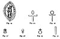
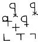
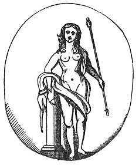

  
[Intangible Textual Heritage](../../index)  [Sub Rosa](../index) 
[Index](index)  [Previous](rrm20)  [Next](rrm22) 

------------------------------------------------------------------------

[Buy this Book at
Amazon.com](https://www.amazon.com/exec/obidos/ASIN/1564591182/internetsacredte)

------------------------------------------------------------------------

p. 156

[  
Click to enlarge](img/15600.jpg)  
Fig. 24-30  

### CHAPTER THE SEVENTEENTH

#### THE ROUND TOWERS OF IRELAND

IT is astonishing how much of the Egyptian and the Indian symbolism of
very early ages passed into the usages of Christian times. Thus: the
*high cup* and the *hooked staff* of the god became the bishop’s mitre
and crosier; the term *nun* is purely Egyptian, and bore its present
meaning; the *erect oval*, symbol of the Female Principle of Nature,
became the Vesica Piscis, and a frame for Divine Things; the *Crux
Ansata*, testifying the union of the Male and Female Principle in the
most obvious manner, and denoting fecundity and abundance as borne in
the god's hand, is transformed, by a simple inversion, into the Orb
surmounted by the Cross, and the ensign of royalty. Refer to *The
Gnostics and their Remains*, p. 72.

p. 157

[  
Click to enlarge](img/15700.jpg)  
Fig. 31  

The famous 'Stone of Cabar', Kaaba, Cabir, or Kebir, at Mecca, which is
so devoutly kissed by the faithful, is a talisman. It is called the
'Tabernacle' (*Taberna*, or Shrine) of the Star Venus. 'It is said that
the figure of Venus is seen to this day engraved upon it, with a
crescent.' The very Caaba itself was at first an idolatrous temple,
where the Arabians worshipped 'Al-Uza'--that is, Venus. See Bobovius,
Dr. Hyde Parker, and others, for particulars regarding the Arabian and
Syrian Venus. She is the 'Uraniæ-corniculatæ sacrum' (Selden, *De Venere
Syriaca*). The 'Ihrâm is a sacred habit, which consists only of two
woollen wrappers; one closed about the middle of devotees, to cover',
etc., 'and the other thrown over the shoulders.' Refer to observations
about Noah, later in our book; Sale's *Discourse*, p. 121; Pococke's
*India in Greece*, vol. ii. part i. p. 218. The Temple of Venus at
Cyprus was the Temple of Venus-Urania. 'No woman entered this temple'
(Sale's *Koran*, chap. vii. p. 119; note, p. 149). Accordingly, Anna
Commena and Glycas (in Renald. *De Mah.*) say that 'the Mahometans do
worship Venus'. Several of the Arabian idols were no more than large,
rude stones (Sale's *Discourse*, p. 20; *Koran*, chap. v. p. 82). The
stone at Mecca is *black*. The crypts, the subterranean churches and
chambers, the choirs, and the labyrinths, were all intended to enshrine
(as it were) and to conceal the central object of worship, or this
sacred 'stone'. The pillar of Sueno, near Forres, in Scotland, is an
obelisk. These obelisks were all astrological *gnomons*, or 'pins', to
the imitative stellar mazes, or to the 'fateful charts', in the
'letter-written' skies. The astronomical 'stalls', or 'stables'

p. 158

were the many 'sections' into which the 'hosts' of the starry sky were
distributed by the Chaldæans. The *Decumens* (or tenths), into which the
ecliptic was divided, had also another name, which was *Ashre*, from the
Hebrew particle *as*, or *ash*, which means 'fiery', or 'FIRE'. The
Romans displayed reverence for the ideas connected with these sacred
stones. Cambyses, in Egypt, left the obelisks or single magic stones.
The *Linghams* in India were left untouched by the Mohammedan
conquerors. The modern Romans have a *phallus* or *lingha* in front of
almost all their churches. There is an obelisk, altered to suit
Christian ideas (and surmounted in most instances in modern times by a
cross), in front of every church in Rome. There are few churchyards in
England without a *phallus* or obelisk. On the top is usually now fixed
a dial. In, former times, when the obeliscar form was adopted for
ornaments of all sorts, it was one of the various kinds of Christian
acceptable cross which was placed on the summit. We have the single
stone of memorial surviving yet in the Fire-Towers (*Round Towers of
Ireland*). This *phallus*, upright, or 'pin of stone', is found in every
Gilgal or Druidical Circle. It is the boundary-stone or *terminus*, the
parish mark-stone; it stands on every motehill lastly (and chiefly),
this stone survives in the stone in the coronation chair at Westminster
(of which more hereafter), and also in the famous 'London Stone', or the
*palladium*, in Cannon Street, City of London: which stone is said to be
'London’s fate'--which we hope it is not to be in the unprosperous
sense.

The letter 'S', among the Gnostics, with its. grimmer or harsher brother
(or sister) 'Z', was called the 'reprobate' or 'malignant' letter. Of
this portentous *sigma* (or sign) 'S' (the angular *and not serpentine*
'S' is the grinding or bass 'S'--the letter

p. 159

\[paragraph continues\] 'Z'), Dionysius
the Halicarnassian says as follows: that the 'letter S *makes a noise
more brutal than human*. Therefore the ancients used it very sparingly'
('Περἰ συνθες': see, also, sect. 14 p of *Origin and Progress of
Language*, vol. ii. p. 233).

Notwithstanding the contentions of opposing antiquaries, and the usually
received ideas that the 'Irish Round Towers' were of Christian, and not
heathen, origin, the following book, turning up very unexpectedly, seems
to settle the question in favour of O’Brien, and of those who urge the
incredibly ancient devotion of the Round Towers to a heathen
myth--fire-worship, in fact.

'John O’Daly, 9 Anglesea Street, Dublin. Catalogue of Rare and Curious
Books, No. 10, October 1855, Item 105: *De Antiquitate Turrum Belanorum
Pagana Kerriensi, et de Architectura non Campanilis Ecclesiasticæ*, T.
D. Corcagiensi, Hiberno. Small 4to, old calf, with numerous woodcut
engravings of Round Towers interspersed through the text, £10. Lovanii,
1610.' The bookseller adds 'I never saw another copy of this curious old
book.' This book--which there is no doubt is genuine--would seem finally
to settle the question as to the character of these Irish Round Towers,
which are not Christian belfries, as Dr. George Petrie, and others
sharing his erroneous beliefs, persistently assure us, but heathen
*Lithoi*, or obelisks, in the sense of all those referred to in other
parts of this work. They were raised in the early religions, as the
objects of a universal worship. All antiquaries know of what object the
*phallus* stands as the symbolical representation. It needs not to be
more particular here.

The '*Fleur-de-Lis*' is a sacred symbol descending from the Chaldæans,
adopted by the Egyptians, who converted it into the deified '*scarab*',
the emblem of

p. 160

the Moon-god; and it is perpetuated in that mystically magnificent badge
of France, the female 'Lily', or 'Lis'. All the proofs of this lie
concealed in our Genealogy of the Fleur-de-Lis ([p.
47](rrm12.htm#page_47) and following pages, also *post*), and the
'Flowers-de-Luce', or the 'Fleurs-de-Lis', *passim*. It means
'generation', or the vaunt realized of the Turkish Soldan, '*Donec totum
impleat orbem*'. The 'Prince of Wales’s Feathers', we believe to be, and
to mean, the same thing as this sublime 'Fleur-de-Lis'. It resembles the
object closely, with certain effectual, ingenious disguises. The origin
of the Prince of Wales’s plume is supposed to be the adoption of the
king's crest (by Edward the Black Prince, at the battle of Cressy), on
the discovery of the slain body of the blind King of Bohemia. Bohemia
again!--the land of the 'Fire-worshipping Kings' whose palace, the
Radschin, still exists on the heights near Prague. We believe the crest
and the motto of the Prince of Wales to have been in use, for our
Princes of Wales, at a much earlier period, and that history, in this
respect, is perpetuating an error--perhaps an originally intended
mistake. We think the following, which appears now for the first time;
will prove this fact. Edward the Second, afterwards King of England, was
the first Prince of Wales. There is reason to suppose that our valiant
Edward the First, a monarch of extraordinary acquirements, was initiated
into the knowledge of the abstruse Orientals. An old historian has the
following: 'On their giving' (i.e. the assembled Welsh) 'a joyful and
surprised assent to the King's demand, whether they would accept a king
born really among them, and therefore a true Welshman, he presented to
them his new-born son, exclaiming in broken Welsh "Eich dyn!", that. is
"This is your man"--which has been corrupted into the present motto to
the Prince of Wales's crest, "Ich

p. 161

dien", or "I serve". The meaning of 'I serve' in this view, is, that 'I'
suffice, or 'the Lis', or '*the act*', suffices (refer to pages and
figures *post*), for all the phenomena of the world.

 

 

------------------------------------------------------------------------

[Next: Chapter XVIII: Prismatic Investiture of the Microcosm](rrm22)
