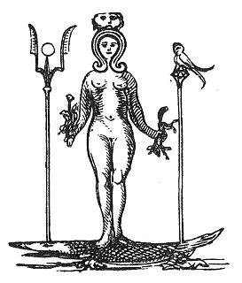

  
[Intangible Textual Heritage](../../index)  [Sub Rosa](../index) 
[Index](index)  [Previous](rrm28)  [Next](rrm30) 

------------------------------------------------------------------------

[Buy this Book at
Amazon.com](https://www.amazon.com/exec/obidos/ASIN/1564591182/internetsacredte)

------------------------------------------------------------------------

p. 209

### CHAPTER THE TWENTY-FOURTH

#### THE BELIEFS OF THE ROSICRUCIANS--MEANING OF LIGHTS AND OF COMMEMORATIVE FLAMBEAUX IN ALL WORSHIP

FROM the name of the Temple, now Stonehenge, comes the name of
Ambresbury, which stands a few miles from it. This is called the 'Ambres
of the Abiri'. It is two words, and means the 'Ambres of the *Dii
Potentes*', or of the ‏אבירי‎, or 'Cabiri'--for they are the same.

The star of the *Légion d’Honneur* bears the inscription '*Napoléon,
Empereur des Français*'. This order was instituted by the Emperor
Napoleon the First, after the discovery and dissolution of the Secret
Society, or Brotherhood, of which General Pichegru, Georges Cadoudal;
the famous Moreau, and other noted revolutionary men were members. This
order possessed, it is stated, a talisman or mystic head, which served
as a recognitive mark, and was supposed to be a sort of bond to the
brotherhood. After their death, their secret insignia were discovered;
and it has been stated that the Emperor Napoleon, whose attention was
instantaneously arrested by great and unusual ideas or supernatural
suggestions, in suppressing this mystic symbol or head, adopted it in
another form, and substituted his own head in profile, as the
*palladium*, or talisman, for his new order of the 'Legion of Honour'.

The saffron robe of Hymen is of the colour of the

p. 210

\[paragraph continues\] Flame of Fire. The
Bride, in ancient days, was covered with a veil called the '*Flammeum*';
unless made under this, no vow was considered sacred. The ancients
swore, not by the altar, but by the flame of fire *which was upon the
altar*. Yellow, or flame-colour, was the colour of the Ghebers, or
Guebres, or Fire-Worshippers. *The Persian lilies are yellow;* and here
will be remarked a connexion between this fact of the yellow of the
Persian lilies and the mystic symbols in various parts of our book.
Mystic rites, and the symbolical lights, which mean the Divinity of
Fire, abound at Candlemas-day (February 2nd), or the Feast of the
Purification; in the torches borne at weddings, and in the typical
flame-brandishing at marriage over almost all the world; in the
illuminations at feasts; in the lights on, and set about, the Christian
altar; at the festival of the Holy Nativity; in the ceremonies at
preliminary espousals; in the Bale, or Baal, fires on the summits of the
mountains; in the watch-lights, or votive sanctuary-lights, in the
hermitage in the lowest valley; in the *chapelle ardente*, in the Romish
funereal observances, with its abundance of silent, touching lights
around the splendid *catafalque*, or twinkling, pale and ineffectual,
singly at the side of the death-bed in the cottage of the peasant.
Starry lights and innumerable torches at the stately funeral, or at any
pompous celebration, mean the same. In short, light all over the world,
when applied to religious rites, and to ceremonial, whether in the
ancient or in the modern times, bespeaks the same origin, and struggles
to express the same meaning, which is Parseeism, Perseism, or the
worship of the deified FIRE, disguised in many theological or theosophic
forms. It will, we trust, never be supposed that we mean, in this, *real
fire*, but only the inexpressible something of which real fire, or
rather

p. 211

its flower or glory (bright light), is the farthest off--because, in
being visible at all, it is the grossest and most inadequate image.

All this strange, dreamy, ethereal view of a vital, accessible
something, entirely separate from the suggestions of mere sensation, is
Gnosticism, or Bhuddism, in its own profoundest depth. It follows on
similarly to the 'intoxication,' or suffusion with the very certainty of
the presence of God, which, in the poetic sense, was said to fill the
mind of even the supposed arch-atheist Spinoza.

The Rosicrucians, through the revelations concerning them of their
celebrated English representative, Robertus de Fluctibus, or Robert
Fludd, declare, in accordance with the Mosaic account of
creation--which, they maintain, is in no instance to be taken literally,
but metaphorically--that two original principles, in the beginning,
proceeded from the Divine Father. These are Light and Darkness, or form
or idea, and matter or plasticity. Matter, downwards, becomes fivefold,
as it works in its forms, according to the various operations of the
first informing light; it extends four-square, according to the points
of the celestial compass, with the divine creative effluence in the
centre. The worlds spiritual and temporal, being rendered subject to the
operation of the original Type, or Idea, became, in their imitation of
this Invisible Ideal, first intelligible, and then endowed with
reciprocal meaning outwards from themselves. This produced the being (or
thought) to whom, or to which, creation was disclosed. This is properly
the 'Son', or Second Ineffable Person of the Divine Trinity. Thus that
which we understand as a 'human mind' became a possibility. This second
great, only intelligible world, the Rosicrucians call 'Macrocosmos'.
They distribute it as into three regions or spheres;

p. 212

which, as they lie near to, or dilate the farthest from, the earliest
opening divine 'Brightness', they denominate the Empyræum, the Ætheræum,
and the Elementary Region, each filled and determinate and forceful with
less and less of the First Celestial Fire. These regions contain
innumerable invisible nations, or angels, of a nature appropriate to
each. Through these immortal regions, Light, diffusing in the emanations
of the cabalistic Sephiroth, becomes the blackness, sediment, or ashes,
which is the second fiery, real world. This power, or vigour, uniting
with the Ethereal Spirit, constitutes strictly the 'Soul of the World'.
It becomes the only means of the earthly intelligence, or man, knowing
it. It is the Angel-Conqueror, Guide, Saviour born of 'Woman', or 'Great
Deep', the Gnostic Sophia, the 'Word made flesh' of St. John. The
Empyræum is properly the flower, or glory (effluent in its abundance),
of the divine Latent Fire. It is penetrated with miracle and holy magic.
The Rosicrucian system teaches that there are three ascending
hierarchies of beneficent Angels (the purer portion of the First Fire,
or Light), divided into nine orders. These threefold angelic hierarchies
are the Teraphim, the Seraphim, and the Cherubim. This religion, which
is the religion of the Parsees, teaches that, on the Dark Side, there
are also three counter-balancing resultant divisions of operative
intelligences, divided again into nine spheres, or inimical regions,
populated with splendidly endowed adverse angels, who boast still, the
relics of their lost, or eclipsed, or changed, light. The elementary
world, or lowest world, in which man and his belongings, and the lower
creatures, are produced, is the flux, subsidence, residuum, ashes, or
deposit, of the Ethereal Fire. Man is the microcosm, or 'indescribably
small copy', of the whole great

p. 213

world. Dilatation and compression, expansion and contraction, magnetic
sympathy, gravitation to, or flight from, is the bond which holds all
imaginable things together. The connexion is intimate between the higher
and the lower, because all is a perpetual aspiration, or continuous
descent: one long, immortal chain, whose sequence is never-ending,
reaches by impact with that immediately above, and by contact with that
immediately below, from the very lowest to the very highest. 'So true is
it that God loves to retire into His clouded Throne; and, thickening the
Darkness that encompasses His most awful Majesty, He inhabits an
Inaccessible Light, and lets none into His Truths but the poor in
spirit.' The Rosicrucians contended that these so 'poor in spirit' meant
themselves, and implied their submission and abasement before God.

The Rosicrucians held that, all things visible and invisible having been
produced by the contention of light with darkness, the earth has
denseness in its innumerable heavy concomitants downwards, and they
contain less and less of the original divine light as they thicken and
solidify the grosser and heavier in matter. They taught, nevertheless,
that every object, however stifled or delayed, in its operation, and
darkened and thickened in the solid blackness at the base, yet contains
a certain possible deposit, or jewel, of light--which light; although by
natural process it may take ages to evolve, as light will tend at last
by its own native, irresistible force upward (when it has opportunity),
can be liberated; that dead matter will yield this spirit in a space
more or less expeditious by the art of the alchemist. There are worlds
within worlds--we, human organisms, only living in a deceiving, or
Bhuddistic, 'dreamlike phase' of the grand panorama. Unseen and
unsuspected (because in it

p. 214

lies magic), there is an inner magnetism, or divine aura, or ethereal
spirit, or possible eager fire; shut and confined, as in a prison, in
the body, or, in. all sensible solid objects, which have more or less of
spiritually sensitive life as they can more successfully free themselves
from this ponderable, material obstruction. Thus all minerals, in this
spark of light, have the rudimentary possibility of plants and growing
organisms; thus all plants have rudimentary sensitives, which might (in
the ages) enable them to perfect and transmute into locomotive new
creatures, lesser or higher in their grade, or nobler or meaner in their
functions; thus all plants and all vegetation might pass off (by
side-roads) into more distinguished highways, as it were, of
independent, completer advance, allowing their original spark of light
to expand and thrill with higher and more vivid force, and to urge
forward with more abounding, informed purpose--all wrought by planetary
influence, directed by the unseen spirits (or workers) of the Great
Original Architect, building His *microcosmos* of a world from the plans
and powers evoked in the *macrocosm*, or heaven of first forms, which,
in their multitude and magnicence, are as changeable shadows cast off
from the Central Immortal First Light, whose rays dart from the centre
to the extremest point of the universal circumference. It is with
terrestrial fire that the alchemist breaks or sunders the material
darkness or atomic thickness, all visible nature yielding to *his*
furnaces, whose scattering heat (without its sparks) breaks all doors of
this world’s kind. It is with immaterial fire (or ghostly fire) that the
Rosicrucian loosen contraction and error, and conquers the false
knowledge and the deceiving senses which bind the human soul an in its
prison. On this side of his powers, on this dark side (to the world) of
his character, the

p. 215

alchemist (rather now become the Rosicrucian) works in invisible light,
and is a magician. He lays the bridge (as the Pontifex or Bridge-Maker)
between the world possible and the world impossible: and across this
bridge, in his Immortal Heroism and Newness, he leads the votary out of
his dream of life into his dream of temporary death, or info extinction
of the senses and of the powers of the senses; which world’s blindness
is the only true and veritable life, the envelope of flesh falling
metaphorically off the now liberated glorious *entity*--taken up, in
charms, by the invisible fire into rhapsody, which is as the gate of
heaven.

Now, a few words as to the theory of alchemy. The alchemists boasted of
the power, after the elimination and dispersion of the ultimate elements
of bodies by fire (represented by the absent difference of their weights
before and after their dissolution), to recover them back out of that
exterior, unknown world surrounding this world: which world men reason
against as if it had no existence, when if has real existence; and in
which they were in ignorance in their 'Pre-State', as they will be
(perhaps also in ignorance) in their 'After-State'. In respect of which
state ('before' and 'after' this life), all people, in all time, have
had an idea. It is 'Purgatory', if is '*Limbus*', it is 'Suspension in
Repose', it is as the 'Twilight' of the Soul before and after the 'Day'
of Full Life, or complete consciousness. These ideas are as equally
Christian as Pagan. How little is all this supposed in the ignorance of
the moderns!

It is this other world (just off this real world) into which the
Rosicrucians say they can enter, and bring back, as proofs that they
have been there, the old things (thought escaped), metamorphosed into
new things. This act is *transmutation*. This product is

p. 216

magic gold, or 'fairy gold', condensed as real gold, This growing gold,
or self-generating and multiplying, gold, is obtained by invisible
transmutation (and in other light) in another world out of this world;
immaterial to us creatures of limited faculties, but material enough,
farther on, on the heavenly side, or on the side *opposite* to our human
side. In other words, the Rosicrucians claim not to be bound by the
limits of the present world, but to be able to pass into this next world
(inaccessible only in appearance), and to be able to work in it, and to
come back safe (and selfsame) out of it, bringing their trophies with
them, which were gold, obtained out of this master-circle, or outside
elementary circle, different from ordinary life, though enclosing it;
and the *elixir vitæ*, or the means of the renewal or the perpetuation
of human life through this universal, immortal medicine, or
*magisterium*, which, being a portion of the light outside, or magic, or
breath of the spirits, fleeing from man, and only to be won in the
audacity of God-aided alchemic exploration, was independent of those
mastered natural elements, or nutritions, necessary to ordinary common
life. The daily necessary food which is taken for the sustenance of the
body was, as the Rosicrucians contended, the means of dissolution, or
death daily passing through and the real cause of the destruction of the
body, by the slowest of all processes, but yet, in instalments, the
effectual one. They asserted that man *dies daily* in his own native
bodily corruptions. These singular philosophers ventured the assertion
that God did not, in the beginning, intend that man’s life should be
terminated by diseases, nor that he should be made subject to
accidental, violent means of end. In the abstract sense, and apart from
our knowledge of man as man, the Rosicrucians contended that diseases
are not

p. 217

necessarily incidental to the body, and that death may be said to have
become an imported accident into the scheme of things; our ideas being
erroneous as to the original design in regard of us.

Man was to have lived as the angels, of an impregnable, impassable
vitality, taking his respiration, not by short snatches, as it were, but
as out of the great cup of the centuries. *He* was to be the spectator
of nature--not nature *his* spectator. The real objects of the adepts
were, in truth, to remain no longer slaves to those things supposed to
be *necessities*, but, by the assistance of Heaven, to remove back to
Heaven’s original intention; to rise superior to the consequences of the
original Curse, and to tread under foot, in vindicating the purpose of
God, that mortal (however seductive), sexual, distinctive, degradation
entailing dissolution, heired from Adam, or from the First Transgressor.
That poverty and celibacy (under certain limitations) must be the
obligations of the true Brothers of the 'R. C.' will at once be seen
from the above reasons, however wild and mistaken--barely even
comprehensible. This is the real original reason for the monastic
state--defying and denying nature.

The original curse was entailed upon mankind by eating of

                                   The fruit  
Of that forbidden 'Tree', whose mortal taste  
Brought death into the world, and all our woe.

\[paragraph continues\] What that 'Tree'
was, and what are its votive, idolatrous (in the bad sense) symbols in
the old world and in the new, we think we have abundantly shown--at
least, in the occult, shadowy idea. Why, supposing that the alchemists
ever possessed the power of universal gold-making, they fail of
producing any,

p. 218

or of offering one of their rich gifts to the world, is at once answered
in these two conclusive, obvious facts: Firstly, that if this power of
gold-making, or of transmutation, were a recognized possibility, like
any other art allowed or authorized, it would inevitably become penal or
impossible, in order to preserve the existing value of gold, the richest
metal; and the professor of the art would be at once put out of sight.
Secondly, if supposed to be true, and not fable, like any ordinary art
or science, the man who had arrived at such a stupendous secret would be
sacrificed or martyred in the insatiate haste of the people to compel
him to produce gold, in order to satisfy *them*--that gold, moreover,
which will destroy, but can never satisfy. 'Ye cannot serve God and
Mammon.' These things the alchemists too well know, and therefore they
(if any exist now) hide, as they have always hidden, and deny, as they
have always denied; being desirous of stealing through the world unknown
and of serving God alone, whose inaccessible great glory, as we see, has
been imitated in the golden lights of the inexpressibly grand (in the
worldly and mortal sense), apostate constructions of the magnificent
Mammon, Lord of the Treasures of this World, for which men offer
themselves willing victims even to Him, King of the Visible, whose
semblance is that of the most brilliant yellow element--Fire--*Or*,
'Golden Flame', the 'Flower' of the Fire.

The alchemists maintain that the metals are produced in the secret
operations of the planets, that grow them daily in the bowels of the
earth; that the sun and moon, red and white, fire and water, light and
darkness, male and female, night and day, are active in the generation
of the precious metals, of which gold is due wholly to the invisible
operation of the sun and moon, and silver is referable to the

p. 219

whitening or bleaching lucidity of the moon; that gold is produced
quicker or slower according to the faster or slower operations of
nature; that it vivifies and vegetates, bears bright seed and
multiplies, germinating as fructifying in the matrix, or the
laboratories of the earth; that gold is produced with infinite pains, as
it were, by these chemic operations of nature, very slowly under certain
circumstances, but very rapidly under other more favourable, more
powerful conditions; that it is possible for the adept to act as the
midwife of nature, and to assist in her deliverance, and in the birth of
gold, in these occult senses; that the work of nature being thus
expedited by this alchemical art, the hitherto thwarted intention of
Providence is effected in the predetermined liberation of the divine
gold, 'Lux', or light, which is again united to its radix or
producing-point, in. heaven. A spark of the original light is supposed
by the Rosicrucians to remain deep down in the interior of every atom.

The Rosicrucian Cabala teaches that the three great worlds
above--Empyræum, Ætheræum, and the Elementary Region--have their copies
in the three points of the body of man: that his head answers to the
first; his breast, or heart, to the second; and his ventral region to
the third. In the head rests the intellect, or the magnetism of the
assenting judgment, which is a phenomenon; in his heart is the
conscience, or the *emotional* faculty, or the Saviour; and in the
umbilical centre reside the animal faculties, or all the sensitives.
Nutrition is destruction in the occult sense, and dissolution is rescue
in the occult sense; because the entity, or visible man, is constructed
in the elements, and is as equally ashes, or condemned matter, as they
are; and because the fire that feeds the body (which is its natural
respiration or

p. 220

maintenance) is in itself that which (however slowly) destroys it. Man
lives upon the lees of nature, or (in the Bhuddistic view) upon the
'gross purgations of the celestial fire', which is urging itself clear
through the operation of the divine rescuing spirit in it. It follows
that metaphysically all the wonderful shows of life are *phantasmata*
only, and their splendours false and a show only. But as these shows are
the medium and the instruments of life, without which intelligence (in
the human sense) would be impossible, this celestial 'Second Fire' has
been deified in the acknowledgments of the first inhabitants of the
world, who raised pillars and stones in its honour as the first idol.
Thus man bears in his own body the picture of the 'Triune'. Reason is
the head, feeling is the breast, and the mechanical means of both
feeling and reasoning, or the means of his being Man, is the epigastric
centre, from which the two first spring as emanations, and with which
the two first form ultimately but 'one'. The invisible magnetic,
geometrical bases, or latitudes, of these three vital points, whose
consent, or coincidence, or identity, forms the 'microcosm', which is a
copy of the same form in heaven, answer magically to their stellar
originals. This is astrological 'ruling' by pyramidal culmination; and
by trilinear descent or efflux, to an intersecting point in the
latitudes of the heavens and in the man’s body, at which upper and
lower, or heaven and earth; interchange; and Man is therefore said to be
made 'in the image' of the Archetype, who has 'descended' to man, who
has 'ascended' to Him. This is the 'hinge-point' of the natural and the
supernatural, upon which the two wings of the worlds real and unreal
revolve. The starry heavens, through whose astrological cross-work
complications (as in a snap) all these infinite effects are produced,
and on whose

p. 221

\[paragraph continues\] (for, taking
gravitation away, they are the same) floor of lights, or cope or dome of
signs or letters, all the 'past, present, and future' has been written
by the finger of God (although to man they are ever rearranging), can be
read by the competent as Fate Natural and supernatural, though one is
only the reversed side of the other, as 'darkness is only the reversed
side of light, and light is only the reversed side of darkness', [1](#fn_12) are mistaken by man for opposites,
although they are the same: man living in this state in darkness,
although his world is light; and heaven in this state being darkness,
although this state is light.

Music (although it is unheard by man) is necessarily produced in the
ceaseless operations of material nature, because nature itself is
penitential and but the painful (and musical) expression between two
dissonant points. The Bhuddist contends that all forms are but the
penance of nature. Music is life, and life is music. Both are pain,
although made delightful. Phenomena are not real.

Thus colours to the human are negative as music addressed to the ear,
the musical notes negative as colours addressed to the eye, and so on of
the other senses, although they are all the same in the imagination,
without the *sensorium*--as dreams show. And life and the world, in this
view, are all imagination: man being made in idea, and only in his own
belief. This, again, is only pure Parseeism; and the whole will be
rightly regarded as the most extraordinary dream of philosophy--as depth
of depths beyond idea.

Schubert, in his *Symbolism of Dreams*, has the following passages,
which we have before adduced and

p. 222

made use of for illustration: 'It may be asked whether. that language,
which now occupies so low a place in the estimation of men, be not the
actual waking language of the higher regions, while we', adds the
philosopher, coming out with something very strange, 'awake as we fancy
ourselves, may be sunk *in a sleep of many thousand years*, or, at
least, in the echo of their dreams, and only intelligibly catch a few
dim words of that language of God, as sleepers do scattered expressions
from the loud conversation of those around them.'

The following is a fair view of the Rosicrucian theory concerning music.

The whole world is taken as a musical instrument; that is, a chromatic,
sensible instrument. The common axis or role of the world celestial is
intersected--where this superior diapason, or heavenly concord or chord,
is divided--by the spiritual sun, or centre of sentience. Every man has
a little spark (sun) in his own bosom. Time is only protracted
consciousness, because there is no world out of the mind conceiving it.
Earthly music is the faintest tradition of the angelic state; it remains
in the mind of man as the dream of, and the sorrow for, the lost
paradise. Music is yet master of the man’s emotions, and therefore of
the man.

Heavenly music is produced from impact upon the paths of the planets,
which stand as chords or strings, by the cross-travel of the sun from
note to note, as from planet to planet; and earthly music is
microscopically an imitation of the same, and a 'relic of heaven'; the
faculty of recognition arising from the same supernatural musical efflux
which produced the planetary bodies, in motived projection from the sun
in the centre, in their evolved, proportional, .harmonious order. The
Rosicrucians taught that the

p. 223

\[paragraph continues\] 'harmony of the
spheres' is a true thing, and not simply a poetic dream: all nature,
like a piece of music, being produced by melodious combinations of the
cross-movement of the holy light playing over the lines of the planets:
light flaming as the spiritual ecliptic, or the *gladius* of the
Archangel Michael, to the extremities of the solar system. Thus are
music, colours, and language allied.

Of the Chaldæan astrology it may figuratively be said that, although
their knowledge, in its shape of the 'Portentous Stone'--in this
instance, their grave-stone--shut up the devils in the depths of the
'Abyss', and made the sages their masters (Solomon being the Priest or
King, and his seal the 'Talisman' that secures the 'Deep'): Man, on
account of his having fallen into the shadow and the corruptions of
EXISTENCE, needs that mighty exterior HAND (before which all tremble) to
rescue him back into his native original Light or Rest. All the
foregoing is pure Bhuddism.

Thinkers who have weighed well the character of those supposed
infractions of natural laws which have admitted, as it were
philosophically, the existence of other independent, absent, thinking
spirits, communicating intelligibly in this world of ours, insist 'that
it is impossible to suppose that the partitions between this world and
the other world are so thin as that you can hear the movers in the other
through.'

Nevertheless thoughtful people are equally able to convict modern
philosophical realists of absurdity, when the former adduce the
following insurmountable objection against them: 'When we tell you of a
supernatural thing', say the supernaturalists to the realists; 'you
directly *have recourse to a natural thing in which to find it*.' This
is contrary to common dense; and therefore the realistic arguer has no
right to dispose

p. 224

in this manner of that which is supernatural; for his objections are
futile and vain, and his arguments contradict themselves. Spirit and
matter, when sought to be explained, are totally opposed; and hence,
arises the reason why there can never be any belief of impossible
things, and only the conviction that such things have been in the mind,
notwithstanding the insurmountable contradiction of the senses.

 

 

------------------------------------------------------------------------

### Footnotes

[221:1](rrm29.htm#fr_12) '*Comte de Gabalis*':
Rosicrucian.

------------------------------------------------------------------------

[Next: Chapter XXV: The Great Pyramid](rrm30)
