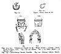
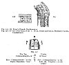
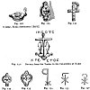
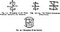
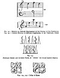
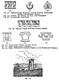
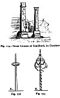
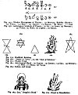
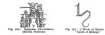

  
[Intangible Textual Heritage](../../index)  [Sub Rosa](../index) 
[Index](index)  [Previous](rrm31)  [Next](rrm33) 

------------------------------------------------------------------------

[Buy this Book at
Amazon.com](https://www.amazon.com/exec/obidos/ASIN/1564591182/internetsacredte)

------------------------------------------------------------------------

p. 254

### CHAPTER THE SECOND

#### PRESENCE OF THE ROSICRUCIANS IN HEATHEN AND CHRISTIAN ARCHITECTURE

A QUESTION may here arise whether two corresponding pillars, or columns,
in the White Tower, London, do not very ingeniously conceal,
masonically, the mythic *formula* of the Mosaic Genesis, 'Male and
Female created He them', etc. Refer below to figs. 119, 120.

1\. Tor, or 'Hammer of Thor' T(au).

[  
Click to enlarge](img/25400.jpg)  
Figs. 119-124  

|                                                                                                                                                                                                                                                                         |
|-------------------------------------------------------------------------------------------------------------------------------------------------------------------------------------------------------------------------------------------------------------------------|
| Figs. 119, 120: Columns to Chapel in the 'White Tower', London. Style, Early Norman, 1081. Fig. 119--(1) Mystic 'Tau'; (2) Male, Right; (3) Female, Left. Fig. 122: Egypt, Persia: Sect of Ali; Fig. 123: Castle-Rising Church, Norfolk. Fig. 124: Romsey Abbey, Hants. |

p. 255

[  
Click to enlarge](img/25500.jpg)  
Figs. 125-127  

|                                                                                                                                                                                                                                                                                                                          |
|--------------------------------------------------------------------------------------------------------------------------------------------------------------------------------------------------------------------------------------------------------------------------------------------------------------------------|
| Fig. 125: St. Peter's Church, Northampton; Fig. 126: S--out of the Arms of the +. (Font, Runic and Saxon, Bridekirk Church, Cumberland); Fig. 127: ‏ת‎ ω T: The Ten Commandments, 'Tables of Stone' Five 'Commandments' to the Right, Masculine, 'Law', Five 'Commandments' to the Left, the 'Prophets', or the 'Gospel' |

2\. Corinthian Volutes, or 'Ram's Horns'.

The crescent moon and star is a Plantagenet badge. It is also the Badge
of the Sultan of Turkey. Also, with a difference, it displays the
insignia of Egypt.

The flag of Egypt is the ensign of the sect of Ali (the second
Mohammedan head of religion), which is 'Mars, a Crescent, Luna; within
the horns of which is displayed an estoile of the second'--abandoning
the vert, or green, of the 'Hadgi', or of Mecca, the site of the
apotheosis of Mohammed. The Mohammedan believers of the sect of Ali rely
on the 'masculine principle'--more closely, in this respect,
assimilating with the Jews; and therefore their distinctive heraldic and
theological colour is red, which is male, to the exclusion of the other
Mohammedan colour,

p. 256

[  
Click to enlarge](img/25600.jpg)  
Figs. 128-136  

|                                                                                                     |
|-----------------------------------------------------------------------------------------------------|
| Fig. 130 A lamp, Roma Sotteranea ΙΧΘΥΣ.'; Fig. 131: Devices from the Tombs in the Catacombs at Rome |

green, which is female. The 'Hadgi', or Pilgrims to Mecca, wear green;
the Turkish Mussulmans wear red and green, according to their various.
titles of honour, and to their various ranks.

The Hospital of St. Cross, near Winchester, abounds in the earliest
Norman mouldings. The architecture of St. Cross presents numerous
hermetic suggestions.

The identity of Heathen and of Christian Symbols is displayed in all our
old churches in degrees more or less conclusive.

The 'Ten fingers' of the two hands (made up of each 'Table' of Five) are
called in old parlance, the ten commandments'. 'I will write the ten
commandments

p. 257

[  
Click to enlarge](img/25700.jpg)  
Figs. 137-140  

|                                                                                                                                                         |
|---------------------------------------------------------------------------------------------------------------------------------------------------------|
| Fig. 137: Monogram of the Three Figs. 138, 139: The Heathen Monogram Emblems carried in the Mysteries of the Triune; Fig. 140: Monogram of the Saviour. |

in thy face' was spoken in fury, in the old-fashioned days, of an
intended assault. The hands explain the meaning of this proverbial
expression, interpreted astrologically. Palmistry is called Chiromancy,
because Apollo, mythologically, was taught 'letters' by Chiron, the
'Centaur'.

The devices on most Roman Bronze Lamps present continual Gnostic ideas.

The Temple Church, London, will be found to abound with Rosicrucian
hieroglyphs and anagrammatical hints in all parts, if reference be made
to it by an attentive inquirer--one accustomed to these abstruse
studies.

These designs supply a variety of Early Christian Symbols or
Hieroglyphs, drawn from Roman originals in all parts of the world.

The Æolian Harp, or Magic Harp, gave forth real strains in the wind.
.These were supposed to be communications from the invisible spirits
that people the, air in greater or lesser number. See figs. 141, 142.

The above music consists of a magical incantation to the air, or musical
Charms, supposed magically to

p. 258

[  
Click to enlarge](img/25800.jpg)  
Figs. 141-145  

<table data-border="0" width="50%">
<colgroup>
<col style="width: 100%" />
</colgroup>
<tbody>
<tr class="odd">
<td data-valign="top" width="655">
Fig. 141: Melody (or Melodic Expression) of the Portico of the Parthenon 
Fig. 142: General Melody (or Melodic Expression) of the Pantheon, Rome 
Fig. 143: Alternate Direct and Crooked Radii, or 'Glories' set round Sacred Objects 
Figs. 144, 145: Collar of Esses
</td>
</tr>
</tbody>
</table>

be played from the frontispieces, as musical instruments, of two of the
most celebrated ancient religious structures. The Cabalists imagined
that the arrangements of the stars in the, sky, and particularly the
accidental circumvolvent varying speed of the planets of the solar
system, produced music--as men know music. The Sophists maintained that
architecture, in another sense, was harmonious communication,

p. 259

[  
Click to enlarge](img/25900.jpg)  
Figs. 146-153  

<table data-border="0" width="50%">
<colgroup>
<col style="width: 100%" />
</colgroup>
<tbody>
<tr class="odd">
<td data-valign="top" width="655">
Fig. 146: Egg-and-Tongue Moulding, Caryatic Prostyle, Pandroseum 
         (Temple of Erechthæus, Athens) 
Fig. 147: Moslem: the Crescent and Star: also Plantagenet 
Fig. 148: Honeysuckle, Greek Stele 
Fig. 149: Egg-and-Tongue Moulding, Roman example 
Fig. 150: Rhamasseion, Thebes, Caryatic Portico 
Fig. 151: India, origin of the 'Corinthian' 
Fig. 152: India, Rudimental Corinthian Capital, as also Rudimental Christian
</td>
</tr>
</tbody>
</table>

addressed to a capable apprehension--when the architecture was true to
itself, and therefore of divine origin. Hence the music on [p.
258](#page_258). These passages were supposed to be magic charms, or
invocations, addressed by day and night, to the intelligent beings who
filled the air invisibly. They were played from the fronts

p. 260

[  
Click to enlarge](img/26000.jpg)  
Figs. 154-156  

Fig. 154: Stone Crosses at Sandbach, in Cheshire

of the Parthenon, Athens, and the Pantheon, Rome, according to the ideas
of the superstitious Greeks and of the Oriental Christian Church.

In fig. 153 we have a representation of Bersted Church, as seen
(magnified) from a rising hill, over a hop-garden, at about the distance
of half a mile. Bersted is a little village, about three miles from
Maidstone, Kent, on the Ashford road. In the chancel of Bersted Church,
Robert Fludd, or Flood ('Robertus de Fluctibus'), the head of the
Rosicrucians in England, lies buried. He died in 1637.

Fig. 155 displays the standard Maypole, or authentic Maypole, with all
its curious additions; and we add their explanation. In the upper
portion we have the

p. 261

[  
Click to enlarge](img/26100.jpg)  
Figs. 157-165  

<table data-border="0" width="50%">
<colgroup>
<col style="width: 100%" />
</colgroup>
<tbody>
<tr class="odd">
<td data-valign="top" width="655">
Fig. 157: Hindoo Monograms of Planets: (1) Mercury, Buddha (Boodh)' (2) Venus; (3) Mars; (4) Jupiter; (5) Saturn; (6) Moon; (7) Sun 
Fig. 158: Astrological Symbols of Planets: (1) Sol (2) Luna; (3) Mercury; (4) Venus; (5) Mars; (6) Jupiter; (7) Saturn 
Fig. 159: Buddhist Emblem 
Fig. 160: 'Shield of David', or, the 'Seal of Solomon' 
Fig. 161: Phallic Triad 
Fig. 162: Astrological Hand: (1) Jupiter; (2) Saturn; (3) Sun; (4) Mercury; (5) Mars; (6) Moon; (7) Venus 
Fig. 163: Indian and Greek 
Fig. 164: Isis, 'Dragon’s Head' 
Fig. 165: Hand in Benediction
</td>
</tr>
</tbody>
</table>

\[paragraph continues\] Apex of the
Phallus, the Quatre-feuilles, and the Discus or Round. The lower portion
is the Linga, Lingham, or Phallus, 'wreathed'; also the 'Pole' of the
ship 'Argo' ('Arco'); otherwise the 'Tree of Knowledge'. The ribbons of
the Maypole should be of the seven prismatic colours.

Fig. 156 shows the union of the Phallus and Yoni, and exhibits
Unmistakably the destination and purpose of the familiar Maypole.

p. 262

[  
Click to enlarge](img/26200.jpg)  
Figs. 166, 167  

|                                                                                                   |
|---------------------------------------------------------------------------------------------------|
| Fig. 166: Egyptian Alto-Relievo (British Museum); Fig. 167, 'Hook of Saturn', 'Crook of Bishops'. |

Each finger in fig. 162 is devoted to a separate planet. Refer to the
engraving of the hand.

Fig. 167, 'Hook of Saturn', 'Crook of Bishops'. 'By hook or crook',
meaning, 'By fair means or foul', is a proverbial expression,
continually heard.

There are two works which will assist in throwing light upon that mystic
system of the ancients, probably originating in the dreaming East, that
refers the production of music to architectural forms or geometric
diagrams; as columns and entablatures, or upright lines and cross-lines,
and mathematical arcs and diagonals, in their modifications and
properties, of course are. These books, which will help to explain the
passages of music given at [p. 258](#page_258), figs. 141, 142, are
Hay's *Natural Principles and Analogy of the Harmony of Form*, and a
very original and learned musical production, entitled *The Analogy of
the Laws of Musical Temperament to the Natural Dissonance of Creation*,
by M. Vernon, published in London in 1867. Through a strange theory, the
music at [p. 258](#page_258) of our book is taken as the expression of
the geometrical fronts of the two great temples, the Parthenon at Athens
and the Pantheon at Rome, which are supposed to have been built with
perfect art. We have 'translated' these phantom Æolian melodies played
in the winds (so to express it), and fixed them in modern musical
notation.

------------------------------------------------------------------------

[Next: Chapter III. The Rosicrucians Amidst Ancient Mysteries. Their
Traces Discoverable in the Orders of Knighthood](rrm33)
