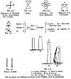
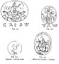
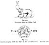
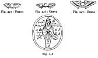
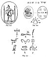
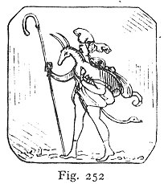
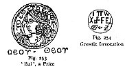
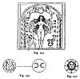
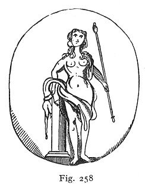

  
[Intangible Textual Heritage](../../index)  [Sub Rosa](../index) 
[Index](index)  [Previous](rrm34)  [Next](rrm36) 

------------------------------------------------------------------------

[Buy this Book at
Amazon.com](https://www.amazon.com/exec/obidos/ASIN/1564591182/internetsacredte)

------------------------------------------------------------------------

p. 295

### CHAPTER THE FIFTH

#### CONNEXION BETWEEN THE TEMPLARS AND GNOSTICISM

THE branch sect of the Gnostics, called Basilideans, who were properly
Ophites, arose in the second century, deriving their name from
Basilides, the chief of the Egyptian Gnostics. They taught that in the
beginning there were Seven Being's, or Æons, of a most excellent nature;
in whom we recognize the cabalistic Seven Spirits before the Throne. Two
of these first Æons, called Dyamis and Sophia--that is 'Power' and
'Wisdom'--engendered the, angels of the highest order. The name of
Abraxas; the Deity of the Gnostics, is made up of 'the numerical letters
representing the total 365--the aggregate of days of the solar year. The
'manifestation' of Abraxas rests in his Son, Nūs (knowledge), or Christ,
the chief of the Æons, who descended to earth and assumed the form of
'Man'; was baptized, and crucified in appearance (Mosheim's *Eccles.
Hist.* vol. i. pp. 181-4). The Manichæans, who deny the reality of the
Crucifixion of the Son of God, and whose tenets concerning the Saviour
Jesus are peculiar, derive their name from Manes, or Mani; and their
doctrine was first disseminated in Persia about the year 270. They speak
mysteriously of the *Anima Mundi*, or 'Hyle'; they call this principle a
deity, and agree with the Rosicrucians in asserting that it is a power
presenting itself at once in reverse to the world and to the heavens, in
as far as that, while it is dark to the one, it is light

p. 296

to the other; and contrariwise. The Gnostic hierarchy consisted of an
arch-priest or patriarch, twelve. masters, and seventy-two leaders or
bishops. The Gnostics called Matter, or Body, 'evil', and 'darkness',
and seemed uncertain whether, in its operations, it were active or
passive. It was believed by these sectaries that there were successive
emanations of intelligent beings--these were the Æons (αἰῶνες),
producing the various phases in creation. In this way, there arose in
time a mighty being, the Demiurge, who set to work on the inert matter
then existing, and out of it formed the world. The reconcilement, or
restoration, is to the Bhuddistic *pleroma*, or fullness of light. It is
absorption into 'annihilation', or into victory, oblivious of the
vexations of 'life'. Here, in this fullness of light--or independence of
all worlds, or of life, according to Man’s ideas--the Supreme God has
His habitation: but it is not 'nothingness', according to our ideas of
nothing; it is so only because it has not anything in it comprehensible.
The Alexandrian Gnostics inclined to the opinion that Matter was inert,
or passive; the Syrian, Gnostics, on the contrary, held that it was
active. Valentinus came from Alexandria to Rome about A.D. 140. St.
Augustine fell under the Gnostic influence, and retained their beliefs
from his twentieth to his twenty-ninth year--viz., from 374 to 383 A.D.
Their books have for titles: the *Mysteries*, the *Chapters* or *Heads*,
the *Gospel*, and the *Treasure*. Refer to Beausobre, Walch, Fuësslin,
and Hahn.

The Gnostics held that Christ's teaching was not fully understood even
by His disciples; and therefore He promised to send, in due time, a
still greater Apostle, the Paraclete, who should effectually separate
truth from falsehood. This Paraclete appeared in Mani.

The West Front of Lichfield Cathedral displays

p. 297

accurately the mythic idea of the union of the Male and Female
Principles in the parallel double towers, which are uniform.

The claims for the real reading of the Egyptian hieroglyphics are
distinct and unhesitating, as put forward by the Egyptologists; who, if
industry could have succeeded, certainly would have realized their
desire. But it is extremely doubtful whether, after all, they are not
very widely astray. The late Sir George Cornewall Lewis, in his *History
of Ancient Astronomy*, has disposed conclusively of the assumed
correctness of most of these interpretations. The Egyptologists, the
principal of whom are Champollion, Rawlinson, Dean, Milman, Sir George
Lewis (perhaps the best critic), Professor Wilson, Sir Gardner
Wilkinson, Dr. Cureton, Dr. Hincks, M. Oppert, Mr. Fox Talbot, with a
large amount of ingenious and very plausible research and conjecture,
have not truly touched or appreciated these enigmas. They yet remain,
baffling the curiosity of the moderns; and they are likely to preserve
their real mysteries unread as long as the stones of the Pyramids and
the remembrance of the Sphinx--if not her visible figure--themselves
endure. We believe that there is no adequate mystical comprehension
among modern decipherers to read the hopeless secrets--purposely evading
discovery--which lie locked in the hieroglyphics: the most successful
readings are probably guesses only, founded on readily accepted likeness
and likeliness.

The Temple Church, London, presents many mythic figures which have a
Rosicrucian expression. In the spandrels of the arches of the long
church, besides the 'Beauséant', which is repeated in many places, there
are the armorial figures following: 'Argent, on a cross gules, the Agnus
Dei, or Paschal Lamb,

p. 298

or'; 'Gules, the Agnus Dei, displaying over the right shoulder the
standard of the Temple; or, a banner, triple cloven, bearing a cross
gules'; 'Azure, a cross prolonged, potent, issuant out of the crescent
moon argent, horns upwards; on either side of the cross, a star or'.
This latter figure signifies the Virgin Mary, and displays the cross as
rising like the pole, or mast of a ship (*argha*), out of the midst of
the crescent moon, or *navis biprora*, curved at both ends; 'azure,
semée of estoiles, or'. The staff of the Grand Master of the Templars
displayed a curved cross of four splays, or blades, red upon white. The
eight-pointed red Bhuddist cross was also one of the Templar ensigns.
The temple arches abound with brandished *estoiles*, or stars, with wavy
or crooked flames. The altar at the east end of the Temple Church has a
cross *flourie*, with lower limb prolonged or, on a field of *estoiles*,
wavy; to the right is the Decalogue, surmounted by the initials, Α. Ω.
(Alpha and Omega); on the left are the monograms of the Saviour,
Ι C∙Χ C; beneath, is the Lord's Prayer. The whole altar displays
feminine colours and emblems, the Temple Church being dedicated to the
Virgin Maria. The winged horse, or Pegasus, argent, in a field gules, is
a badge of the Templars. The tombs of the Templars, disposed around the
circular church in London, are of that early Norman shape called *dos
d’âne*; their tops are triangular; the ridge-moulding passes through the
temples and out of the mouth of a mask at the upper end, and issues out
of the horned skull, apparently, of some purposely *trodden* creature.
The head at the top is shown in the 'honour-point' of the cover of the
tomb. There is an amount of unsuspected meaning in every curve of these
Templar tombs; but it would at present too much occupy us to more fully
explain.

p. 299

[  
Click to enlarge](img/29900.jpg)  
Figs. 232-238  

<table data-border="0" width="50%">
<colgroup>
<col style="width: 100%" />
</colgroup>
<tbody>
<tr class="odd">
<td data-valign="top" width="590">
Fig. 232: Signature or Talisman of the Jaina Kings: also Gnostic 
Fig. 233: India 
Fig. 234: <a href="errata.htm#7">Talisman</a>: the Four Elements 
Fig. 235: 'Wizard's Foot' Pentalpha 
Fig. 237: Pillars of Seth 
Fig. 238: (1) Osiris, Bhudd (2) Thus in India (3) Hermes. Thus in Egypt (4) Bel or Baal. Thus in Britain (All the above are different versions of the Phallus, with its meanings)
</td>
</tr>
</tbody>
</table>

The crook part of a Bishop's staff shows the undulating curve of S.S.
issuing out of the foliations: meaning the Blessed Virgin Mary. This is
particularly observable in the statue of William of Wykeham, the
founder, at St. Mary's College, Winchester; who, holding the spiritual
crook in the left hand, gives the usual benediction of the two extended
fingers with his right. The crook is the Shepherd Crook of the 'Second
Person', and of the 'Holy Spirit'.

We now give a series of Gnostic Talismans, from originals. The reader is
requested to refer to our numerous figures and symbols from the Temple
Church,

p. 300

[  
Click to enlarge](img/30000.jpg)  
Figs. 239-242  

|                                                                         |
|-------------------------------------------------------------------------|
| Fig. 241: 'Mithraic Sacrifice' Gnostic; Fig. 242: Jacinth: Gnostic Gem. |

\[paragraph continues\] London, and to the
insignia of the Templars, as displayed in all countries, for hints as to
their connexion with the mysterious beliefs constituting that which is
called Gnosticism.

Concerning the Pillars of Seth (see fig. 237), Josephus asserts that No.
1 was existent in his time. It is a Cabalistic tradition that No. 2 was
destroyed in the Deluge. Notice also their resemblance to the Phallus or
Phallos, Lingam or Lingham. Lithoi = Ll-th-oi.

Figs. 239-240, represent, under different aspects, the armed Abraxas,
the chief deity of the Gnostics. In fig. 239 he is displayed with
characteristics of Apollo, or the Sun rising in the East, in the
*quadriga* or four-horsed chariot. Fig. 240: 'Abraxas brandishing his
whip, as if chasing away the evil genii.

p. 301

[  
Click to enlarge](img/30100.jpg)  
Fig. 243, 244  

<table data-border="0" width="50%">
<colgroup>
<col style="width: 100%" />
</colgroup>
<tbody>
<tr class="odd">
<td data-valign="top" width="590">
Fig. 243: Egyptian Apis, or Golden Calf 
Fig. 244: Cancer grasping with One Claw at the Lunar Crescent: Gnostic Gem
</td>
</tr>
</tbody>
</table>

\[paragraph continues\] On his shield; the
titles ΙΨ. ΙΑΩ. Neat work. Green jasper' (*The Gnostics*, p. 201).

The '*Uræon*', or winged solar disc, or egg, from which issue, on
reversed sides, the two emblematical asps, has certain characteristics
which ally it with the '*Scarabæus*'. Both Uræon and Scarabæus are
symbols continual on the fronts of the Egyptian temples, and they are
principally placed over the portals; they are talismans or charms.

Fig. 248: 'Osiris', or the 'Old Man'; a terminal figure. At the foot,
the celestial globe and masonic pentagon, or 'Solomon’s Seal'. The field
is occupied by symbols and letters, seemingly Hebrew. The whole design
is mediæval, hardly a production of even the lowest times of the Empire.
This is one of the pieces most evidently bespeaking a 'Rosicrucian'
origin. Deeply cut in a coarse-grained green jasper (*Gnostics*, p.
213).

Fig. 249: Anubis walking; in each hand, a long

p. 302

[  
Click to enlarge](img/30200.jpg)  
Figs 245-248  

|                                                   |
|---------------------------------------------------|
| Fig. 245: Uræon; Fig. 246: Uræon; Fig. 247: Uræus |

\[paragraph continues\] Egyptian sceptre
terminating in a ball; in the field, the sun and moon (adjuncts marking
the astrological character of this talisman, which therefore must be
ascribed to the class of Abraxoids). The whole enclosed in a sunken
circle. Rev. MIXAHA, between four stars. The Cabalists make Michael the
Angel of the Sun. Plasma of bad quality (*The Gnostics*, p. 200).

Fig. 250: This object is the 'Chnuphis Serpent', to which frequent
reference has been made in our book. The 'Serpent' is raising itself in
act to give the mythic dart. On its, head is the crown of seven points
or vowels. The second amulet presents the name of the Gnostic 'Unknown
Angel', with the four stars in the angles. This is Michael or the
'Saviour', the 'Chief of the Æons', seventy-two in number, and composed
of six times twelve; there being three 'double decades', for the night
and for the day, in each lunar period or sign of the zodiac; each of
which consists of thirty degrees. In another aspect, this symbol stands
for the Gnostic Chief Deity Abraxas, the letters of whose name make up
the number of days of the solar circle.

p. 303

[  
Click to enlarge](img/30300.jpg)  
Figs. 249-251  

The following group of figures gives some of the significant hieroglyphs
from the Egyptian sculptures. (*a*) Plume, 'Spiritual Power' (*b*)
Jackal, 'Priesthood'. (*c*) Tau, Fleur-de-Lis, Crux-Ansata. (*d*)
Placenta, 'Religious Solemnities'. (*e*) Horns, 'Power'. (*f*) Anser,
'Prudence'. (*g*) 'Nonage'. (*h*) Asp, 'Sovereignty'. (*i*) Hawk,
'Sagacity'. The Lotus-headed Sceptre means 'Religious Authority'. A
Snake-headed Rod or Staff signifies 'Military Dominion'. A Snaky Rod or
Sceptre is the 'Lituus' or 'Augur's Divining-rod', when it is curved at
the lower as well as the upper end. It is said that this was the sceptre
of Romulus.

p. 304

We give in another place the Procession of the 'Logos', or 'Word',
according to the Gnostics,

Fig. 252: 'The Good Shepherd bearing upon his shoulders the Lost Lamb,
as he seems to the uninitiated eye: but on close inspection he becomes
the double-headed Anubis; having one head human, the other a jackal’s,
whilst his girdle assumes the form of a serpent, rearing aloft its
crested head. In his hand is a long hooked staff. It was perhaps the
signet of some chief teacher or, apostle among the Gnostics, and its
impression one of the tokens serving

 

for mutual recognition mentioned by Epiphanius. Neatly engraved in a
beautiful red sard, fashioned to an octagon form; a shape never met in
the class of antique gems, though so much affected in Mediæval art, on
account of its supposed mystic virtues' (*The Gnostics*, p. 201).

One of the Gnostic Gems, reputed the most efficacious of amulets, is of
red jasper, and presents the Gorgon's Head ('Gorgoneion'), with the
legend below, 'ΑΡΗΓΩ ΡΩΠΟΜΑΝΔΑΡΗ', 'I protect Rhoromandares'.

In India, the 'Great Abad' is Bhudda; Bauddha, Buddha, or Baddha. There
is a connexion. suggested here with the 'Abaddon' of the Greeks. In the
same way, a relation may be traced with 'Budha’s Spiritual Teacher'; who
was the mythic Pythagoras,

p. 305

the originator, of the system of transmigration, afterwards transplanted
to Egypt, and thence to Greece. Thus in Sanscrit it is 'Bud’ha-Gooros';
in Greek it is 'Pythagoras', in English it is 'Pythagoras'; the whole,
'Budha's Spiritual Teacher'.

The *crista*, or crest, or symbolic knob of the Phrygian cap or Median
bonnet, is found also, in a feminine form, in the same mythic head-cover
or helmet, for it unites both sexes in its generative idea, being an
'idol'. In the feminine case--as obviously in all the statues of Minerva
or Pallas-Athene, and in the representations of the Amazons, or
woman-champions, or warriors--everywhere the cap or helmet has the
elongated, rhomboidal, or globed, or salient part in reverse, or
dependent on the nape of the neck. This is seen in the illustration of
the figure of the armed 'Pallas-Athene', among our array of these
Phallic caps. The whole is deeply mythic in its origin. The ideas became
Greek; and when treated femininely in Greece, the round or
display--which in the masculine helmet was naturally pointed forward,
saliently or exaltedly (the real '*christa*', or 'crest')--became
reversed or collapsed, when worn as the trophy on a woman's head. On a
narrow review of evidence which evades, there is no doubt that, these
classic helmets with their 'crests', this *pileus*, Phrygian cap, Cap of
Liberty, or the Grenadiers’ or Hussars’ fur caps, or cocked hats, have
all a phallic origin.

The Cardinal's 'Red Hat' follows the same idea in a different way; it is
a chapel, chapter, chapiter, or chapeau, a discus or table crimson, as
the mystic feminine 'rose', the 'Queen' of Flowers, is crimson. The word
'Cardinal' comes both from *Cardo* (Hinge, Hinge-Point, 'Virgo' of the
Zodiac), and also from *Caro*, It. *Carne*, flesh--the Word made flesh.'

p. 306

It is probable that these mythological hints and secret expressions, as
to the magic working of nature, were insinuated by the imaginative and
ingenious Greeks into dress and personal appointments. In the temples,
and in templar furniture, mythological theosophic hints abound; every
curve and every figure, every colour and every boss and point, being
significant among the Grecian contrivers, and among those from whom they
borrowed--the Egyptians. We may assume that this classic Grecian form of
the

[  
Click to enlarge](img/30600.jpg)  
Figs. 253, 254  

|                                                         |
|---------------------------------------------------------|
| Fig. 253: 'Bai', a Prize; Fig. 254: Gnostic Invocation. |

head-cover or helmet of the Athenian goddess Pallas-Athene, or Minerva,
not only originated the well-known Grecian mode of arranging women's
hair at the back, but that this style is also the far-off, classic
progenitor of its clumsy, inelegant imitation, the modern chignon, which
is only an abused copy of the antique. In our deduction (as shown in a
previous group of illustrations) of the modern military fur
caps--particularly the Grenadier caps of all modern armies, as well as
those of other branches of the military service--from that common great
original, into which they can be securely traced, the mythic Phrygian
cap when red, the Vulcan's *pileus* when black, we prove the
transmission of an inextinguishable important hint in religion.

The following are some of the most significant talismans of the
Gnostics:

p. 307

[  
Click to enlarge](img/30700.jpg)  
Figs. 255-257  

In fig. 255 we have the representation of the Gnostic Female Power in
Nature--Venus, or Aphrodite, disclosing in the beauty, grace, and
splendour of the material creation. On the other, or terrible, side of
her character, the endowments of Venus, or of the impersonated idea of
beauty, change into the alarming; these are the attributes of the
malific feminine elementary genius born of 'darkness' or 'matter', whose
tremendous countenance, veiled as in the instance of Isis, or masked as
in that of the universal mythological Queen of Beauty, inspires or
destroys according to the angle of contemplation at which she is
mythically revealed.

Fig. 256 (A) is the crested 'Snake', curved as the symbol of the
'Dragon’s Tail', traversing from left to right the fields of creation,
in which the stars are scattered as 'estoiles', or waved serpentining
flames--the mystic 'brood' of the 'Great Dragon'. The reverse of this
amulet (B) presents the 'crescent'

p. 308

and 'decrescent' moons, placed back to back, with a trace or line,
implying that the 'Microcosmos', or 'Man', is made as between the
'Moons'. This

   
Fig. 258

figure suggests a likeness to the sign of the 'Twins', and to that of
the February 'Fishes'.

Fig. 257 is the mythological 'Medusa's Head', terrible in her beauty,
which transforms the beholder to stone. This direful head is twined
around with snakes for hair, and the radii which dart from it are
lightning. It is, nevertheless, esteemed one of the most powerful
talismans in the Gnostic, preservative group, though it expresses
nothing (in a strange, contradictory way) but dismay and destruction.

Fig. 258 is referred to in a previous part of our book as fig. 313.

------------------------------------------------------------------------

[Next: Chapter VI. Strange Speculations of the
Transcendentalists](rrm36)
