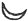
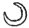
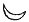
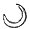

  
[Intangible Textual Heritage](../../index)  [Sub Rosa](../index) 
[Index](index)  [Previous](rrm53)  [Next](rrm55) 

------------------------------------------------------------------------

[Buy this Book at
Amazon.com](https://www.amazon.com/exec/obidos/ASIN/1564591182/internetsacredte)

------------------------------------------------------------------------

p. 454

### CHAPTER THE TWENTY-FOURTH, AND LAST

#### CABALISTIC PROFUNDITIES

IT is an assertion of the occult philosophers that the meaning and
purpose of life is altogether mistaken:--necessarily--that is, in the
'Necessity of Things'--mistaken. That, inasmuch as *he lives*, man is
incapacitated for pronouncing upon the *nature of his life;* being
it--*itself*. He being as a 'Liver'--'It'--(i.e. 'Life', 'Itself').
Philosophy and common sense take it for granted that life needs
consciousness, or some form in which the consciousness may be, in order
that the liver may 'live'. Abstract philosophy asserts that the liver
(living), UNLIVES (in the true sense), *for the very purpose of living*.
In other words, it is concluded that, as man is the 'thing seen', the
individual cannot ever go out of himself, 'to see himself'; that the
'judged at the bar' cannot cease his character to become another
character, and thus 'change places' with his judge, and thus become the
judge on the bench, going out of 'himself', to become 'something other'
than himself, and to judge of what he is, himself. Now this, obviously,
cannot be in common-sense, or in any sense. Thus, this philosophy is
applied in the hermetic sense. The alchemists contended that it is
possible (by art) to obtain out of the boundless, holy, unappropriated
eternal Youth of Nature, a wherewithal, by means of which to 'wreak'--to
use a strange word. Thus there could be miraculous renewal, even out of
the powers of nature. No one knows the purposes

p. 455

of God, nor can any one limit the powers of God.

'*Angelicarum* animarum *revolutionem*, quanquam ad terrestrem regionem
proprie, dictam haud pertingit, ad superiorem tamen partem mundi
*Asiathici* et atmosphœram extendi. Nec tamen nisi parcius et
compendiosius hisce de rebus egimus in *Cabbala Philosophica;* in
*Geneseos*, Cap. 2 & 3.

Animas, quæ non *sua* quidem culpa, laborant, sed *Divino* quodam
*Fato*, in mundum *Asiathicum* delabuntur. Divina quadam vi munitas ac
agitatas tuto certoque in mundum Aziluthicum reverti.

Animam *Messiæ* in mundo Aziluthico tan tum profecisse et tam arcto
amore ac unione cum Divino Intellectu, sive æterno *Logo* coaluisse ut
tandem summo plane gradu *Aziluthico* vel potius *Hyperaziluthico*, et
si scholastici loqui liceat Hypostatico, cum eo unitus esset, adeo ut
Anima *Messiæ* et Divinus *Logos* unafieret ‏פרעוף‎, i.e. unapersona (ut
anima et corpus unus Homo) quæ recte appellanda esset Filius DEI.

*Electrum* vero in *medio Ignis* est Elementum Divinum cælestis vortices
materiæ inclusum et interspersum.'

\*     \*     \*     \*     \*

'Upward of the "server" or of the heavenly-assisted influences.' Sphara
Litera (M) signata, representat Mundum Briathicum, ubi observanda.

<table data-border="1">
<colgroup>
<col style="width: 20%" />
<col style="width: 20%" />
<col style="width: 20%" />
<col style="width: 20%" />
<col style="width: 20%" />
</colgroup>
<tbody>
<tr class="odd">
<td data-valign="top">
 
</td>
<td data-valign="top">
(<em>Sephiroth</em>)
</td>
<td data-valign="top">
(<em>Nomina</em>)
</td>
<td data-valign="top">
(<em>Angeli</em>)
</td>
<td data-valign="top">
(<em>Chori Angelorum</em>)
</td>
</tr>
<tr class="even">
<td data-valign="top">
1.
</td>
<td data-valign="top">
Kether
</td>
<td data-valign="top">
‏אהיה‎
</td>
<td data-valign="top">
Jehuel
</td>
<td data-valign="top">
Seraphim.
</td>
</tr>
<tr class="odd">
<td data-valign="top">
2.
</td>
<td data-valign="top">
Chochmah
</td>
<td data-valign="top">
‏אה֗הי‎
</td>
<td data-valign="top">
Raphaël
</td>
<td data-valign="top">
Ophanim.
</td>
</tr>
<tr class="even">
<td data-valign="top">
3.
</td>
<td data-valign="top">
Binah
</td>
<td data-valign="top">
‏אה֗ה‎
</td>
<td data-valign="top">
Cherubiel
</td>
<td data-valign="top">
Cherubim.
</td>
</tr>
<tr class="odd">
<td data-valign="top">
4.
</td>
<td data-valign="top">
Daath
</td>
<td data-valign="top">
‏היה֗א‎
</td>
<td data-valign="top">
Schemuel.
</td>
<td data-valign="top">
 
</td>
</tr>
<tr class="even">
<td data-valign="top">
5.
</td>
<td data-valign="top">
Chesed
</td>
<td data-valign="top">
‏הה֗יא‎
</td>
<td data-valign="top">
Zadkiel
</td>
<td data-valign="top">
Schinanim.
</td>
</tr>
<tr class="odd">
<td data-valign="top">
6.
</td>
<td data-valign="top">
Gebhurah
</td>
<td data-valign="top">
‏הה֗אי‎
</td>
<td data-valign="top">
Tarschisch
</td>
<td data-valign="top">
Tarschischim. p. 456
</td>
</tr>
<tr class="even">
<td data-valign="top">
7.
</td>
<td data-valign="top">
Tiphereth
</td>
<td data-valign="top">
‏הא֗הי‎
</td>
<td data-valign="top">
Chasmel: alii
</td>
<td data-valign="top">
Chaschmalin.
</td>
</tr>
<tr class="odd">
<td data-valign="top">
8.
</td>
<td data-valign="top">
Nezach
</td>
<td data-valign="top">
‏הא֗יה‎
</td>
<td data-valign="top">
Metatron 
Usiel
</td>
<td data-valign="top">
Malachim.
</td>
</tr>
<tr class="even">
<td data-valign="top">
9.
</td>
<td data-valign="top">
Hod
</td>
<td data-valign="top">
‏היא֗ה‎
</td>
<td data-valign="top">
Chasmel
</td>
<td data-valign="top">
Bene Elohim.
</td>
</tr>
<tr class="odd">
<td data-valign="top">
10.
</td>
<td data-valign="top">
Jesod
</td>
<td data-valign="top">
‏יאה֗ה‎
</td>
<td data-valign="top">
Zephaniah: 
alii Jehuel
</td>
<td data-valign="top">
Ischim.
</td>
</tr>
<tr class="even">
<td data-valign="top">
11.
</td>
<td data-valign="top">
Malchuth
</td>
<td data-valign="top">
‏יה֗ה֗א‎ 
‏יהאה‎ 
‏אל טדי‎
</td>
<td data-valign="top">
Michaël
</td>
<td data-valign="top">
Arelim.
</td>
</tr>
</tbody>
</table>

FINIS

'Soli deo gloria per Christum.'

'*Kabbala Denudata seu doctrina Hebræroum Transcendentalis et
Metaphysica atque Theologia scriptum Omnibus Philologis, Philosophis,
Theologis omnium religionum, atqu: Philo-Chymicis*. Sulzbaci, Typis
Abrahami Lichtenthalbri--1677.'

*Extracts from the Cabala*

THE 'SECOND RUIN'

In which Second Ruin the origin of the strangely great, strangely
mysterious religion of the first Buddhism, or first Buddhistic (or more
properly Bhuddhistic) system is to be found.

'When the old primæval world was ruined.'

'‏הוה‎ chavvah. R. Moscheh inquit, sic appellari Malchuth, quia est vere
est Mater omnis viventis, et uxor Adami primi sub mysterio ‏מה‎ to quod
refert numerum ‏ארם‎. *Pardes. Tr.*, 23, c. 8.

'‏חופה‎ *Thalamus, vel cælum nuptiale*, sub quo sponsus et sponsa
consecrantur. Kabbalistæ totum systema Aziluthicum in Chuppah
præfigurant. Kether enim est Tectum. Chocmah Parietes; Binah ostium;
Chesed, Gebburah, Nezach et Hod quasi brachia in

p. 457

introitu Thalami constituta; Tiphereth et Malchuth sponsus et sponsa
intra Thalamum per Jesod, qui est Paranymphus. *Pardes. Tr.*, 23, c. 8.
Kabbala Denudata, p. 338.'

Morum trium est terra, de qua ibidem; sicut trium nominum receptaculum
est Adonai, a quo omnium judiciorum fit executio. Hinc intelligitur
mysticum illud *Genes*, 42, vers. 33. Vir ‏אר֞ני האר֞ץ‎ Dominus terræ.
*Conf. Jehosch*., 3, vers. 11.

'*Arca*, est Malchuth: unde in eam ingressus dicitur Noach, i.e. *Jesod.
Gen.*, 6, 9, *Pard*.

'Duodecim ergo signacula Tetragrammati et 4 vexilla eorum sunt hæc:
Vexillum primum; vexillum secundum; vexillum tertium; vexillum quartum.

'Duodecim autem Tribus in hæc vexilla distribuuntur. Vexillum 1.
Juhudah, Jissaschar, Sebulon. Vexillum 2. Reuben, Schimeon, Gad.
Vexillum 3. Ephraim, Menanche, Binjamin. Vexillum 4. Dan, Asser,
Napthali.

'Duodecim vero menses cum 12. Signis et limitibus Zodiaci in 4
Quadrantibus anni ita locantur.

'‏דר‎ Incola inhabitans. Omnium interpretum consensu vocatur Malchuth.
Et in Schaare Zedek additur ratio, quod sit ‏דירה‎ hospitium
Tetragrammati Tiphereth, vel quod habitet in tonos sicut scriptum est:
*Lev*., 16, 16, qui commoratur cum eis in medio immunditiarum eorum. R.
Moscheh autem dicit, ‏דר‎ esse nomen Lapidis pretiosi; item spinarum et
tribulorum. Atqui sit et hæc mensura se habet, quippe a qua provenit
bonum et malum Dicetque quod a ‏דר‎ venit vox ‏דרזם‎ meridies. Ipse
autem R. Moscheh hanc vocent applicat ad Binah, in Malchuth ergo illius
respectu erit. *Pard. Tr.*, 23, c. 4.' *Kabbala Denudata*. Ed. 1677.
Salzbuch.

'Cerva amorum. *Prov*., 5, 19. Ita vocatur Malchuth potissimum ob
mysterium *novilunii* quando

p. 458

sc. ista in altu porrigit Cornua, quæ sint Cornua. Hod gloriosa in ipsa
apparentia quando nova sit h. m. 
: aliquando tamen cornu unum altius est altero h. m.
 : sit tradit R. Schimeon
ben Jochai in Raja Mehimna, hac adjecta ratione: Hæc variare secundum
diversitatem renovationis. Vel enim æqualis sit ab utroque loco: et tunc
cornua equalem habent altitudinem. Si vero a parte plus accipit, ita ut
hæc sinistræ prævaleat, tunc cornu unum elevatius est altero: atque tunc
vocatur *cerva amorum*, ob mysterium amoris et Chesed seu benignitatis
in ipsa prævalentis. Si autem sinistrum prævalet latus, vocatur ‏הטחר‎:
‏אלת‎ *cerva nigricans* seu diluculi caliginosi. *Ps*., 22, 1, nim. ob
nigredinem et anxietatem cui subjecta est in exilio.'

'Lurking principles in the physiology of the human construction.'
Extracted from *Cabala*: ‏חבעלת״‎ Rosa. Est Schechinah, juxta *Cant*.,
2, 1. Ratio datur in *Sohar Sect. Æmor*, quod sicut Rosa crescit ad
aquas, et emittit odorem bonum, sic Malchuth hoc gaudeat nomine, cum
influxum affugit a Binah, quæ bonum elevat odorem. Item: quod tunc sic
vocetur, cum copulari desiderat cum Rege: cum vero Eidem jam adhæret per
oscula, nominantur ‏טוטנח‎ Crinorrhodon; juxta *Cant*. 5, 13. *Pardes
Tractat*., 2, 3, c. 8. *Kabbala Denudata*. Ed. 1677. Salzburg. P. 333.

'Sed a muris versus exteriora sunt turmæ malignæ ad latus sinistrum, non
quidem supra, sed infra tantum. Et caput omnium catervarum malarum est
Samaël: et illæ omnes sunt autores jurgiorum et odii, et non pertinent
ad habitatores atrii Regii; sed extra degunt extra tertium aggerem et
extra muros, qui circum castra. Et huc pertinet illud *Num*., 5, 2, de
exclusione Leprosorum, fluentium; et aliorum immundorum; quæ sunt tres
catervæ. Isti dicuntur

p. 459

inquinare l. c. attendunt enim, quam accuratissime sicubi peccatis se
polluant homines, atque turn in supernis eos accusant. Atque sic dicitur
*Psal*., 104, 4. Faciens angelos suos spiritus, ministros suos ignem
flagrantem. Hinc Aqua ad El, Ignis ad Elohim, Aër ad Tetragrammaton, et
Terra ad Adonai refertur. Ordinem reperies *Gene*., 1, 2, ubi inter
tenebras (quibus Ignis æquipollet) et aquas, ferri dicitur spiritus, ut
inter Elohim et El est Tetragrammaton. Receptaculum autem quod a ‏דר‎
veniat vox ‏דרום‎ meridies. Ipse autem R. Moscheh hanc vocent applicat
ad Binah, in Malchuth ergo illius respectu erit. *Pard. Tr.*, 23, c. 4.
*Kabbala Denudata*. Ed. 1677. Salzbuch.

'Cerva amorum, *Prov*., 5, 19. Ita vocatur Malchuth potissimum ob
mysterium *novilunii* quando sc. ista in altu porrigit Cornua, quæ sint
Cornua Hod gloriosa in ipsa apparentia quando nova sit h. m.  : aliquando tamen cornu unum
altius est altero h. m.  :
Sit tradit R. Schimeon ben Jochai in Raja Mehimna, hac adjecta ratione:
Hæc variare secundum diversitatem renovationis. Vel enim æqualem accipit
influxum a dextra et a sinistra, et renovatio æqualis sit ab utroque
loco: et tunc cornua equalem habent altitudinem. Si vero a parte dextra
plus accipit, ita ut hæc sinistræ prævaleat, tunc cornu unum elevatius
est altero; atque tunc vocatur *cerva amorum*, ob mysterium amoris et
Chesed seu benignitatis in ipsa prævalentis. Si autem sinistrum prævalet
latus, vocatur: ‏השחר‎: ‏אלט‎ *cerva nigricans* seu diluculi
caliginosi.--*Ps*., 22, 1, nim. ob nigredinem et anxietatem cui subjecta
est in exilio.'

Pairing (human) is synthesis--it is the union of 'Half-Sex', Man (so
assumed in this abstract sense), and 'Half-Sex', Woman (so assumed,
also, in this abstract sense). The union of these 'Two' half-sexes is
the establishment of a 'Whole' Sex--

p. 460

\[paragraph continues\] Hermaphrodite:
(Hermes-Aphrodite. Venus-Mercury). The mechanical definition of the
exercise of Sex is power of blissful *protrusion;* human
organic-advance; willed, conscious magnetism (for an end):--with climax
of dissolution and destruction (in the end).--Perishing as in the
'flower' of this 'stalk'. Thus Cornelius Agrippa and Paracelsus--thus
the mystic anatomists, like Fludd and Van Helmont. Thus, the
Mythologists say that the orders are to be taken as identical, although,
in fact, they are directly contradictory. It is these things, which are
set against each other, which constitute the stupendous and irresistible
natural temptation (obtained out of shame or out of denial, and
disgrace), of all this enchanted side of life.

'‏טבור‎ Umbilicus. Est schechinah, quatenus adhuc occulta; Corpus enim
est Tiphereth, et venter Malchuth de parte Binah; sub mysterio ‏הא‎. Sed
Tibbur est notio Jod, quatenus est in ventre et in Tiphereth. Et hoc est
punctum illud, quo fundamentum habet mundus, quod vocant Tibbur seu
medium terræ; nempe punctum Zijon. Et forte Tibbur est *Jesod. Pard.
Tr.*, 23, c. 9. ‏חטוקיהם‎ Ligaturæ illarum.' (*Kabbala*.)

There is nothing in the lower and sensible world, that is not produced,
and hath its image, in the superior world. Since the form of the body,
as well as the soul, is made after the image of the Heavenly Man, a
figure of the forthcoming body which is to clothe the newly descending
soul is sent down from the celestial regions to hover over the couch of
the husband and wife when they copulate, in order that the conception
may be formed according to this model. We have before declared in our
chapter on the mystic anatomy, enlarged upon by Cornelius Agrippa, that
the human 'act' by which the power of perpetuation

p. 461

has been placed in the exercise by man, and has been elevated into the
irresistible natural temptation, is rightly a solemnity or magic
endowment, or celebration to which all nature not assents simply, but
concurs, as the master-key, however blindly or ignorantly, or brutally
often practised. *The Soha*r, iii. 104, a, b, declares that 'At
connubial intercourse on earth, the Holy One (blessed be he) sends a
human form which bears the impress of the divine stamp. This form is
present at intercourse, and, if we were permitted to see it, we should
perceive over our heads an image resembling a human face. And it is in
this image that we are formed. As long as this image is not sent by God,
and does not descend and hover over our heads, there can be no
conception; for it is written 'And God created man in his own image'
(*Gen*. i. 27). This image receives us when we enter the world; it
develops itself with us when we grow; and accompanies us when we depart
this life, as it is written: 'Surely man walked in an image'.

The followers of this secret doctrine of the *Kabbalah* claim for it a
pre-Adamite existence. It is also called the secret Wisdom, because it
was only handed down by tradition through the initiated, and its whole
story indicated in the Hebrew Scriptures by signs which are hidden and
unintelligible to those who have not been instructed in its mysteries.
'All human countenances are divisible into the four primordial types of
faces which appeared at the mysterious chariot-throne in the vision of
the prophet Ezekiel; viz. the face of man, of the lion, the ox, and the
eagle. Our faces resemble these more or less according to the rank which
our souls occupy in the intellectual or moral dominion. Physiognomy does
not consist in the external lineaments, but in the features which are
mysteriously drawn in us.'

p. 462

The following are fragments from the *Cabala*:

'Ad Kether, Mundus Intelligentiæ, Sphæra prima, que dat facultatem
omnibus stellis et circulis.

'Ad Chochmah, sphæra motus diurni.

'Ad Binah, sphæra otava stellarum fixarum, et duodecim signorum
cælestium, cum quibus combinantur duodecim menses.

'Ad Gedulah--Saturnus.

'Ad Gebhurah--Jupiter.

'Ad Tiphereth--Mars.

'Ad Nezach--Sol.

'Ad Hod--Venus.

'Ad Jesod--Mercurius.

'Ad Malchuth--et in medio locatur Terra.

'Figura T. representat Hortum-Eden, ejusque septem mansiones: ubi in
circuitu est murus Paradisiacus et sequuntur septem palatia; in medio
autem arbor Vitæ.

Ut legitur *Deuter*. 30, 15. "Vide, exhibui coram te vitam et bonum,
mortem et malum", etc., added locum *Proverb*, 31, 11, 12. Beatus, qui
intelligit insigne hoc mysterium, quia ex eo potest intelligere
mysterium albedinis et Lunæ a principio ad finem' (pre-eminently
indicative of the mysteries of the Rosicrucians). 'Hinc etiam Lepra
continetur sub mysterio Labani Aramæi. Qui hoc intelligit, etiam capiet
mysterium Lepræ, quæ signum est, quod clausus sit mundus dilectionem
unde Targumice *Lepra* dicitur.'

\*     \*     \*     \*     \*

'These are sexual notions--in fact as such must be everywhere'--'Et
Malchuth, quando locata et alligata est inter Jesod et Binah etiam
vocatur Fœdus. Et hoc est mysterium ‏הפריעה‎ Denudiationis: quia
circumcisio refertur ad Jesod et denudatio ad Malchuth. Et propteria
dicitur: Qui circumcisus est, et non denudatus, idem est, ac si
circumcisus non esset;

p. 463

quia fodicat portam ingressus, quæ est Malchuth, et Ista est denudatio.

'Appetitus bonus et prava concupiscentia. Vid. *Sohar, Sect. Lechlecha*,
57, 227; *Vajera*, 68, c. 269; *Vajischlach*, 95, c. 379; *Toledoth*,
82, c. 325; *Vajischlach*, 101, c. 406; *Vajescheb*, 106, c. 424;
*Mikkez*, III, c. 445 *sqq*., etc., etc. Also *Kabbala Denudata*. Ed.
1677. Salzburg.

'Ignis ‏אש‎ Fire. Cum in viri appellatione, id est in ‏איֹש‎ reperiatur,
‏וֹ‎, quasi dicatur ‏אש וֹ‎ Ignis Joddatus, id est masculinus. Si autem
componantur ambo, inde fit ‏אשיֹה‎ Ignis Dominio.' Et unus quidem Ignis,
remoto omni dubio, est ad dextram; estque *Ignis albus*; Alter autem est
ad sinistram; *Ignis* nemper *ruber*: quæ apparent ex ‏יהׁ‎, ubi Jod
dextrum, He, sinistrum designat. *Pardes Rimmonim Tract*., 23, c. 1, h,
t, Videantur plura de Uxore in Sohar, Part Sect. Breschith, fol. 39.
Col. 154, 155.

'Cum purum non dicatur, nisi respectu prioris impuritatis. Fundamentum
ergo sanctitatis est in Chesed, supra qua Chochmah; cui nomen *sancti*
tribuitur; et hinc per dextram sanctitas venit super omnia. Sed
fundamentum puritatis est in Gebhura; quia igne Gebhuræ omnia
dealbatur.' *Ligaturæ illarum, Trabeationes, Exod*., 27, 10, 11, etc.

'In Tikkunim hoc nomen applicatur ad Hezach et Hod; vel quod se invicem
colligant, ut fiant unum in copula: vel a fulciendo, quod sint
Trabeationes Domus, et Domus firmetur super eas, quatenus. Sunt Jachin
et Boas. Vel quatenus sunt in classe Tiphereth et Malchuth, qui inter
ambas istas uniuntur. Pardes I, c.'

\*     \*     \*     \*     \*

'The exercise of the mysteries.'--

'‏יין‎ Vinum. Hæc vox absolute posita refertur ad Gebhurah. Sed si album
intelligitur inclinare

p. 464

censeatur ad Chesed, cum rubrum sit vis Gebhuræ: Dicitur autem *bonum*,
quando miscetur aquis; subintelligendo aquas Chesed, unde bonum
provenit, ut dictum sub ‏טוב‎. *Eccl*., 7, 12; *Jeches*., 10, 20; *Pard.
Tr.*, 23, c. 10. Vid. *Soh*., Sect. Noach, 54, c. 216; *Lechlecha*, 61,
c. 244; et *Toledoth*, 81, c. 321; *Vajikra*, 5, c. 19; *Schemini*, 17,
c. 67; *Æmor*, 46, c. 182; *Fol*., 48, 192; *Pinchas*, 114, c. 454;
*Debharim*, 123, c. 491.' *Cabala Denudata*. SALZBACH edn., 1677.

'‏סגידּן‎, *quasi clausura*, (et Leprosus ‏מוסגר‎ quasi clausus, sive
quis Leprosus sit simpliciter (primo aspectu, ut nulla inclusione opus
est) sive mundari queat; quod est mysterium magnum. Lepra enim venit ob
linguam malum; quæ omnia clara sunt; omni enim proveniunt e scaturigine
serpentis antiqui, qui causa est, ut claudantur portæ Rachamim. Ille
autem qui intelligit mysteria hæc magna, de comestione Adami ab arbore
cognitionis tempore præputii, etiam intelliget, quare vocetur *Arbor
cognitionis;* et quare vocetur *Boni et Mali*. *Kabbala Denudata*, p.
495. (Edn. 1677.)

 

 

 

THE END

 

\_\_\_\_\_\_\_\_\_\_\_\_\_\_\_\_\_\_\_\_\_  
Butler & Tanner, The Selwood Printing Works, Frome, and London

 

 

------------------------------------------------------------------------

[Next: Plate 1. Ever-Burning Rosicrucian Lamps](rrm55)
