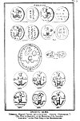

  
[Intangible Textual Heritage](../../index)  [Sub Rosa](../index) 
[Index](index)  [Previous](rrm56)  [Next](rrm58) 

------------------------------------------------------------------------

[Buy this Book at
Amazon.com](https://www.amazon.com/exec/obidos/ASIN/1564591182/internetsacredte)

------------------------------------------------------------------------

 

[  
Click to enlarge](img/pl03.jpg)  
No. 3. GNOSTIC GEMS  

GNOSTIC GEMS.  
Talismans, Magical Charms, and Invocations. (Strictly "Rosicrucian.")  
This Plate is illustrative of the Mysteries of the Gnostics.  
"ABRAXAS," or the Chief Deity in his Manifestations.

------------------------------------------------------------------------

[Next: Plate 4. The Round Table of King Arthur](rrm58)
