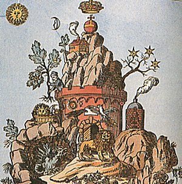

  
[Intangible Textual Heritage](../../index)  [Sub Rosa](../index) 

------------------------------------------------------------------------

[Buy this Book at
Amazon.com](https://www.amazon.com/exec/obidos/ASIN/0892540761/internetsacredte)

------------------------------------------------------------------------

<table width="75%">
<colgroup>
<col style="width: 50%" />
<col style="width: 50%" />
</colgroup>
<tbody>
<tr class="odd">
<td width="50%" data-valign="TOP"> 
 Detail of Geheime Figuren der Rosenkreuzer [1785] (Public Domain Image)</td>
<td width="50%" data-valign="CENTER"><h1 id="with-the-adepts" data-align="CENTER">With the Adepts</h1>
<h5 id="an-adventure-among-the-rosicrucians" data-align="CENTER">An Adventure Among the Rosicrucians</h5>
<h2 id="by-franz-hartmann" data-align="CENTER">by Franz Hartmann</h2>
<h4 id="section" data-align="CENTER">[1910]</h4></td>
</tr>
</tbody>
</table>

------------------------------------------------------------------------

[Contents](#contents)    [Start Reading](wta00)    [Page
Index](pageidx)    [Text \[Zipped\]](wta.txt.gz)

------------------------------------------------------------------------

|                                                                                                                           |
|---------------------------------------------------------------------------------------------------------------------------|
|  |

Franz Hartmann was a 19th century Bavarian physician, theosophist and
writer. He emigrated to the United States, and became an American
citizen, practicing medicine in the then-frontier areas of the Midwest,
including Missouri and Texas. He became interested in Spiritualism, and
joined the Theosophists in 1883 at their enclave in Madras, India, a
refuge similar in spirit to the one he pictures in this book. He became
somewhat disillusioned with Blavatsky, however, and returned to Europe
two years later. He remained skeptical of her methods, and in his later
years tended toward western rather than eastern esotericism. Personally,
however Hartmann remained on good terms with Blavatsky, and was the
first to translate [The Secret Doctrine](../../the/sd/index) into
German.

This, the third of Hartmann's books, and the first with a fictional
setting, begins with a journey in the Alps. The narrator meets a
mysterious dwarf. The dwarf takes him to an Adept who resides in a
hidden Rosicrucian colony high in the mountains. This Adept proceeds to
expound for a hundred and fifty pages on the Rosicrucian way, including
Alchemy, Elementals and the acquisition of psychic powers. There is a
demonstration of the transmutation of silver into gold using a red
powder. The narrator also meets some of other residents, including two
mysterious women who have vivid memories of their past lives, and the
doppelganger of the Adept, who sends the narrator on a hallucinogenic
night journey to the Indian ocean where he consorts with water spirits.

On the whole, the book is a very straightforward read, unlike some of
the other Rosicrucian tales; this is because the framing story is simply
a fictional setting in which to examine the ideas, rather than a dense
allegory. This book serves as a very compact introduction to this
eternally fascinating subject of the 'invisible college'.

------------------------------------------------------------------------

 [Title Page](wta00)  
[Contents](wta01)  
[Preface](wta02)  
[I. The Excursion](wta03)  
[II. The Monastery](wta04)  
[III. Unexpected Revelations](wta05)  
[IV. The Refectory](wta06)  
[V. Recollections of Past Lives](wta07)  
[VI. The Alchemical Laboratory](wta08)  
[VII. The Higher Life](wta09)  
[VIII. Black Magic](wta10)  
[IX. The End](wta11)  
[Appendix. A Rosicrucian Institution in Switzerland](wta12)  
