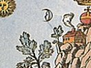

  
[Intangible Textual Heritage](../../index)  [Sub Rosa](../index) 
[Index](index)  [Previous](wta02)  [Next](wta04) 

------------------------------------------------------------------------

[Buy this Book at
Amazon.com](https://www.amazon.com/exec/obidos/ASIN/0892540761/internetsacredte)

------------------------------------------------------------------------

  
*With the Adepts, An Adventure Among the Rosicrucians*, by Franz
Hartmann \[1910\], at Intangible Textual Heritage

------------------------------------------------------------------------

p. 1

# WITH THE ADEPTS

### I

### THE EXCURSION

I AM penning these lines in a little village in the Alpine mountains, in
Southern Bavaria, and only a short distance from the Austrian frontier.
The impressions I received yesterday are still fresh in my mind; the
experiences which caused them were as real to me as any other experience
caused by the events of every-day life; nevertheless, they were of such
an extraordinary character that I cannot persuade myself that they were
more than a dream.

Having finished the long and tedious labour of investigating the history
of the Rosicrucians, and studying old worm-eaten books, mouldy
manuscripts hardly legible from age, passing days and parts of night in
convent libraries and antiquarian shops, collecting and copying
everything that seemed to be of any value for my object in view, and
having at last finished my task, I made up my mind to grant to myself

p. 2

a few holidays, and to spend them among the sublime scenery of the
Tyrolian Alps.

The mountains were not yet free from snow, although the spring had
advanced; but I was anxious to escape the turmoil and noise of the city,
to breathe once more the pure and exhilarating air of the mountain
heights, to see the shining glaciers glistening like vast mirrors in the
light of the rising sun, and to share the feeling of the poet Byron when
he wrote the following verses:--

"He who ascends to mountain tops shall find  
   The loftiest peaks most wrapp’d in clouds and snow;  
 He who surpasses or subdues mankind  
   Must look down on the hate of those below;  
 Though high above the sun of glory glow,  
   And far beneath the earth and ocean spread,  
 Round him are icy rocks, and loudly blow  
   Contending tempests on his naked head,  
 And thus reward the toils which to these summits led."

Boarding the train, I soon arrived at the foot of the hills. Thence I
wandered on foot, highly enjoying the change from the smoky atmosphere
of the crowded streets to the fresh air of the country, pregnant with
the odour of the pines and the daisies, the latter of which were
appearing in places from which the snow was gone. The road led up
through the valley of the river, and, as I advanced, the valley grew
narrower and the sides of the mountain steeper. Here and there were
clusters of farmhouses, and some rustic cottages clinging

p. 3

to the projecting rocks of the mountains as if seeking protection
against the storms which often blow through these valleys. The sun was
sinking down below the western horizon, and gilded the snowy peaks of
the mountains and the brazen cross on the top of the spire of the little
village church, from which tolled the curfew, or, as it is here called,
the *Ave Maria*, when I arrived at the place selected as a
starting-point for my excursions into the mountains.

Finding a hospitable reception in the village inn, I soon retired to
rest, and awoke early in the morning, having been aroused from my sleep
by the tinkling of little bells hanging around the necks of the goats
which were sent out to their pasturage. I arose and stepped to the
window. The shadows of night were fleeing before the approach of the
coming sun; the dawn had begun, and before me in sublime array stood the
grand old peaks of the mountains, reminding me of Edwin Arnold's
description of the view to be had from the windows of Prince Siddârtha's
palace, Vishramvan. There the grand mountains stood:--

"Ranged in white ranks against the blue-untrod  
 Infinite, wonderful--whose uplands vast,  
 And lifted universe of crest and crag,  
 Shoulder and shelf, green slope and icy horn,  
 Riven ravine and splintered precipice,  
 Led climbing thought higher and higher, until  
 It seemed to stand in heaven and speak with gods."

p. 4

Soon I was on the way, and wandered farther up through the valley along
the river-bed; but the river was here merely a small stream, rushing and
dancing wildly over the rocks, while farther down, where it had grown
big, it flowed in tranquil majesty through the plains. The valley
through which I wandered seemed to cut through long ranges of mountains,
and other valleys opened into this. Some of these valleys were known to
me, for I had roamed through them and explored their mysterious
recesses, caves, and forests some twenty years ago; but there was one
mysterious valley which had not yet been explored by me, and which led
towards a high, bifurcated mountain peak, whose summit was said to be
inaccessible, and upon which the foot of no mortal had ever trod.
Towards this valley I seemed to be attracted by some invisible but
irresistible power. I felt as if, in its unexplored depths at the foot
of this inaccessible mountain, the secret and undefined longings of my
heart were to be satisfied; as if there a mystery was to be revealed to
me, whose solution could not be found in books.

The sun had not yet risen above the horizon, and the dark woods to the
right and left were of a uniform colour. As I entered the narrow,
mysterious valley, the path rose gradually, leading through a dark
forest along the side

p. 5

of a mountain. Slowly and almost imperceptibly it ascended; at first it
was near the rushing stream, but as I progressed the roar of the torrent
sounded more and more distant; the foaming stream itself seemed to sink
farther down. At last the forest became thinner, and the dark woods were
now far below me; but before me and above the intervening trees rose the
naked cliffs of the inaccessible mountain. Still the path led up higher.
Soon the distant noise of a waterfall was heard, and I approached again
the bed of the mountain stream, which, however, now seemed to be a mass
of rocks, split into pieces by some giant power, lying about in wild
confusion, while the white foam of the water danced between the cliffs.

Here and there were little islands of soil covered with green
vegetation. They stood like isolated tables in the midst of the
wilderness; for the combined action of water and air had decomposed and
eaten away a great part of their foundations, and they looked like
plates of soil resting upon small pedestals; hard as they are, their
final tumble is merely a question of time, for their foundations are
slowly crumbling away.

My path took me upwards, sometimes nearing the river-bed, sometimes
receding from it, leading sometimes over steep rocks, and again
descending

p. 6

to the bottom of ravines formed by the melting snows. Thus I entered
deep into the mysterious valley, when the first signs of sunrise
appeared upon the cliffs above my head. One of these towering peaks was
crowned with a halo of light, while beyond it the full sunlight streamed
into the valley below. A mild breeze swept through the tops of the
trees, and the foliage of the birch-trees, with which the pine forest
was sprinkled, trembled in the morning air. No sound could now be heard,
except occasionally the note of a titmouse, and more rarely the cry of a
hawk which rose in long-drawn, spiral motions high up into the air to
begin its work of the day.

Now the ash-gray walls and cliffs began to assume a pale silvery hue,
while in the rents and crags of the rock the dark blue shade seemed to
resist the influence of the light. Looking backwards, I saw how the
valley widened, and, far down, the stream could be seen as it wandered
towards the plains. Obtaining more room as it advanced, it spread, and
formed ponds and tanks and little lakes among the meadows. On the
opposite side of the valley rose the tops of high mountains far into the
sky, and between the interstices of the summits, still more summits
arose. The foot of the range was covered with a dark vegetation, but the
mountain sides

p. 7

exhibited a great variety of colours, from the almost black appearance
of the rocks below to the ethereal white of the farthest peaks, whose
delicate hues seemed to blend with the pale blue sky. Here and there the
surface was already covered with spots of light from the rising sun,
falling through the rents of the rocks and through the branches of
trees, foreboding the near arrival of the orb of day. Thus the higher
peaks enjoyed the warm light of the sun long before it shone into the
valley below; but while it shone in its full brightness upon the
mountain tops, the dark shadows in the deep valley became thinner and
began to disappear.

At last the solemn moment arrived, and the sun rose in his sublime
majesty over the tops of the mountains, becoming visible to all. The
shadows fled, and a flood of light penetrated into the valley,
lightening up the dark forest of pines and illuminating the caves of the
rocks. Shining upon the fields of snow and the glaciers, its light was
reflected as in a mirror and produced a blinding effect, but upon the
rocky surface it became softened, and gave it the appearance of a
thousand various hues.

The road turned round a projecting part of the height, and suddenly I
stood in full view of the inaccessible mountain. Between the place where
I stood and the base of the mountain

p. 8

there was a well-nigh treeless plain, and the soil was almost without
any vegetation. Everywhere the ground was covered with stones and rocks,
many of which seemed to have fallen down from the mysterious mountain
and to have been broken in the fall. Here and there was a small spot
covered with moss or small vegetation, sending fantastically-shaped
branches of green upwards along the sides of the inaccessible mountain
towards the bare gray walls of the summit, where giant sentinels of a
forbidding mien stood eternal and immovable, and seemed to defend their
strongholds against the aggressive vegetation, crowding the latter back
into the valley. Thus the everlasting combat which had been raging for
untold ages still continued; but the front lines of the contending
armies changed from year to year. Everlasting, like the eternal truths,
stand the bare gray rocks upon the summits; here and there the
vegetation invades their kingdom, like illusions approaching the realm
of the real; death is victorious; the green spots are buried each year
under the descending rocks; but again life is the victor, for those
rocks decay, and a new life appears upon their withered faces.

In the limestone formation of the Alpine ranges, the rocks decomposed by
wind and rain assume often the most fantastic shapes,

p. 9

which suggest the names which are given to the mountains. Very little
power of imagination is required to behold in the shape of the summits
of the Wilden Kaiser mountain the figure of the Emperor Barbarossa, with
his long red beard, with crown and sceptre, lying in state, unaffected
by the cold of the winter or the summer's heat, waiting to be
resurrected; or we may see in the shape of the Hochvogel the form of an
eagle spreading its wings; in the Widder-horn, the shape of the horns of
a ram, &c. At the base of the mountains and in the valleys the soil is
covered with small loose rocks and piles of sand, in the midst of which
the coltsfoot plant (*Tussilago farfara*) spreads its large green
leaves, and the blue bell-shaped flowers of the monkshood (*Aconitum
napellus*) wave their heads. In some secluded spots grows the celebrated
edelweiss (*Gnaphalium leontopodium*), resembling in size those which
grow on the Popocatepetl in Mexico, and on the Cordilleras of South
America. There may also be found the mountain gentian, the Alpine rose,
the mandrake, *Arnica montana*, the mysterious *Hypericon*, and other
curious plants full of healing powers and strange virtues. Wherever a
sufficient quantity of soil has accumulated to enable a tree to grow, a
larger kind of vegetation appears; but the little crust of earth is not
deep enough

p. 10

to afford a solid footing to large trees. They may grow to a certain
height, but some day a storm will arise and sweep down the mountain
sides, and then the work of destruction begins. Grand old tree-corpses,
whose roots have been torn from the soil, are lying about, their
barkless, bleached branches like so many skeleton arms stretched up
towards heaven, as if they had been calling for help in the hour of
their death, but no help had arrived. Smaller growths of dwarf-trees
surround them, and cover the ground or feed like parasites upon the
substance of the dead.

The spring had advanced; but among these mountains the seasons are
interlaced with each other. The red and yellow leaves painted by autumn
were seen among the green foliage of the stunted pines. The moss
clinging to the steep precipices shows the reddish colour obtained in
the fall, and in many clefts and caverns linger the snow and ice of the
past winter; but above the red and green and the pure white snow the
gray masses of the summits rise in a succession of pillars and points,
with domes and spires and pinnacles, like a city built by the gods;
while in the background spreads the gray or blue canopy of heaven. Thin
streams of water run down from these heights over the precipices, and as
they splash

p. 11

over the projecting rocks they are reduced to vapour before reaching the
ground below. The rocks themselves have been hollowed out, forming large
caves, and indicating how powerful those little veins of water may
become, if swelled by the floods from the melting snows of the summits.

After enjoying for a few minutes the sublimity of this scenery, I
continued my way and approached a little stream coming from a waterfall
in the distance. I wandered along its border; the water was deep, but so
clear that even the smallest pebble could be distinctly seen at the
bottom. Sometimes it appeared as motionless as if it were liquid crystal
penetrated by the rays of the sun, and again, meeting with obstacles in
its way, it foamed in its rocky bed as if in a sudden fit of rage, while
in other places it tumbled in little cascades over pretty pebbles and
stones, forming miniature cataracts which exhibited manifold colours.

In these solitudes there is nothing to remind one of the existence of
man, except occasionally the sawn-off trunk of a tree, showing the
destructive influence of human activity. In some old, rotten, and hollow
trunks rain-water has collected, sparkling in the sun like little
mirrors, such as may be used by water nymphs, and

p. 12

around their edges little mushrooms are growing, which our imagination
transforms into chairs, tables, and baldachinos for fairies and elves.

Where I now stood, the ground was covered with moss, and occasionally
there was to be seen a great, white thistle, whose sharp-pointed leaves
sparkled in the sunlight. At a short distance I saw a small grove of
pines, looking like an island in the desert, and to that grove I
directed my steps. There I resolved to rest and enjoy the beauty of
nature. I laid myself down upon the moss in a place which was
overshadowed by a mighty pine. The music of the mountain stream was
heard at a distance, and opposite to the place where I rested there was
to be seen a waterfall, spreading into a vapour as it fell over the
rocks, and in the vapour appeared the colours of the rainbow. The mist
fell into a basin formed of rock, and from a rent in this basin,
overgrown with moss, the water foamed and rushed, hastening down towards
the valley, to become united with the main body of the river.

For a long time I watched the play of the water, and the longer I
watched the more did it become alive with forms of the most singular
shape. Supermundane beings of great beauty seemed to dance in the spray,
shaking their heads in the sunshine and throwing showers of liquid
silver from their streaming curls and

p. 13

waving locks. Their laughter sounded like that of the falls of
Minnehaha, and from the crevices of the rocks peeped the ugly faces of
gnomes and kobolds watching slyly the dance of the fairies. Above the
fall the current seemed to hesitate before throwing itself down over the
precipice; but below, where it left the basin, it appeared to be
irritated by the impediments in its way and impatient to leave its home;
while far down in the valley, where it became united to its brother, the
river, it sounded as if the latter was welcoming it back to its bosom,
and as if both were exulting over their final union in a glad jubilee.

What is the reason that we imagine such things? Why do we endow "dead
things" with human consciousness and with sensation? Why are we in our
moments of happiness not satisfied to feel that we live in a body, but
our consciousness craves to go out of its prison-house and mix with the
universal life? Is our consciousness merely a product of the organic
activity of our physical body, or is it a function of the universal
life, concentrated--so to say--in a focus within the physical body? Is
our personal consciousness dependent for its existence on the existence
of the physical body, and does it die with the latter; or is there a
spiritual consciousness, belonging to a higher, immortal,

p. 14

and invisible self of man, which is temporarily connected with the
physical organism, but which may exist independent of the latter? If
such is the case, if our physical organism is merely an instrument
through which our consciousness acts, then this instrument is not our
real self. If this is true, then our real self may exist independently
of the latter. If we mentally float along the curves of the mountain
tops, sinking gradually downwards, rising suddenly upwards, and
examining in our imagination the things upon their surface, why do we
feel such a sense of exhilaration and joy, as if we were really there,
but had left our material body behind, because too heavy to accompany
the spirit to the top of the inaccessible mountain? It is true, a part
of our life and consciousness must remain with the physical form, to
enable it to continue to live during our absence and to attend to the
functions of life; but we have read of somnambules and persons in an
ecstatic condition, whose inner spiritual self, with all its powers of
consciousness, sensation, and perception, was absent from their
apparently dead forms, and who visited distant places, going and
returning with the velocity of thought, and bringing descriptions of
such places which were afterwards verified and found to be true.

p. 15

Why do we find life in all things, even in those which are considered
"dead," if we merely put ourselves in a condition in which we can
perceive that they are living? Can there be any dead matter in the
universe? Is not even a stone held together by the "cohesion" of its
particles, and attracted to the earth by "gravitation"? But what else is
this "cohesion" and "gravitation" but energy, and what is "energy" but
the Soul, an interior principle called force, which produces an outward
manifestation called matter; but which must ultimately be identical with
force or substance, or by whatever name we may call a thing of which we
have no conception. If this view is correct, then all things possess
life, all things possess soul, and there may be soul-beings, whose
outward forms are not so gross as ours, and who are therefore invisible
to our physical senses, but may be perceived by our own soul.

In the silence of nature thoughts grow to be waking dreams, and dreams
become visions. I imagined how in this solemn solitude I might remain
all the rest of my life, perhaps sharing my habitation with a few
congenial friends. I imagined how, united by common interests and having
identical objects in view, we might be happy and obtain knowledge
together. Here, far away from the superficiality and shallowness

p. 16

of common life, a far greater clearness of mental perception, a much
deeper concentration of thought, a much higher conception of the truth
regarding the mysteries of nature and man might be obtained. How much
would our senses be sharpened for the perception of external and
internal things! how much would our knowledge of self increase! What
should we care about the tomfooleries of what is called "society"; what
should we care to know of what is going on in that great insane asylum
called "the world"? Here we could live undisturbed within our own
selves, unpestered by the necromantic practices of "society," which
daily and hourly force us to go out from within our own selves, to
appear where we do not desire to be, compel us to act as we do not
desire to act, to bow down before the goddess of fashion, whom we
despise in our hearts.

Would such a life be useful for us and useful for others? If it is true
that the world and we ourselves are made up of ideas, then it is just in
such solitudes that the best conditions might be found in which to grasp
and remodel ideas. Thoughts and ideas cannot be merely illusions; they
must have a real existence, as real and perhaps more lasting than the
objective things of this world; for we know that ideas outlive the death
of the forms in which they are represented; we know

p. 17

that ideas, like other fruits, are born and become mature, and whenever
an idea is mature it appears on the mental horizon of the world, and is
often grasped at the same time by some receptive minds. A man who is
able to grasp and remodel exalted ideas, and give them material
expression, may do much more for the benefit of the world by living
alone and in solitude, than by living among the world where his work is
continually impeded by affairs of minor importance. The ideas which he
shapes will not die with his body. They will be thrown upon the great
mirror, the Astral Light, and be preserved in the memory of the world,
to be grasped and utilised by others.

What is that being we call *man*, after all? What is this living animal
organism of flesh, blood, and bones, nerves and mind, which lives for a
while and then dies, and which the great majority of people esteem so
highly, as if it were their own immortal self, and for the comfort of
which they often sacrifice their self-respect, their dignity, honour,
and virtue? Is it anything else than an animal in whom an intellectual
activity of a higher order than in other animals predominates? Can this
mental activity be the product of the mechanical, chemical, and
physiological activity of gross matter? If not, what is the cause of
this activity, and can this cause exist independently of the form? What
is a

p. 18

man without any intelligence? If intelligence, as it necessarily must
be, is an attribute of the spirit, what is a man without any spirit and
without spiritual intelligence?

While I was meditating about this question a stupid laughter sounded
close by my side. I had been so much engaged with my own thoughts that I
had not noticed the approach of the stranger; but looking up I saw close
by my side one of those half-idiotic human beings whom they call
cretins, and who are often found in the mountainous countries of
Switzerland and Savoy. I was somewhat surprised and startled, and not a
little annoyed at the unwelcome interruption, and I asked him rather
abruptly, "What do you want?"

A broad grin passed over the face of the dwarf, for such he certainly
was, as he answered, "Master says I should guide you to his house." I
was somewhat astonished by his reply, but remembering that the dwarf was
an idiot, and that no intelligent answer was to be expected from him, I
asked, "Who is your master?" His answer was, "Imperator"; and as he
spoke that word a spark of intelligence seemed to shine in his eyes, and
the tone of his voice seemed to indicate that this Imperator, whoever he
might be, was undoubtedly somebody to whom the cretin rendered implicit
obedience. I attempted

p. 19

to ask the dwarf more questions, and to find out who his Imperator was,
or where he lived, but all my efforts to obtain information from one who
was evidently an idiot were unavailing, and he merely grinned and
repeated the words which he had already said before. I therefore at last
made up my mind to go with him and see how the adventure would end.

The cretin walked ahead and I followed him; he led me towards the base
of the inaccessible mountain. While we were walking on, and the idiot
often turned back to see whether I was following him, I had a good
opportunity to study his dress and features. He was not over three feet
high, and evidently a hunchback. His clothing consisted of a brown gown,
to which a hood was attached, which made him appear like a small
Capuchin monk of the order of St. Augustine. An immense big head and a
comparatively large body rested upon very thin and small legs, while his
feet seemed again to be extraordinarily large. Perhaps on account of his
small size and the healthy colour of his face, he appeared to be almost
a child; but this opinion was contradicted by a gray beard of
considerable length which adorned his face. In his hand he carried a
staff made of a dead limb of a tree, which he had evidently picked up on
his way.

------------------------------------------------------------------------

[Next: II. The Monastery](wta04)

