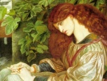

  
[Intangible Textual Heritage](../../index)  [Sub Rosa](../index) 
[Index](index)  [Previous](zan53)  [Next](zan55) 

------------------------------------------------------------------------

[Buy this Book at
Amazon.com](https://www.amazon.com/exec/obidos/ASIN/1595478779/internetsacredte)

------------------------------------------------------------------------

  
*Zanoni*, by Edward Bulwer Lytton, \[1842\], at Intangible Textual
Heritage

------------------------------------------------------------------------

# BOOK V.—THE EFFECTS OF THE ELIXIR.

### CHAPTER I.

     Frommet's den Schleier aufzuheben,  
     Wo das nahe Schreckness droht?  
     Nur das Irrthum ist das Leben  
     Und das Wissen ist der Tod,

    —Schiller, Kassandro.

     Delusion is the life we live  
     And knowledge death; oh wherefore, then,  
     To sight the coming evils give  
     And lift the veil of Fate to Man?

     Zwei Seelen wohnen, ach! in meiner Brust.

     (Two souls dwell, alas! in my breast.)

     ....

     Was stehst du so, und blickst erstaunt hinaus?

     (Why standest thou so, and lookest out astonished?)

    —"Faust."

It will be remembered that we left Master Paolo by the bedside of
Glyndon; and as, waking from that profound slumber, the recollections of
the past night came horribly back to his mind, the Englishman uttered a
cry, and covered his face with his hands.

"Good morrow, Excellency!" said Paolo, gayly. "Corpo di Bacco, you have
slept soundly!"

The sound of this man's voice, so lusty, ringing, and healthful, served
to scatter before it the phantasma that yet haunted Glyndon's memory.

He rose erect in his bed. "And where did you find me? Why are you here?"

"Where did I find you!" repeated Paolo, in surprise,—"in your bed, to be
sure. Why am I here!—because the Padrone bade me await your waking, and
attend your commands."

"The Padrone, Mejnour!—is he arrived?"

"Arrived and departed, signor. He has left this letter for you."

"Give it me, and wait without till I am dressed."

"At your service. I have bespoke an excellent breakfast: you must be
hungry. I am a very tolerable cook; a monk's son ought to be! You will
be startled at my genius in the dressing of fish. My singing, I trust,
will not disturb you. I always sing while I prepare a salad; it
harmonises the ingredients." And slinging his carbine over his shoulder,
Paolo sauntered from the room, and closed the door.

Glyndon was already deep in the contents of the following letter:—

"When I first received thee as my pupil, I promised Zanoni, if convinced
by thy first trials that thou couldst but swell, not the number of our
order, but the list of the victims who have aspired to it in vain, I
would not rear thee to thine own wretchedness and doom,—I would dismiss
thee back to the world. I fulfil my promise. Thine ordeal has been the
easiest that neophyte ever knew. I asked for nothing but abstinence from
the sensual, and a brief experiment of thy patience and thy faith. Go
back to thine own world; thou hast no nature to aspire to ours!

"It was I who prepared Paolo to receive thee at the revel. It was I who
instigated the old beggar to ask thee for alms. It was I who left open
the book that thou couldst not read without violating my command. Well,
thou hast seen what awaits thee at the threshold of knowledge. Thou hast
confronted the first foe that menaces him whom the senses yet grasp and
inthrall. Dost thou wonder that I close upon thee the gates forever?
Dost thou not comprehend, at last, that it needs a soul tempered and
purified and raised, not by external spells, but by its own sublimity
and valour, to pass the threshold and disdain the foe? Wretch! all my
silence avails nothing for the rash, for the sensual,—for him who
desires our secrets but to pollute them to gross enjoyments and selfish
vice. How have the imposters and sorcerers of the earlier times perished
by their very attempt to penetrate the mysteries that should purify, and
not deprave! They have boasted of the Philosopher's Stone, and died in
rags; of the immortal elixir, and sunk to their grave, grey before their
time. Legends tell you that the fiend rent them into fragments. Yes; the
fiend of their own unholy desires and criminal designs! What they
coveted, thou covetest; and if thou hadst the wings of a seraph thou
couldst soar not from the slough of thy mortality. Thy desire for
knowledge, but petulant presumption; thy thirst for happiness, but the
diseased longing for the unclean and muddied waters of corporeal
pleasure; thy very love, which usually elevates even the mean, a passion
that calculates treason amidst the first glow of lust. THOU one of us;
thou a brother of the August Order; thou an Aspirant to the Stars that
shine in the Shemaia of the Chaldean lore! The eagle can raise but the
eaglet to the sun. I abandon thee to thy twilight!

"But, alas for thee, disobedient and profane! thou hast inhaled the
elixir; thou hast attracted to thy presence a ghastly and remorseless
foe. Thou thyself must exorcise the phantom thou hast raised. Thou must
return to the world; but not without punishment and strong effort canst
thou regain the calm and the joy of the life thou hast left behind.
This, for thy comfort, will I tell thee: he who has drawn into his frame
even so little of the volatile and vital energy of the aerial juices as
thyself, has awakened faculties that cannot sleep,—faculties that may
yet, with patient humility, with sound faith, and the courage that is
not of the body like thine, but of the resolute and virtuous mind,
attain, if not to the knowledge that reigns above, to high achievement
in the career of men. Thou wilt find the restless influence in all that
thou wouldst undertake. Thy heart, amidst vulgar joys will aspire to
something holier; thy ambition, amidst coarse excitement, to something
beyond thy reach. But deem not that this of itself will suffice for
glory. Equally may the craving lead thee to shame and guilt. It is but
an imperfect and new-born energy which will not suffer thee to repose.
As thou directest it, must thou believe it to be the emanation of thine
evil genius or thy good.

"But woe to thee! insect meshed in the web in which thou hast entangled
limbs and wings! Thou hast not only inhaled the elixir, thou hast
conjured the spectre; of all the tribes of the space, no foe is so
malignant to man,—and thou hast lifted the veil from thy gaze. I cannot
restore to thee the happy dimness of thy vision. Know, at least, that
all of us—the highest and the wisest—who have, in sober truth, passed
beyond the threshold, have had, as our first fearful task, to master and
subdue its grisly and appalling guardian. Know that thou CANST deliver
thyself from those livid eyes,—know that, while they haunt, they cannot
harm, if thou resistest the thoughts to which they tempt, and the horror
they engender. DREAD THEM MOST WHEN THOU BEHOLDEST THEM NOT. And thus,
son of the worm, we part! All that I can tell thee to encourage, yet to
warn and to guide, I have told thee in these lines. Not from me, from
thyself has come the gloomy trial from which I yet trust thou wilt
emerge into peace. Type of the knowledge that I serve, I withhold no
lesson from the pure aspirant; I am a dark enigma to the general seeker.
As man's only indestructible possession is his memory, so it is not in
mine art to crumble into matter the immaterial thoughts that have sprung
up within thy breast. The tyro might shatter this castle to the dust,
and topple down the mountain to the plain. The master has no power to
say, 'Exist no more,' to one THOUGHT that his knowledge has inspired.
Thou mayst change the thoughts into new forms; thou mayst rarefy and
sublimate it into a finer spirit,—but thou canst not annihilate that
which has no home but in the memory, no substance but the idea. EVERY
THOUGHT IS A SOUL! Vainly, therefore, would I or thou undo the past, or
restore to thee the gay blindness of thy youth. Thou must endure the
influence of the elixir thou hast inhaled; thou must wrestle with the
spectre thou hast invoked!"

The letter fell from Glyndon's hand. A sort of stupor succeeded to the
various emotions which had chased each other in the perusal,—a stupor
resembling that which follows the sudden destruction of any ardent and
long-nursed hope in the human heart, whether it be of love, of avarice,
of ambition. The loftier world for which he had so thirsted, sacrificed,
and toiled, was closed upon him "forever," and by his own faults of
rashness and presumption. But Glyndon's was not of that nature which
submits long to condemn itself. His indignation began to kindle against
Mejnour, who owned he had tempted, and who now abandoned him,—abandoned
him to the presence of a spectre. The mystic's reproaches stung rather
than humbled him. What crime had he committed to deserve language so
harsh and disdainful? Was it so deep a debasement to feel pleasure in
the smile and the eyes of Fillide? Had not Zanoni himself confessed love
for Viola; had he not fled with her as his companion? Glyndon never
paused to consider if there are no distinctions between one kind of love
and another. Where, too, was the great offence of yielding to a
temptation which only existed for the brave? Had not the mystic volume
which Mejnour had purposely left open, bid him but "Beware of fear"? Was
not, then, every wilful provocative held out to the strongest influences
of the human mind, in the prohibition to enter the chamber, in the
possession of the key which excited his curiosity, in the volume which
seemed to dictate the mode by which the curiosity was to be gratified?
As rapidly these thoughts passed over him, he began to consider the
whole conduct of Mejnour either as a perfidious design to entrap him to
his own misery, or as the trick of an imposter, who knew that he could
not realise the great professions he had made. On glancing again over
the more mysterious threats and warnings in Mejnour's letter, they
seemed to assume the language of mere parable and allegory,—the jargon
of the Platonists and Pythagoreans. By little and little, he began to
consider that the very spectra he had seen—even that one phantom so
horrid in its aspect—were but the delusions which Mejnour's science had
enable him to raise. The healthful sunlight, filling up every cranny in
his chamber, seemed to laugh away the terrors of the past night. His
pride and his resentment nerved his habitual courage; and when, having
hastily dressed himself, he rejoined Paolo, it was with a flushed cheek
and a haughty step.

"So, Paolo," said he, "the Padrone, as you call him, told you to expect
and welcome me at your village feast?"

"He did so by a message from a wretched old cripple. This surprised me
at the time, for I thought he was far distant; but these great
philosophers make a joke of two or three hundred leagues."

"Why did you not tell me you had heard from Mejnour?"

"Because the old cripple forbade me."

"Did you not see the man afterwards during the dance?"

"No, Excellency."

"Humph!"

"Allow me to serve you," said Paolo, piling Glyndon's plate, and then
filling his glass. "I wish, signor, now the Padrone is gone,—not," added
Paolo, as he cast rather a frightened and suspicious glance round the
room, "that I mean to say anything disrespectful of him,—I wish, I say,
now that he is gone, that you would take pity on yourself, and ask your
own heart what your youth was meant for? Not to bury yourself alive in
these old ruins, and endanger body and soul by studies which I am sure
no saint could approve of."

"Are the saints so partial, then, to your own occupations, Master
Paolo?"

"Why," answered the bandit, a little confused, "a gentleman with plenty
of pistoles in his purse need not, of necessity, make it his profession
to take away the pistoles of other people! It is a different thing for
us poor rogues. After all, too, I always devote a tithe of my gains to
the Virgin; and I share the rest charitably with the poor. But eat,
drink, enjoy yourself; be absolved by your confessor for any little
peccadilloes and don't run too long scores at a time,—that's my advice.
Your health, Excellency! Pshaw, signor, fasting, except on the days
prescribed to a good Catholic, only engenders phantoms."

"Phantoms!"

"Yes; the devil always tempts the empty stomach. To covet, to hate, to
thieve, to rob, and to murder,—these are the natural desires of a man
who is famishing. With a full belly, signor, we are at peace with all
the world. That's right; you like the partridge! Cospetto! when I myself
have passed two or three days in the mountains, with nothing from sunset
to sunrise but a black crust and an onion, I grow as fierce as a wolf.
That's not the worst, too. In these times I see little imps dancing
before me. Oh, yes; fasting is as full of spectres as a field of
battle."

Glyndon thought there was some sound philosophy in the reasoning of his
companion; and certainly the more he ate and drank, the more the
recollection of the past night and of Mejnour's desertion faded from his
mind. The casement was open, the breeze blew, the sun shone,—all Nature
was merry; and merry as Nature herself grew Maestro Paolo. He talked of
adventures, of travel, of women, with a hearty gusto that had its
infection. But Glyndon listened yet more complacently when Paolo turned
with an arch smile to praises of the eye, the teeth, the ankles, and the
shape of the handsome Fillide.

This man, indeed, seemed the very personation of animal sensual life. He
would have been to Faust a more dangerous tempter than Mephistopheles.
There was no sneer on HIS lip at the pleasures which animated his voice.
To one awaking to a sense of the vanities in knowledge, this reckless
ignorant joyousness of temper was a worse corrupter than all the icy
mockeries of a learned Fiend. But when Paolo took his leave, with a
promise to return the next day, the mind of the Englishman again settled
back to a graver and more thoughtful mood. The elixir seemed, in truth,
to have left the refining effects Mejnour had ascribed to it. As Glyndon
paced to and fro the solitary corridor, or, pausing, gazed upon the
extended and glorious scenery that stretched below, high thoughts of
enterprise and ambition—bright visions of glory—passed in rapid
succession through his soul.

"Mejnour denies me his science. Well," said the painter, proudly, "he
has not robbed me of my art."

What! Clarence Glyndon, dost thou return to that from which thy career
commenced? Was Zanoni right after all?

He found himself in the chamber of the mystic; not a vessel,—not an
herb! the solemn volume is vanished,—the elixir shall sparkle for him no
more! But still in the room itself seems to linger the atmosphere of a
charm. Faster and fiercer it burns within thee, the desire to achieve,
to create! Thou longest for a life beyond the sensual!—but the life that
is permitted to all genius,—that which breathes through the immortal
work, and endures in the imperishable name.

Where are the implements for thine art? Tush!—when did the true workman
ever fail to find his tools? Thou art again in thine own chamber,—the
white wall thy canvas, a fragment of charcoal for thy pencil. They
suffice, at least, to give outline to the conception that may otherwise
vanish with the morrow.

The idea that thus excited the imagination of the artist was
unquestionably noble and august. It was derived from that Egyptian
ceremonial which Diodorus has recorded,—the Judgment of the Dead by the
Living (Diod., lib. i.): when the corpse, duly embalmed, is placed by
the margin of the Acherusian Lake; and before it may be consigned to the
bark which is to bear it across the waters to its final resting-place,
it is permitted to the appointed judges to hear all accusations of the
past life of the deceased, and, if proved, to deprive the corpse of the
rites of sepulture.

Unconsciously to himself, it was Mejnour's description of this custom,
which he had illustrated by several anecdotes not to be found in books,
that now suggested the design to the artist, and gave it reality and
force. He supposed a powerful and guilty king whom in life scarce a
whisper had dared to arraign, but against whom, now the breath was gone,
came the slave from his fetters, the mutilated victim from his dungeon,
livid and squalid as if dead themselves, invoking with parched lips the
justice that outlives the grave.

Strange fervour this, O artist! breaking suddenly forth from the mists
and darkness which the occult science had spread so long over thy
fancies,—strange that the reaction of the night's terror and the day's
disappointment should be back to thine holy art! Oh, how freely goes the
bold hand over the large outline! How, despite those rude materials,
speaks forth no more the pupil, but the master! Fresh yet from the
glorious elixir, how thou givest to thy creatures the finer life denied
to thyself!—some power not thine own writes the grand symbols on the
wall. Behind rises the mighty sepulchre, on the building of which repose
to the dead the lives of thousands had been consumed. There sit in a
semicircle the solemn judges. Black and sluggish flows the lake. There
lies the mummied and royal dead. Dost thou quail at the frown on his
lifelike brow? Ha!—bravely done, O artist!—up rise the haggard
forms!—pale speak the ghastly faces! Shall not Humanity after death
avenge itself on Power? Thy conception, Clarence Glyndon, is a sublime
truth; thy design promises renown to genius. Better this magic than the
charms of the volume and the vessel. Hour after hour has gone; thou hast
lighted the lamp; night sees thee yet at thy labour. Merciful Heaven!
what chills the atmosphere; why does the lamp grow wan; why does thy
hair bristle? There!—there!—there! at the casement! It gazes on thee,
the dark, mantled, loathsome thing! There, with their devilish mockery
and hateful craft, glare on thee those horrid eyes!

He stood and gazed,—it was no delusion. It spoke not, moved not, till,
unable to bear longer that steady and burning look, he covered his face
with his hands. With a start, with a thrill, he removed them; he felt
the nearer presence of the nameless. There it cowered on the floor
beside his design; and lo! the figures seemed to start from the wall!
Those pale accusing figures, the shapes he himself had raised, frowned
at him, and gibbered. With a violent effort that convulsed his whole
being, and bathed his body in the sweat of agony, the young man mastered
his horror. He strode towards the phantom; he endured its eyes; he
accosted it with a steady voice; he demanded its purpose and defied its
power.

And then, as a wind from a charnel, was heard its voice. What it said,
what revealed, it is forbidden the lips to repeat, the hand to record.
Nothing save the subtle life that yet animated the frame to which the
inhalations of the elixir had given vigour and energy beyond the
strength of the strongest, could have survived that awful hour. Better
to wake in the catacombs and see the buried rise from their cerements,
and hear the ghouls, in their horrid orgies, amongst the festering
ghastliness of corruption, than to front those features when the veil
was lifted, and listen to that whispered voice!

....

The next day Glyndon fled from the ruined castle. With what hopes of
starry light had he crossed the threshold; with what memories to shudder
evermore at the darkness did he look back at the frown of its time-worn
towers!

------------------------------------------------------------------------

[Next: Chapter II](zan55)
