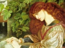

  
[Intangible Textual Heritage](../../index)  [Sub Rosa](../index) 
[Index](index)  [Previous](zan64)  [Next](zan66) 

------------------------------------------------------------------------

[Buy this Book at
Amazon.com](https://www.amazon.com/exec/obidos/ASIN/1595478779/internetsacredte)

------------------------------------------------------------------------

  
*Zanoni*, by Edward Bulwer Lytton, \[1842\], at Intangible Textual
Heritage

------------------------------------------------------------------------

### CHAPTER VI.

     Quel est l'egarement ou ton ame se livre?  
     La Harpe, "Le Comte de Warwick," Act 4, sc. 4.

     (To what delusion does thy soul abandon itself?)

Alas, Zanoni! the aspirer, the dark, bright one!—didst thou think that
the bond between the survivor of ages and the daughter of a day could
endure? Didst thou not foresee that, until the ordeal was past, there
could be no equality between thy wisdom and her love? Art thou absent
now seeking amidst thy solemn secrets the solemn safeguards for child
and mother, and forgettest thou that the phantom that served thee hath
power over its own gifts,—over the lives it taught thee to rescue from
the grave? Dost thou not know that Fear and Distrust, once sown in the
heart of Love, spring up from the seed into a forest that excludes the
stars? Dark, bright one! the hateful eyes glare beside the mother and
the child!

All that day Viola was distracted by a thousand thoughts and terrors,
which fled as she examined them to settle back the darklier. She
remembered that, as she had once said to Glyndon, her very childhood had
been haunted with strange forebodings, that she was ordained for some
preternatural doom. She remembered that, as she had told him this,
sitting by the seas that slumbered in the arms of the Bay of Naples, he,
too, had acknowledged the same forebodings, and a mysterious sympathy
had appeared to unite their fates. She remembered, above all, that,
comparing their entangled thoughts, both had then said, that with the
first sight of Zanoni the foreboding, the instinct, had spoken to their
hearts more audibly than before, whispering that "with HIM was connected
the secret of the unconjectured life."

And now, when Glyndon and Viola met again, the haunting fears of
childhood, thus referred to, woke from their enchanted sleep. With
Glyndon's terror she felt a sympathy, against which her reason and her
love struggled in vain. And still, when she turned her looks upon her
child, it watched her with that steady, earnest eye, and its lips moved
as if it sought to speak to her,—but no sound came. The infant refused
to sleep. Whenever she gazed upon its face, still those wakeful,
watchful eyes!—and in their earnestness, there spoke something of pain,
of upbraiding, of accusation. They chilled her as she looked. Unable to
endure, of herself, this sudden and complete revulsion of all the
feelings which had hitherto made up her life, she formed the resolution
natural to her land and creed; she sent for the priest who had
habitually attended her at Venice, and to him she confessed, with
passionate sobs and intense terror, the doubts that had broken upon her.
The good father, a worthy and pious man, but with little education and
less sense, one who held (as many of the lower Italians do to this day)
even a poet to be a sort of sorcerer, seemed to shut the gates of hope
upon her heart. His remonstrances were urgent, for his horror was
unfeigned. He joined with Glyndon in imploring her to fly, if she felt
the smallest doubt that her husband's pursuits were of the nature which
the Roman Church had benevolently burned so many scholars for adopting.
And even the little that Viola could communicate seemed, to the ignorant
ascetic, irrefragable proof of sorcery and witchcraft; he had, indeed,
previously heard some of the strange rumours which followed the path of
Zanoni, and was therefore prepared to believe the worst; the worthy
Bartolomeo would have made no bones of sending Watt to the stake, had he
heard him speak of the steam-engine. But Viola, as untutored as himself,
was terrified by his rough and vehement eloquence,—terrified, for by
that penetration which Catholic priests, however dull, generally
acquire, in their vast experience of the human heart hourly exposed to
their probe, Bartolomeo spoke less of danger to herself than to her
child. "Sorcerers," said he, "have ever sought the most to decoy and
seduce the souls of the young,—nay, the infant;" and therewith he
entered into a long catalogue of legendary fables, which he quoted as
historical facts. All at which an English woman would have smiled,
appalled the tender but superstitious Neapolitan; and when the priest
left her, with solemn rebukes and grave accusations of a dereliction of
her duties to her child, if she hesitated to fly with it from an abode
polluted by the darker powers and unhallowed arts, Viola, still clinging
to the image of Zanoni, sank into a passive lethargy which held her very
reason in suspense.

The hours passed: night came on; the house was hushed; and Viola, slowly
awakened from the numbness and torpor which had usurped her faculties,
tossed to and fro on her couch, restless and perturbed. The stillness
became intolerable; yet more intolerable the sound that alone broke it,
the voice of the clock, knelling moment after moment to its grave. The
moments, at last, seemed themselves to find voice,—to gain shape. She
thought she beheld them springing, wan and fairy-like, from the womb of
darkness; and ere they fell again, extinguished, into that womb, their
grave, their low small voices murmured, "Woman, we report to eternity
all that is done in time! What shall we report of thee, O guardian of a
new-born soul?" She became sensible that her fancies had brought a sort
of partial delirium, that she was in a state between sleep and waking,
when suddenly one thought became more predominant than the rest. The
chamber which, in that and every house they had inhabited, even that in
the Greek isles, Zanoni had set apart to a solitude on which none might
intrude, the threshold of which even Viola's step was forbid to cross,
and never, hitherto, in that sweet repose of confidence which belongs to
contented love, had she even felt the curious desire to disobey,—now,
that chamber drew her towards it. Perhaps THERE might be found a
somewhat to solve the riddle, to dispel or confirm the doubt: that
thought grew and deepened in its intenseness; it fastened on her as with
a palpable and irresistible grasp; it seemed to raise her limbs without
her will.

And now, through the chamber, along the galleries thou glidest, O lovely
shape! sleep-walking, yet awake. The moon shines on thee as thou glidest
by, casement after casement, white-robed and wandering spirit!—thine
arms crossed upon thy bosom, thine eyes fixed and open, with a calm
unfearing awe. Mother, it is thy child that leads thee on! The fairy
moments go before thee; thou hearest still the clock-knell tolling them
to their graves behind. On, gliding on, thou hast gained the door; no
lock bars thee, no magic spell drives thee back. Daughter of the dust,
thou standest alone with night in the chamber where, pale and
numberless, the hosts of space have gathered round the seer!

------------------------------------------------------------------------

[Next: Chapter VII](zan66)
