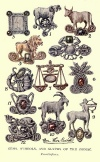

  
[Intangible Textual Heritage](../../index)  [Symbolism](../index) 
[Astrology](../../astro/index)  [Index](index)  [Next](bot01) 

------------------------------------------------------------------------

[Buy this Book at
Amazon.com](https://www.amazon.com/exec/obidos/ASIN/1564594610/internetsacredte)

------------------------------------------------------------------------

[Buy this Book on
Kindle](https://www.amazon.com/exec/obidos/ASIN/B0030IM7KK/internetsacredte)

------------------------------------------------------------------------

  
*The Book of Talismans, Amulets and Zodiacal Gems*, by William Thomas
and Kate Pavitt, \[1922\], at Intangible Textual Heritage

------------------------------------------------------------------------

# THE BOOK OF TALISMANS, AMULETS AND ZODIACAL GEMS

###### by

## WILLIAM THOMAS & KATE PAVITT

### Second and Revised Edition

### With Coloured Frontispiece and Ten Plates

#### LONDON

#### WILLIAM RIDER & SON, LTD.

#### CATHEDRAL HOUSE, PATERNOSTER ROW, E.C.

#### \[1922\]

Scanned, proofed and formatted at Intangible Textual Heritage, September
2008 by John Bruno Hare. This text is in the public domain in the US
because it was published prior to 1923.

 
[  
Click to enlarge](img/front.jpg)  
Frontispiece  

  [  
Click to enlarge](img/cover.jpg)  
Front Cover  

  [  
Click to enlarge](img/title.jpg)  
Title Page  

------------------------------------------------------------------------

[Next: Preface](bot01)

