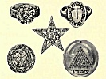

  
[Intangible Textual Heritage](../../index)  [Symbolism](../index) 
[Astrology](../../astro/index)  [Index](index)  [Previous](bot00) 
[Next](bot02) 

------------------------------------------------------------------------

[Buy this Book at
Amazon.com](https://www.amazon.com/exec/obidos/ASIN/1564594610/internetsacredte)

------------------------------------------------------------------------

[Buy this Book on
Kindle](https://www.amazon.com/exec/obidos/ASIN/B0030IM7KK/internetsacredte)

------------------------------------------------------------------------

  
*The Book of Talismans, Amulets and Zodiacal Gems*, by William Thomas
and Kate Pavitt, \[1922\], at Intangible Textual Heritage

------------------------------------------------------------------------

p. vii

### PREFACE

The subject of Talismans and Gems of the
Zodiac covers a wide area, and the difficulty of arriving at a definite
conclusion is increase became of the varying opinions between writers on
these subjects as to the stones referred to, or intended by the
Ancients, complicated still further by the different languages from
which these records have been translated, and where Month or Zodiacal
gems are referred to many of the writers arc obviously unacquainted with
Astrology or Astronomy.

The present volume, being the result of many years of study and
research, it is not easy in all cases to specify the original source of
our information, which has been collected, not only from ancient and
modern writings, but also from personal experience and experiments,
noted at the time they occurred, long before this book was contemplated.
Again, we find that many, and more especially modern authors, quote from
one another in places, and the original source of the information is
obscure; we have, therefore, endeavoured to

p. viii

give as far as possible our authorities, although, owing to the
antiquity of the subject, much is necessarily left to deduction and
conjecture; and it than probable dace, may be unintentional omissions,
to remedy which we give a list of books that we have at different times
consulted and studied with advantage.

We have endeavoured throughout to make the subjects dealt with
interesting as possible, believing that the symbols expressing the
faiths of bygone days term the basis of occult forces, a proper
understanding of which is becoming more and more recognised by
scientists as necessary in the interests of progress at the present day.

It will be noticed that many of the gems have similar qualities
attributed to them which, according to the ancient authorities, were
specifically arranged for the benefit of those types whose planetary
aspects brought them into harmony with the particular stone specified.

With regard to characteristics dealt with in the hind part of the book,
this must be regarded as general, and liable to variation according to
the remaining Planetary influences, which would be indicated in a
horoscope. With this proviso, the information given will be found
reliable and very helpful in giving a knowledge of our n dispositions
and those of our friends and associates

p. ix

and should pave the way to a sympathy and understanding impossible
without this knowledge. It will also afford a simple and easy means of
at least proving there is something in Astrology, and if interest is
aroused the fullest information may be obtained by a study of the books
mentioned, dealing with the subject.

We have greatly benefited from the assistance given as by Mrs. G. M.
Walker in lending us scarce and valuable books for reference, and by G.
H. Greenop, Esq., kindly translating many old Greek and Latin writings;
we should also like to acknowledge our obligations to the Directors of
the British Museum for the facilities given in obtaining information,
and their permission to make drawings from the actual Talismans in their
collections.

WM. THOS. PAVITT

17, HANOVER SQUARE. LONDON W.  
               3*rd* *August*, 1914.

------------------------------------------------------------------------

[Next: Contents](bot02)

