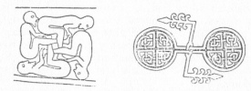
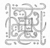

  
[Intangible Textual Heritage](../../index)  [Symbolism](../index) 
[Index](index)  [Previous](mosy01)  [Next](mosy03) 

------------------------------------------------------------------------

[Buy this Book at
Amazon.com](https://www.amazon.com/exec/obidos/ASIN/048641437X/internetsacredte)

------------------------------------------------------------------------

  
*The Migration of Symbols*, by Goblet d'Alviella, \[1894\], at
Intangible Textual Heritage

------------------------------------------------------------------------

p. xxiv

### POSTSCRIPTUM.

At the last moment of going to press I have chanced upon three
remarkable variants of the *swastika* which the Count Goblet d’Alviella
wishes me to reproduce here. The first is from a sepulchral stone at
Meigle in Perthshire, and the second, which is a sinister *swastika*,
from a Cross at St. Vigeans in Forfarshire.

 
[  
Click to enlarge](img/_02400.jpg)

Both these are illustrated in Stuart's *Sculptured Stones of Scotland*.
The third is from one of the old Mahometan buildings of the Mo(n)gol
period at Lahore.

 
[  
Click to enlarge](img/_02401.jpg)

This is also ignorantly rendered as the inauspicious *suwastika;* and
twisted into a legend, which I read as, *ya Fattah*, "O Opener,"
"Beginner," "Leader," "Victorious," "Conqueror," and so forth.

Geo. B.

------------------------------------------------------------------------

[Next: Contents](mosy03)
