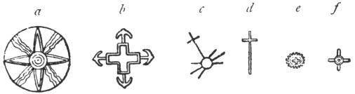
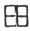
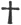
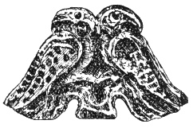
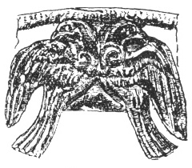

  
[Intangible Textual Heritage](../../index)  [Symbolism](../index) 
[Index](index)  [Previous](mosy04)  [Next](mosy06) 

------------------------------------------------------------------------

[Buy this Book at
Amazon.com](https://www.amazon.com/exec/obidos/ASIN/048641437X/internetsacredte)

------------------------------------------------------------------------

  
*The Migration of Symbols*, by Goblet d'Alviella, \[1894\], at
Intangible Textual Heritage

------------------------------------------------------------------------

p. 10 p. 11

# THE MIGRATION OF SYMBOLS.

### CHAPTER I.

#### ON SYMBOLS COMMON TO DIFFERENT RACES.

Identity of certain images in the symbolism of
different races.—On spontaneous coincidences in the applications of the
symbolical faculty.—The Cross apart from Christianity.—St. Anthony's
Cross *potencée*.—The fight between the eagle and the serpent.—Readiness
with which symbols are transmitted from nation to nation.—Principal
causes of their diffusion.—The complexity and singularity of identical
symbols is a presumption in favour of their unity of origin.—The
*triscèle*.—The Double-headed Eagle.—The Hand of Providence.—Information
supplied by identity of meaning and use.—The Lotus-flower.

The variety of symbols seems at first to
be as boundless as the combinations of the human imagination. It is not
uncommon, however, to discover the same symbolical figures amongst races
the furthest apart. These coincidences can hardly be explained by
chance, like the combinations of the kaleidoscope. Except in the case of
symbols found amongst peoples who belong to the same race, and who,
consequently, may have carried away from their common cradle certain
elements of their respective symbolism, there are only two possible
solutions: either these analogous images have been conceived
independently, in virtue of a law of the human mind, or else they have
passed from one country to another by a process of borrowing.

p. 12

There exists a symbolism so natural that, after the manner of certain
implements peculiar to the stone ages, it does not belong to any
definite region or race, but constitutes a characteristic feature of
humanity in a certain phase of development.

To this category belong, for example, the representations of the sun by
a disc or radiating face, of the moon by a crescent, of the air by
birds, of the water by fishes, also by a wavy line, and so forth.

Perhaps certain more complicated analogies should be added to these,
such as the symbolizing of the different phases of human existence by
the life of the tree, the generative forces of nature by phallic
emblems, the divine triads, and generally every triple combination whose
members are equal, by the equilateral triangle, and, lastly, the four
main directions of space by a cross.

What theories have not been built upon the existence of the equilateral
cross as an object of veneration amongst nearly all the races of the Old
and the New World! Of late years orthodox writers have protested with
good reason against the claim of attributing a pagan origin to the Cross
of the Christians because earlier creeds had included cruciform signs in
their symbolism. And the same objection might be urged against those who
seek for Christian infiltrations in certain other religions under the
pretext that they possess the sign of the Redemption.

When the Spaniards took possession of Central America, they found in the
native temples real Crosses, which were regarded as the symbol,
sometimes of a divinity at once terrible and beneficent —Tlaloc,
sometimes of a civilizing hero, white and bearded—Quetzacoalt, stated by
tradition to have come from the East. They concluded from this that the
Cross had reached the Toltecs through

p. 13

\[paragraph continues\] Christian missions
of which all trace was lost; and, as legend must always fix upon a name,
they gave the honour to St. Thomas, the legendary apostle of all the
Indies. Although this proposition has again found defenders in recent
congresses of Americanists, it may be regarded as irrevocably condemned.
It has been ascertained beyond all possibility of future doubt that the
Cross of pre-Columbian America is a kind of compass card, that it
represents the four quarters whence comes the rain, or rather the four
main winds which bring rain, and that it thus became the symbol of the
god Tlaloc, the dispenser of the celestial waters, and, lastly, of the
mythical personage known by the name of Quetzacoalt. [1](#fn_16)

By a similar process of reasoning the Assyrians

 

Fig. 1. Ideogram of
Anu.  
(Rawlinson. *Western Asia Inscriptions*,
vol. ii. pl. 48, fig. 30 obv.)

were led to represent by an equilateral cross their god of the sky, Anu.
The ideogram of this god is formed by four cruciform characters which
radiate at right angles from the circle or lozenge denoting the sun in
the cuneiform inscriptions. Is

p. 14

not the sky indeed the space in which light radiates?

It is proper to remark that amongst the Assyrians themselves the
equilateral cross, as denoting the main directions in which the sun
shines, became also the symbol of that luminary, and consequently, here
again, of the god who governs it. It was the same with the Chaldæans,
the Hindus, the Greeks, the Persians, and perhaps with the Gauls, and
the ancient civilizers of Northern America (fig. 2).

 

Fig. 2. Solar
Crosses [1](#fn_17).

In China, the equilateral cross inscribed in a square   represents the earth, and
according to Mr. Samuel Beal, a saying is met with there to the effect
that "God made the earth in the form of a cross." [2](#fn_18)

Egyptian writing utilizes among its signs the Greek and even the Latin
Cross. In connection

p. 15

with this we find in a recent article by the Abbe Ansault a
characteristic example of the readiness with which one may go astray in
the identification of symbols, if satisfied with a merely superficial
resemblance. On the famous Damietta stone, the Greek words Πτολεμαῖος
Σωτήρ, "Ptolemy the Saviour," are rendered by the demotic characters
forming the equivalent of Πτολεμαῖος, followed by the sign  ; from which the author
concludes that the term Saviour being rendered by a cross, this sign was
with the Egyptians, an allusion to the future coming of the
Redeemer. [1](#fn_19) Unhappily for this
ingenious interpretation, M. de Harlez, who has taken the trouble to
refute M. Ansault's article, points out to him that in

 

Fig. 3. Hieroglyph of the
Hammer  
(E. Coemans, *Manuel de langue
égyptienne*, p. 47, § xviii.)

demotic the sign   is the
simplest form of a hieroglyph representing a hammer, or a boring tool,
and is usually employed to express the idea of grinding, avenging, and
by amplification, "the Grinder," "the Avenger," a not uncommon epithet
of Horus, and some other gods. [2](#fn_20)

Even in the presence of an analogy of signification combined with a
resemblance of forms, it is well to look twice before identifying
symbols. The St. Anthony's Cross (*croix potencée*, literally
"gibbet-cross")   is
found, with almost the same symbolical signification, in Palestine, in
Gaul, and in ancient Germany, in the Christian Catacombs, and amongst
the ancient inhabitants of Central

p. 16

\[paragraph continues\] America. Among the
Phœnicians and their kindred races, it was the character known by the
name of *tau*, and from an oft quoted passage in Ezekiel [1](#fn_21) we learn that it was accounted a sign of
life and health. Among the Celts and the ancient Germans it was the
representation of the celestial Two-headed Mallet which was accounted an
instrument of life and of fecundity. Amongst the early Christians it was
a form sometimes given to the Cross of Christ, itself called the Tree of
Life. [2](#fn_22) In Central America where,
according to M. Albert Réville, the Cross was surnamed the Tree of
Plenty, [3](#fn_23) it assumed also the form of
the *tau*.

Are we to conclude from this that all these *gibbet-crosses* have the
same origin and the same aim? That would be a rather hasty conclusion.
The symbolical signification of the *tau* is explained by its
resemblance to the *Key of Life* or *crux ansata* of Egypt, so widely
diffused throughout all Western Asia. The Double Hammer of Thor and of
Tarann is a symbol of the lightning, and, for this reason, could not
fail to represent the vivifying forces of the storm, according to the
tradition common among the Indo-European nations. [4](#fn_24) Similarly, if in pre-Columbian America,
the Cross became an emblem of fertility, it is, as we have seen, because
it represents the rain-god. As for the early Christians, if they made of
the Cross a symbol of life, it is especially in the spiritual

p. 17

sense; and, if they sometimes gave it the form of the *palibulum*, it
was because such was the instrument employed among the Romans in the
punishment by crucifixion.

 

In the mythology of primitive nations the contest between the sky, or
sun, and the clouds is frequently represented by a fight between an
eagle and a serpent. This subject has been treated more than once in
ancient art. [1](#fn_25) Already in the Homeric
ages it had become a symbol of victory, for we are told in the Iliad
that the Trojans were on the point of abandoning the assault on the
Greek entrenchments through having seen an eagle which held a serpent in
its claws take flight, being wounded by its prey. [2](#fn_26) Now according to the tradition of the
Aztecs, the founding of Mexico is said to have been resolved on owing to
the apparition of an eagle which, perched upon an agave, and with wings
outstretched towards the rising sun, held a serpent in its talons. [3](#fn_27) The first conquerors of Mexico saw therein
an emblem of future greatness, and to the present day this emblem
figures in the arms of the capital. Yet it is unlikely that the Aztecs
had read Homer.

 

On the other hand, the ease with which symbols are borrowed is
indisputable. Represented on the ordinary productions of industry,
favourite subjects with artists, they pass unceasingly from one country
to another, with commodities of commerce and articles of ornament; as
witness the specimens of Hindu, Chinese, and Japanese symbolism and
pictorial art which have penetrated

p. 18

among us with the vases, the fabrics, and all the curiosities of the far
East. The centres of artistic culture have always been foci of symbolic
exportation. Have there not been found even among the "treasures" of our
mediæval churches on the one hand, and among those of Chinese and
Japanese temples on the other, masterpieces of Sassanian art, which
themselves reproduce the symbols of classic paganism? [1](#fn_28)

In olden times soldiers and sailors and travellers of every profession
never left home without taking with them, under some form or another,
their symbols and gods, a knowledge of which they thus spread in remote
parts—bringing back from abroad others in return. Slavery, so largely
known in the ancient world, must likewise have favoured the importation
of symbols through the medium of those innumerable captives whom the
fortune of war, or the chances of piracy, brought everywhere from the
most distant regions, without depriving them of the memory of their gods
and the forms of their worship. Lastly, coins have never failed to
propagate through immense distances the symbols of the nations who put
them into circulation. Gallic coins are nothing but counterfeits of the
Greek coinage of Phillip or Alexander, and even in the *tumuli* of
Scandinavia native coins have been found which roughly imitated the
coinage of Bactria. [2](#fn_29)

Now nothing is so contagious as a symbol unless perhaps a superstition;
they are all the more so when combined together, as they generally were
among the nations of antiquity, who scarcely

p. 19

adopted a symbol without attaching a talismanic value to it. Even to-day
there are tourists who return from Naples with a coral horn, suspended,
according to the sex of the traveller, from the bracelet, or the
watchchain. Do they really believe that they have found a preservative
against the evil eye in this Italian survival of an old Chaldæan symbol?
To many of them it is assuredly only a local curiosity, a trinket, a
souvenir of travel. But there are some amongst the number who let
themselves be influenced, even unconsciously, by the Neapolitan
superstition. "It can do no harm and may perhaps do good" they would be
tempted to reply, in imitation of certain gamblers when bantered about
their *fetiches*.

We have here an argument which is almost universal among polytheistic
populations, where everyone thinks it safe to render homage not only to
his own gods, but also to those of others, and even to unknown
divinities, for do we ever know of whom we may have need in this world,
or in the next? Egyptian *scarabæi* have been found by the thousand from
Mesopotamia to Sardinia, wherever either the armies of the Pharaohs or
the ships of the Phœnicians penetrated. Everywhere too in these
latitudes there have been found native *scarabæi* made in imitation of
those of Egypt, and reproducing with more or less exactness the symbols
which the engravers of the valley of the Nile displayed so lavishly on
the flat side of these amulets. It is thus again that, long before the
diffusion of coins, the pottery, the jewels, the statuettes of Greece
and of Etruria, furnished Central and Western Europe with divine types
and symbolic figures.

 

Are there any indications which enable us to determine whether analogous
symbols have been

p. 20

produced independently, or were derived from the same source?

Intricacy and singularity of forms when they exceed certain limits may
justify the second of these propositions.

We may well suppose that in the desire to symbolize the strength or
activity of superhuman beings, the Egyptians, the Aztecs, the Hindus,
and the Chinese, have been separately led to enrich by several pairs of
arms and legs, or even by several heads, certain figured representations
of their superhuman beings. [1](#fn_30) But does
this hypothesis of an independent origin hold good when, for example, we
see both on the ancient coins of Lycia and in the feudal coat of arms of
the Isle of Man, a figure at once so precise as the *triscèle* or
*triquetra*, those three legs, joined together at the thigh, which
radiate from a central point?

 

Fig. 4. Triscèle on the
Shield of Enceladus.  
(De Witte and Lenormant. *Monuments Céramographiques*, vol.
i., pl. viii.)

There is nothing for it but to ask one's self how this ancient solar
symbol can have passed from one country to the other. The intermediate
stage may perhaps be found in Sicily, where the *triscèle* was used in
the coinage, from the time of Agathocles, to symbolize the configuration
of the island with three promontories. As the Isle of Man also presents
this geographical peculiarity, it is very possible that, at the
commencement of the

p. 21

middle ages, a Norman baron, or even a Crusader, or simple adventurer,
returning to his home after a sojourn in Sicily, applied to his native
country a symbol still living in the classic traditions of the ancient
Trinacria, save that in order to suit the age he added spurs to the
heels. [1](#fn_31)

 

We are familiar with the Double-headed Eagle of the old German empire,
still blazoned on the armorial bearings of Austria and of Russia. What
was the surprise of the English travellers Barth and Hamilton, when, in
exploring Asia

  [  
Click to enlarge](img/fig005.jpg)  
  

Fig. 5. Bas-Relief of
Eyuk.  
(Perrot and Chipiez. *L’Art dans l’antiquité*, vol. iv.,
fig. 343.

\[paragraph continues\] Minor about fifty
years ago, they discovered a Double-headed Eagle of the same type
sculptured in the midst of religious scenes on Pterian bas-reliefs
dating back to the civilisation of the Hittites?

p. 22

It is difficult to admit that, on both sides, there was conceived
spontaneously, on identical lines, a representation of the eagle so
contrary to the laws of nature. M. de Longpérier has solved the enigma
by reminding us that it was only about 1345 that the Eagle with Two
Heads replaced the monocephalous one on the armorial bearings of the
Western Empire. It would seem to have been Flemish princes who, during
the Crusades, appropriated the device from the coins and standards of
the Turkomans, then the masters of Asia Minor. The latter had adopted it
as the symbol of omnipotence, perhaps the *hamka*, the fabulous bird of
Moslem tradition, which carries off the buffalo and the elephant, as the
kite carries off the mouse. "Thus," observes M. Perrot, "there would
seem to have been transplanted into our modern Europe a symbol belonging
originally to an Asiatic creed of the highest antiquity; and by a
singular turn of fortune the Turks saw, at Belgrade and at Lepanto,
their advance towards the West barred by that same eagle which had
conducted them triumphantly along the banks of the Euphrates and the
shores of the Bosphorus." [1](#fn_32)

Perchance the Turkomans themselves had borrowed this symbol from the
sculptures carved by their mysterious predecessors on the rocks of Eyuk
and of Iasili-Kaïa. But it is equally possible that they acquired it
through the medium of the Persians. We find in the collection of M. de
Gobineau an intaglio, attributed by him to the time of the Arsacidæ, on
which is engraved the traditional type of the Double-headed Eagle
holding, as at Eyuk, a hare in each claw.

p. 23

M. de Longpérier observes that if the stem of certain ferns (*Pteris
aquilina*) be cut transversely a fairly accurate image of the
Double-headed Eagle

 

Fig. 6. Arsacian
Intaglio.  
(*Revue Archéologique* of 1894, vol. xxvii., pl. v., No. 391.

is obtained. Now the fern is named in Greek πτέρις or πτερία, as is the
province where the bas-reliefs of Eyuk are found. The learned
archæologist wondered if it was not this similarity which caused the
Double-headed Eagle to be chosen as the symbol of Pteria: [1](#fn_33) but we know now that the bas-reliefs in
question date from a period far earlier than that of the appearance of
the Greeks in this part of the world, and, besides, it is probable that
the Greeks had given a name to the fern before knowing Pteria. The most
that can be admitted is that the resemblance of the Hittite symbol to
the bicephalous figure obtained from the fern led the Greeks to name the
country after the plant.

The Greeks, whom we have seen adopting as a symbol of victory the figure
of an eagle holding a serpent between its talons, sometimes replaced the
serpent by a hare which corresponded with the Hittite scheme. Only they
rejected anything monstrous that the latter might offer, and contented
themselves with faithfully copying nature. [2](#fn_34) India on the contrary seems to have
accepted without hesitation the bicephalous type which Persia probably
transmitted to it. We there find the Double-headed Eagle on ancient
coins, where

p. 24

it holds an elephant instead of a hare, not only in each talon, but also
in each beak. Moor saw in this a representation of Garuda the solar
Eagle which Vishnu rode. In any case we here draw singularly near the
*hamka* of the Turks; and it may even be that the latter derived their
legend of the fabulous bird from some representation of this kind, where
the part of the hare was taken by an elephant, or buffalo.

 

Fig. 7. Ancient Indian
Coin.  
(Moor. *Hindoo Pantheon*, pl. 103, fig.
3.)

It cannot, however, be said that Greece had nothing to do with the
production of this emblem.

M. Clermont-Ganneau has shown how, in the popular iconography, complex
monsters were frequently produced by a false interpretation of groups
formed of separate individuals. There is, for example, an image of
Phœnician origin which shows us Orthros in the form of two dogs
distinctly apart. "Hellenic image makers," he goes on to say, "unite the
two animals, while fable goes still further and endows the imaginary
creature with a third head which it does not always possess in ancient
art." [1](#fn_35) Thus again the Chimæra
originates in the group, so widespread in Lycian art, of a lion
devouring a goat; the two animals having been taken for one by the Greek
copyist. In the same manner the triple Geryon slain by Herakles owes its
existence to a wrong interpretation of the scene, taken originally from
Egypt, in which a king is seen raising his club as if to strike three
barbarians, who are grouped in such a manner as to give the

p. 25

illusion of a single body with three heads, six arms, and six legs.

I had long since surmised a similar origin in the Double-headed Eagle,
when, turning over once more the pages of Schliemann's *Mykenæ*, I
discovered the solution of the problem in some golden *fibulæ* dug up by
the famous archæologist among the tombs of the ancient *Mycenæ* (fig.
[8](#img_fig008) and [9](#img_fig009)). We there find two eagles, as
Schliemann says, "leaning against each other with their whole bodies and
even with their claws while turning their heads in opposite directions."

At Eyuk the two eagles are fused in one. In this instance it is not
Greek mythology which has clumsily interpreted a Phœnician image, but
the Asiatic sculptor who has misunderstood the real meaning of the
Mycenian image.

When, therefore, the Double-headed Eagle changed sides in the thirteenth
century of our era, during the struggle which has waged for more than
thirty centuries between Europe and Asia, it did nothing else than
return, after many wanderings, to its original home.

|                                                                             |                                                                             |
|-----------------------------------------------------------------------------|-----------------------------------------------------------------------------|
|   |   |

Fig. 8, 9. Jewels From
Mykenæ.  
(Schliemann, *Mykenæ*.)

I will cite yet another symbol, come from afar, the Semitic origin of
which is not to be gainsaid; even when we cannot identify all the stages
of the route it followed in order to reach us.

p. 26

Christian symbolism has often represented God the Father, or Providence,
"the Hand of God," by a hand emerging from a cloud. In some of these
figures the finger-tips emit rays of light, "as if it were a living
sun," observes M. Didron in his *Histoire de Dieu;* and a miniature of
the ninth century in the Bibliothèque Nationale of Paris, shows the
Divine Hand in the middle of a *nimbus* encircling a Cross.

 

Fig. 10. The Hand of
God.  
(Didron. *Histoire de Dieu*, p.
32.)

M. Gaidoz has compared this figure with certain Gallic amulets, the
solar Wheels formed of four rays through which a hand passes. [1](#fn_36)

Might not the two symbols have their prototype upon an Assyrian obelisk,
where two hands are shown to issue from a solar Disk, the right open and
exhibiting the palm, the left closed and holding a bow?

 

Fig. 11. Assyrian
Symbol.  
(G. Rawlinson. *The Five Great
Monarchies*, vol. ii. p. 233.)

The representation of the open, or uplifted, hand, intended to typify
the divine might, is, moreover,

p. 27

common to all branches of the Semitic race; it appears already amongst
the Chaldæans, for a cylinder, of Babylonian origin, exhibits an
uplifted hand, which emerges from a pyramidal base, between persons in
an attitude of adoration; this is precisely the type of our "Hand of
Justice."

 

Fig. 12. Chaldæan
Cylinder.  
(Lajard. *Mithra*, pl. xxvii., fig.
5.)

According to M. François Lenormant, the celebrated pyramid of Borsippa
was called "the Temple of the Right Hand," and one of the names of
Babylon was that of "the city of the Hand of Anu," or, what amounts to
the same thing, of "the Celestial Hand." [1](#fn_37)

The hand uplifted towards the sky is an oft repeated image on the *ex
voto* of Carthage, and even at the present time it is figured on native
houses in Palestine and Marocco to ward off evil spirits from the
dwellers therein. [2](#fn_38) Moreover this
symbol passed also to India, where it decorates the

p. 28

pedestal of the Holy Tree in a bas-relief at Bharhut (see [pl.
iv.](mosy11.htm#img_pl04), fig. *h*).

 

In default of adequate proofs drawn from singularity of form, identity
of meaning and of use may afford strong presumptions in favour of the
relationship of symbols.

There would be nothing surprising in Hindus and Egyptians having
independently adopted, as a symbol of the sun, the lotus-flower, which
every morning opens under the first rays of that luminary to close again
at eventide, and which seems to spring up of itself on the surface of
the placid waters. However, the hypothesis of a transmission becomes
very plausible when, in the iconography of the two nations, we see this
flower serving both as a support to the solar gods, Horus and Vishnu,
and figuring in the hand of the goddesses associated with these gods,
Hathor and Lukshmi, the Venuses of Egypt and India. Lastly, this
plausibility becomes a sort of certainty when, on both sides, we find
the lotus employed to interpret the same shade of thought in some
indirect and subtle enough applications of solar symbolism.

It must indeed be remarked that on either side the Lotus-flower
symbolizes less the sun itself than the solar Matrix, the mysterious
sanctuary into which the sun retires every evening, there to acquire
fresh life.

This miracle, which was believed to be renewed every day, was regarded
as the origin of whatever exists. The Egyptians, who believed that the
world had sprung from the liquid element, made the sun to proceed from a
Lotus which one day had emerged from the primordial waters; [1](#fn_39) this they rendered in their iconography by
representing

p. 29

Horus as springing forth from a lotus-shaped calyx held by Hathor. [1](#fn_40) In the same way the Indian sacred books
constantly speak of gods as sprung from the lotus; it is on a golden
Lotus that Brahma appears in the beginning of time, and it is with the
different parts of this plant that he created the world. [2](#fn_41) A Hindu legend, related by Father Vincenzo
de Santa Catarina, states that Brahma keeps watch six months of the year
and sleeps the other six in a Lotus-flower of extraordinary size and
beauty. [3](#fn_42)

Hence a fresh enlargement given to the figurative meaning of the lotus.
The symbol of solar renascence, it became, with the Egyptians, the
symbol of human renascence and, generally, of life in its eternal and
unceasingly renewed essence. On a sarcophagus in the Louvre there is
depicted a *scarabæus* emerging from a Lotus between Isis and Nephthys
in their characteristic attitude of guardians and protectresses of the
dead. [4](#fn_43) Thus were represented both the
sun and the deceased passing through the tomb to renew their existence
in the luminous fields of space. The lotus was even adopted with this
signification in the funeral symbolism of Europe. It is met with again,
not in the Greek traditions relating to the Lotophagi, those fabulous
people who partook of the lotus in order to forget life and its
troubles, but even in the inscriptions on tombstones which are met with,
dating from the latter centuries of Paganism, from Libya to
Belgium. [5](#fn_44)

Renascence has but few attractions for the}

p. 30

\[paragraph continues\] Brahmans, and
still fewer for the Bhuddists. The latter adopted the ancient Flower of
Life but to symbolize, according to their different schools, nature in
the sum of her manifestations—the eternally active matter—the
innumerable worlds which fill space—the Buddha dwelling in each of
them—lastly, the teaching of the Master, that is to say, the means of
escaping from that chain of causes and effects which engenders personal
existence. It is thus that they carried to the confines of Asia *the
Lotus of the Good Law;* and even to-day in the Himalayas there is no
valley so remote that the traveller does not hear everywhere on his
approach, as an utterance of sanctification and of welcome, the mystic
formula: *om mani padmi om*,—"*Oh! the Jewel in the Lotus*."

However, popular traditions and engraved monuments would suffice to
remind us of the ties which unite the Lotus of Buddhism to that of
Egypt. A legend relates that, when the Buddhisattva appears, a
miraculous Lotus springs out of the earth, and he seats himself thereon,
and takes in all the worlds at a glance. [1](#fn_45) Buddha, besides, is everywhere represented
seated on the Lotus-flower like Vishnu and Horus. It is perhaps not
impossible to fix the intermediate stages of this symbolism. The Lotus
passed from Egypt to the monuments of Phœnicia and, towards the eighth
century before our era, to those of Assyria, [2](#fn_46) which in their turn transmitted it to
Persia. Thus, in the sculptures of Phœnicia goddesses are found who hold
in the hand a Lotus-flower, and, in the Sassanian bas-reliefs at
Tagh-i-Bostan, the solar god Mithras stands upon a

p. 31

\[paragraph continues\]
Lotus-flower. [1](#fn_47) Lastly, among the
Mesopotamians and the Persians it is not uncommon to find the Lotus
blossoming on shrubs in which may be recognized either the Sacred Tree
of the Semitic religions, or the Iranian tree which secretes the Elixir
of Immortality. [2](#fn_48)

Nowadays the beautiful rose-blossomed lotus, *Nymphæa Nelumbo*, observed
on the monuments of Egypt, no longer grows in that country in its wild
state, but by a curious coincidence, it has remained in the *flora*, as
in the symbolism, of India. [3](#fn_49)

 

Fig. 13. Caves of
Kanerki.  
(Fergusson and Burgess. *Cave Temples of India*, pl. x., fig.
35.)

\[paragraph continues\] We may add that it
has been imported from India to China and Japan, so that it is still one
of the principal symbolical figures by which at the present day we
recognize the sacred vases and other objects employed in religious
services by the Buddhists of these countries. [4](#fn_50)

------------------------------------------------------------------------

### Footnotes

[13:1](mosy05.htm#fr_16) Albert Reville, *Religions du Mexique, de
l’Amérique centrale et du Pérou*. Paris, 1885.—It appears that in South
America also the Cross was a wind-rose. A Belgian traveller, M. E.
Peterken, relates that he saw in the Argentine Republic a monolith in
the form of a Latin Cross, called by the natives "the Father of the four
winds." (*Congress of Americanists* of 1877, Paris and Luxemburg, 1888.
Vol. i. p. 57.)—In North America the Cross symbolizes both the sun and
the sky. Among the Blackfeet Indians, according to Mrs. Murray Aynsley
(*Transactions of the Quatuor Coronati*, vol. v. p. 82), it represents
the "old man in the sun who rules the winds."

[14:1](mosy05.htm#fr_17) *a*. Within a Disc in
Assyrian bas-reliefs. J. Menant, *Pierres
gravées de la Haute-Asie*, Paris, 1886, vol. ii. p. 71.—*b*. Alternating
with the radiated Disc, on ancient Indian coins. A. Cunningham, *The Bhilsa Topes*, pl. xxxi.,
figs. 8 and 9.—*c*. Surmounting the solar Disc, on a whorl, from Troy.
Schliemann, *Ilios, ville et pays des
Troyens*, Paris, 1885, No. 1954.—*d*. Sceptre in the hand of Apollo on a
coin of Gallienus. Vict. Durum, *Histoire
des Romains*, Paris, 1885, vol. viii. p. 42—*e*. In a Mithriatic scene
on an engraved stone. Lajard,
*Introduction à l’étude du culte de Mithra*, Atlas, pl. cii., fig.
7.—*f*. Above a lion, on a Gallic coin. Ed.
Flouest, *Deux stèles de Laraire*, Paris, 1885, pl. xvii.—For the
American solar Cross, see further on, fig. 29, the engraving on a shell
found in the mounds of the Mississippi.

[14:2](mosy05.htm#fr_18) The *Indian Antiquary*,
1880, p. 67, *et seq.*

[15:1](mosy05.htm#fr_19) *Le culte de la croix
avant Jésus-Christ*, in the French periodical, *le Correspondant* of the
25th October, 1889.

[15:2](mosy05.htm#fr_20) *Le culte de la croix
avant le christianisme*, in *La Science catholique* of the 15th
February, 1890, p. 163.

[16:1](mosy05.htm#fr_21) Ezek. ix. 4–6.

[16:2](mosy05.htm#fr_22) A. de Gubernatis, *Mythologie des Plantes*.
Paris, 1878, vol. i., p. 6.

[16:3](mosy05.htm#fr_23) *Religions du Mexique*,
etc., p. 91.

[16:4](mosy05.htm#fr_24) A. Kuhn, *Herabkunft des Feuers*. Berlin,
1889.—A Germanic tradition, related by M. Karl Blind, shows to what an
extent the old Pagan beliefs have been fused, in the popular
imagination, with the dogmas of Christianity. The Virgin Mary, in order
to explain the mystery of her conception, says that "the Smith from
above" threw the Hammer into her breast. (*Antiquary*, 1884, p. 200.)

[17:1](mosy05.htm#fr_25) Particularly on the
coins of Elis. (Barclay V. Head,
*Historia Numorum*, p. 353.)

[17:2](mosy05.htm#fr_26) *Iliad*, book xii., l.
200, *et seq.*

[17:3](mosy05.htm#fr_27) Alb. Reville, *Religions du Mexique*, etc., p.
29.

[18:1](mosy05.htm#fr_28) M. Louis Gonse, *L’Art japonais*, p. 143, draws
particular attention to a Sassanian vase, decorated with winged horses
recalling the Greek Pegasus, among the treasures in the temple of
Horiouji at Nara.

[18:2](mosy05.htm#fr_29) C. A. Holmboe, *Traces de bouddhisme en
Norvége*. Paris, 1857, p. 30, el seq.

[20:1](mosy05.htm#fr_30) Captain Becker saw once
in Central Africa an idol with many heads; it was explained to him that
the *fetiche* was able therefore to better detect criminals. *La vie en
Afrique*. Bruxelles, 1888, vol. ii. p. 304.

[21:1](mosy05.htm#fr_31) It is from the
thirteenth century that the *triscèle* figures in the coat-of-arms of
the Isle of Man. According to a letter from Mr. John Newton, published
in *The Athenæum* of the 10th September, 1892, it had been introduced
there by Alexander III. of Scotland, when that Prince took over the
Island of Man from the Norwegians in 1266, he himself having become
familiar with that emblem at the English Court during the reign of Henry
III. This king had been appointed by the favour of Pope Innocent IV. the
nominal sovereign of Sicily, with which country, however, his connection
was but short-lived.—The *triquetra* is likewise met with in the
armorial bearings p. 22 of several noble
families in England, Germany, Switzerland, and Poland. (Michel de Smigrodzki. *Geschichte der
Suastika*. Braunschwlig, 1890, pl. ii. fig. 155.)

[22:1](mosy05.htm#fr_32) Perrot and Chipiez. *L’Art dans l’antiquité*, vol. iv. p.
683.

[23:1](mosy05.htm#fr_33) *Revue archéologique*
of 1845, vol. ii. p. 82.

[23:2](mosy05.htm#fr_34) *The coins of Elis*.
(Barclay V. Head. *Loc. cit.*)

[24:1](mosy05.htm#fr_35) Clermont-Ganneau. *L’imagerie phénicienne*.
Paris, vol. i. p. 15–19.

[26:1](mosy05.htm#fr_36) H. Gaidoz. *Le dieu gaulois du soleil et le
symbolisme de la roue*. Paris, 1886, p. 64.

[27:1](mosy05.htm#fr_37) *Gazette archéologique*
of; 1877, p. 31.

[27:2](mosy05.htm#fr_38) Ph. Berger in the *Gazette archéologique* of
1876, pp. 119–120.—It is remarkable that certain of the aborigines of
Australia attribute similar power to their chiefs’ or ancestors’ hands,
which they detach from the corpse and carefully preserve in their tribe.
An English traveller, Mr. Howitt, states that at the sight of an *aurora
australis* all the Kurnai in the camp began to swing one of these dried
hands towards the portent, shouting out, "Send it away! send it away! do
not let it burn us up!" (J*our. Anthropological Institute*. London,
1883–1884, p. 189.)

[28:1](mosy05.htm#fr_39) G. Maspero, in the *Revue de l’histoire des
religions*, vol. xviii., 1889, p. 21.

[29:1](mosy05.htm#fr_40) G. Lafaye. *Histoire des divinités d’Alexandrie
hors de l’Égypte*. Paris, 1884, p. 247.

[29:2](mosy05.htm#fr_41) James Darmesteter. *Essais orientaux*. Paris,,
1883, p. 148.

[29:3](mosy05.htm#fr_42) de Gubernatis. *Mythologie des plantes*, vol.
I. p. 206.

[29:4](mosy05.htm#fr_43) This painting is
reproduced by M. Ledrain in the *Gazette archéologique* of 1878, p. 192.

[29:5](mosy05.htm#fr_44) See further fig.
[16](mosy06.htm#img_fig016) and [17](mosy06.htm#img_fig017).

[30:1](mosy05.htm#fr_45) Senart. *La légende du Bouddha* in the *Journal
asiatique*. Paris, 1874, 347.

[30:2](mosy05.htm#fr_46) At least this is the
date assigned by Layard, who gives the epoch of the building of
Khorsabad as the date of the first appearance of the Egyptian lotus in
Assyria as a symbol or subject for ornament. (*Nineveh and its Remains*,
vol. ii. p. 213.)

[31:1](mosy05.htm#fr_47) Flandin and Coste. *Voyage en Perse*, vol. i., pl. iii. and
xiv.

[31:2](mosy05.htm#fr_48) See further on, chap.
iv.

[31:3](mosy05.htm#fr_49) Perrot and Chipiez. *Histoire de l’art dans l’antiquité*,
vol. i. p. 578.

[31:4](mosy05.htm#fr_50) Michel Paléologue. *L'art chinois*. Paris,
1887, p. 45.

------------------------------------------------------------------------

[Next: I. Geographical Distribution of the Gammadion](mosy06)
