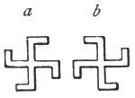

  
[Intangible Textual Heritage](../../index)  [Symbolism](../index) 
[Index](index)  [Previous](mosy05)  [Next](mosy07) 

------------------------------------------------------------------------

[Buy this Book at
Amazon.com](https://www.amazon.com/exec/obidos/ASIN/048641437X/internetsacredte)

------------------------------------------------------------------------

  
*The Migration of Symbols*, by Goblet d'Alviella, \[1894\], at
Intangible Textual Heritage

------------------------------------------------------------------------

p. 32

### CHAPTER II.

#### ON THE GAMMADION OR SWASTIKA.

I. Geographical distribution of the *gammadion*.—Different patterns of
the *gammadion*.—Its common occurrence amongst all the nations of the
Old World, with the exception of the Egyptians, the Phœnicians, the
Mesopotamians, and the Persians.—The *fylfot*.—The *swastika*.

II\. Previous interpretations of the *gammadion*.—Opinions of Messrs.
George Birdwood, Alexander Cunningham, Waring, W. Schwartz, Emile
Burnouf, R. P. Greg, Ludwig Müller, and others.

III\. Probable meaning of the *gammadion*.—The *gammadion* a charm.—The
*gammadion* symbolical of the solar movement, and, by analogy, of the
heavenly bodies in general.—The arms of the *gammadion* are rays which
move.—Connection between the *tétrascèle* and the *triscèle*.—Figures
connected with the *gammadion*.—Equivalence of the *gammadion* and
certain solar images.—The Three Steps of Vishnu.—Lunar *tétrascèles*.

IV\. Cradle of the *gammadion*.—Was it conceived simultaneously in
several places?—Uniformity of its meaning and use.—Discussion as to its
Aryan or Pelasgic origin.—Information furnished by the "whorls" of
Hissarlik and the prehistoric pottery of Northern Italy.—The question is
archæological, not ethnical.—Conclusions.

#### I. Geographical Distribution of the Gammadion.

 

Fig. 14.
Gammadions

The name *gammadion* is given to that
form of cross whose extremities are bent back at right

p. 33

angles, as if to form four *gammas* joined together at the base (fig.
14).

It may be called a cross *pattée* when the bent parts end in a point so
as to form a sort of foot ([fig. 15a](#img_fig015)), and a cross with
hooks when the arms after being bent a first time are again twisted
either inwards ([15b](#img_fig015)), or outwards ([15c](#img_fig015)).
Lastly, it takes the name of *tétrascèle* when the arms are rounded off
whilst curving backwards ([15d](#img_fig015)).

 

Fig. 15. Varieties of the
Gammadion

With the exception of the solar Disk and the Greek Cross there are few
symbolical marks so widely distributed.

Dr. Schliemann, exploring the *débris* of the towns piled upon the
plateau of Hissarlik, beginning with the second or "burnt city," which
the learned explorer identifies with the Ilium of Priam, [1](#fn_51) found innumerable *gammadions*, especially
amongst the decorations of those terra cotta disks which have been
thought to be "whorls," and which served perhaps as *ex voto*. [2](#fn_52) It likewise ornaments certain idols of
feminine shape, which recall roughly the appearance of the Chaldæan
Ishtar; in one of these statuettes, a leaden one, it occupies the centre
of the triangle denoting the belly. [3](#fn_53)

In Greece, as in Cyprus and at Rhodes, it first appears on that pottery
with geometrical ornamentation which constitutes the second period of

p. 34

\[paragraph continues\] Grecian
ceramics; [1](#fn_54) it then passes to those
vases with decorations taken from living objects, whose appearance seems
to coincide with the development of Phœnician influences on the shores
of Greece. [2](#fn_55)

It is seen on the archaic pottery of Cyprus, and of Rhodes, and of
Athens, on both sides of the conventional Tree, so frequently reproduced
on the inscribed monuments of Hither Asia between two monsters facing
each other (see further on, [pl. iv](mosy11.htm#img_pl04).). It appears
on an Athenian vase in a burial scene, three times repeated in front of
the funeral car. [3](#fn_56) On a vase from
Thera several *gammadions* are reproduced round an image of the Persian
Artemis. [4](#fn_57) At Mycenæ it figures on
ornaments collected during Dr. Schliemann's excavations. [5](#fn_58) At Pergamus it adorns the balustrade of
the portico which surrounded the temple of Athene, and at Orchomenus the
sculptured roof of the so-called nuptial chamber in the palace of the
Treasury. [6](#fn_59) Lastly, when the
introduction of money disclosed a new outlet for the symbolic forms of
religion and of art, it became a favourite emblem in the coinage, not
only of the Archipelago and of Greece Proper, but also of Macedon,
Thrace, Crete, Lycia, and Paphlagonia.

From Corinth, where it figures amongst the most ancient mint marks, it
passed to Syracuse under Timoleon, to be afterwards spread abroad on the

p. 35

coins of Sicily and of Magna Græcia. [1](#fn_60)
In Northern Italy it was known even before the advent of the Etruscans,
for it has been met with on pottery dating from the terramare
civilization. [2](#fn_61) It appears also on the
roof of those ossuaries, in the form of a hut, which reproduce on a
small scale the wicker hovels of the people of that epoch. [3](#fn_62) In the Villanova period it adorns vases
with geometrical decorations found at Cære, Chiusi, Albano, and at
Cumæ, [4](#fn_63) and when Etruria became
accessible to oriental influences it appears on *fibulæ* and other
golden ornaments. [5](#fn_64)

At a still later period it is found on the breasts of personages
decorating the walls of a Samnite tomb near Capua; [6](#fn_65) lastly it appears as a *motif* for
decoration in the Roman mosaics. It is singular that at Rome itself it
has not been met with on any monument prior to the third, or perhaps the
fourth, century of our era. About that period the Christians of the
Catacombs had no hesitation in including it amongst their
representations of the Cross of Christ. Not only did they carve it upon
the tombs, but they also used it to ornament the garments of certain
priestly personages, such as the *fossores*, and even the tunic of the
Good Shepherd. [7](#fn_66) At Milan it forms a
row of curved Crosses round the pulpit of St. Ambrose.

On the other hand, it appears to have been

p. 36

widely distributed throughout the provinces of the Roman empire,
especially among the Celts, where in many cases it is difficult to
decide whether it is connected with imported civilization, or with
indigenous tradition. From Switzerland, and even from the Danubian
countries, to the most remote parts of Great Britain, it has been found
on vases, on metal plates, on *fibulæ*, on sword belts, and on
arms. [1](#fn_67) In England it adorns fragments
of mosaics collected from the ruins of several villas, [2](#fn_68) as well as a funeral urn unearthed in a
mound of the bronze age. [3](#fn_69) In Gaul it
is observed frequently enough on coins ranging from the third century
B.C. to the third century of our era, and even later, for it is met with
on a Merovingian piece. [4](#fn_70) We may add
that it already figures on fragments of pottery and even on terra cotta
matrices found in a lacustrine city in Lake Bourget. [5](#fn_71)

In Belgium, we meet with it at Estinnes (Hainault) and at Anthée
(Province of Namur) in tile *débris* dating back to the Roman
epoch. [6](#fn_72) It is also seen repeated
several times, in association with the Lotus-flower, among the
inscriptions on tombstones discovered, some years ago, in the
Belgo-Roman cemetery of Juslenville, near Pepinster ([fig.
16](#img_fig016)).

An interesting discussion, arose in the *Institut archéologique
liégeois* as to whether—in spite of the invocation D\[iis\]
M\[anibus\]—the presence of the *gammadion* did not imply the Christian

p. 37

character of this sepulchral monument. [1](#fn_73) To the arguments brought forward to refute
this theory we may add that a sepulchral *stele* of an unquestionably

 

Fig. 16. Tombstone from
Juslenville  
(*Institut archéologique liègeois*, vol. x. (1870), pl. xiii.)

pagan character, discovered in Algeria, offers an analogous combination
of two *gammadions* placed over a Wheel.

 

Fig. 17. Libyan Sepulchral
Stele.  
(Proceedings of the *Soc. franc. de numism. et d’archéol.*, vol. ii.,
pl. iii. 3.)

The fact may be mentioned that in the middle of the Christian era,
eleven or twelve centuries later, the *gammadion* reappears on a
sepulchre in

p. 38

the same Belgian province. On a tombstone of the fourteenth century,
discovered in 1871, during the construction of a tunnel at Huy, three
personages are sculptured, one of whom is a priest clothed in a
chasuble, and on this chasuble three bands of *gammadions* can be
distinctly seen. [1](#fn_74)

The *gammadion*, associated with the Wheel, as well as with the
Thunderbolt, likewise adorns votive altars found, in England, and near
the Pyrenees, on the site of Roman encampments. [2](#fn_75)

 

Fig. 18. Altar in the
Toulouse Museum.  
(*Reveu archéologique de* 1880, vol. xl. p. 17.)

At Velaux, in the Bouches-du-Rhône department, there has been found the
headless statue of a god sitting cross-legged, who bore on its breast a
row of crocketed crosses surmounting another row of equilateral
crosses. [3](#fn_76)

In Ireland, however, and in Scotland, the *gammadion* seems really to
have marked Christian sepulchres, for it is met with on tombstones
associated with Latin Crosses. [4](#fn_77)

The Rev. Charles Graves, Bishop of Limerick, has described an ogham
stone found in an abandoned

p. 39

cemetery in Kerry, which he believes to belong to the sixth century; it
bears an arrow between two *gammadions*. [1](#fn_78)

The Anglo-Saxons gave to the *gammadion* the name of *fylfot*, from the
Norse *fiöl* (full, *viel* = "numerous"), and *fot* (foot). [2](#fn_79) It has been observed on pottery and
funeral urns of the bronze age in Silesia, in Pomerania, and the eastern
islands of Denmark. In the following ages it is met with on ornaments,
on sword-hilts, on golden brackets, on sculptured rocks, and on
tombstones. [3](#fn_80) Amongst the
Scandinavians it ended by combining, doubtlessly

 

Fig. 19. Cross On A Runic
Stone From Sweden.  
(Ludwig Müller, p. 94, fig. a.)

under the influence of Christianity, with the Latin Cross.

In an old Danish church it ornaments baptismal fonts which date from the
early times of Christianity. [4](#fn_81) In
Iceland, according to Mr. Hjaltalin, it is still in use at the present
day as a magic sign. [5](#fn_82)

Amongst the Slays and Finns it has not yet been found, save in a
sporadic state, and about the period of their conversion to Christianity
only. We may remark, by the way, that it is very difficult

p. 40

to determine the age and nationality of the terra cotta or bronze
objects on which it has been observed in countries of mixed or
superposed races, such as Hungary, Poland, Lithuania and Bohemia.

In the Caucasus, M. Chantre has met with it on ear-drops, ornamental
plates, sword-hilts, and other objects found in burial-places dating
back to the bronze period and the first iron age. [1](#fn_83)

Amongst the Persians its presence has been pointed out on some Arsacian
and Sassanian coins only. [2](#fn_84)

The Hittites introduced it on a bas-relief at Ibriz, in Lycaonia, where
it forms a border on the dress of a king, or priest, who offers up a
sacrifice to a god. [3](#fn_85)

The Phœnicians do not seem to have known or, at least, to have used it,
except on some of the coins which they struck in Sicily in imitation of
Greek pieces. A coin of Byzacium on which it is figured, near the head
of Astarte, dates from the reign of Augustus. [4](#fn_86)

It is not met with either in Egypt, in Assyria, or in Chaldæa.

In India it bears the name of *swastika*, when its arms are bent towards
the right ([fig. 14a](#img_fig014)), and *sauwastika* when they are
turned in the other direction ([fig. 14b](#img_fig014)). The word
*swastika* is a derivative of *swasti*, which again comes from *su* =
well, and the verb *asti* = it is; the expression would seem therefore
to correspond with a Greek formula—εὐ εστὶ, and, in fact, amongst the
Hindus

p. 41

as amongst the Buddhists, its representation has always passed for a
propitious sign. [1](#fn_87)

The grammarian Panini mentions it as a character used for earmarking
cattle. We see in the *Ramayana* that the ships of the fleet, on which
Bharata embarked for Ceylon, bore, doubtlessly on their bows, the sign
of the *swastika*. [2](#fn_88) Passing now to
inscribed monuments we find the *gammadion* on the bars of silver,
shaped like dominos, which, in certain parts of India, preceded the use
of money proper. [3](#fn_89)

It even appears upon a coin of Krananda, which is held to be the oldest
Indian coin, and which is

 

Fig. 20. Ancient Indian
Coin.  
(*Archæological Survey of India*, vol. x., pl. ii., fig. 8.)

likewise remarkable as exhibiting the first representation of the
*trisula*. [4](#fn_90)

Occurring frequently at the beginning and the end of the most ancient
Buddhist inscriptions, several examples of it are to be seen on the
Foot-Prints of Buddha sculptured at Amravati. [5](#fn_91) The *swastika* represents, moreover,
according to Buddhist tradition, the first of the sixty-five marks which
distinguished the Master's feet, whilst the

p. 42

fourth is formed by the *sauwastika*, and the third by the
*nandyavarta*, a kind of labyrinth, which, in the manner of the Greek
*meander*, may be connected with the *gammadion*. [1](#fn_92)

 

Fig. 21. The
Nandyavarta.

It must be observed that amongst the Jains, the *gammadion* is regarded
as the emblem of Suparsva, the seventh of the twenty-four
*Tirthankaras*, whilst the *nandyavarta* is that of the
eighteenth. [2](#fn_93)

Even at the present day, according to Mr. Taylor, the Hindus, at the
time of the new year, paint a *gammadion* in red at the commencement of
their account books, and, in their weddings and other ceremonies, they
sketch it in flour on the floors of their houses. [3](#fn_94) It also figures at the end of manuscripts
of a recent period, at least under a form which, according to M. Kern,
is a development of the *tétrascèle*. [4](#fn_95)

The *gammadion* has been likewise preserved to the present time amongst
the Buddhists of Tibet, where the women make use of it in the
ornamentation of their skirts, and where it is placed on the

p. 43

breasts of the dead. [1](#fn_96) In China—where
it bears the name of *ouan*—and in Japan it adorns vases, caskets, and
the representations of divinities, as may be seen in the Musée Guimet at
Paris; it is even figured upon the breasts of certain statues of Buddha
and the Buddhisattvas, where, according to M. Paléologue, it would seem
to symbolize the heart. [2](#fn_97) According to
another interpretation, given by the Annamite bonzes, it might be the
cicatrice of a spear-thrust received by Buddha; but these bonzes,
according to M. G. Dumoutier, continue to venerate this symbol without
understanding it. [3](#fn_98)

In the Woolwich Arsenal the *gammadion* may be seen upon a cannon
captured at the Taku forts by the English. According to M. G. Dumoutier
it is nothing else than the ancient Chinese character *che*, which
implies the idea of perfection, of excellence, and would seem to signify
the renewal and the endless duration of life. [4](#fn_99) In Japan, according to M. de Milloué, it
represents the number 10,000, which symbolizes that which is infinite,
perfect, excellent, and is employed as a sign of felicity. [5](#fn_100) A statue of the Buddhisattva Jiso, in
the Musée Guimet, rests upon a pedestal ornamented with *swastikas*.

Lastly let us conclude this long recital, which is in danger of becoming
tedious without hope of being complete, by mentioning the presence of
the *gammadion* in Africa, on bronzes brought from Coomassie by the last
English Ashantee

p. 44

expedition; [1](mosy07.htm#fn_101) in South
America, on a calabash from the Lenguas tribe; in North America, on
pottery from the mounds and from Yucatan, as also on the rattles made
from a gourd which the Pueblos Indians use in their religious
dances. [2](mosy07.htm#fn_102)

------------------------------------------------------------------------

### Footnotes

[33:1](mosy06.htm#fr_51) Schliemann. *Ilios, ville et pays des Troyens*.
Paris, 1885, pp. 507 *et seq.*

[33:2](mosy06.htm#fr_52) Schliemann. *Troja*. London, 1884, p. 39.—See
below fig. 22, 23a, 30, also plate ii., etc.

[33:3](mosy06.htm#fr_53) Schliemann. *Ilios*, fig. 226. See also *Troja*
(English ed.) on an "owl headed" vase of the most recent prehistoric
city.

[34:1](mosy06.htm#fr_54) Alb. Dumont. *Peintures céramiques de la Grèce
propre*. Paris, 1873, vol. i., pl. xv., fig. 17.

[34:2](mosy06.htm#fr_55) Perrot and Chipiez. *Histoire de l’art dans l’antiquité*.
Paris, 1885, vol. iii., figs. 513, 515, 518.

[34:3](mosy06.htm#fr_56) Victor Duruy. *Histoire des Grecs*. Paris,
1888, vol. i., fig. 729.

[34:4](mosy06.htm#fr_57) Daremberg and Saglio. *Dictionnaire des antiquités des
grecques et romaines*. Fasc. 12. Paris, 1888. S. v. Diane, p. 153, fig.
2389.

[34:5](mosy06.htm#fr_58) Schliemann. *Mycènes*. Paris, 1879, P. 193.

[34:6](mosy06.htm#fr_59) Schliemann. *Troja*, p. 123.

[35:1](mosy06.htm#fr_60) *Numismatic Chronicle*.
London, vol. viii. (3rd series), p. 103.

[35:2](mosy06.htm#fr_61) De Mortillet. *Musée préhistorique*, pl. xcix.

[35:3](mosy06.htm#fr_62) J. Martha. *Archéologie étrusque et romaine*,
fig. 1.

[35:4](mosy06.htm#fr_63) Alexandre Bertrand. *Archéologie celtique et
gauloise*. Paris, 2nd ed., 1889, figs. 65–68.

[35:5](mosy06.htm#fr_64) Alexandre Bertrand. *La Gaule avant les
Gaulois*. Paris, 1884, fig. 77.

[35:6](mosy06.htm#fr_65) Th. Roller. *Les catacombes de Rome*. Paris,
vol. ii. p. 32.

[35:7](mosy06.htm#fr_66) Th. Roller. *Les catacombes de Rome*, vol. i.,
pl. vi. 1; pl. x., 29, 30, 31; pl. xxxxii., 15; pl. xxxix., i 9; vol.
ii., pl. lv., 2; pl. lxxxviii., 13, and pl. xciv., 2.

[36:1](mosy06.htm#fr_67) Mortillet. *Musée préhistorique*, pl. xciii.,
xcviii. and c.

[36:2](mosy06.htm#fr_68) Rob. Sewell, in the *Jour. Rl. As. Soc.*, vol.
xviii. (new series), p. 383.

[36:3](mosy06.htm#fr_69) De Mortillet. *Le signe de la croix avant le
christianisme*. Paris, 1866, fig. 76.

[36:4](mosy06.htm#fr_70) Lelewel. *Numismatique du moyen âge*. *Atlas*,
pl. iv., No. 57.

[36:5](mosy06.htm#fr_71) Ern. Chantre. *L’âge du Bronze*. Paris, 1876,
2nd part, pp. 194, 195.

[36:6](mosy06.htm#fr_72) *Bulletins de
l’Institut archéologique liégeois*, vol. x. p. 106.

[37:1](mosy06.htm#fr_73) It was maintained that
these letters signified:—*DoMus æterna* or *D*\[*eo*\] *M*\[*aximo*\],
so that instead of reading, *Diis manibus Primus Marci Filius*, M.
Buckens, formerly Professor at the Academy of the Fine Arts at Liege,
did not hesitate, by a free interpretation of the *gammadions*, the
floral ornamentation, the triangle, the niche, and the lotus leaves, to
translate them textually as follows: "The last abode of the son of
Marcus in Jesus Christ, God, baptized in the name of the Father and of
the Holy Ghost"! (*Bulletins de l'Institut archéologique liégeois*, vol.
x. (1870), p. 55.)

[38:1](mosy06.htm#fr_74) The stone is now in the
"Musée du Parc du Cinquantenaire" at Brussels.

[38:2](mosy06.htm#fr_75) Lud. Müller. *Det saakaldte Hagekors*.
Copenhagen, 1877, pp. 21, 22.

[38:3](mosy06.htm#fr_76) Alex. Bertrand. *L’autel de Saintes et les
triades gauloises*, in the *Revue archéologique* of 1880, vol. xxxix. p.
343

[38:4](mosy06.htm#fr_77) Lud. Müller. *Op. cit.*, p. 114.

[39:1](mosy06.htm#fr_78) *Transactions of the
Royal Irish Academy*, vol. xxvii., Feb., 1879. See also the same vol.,
April, 1879, *On the Croix gammée* or *Swastika*.

[39:2](mosy06.htm#fr_79) R. P. Greg. *The Fylfot and Swastika*, in
*Archæologia*. London, vol. xlviii., part ii., 1885, p. 298.

[39:3](mosy06.htm#fr_80) Lud. Müller. *Op. cit.*, *passim.*—R. P. Greg. *Loc. cit.*, pl. xix., fig. 27, 31,
32, 33.—C. A. Holmboe. *Traces du
bouddhisme en Norvège*. Paris, 1857, pp. 34 *et seq.*

[39:4](mosy06.htm#fr_81) Lud. Müller. *Op. cit.*, p. 113.

[39:5](mosy06.htm#fr_82) *Nineteenth Century*
for June, 1879, p. 1098.

[40:1](mosy06.htm#fr_83) Ern. Chantre. *Recherches archéologiques dans
le Caucase*. Paris, 1886, vol. ii., atlas, pl. xi., xv., etc.

[40:2](mosy06.htm#fr_84) Lud. Müller. *Op. cit.*, fig. 3.

[40:3](mosy06.htm#fr_85) Perrot and Chipiez. *Histoire de l’art dans l’antiquité*,
vol. iv., fig. 354.

[40:4](mosy06.htm#fr_86) *Numismatique de
l’ancienne Afrique*. Copenhagen, 1860–1862, vol. ii. p. 40, No. 4.

[41:1](mosy06.htm#fr_87) See Prof. Max Müller's
letter, in Schliemann. *Ilios*, pp.
517–521.

[41:2](mosy06.htm#fr_88) Ramayana.

[41:3](mosy06.htm#fr_89) Edw. B. Thomas. *The early Indian Coinage*, in
the *Numismatic Chronicle*, vol. iv. (new series), pl. xi.

[41:4](mosy06.htm#fr_90) See our [fig.
146](mosy17.htm#img_fig146).

[41:5](mosy06.htm#fr_91) James Fergusson. *History of Indian and Eastern
Architecture*. London. Murray, 1876, p, 184. See our
[title-page](mosy00.htm#img_feet).

[42:1](mosy06.htm#fr_92) Eug. Burnouf. *Le Lotus de la Bonne-Loi*.
Paris, 1852, p. 626.

[42:2](mosy06.htm#fr_93) Colebrooke. *Observations on the Jainas*, vol.
ix., *Asiatic Researches*, p. 308.

[42:3](mosy06.htm#fr_94) Eug. Burnouf. *Op. cit.*, p. 626.

[42:4](mosy06.htm#fr_95) Kern:. *Der Buddhismus*. Leipzig, 1884, vol.
ii. p. 239, note 3.—Colebrooke gives to this sign the name of
*srivatsa*, and makes it out to be the distinctive mark of the tenth
Tirthankara of the Jains. M. Schwartz has compared it to the four-leaved
clover, which also "brings luck."

[43:1](mosy06.htm#fr_96) *Journal Asiatique*,
2nd series, vol. iv. p. 245. Pallas.
*Samlungen historischer Nachrichten über die mongolischen
Volkerschaften*, vol. i. p. 277.

[43:2](mosy06.htm#fr_97) Michel Paléologue. *L’Art chinois*, p. 47.

[43:3](mosy06.htm#fr_98) G. Dumoutier. *Les Symboles, les Emblèmes et
les Accessoires du culte chez les Annamites*. Paris, 1891, pp. 19–20.

[43:4](mosy06.htm#fr_99) G. Dumoutier. *Le svastika et la roue solaire
en Chine, in the Revue d’Ethnographie*. Paris, 1885, p. 331.

[43:5](mosy06.htm#fr_100) De Milloué. *Le svastika*, in the *Bulletins de
la Société d’Anthropologie* of Lyons, 1881, v. i. pp. 191 *et seq.*

------------------------------------------------------------------------

[Next: II. Different Interpretations of the Gammadion](mosy07)
