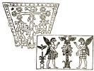

  
[Intangible Textual Heritage](../../index)  [Symbolism](../index) 
[Index](index)  [Previous](mosy12)  [Next](mosy14) 

------------------------------------------------------------------------

[Buy this Book at
Amazon.com](https://www.amazon.com/exec/obidos/ASIN/048641437X/internetsacredte)

------------------------------------------------------------------------

  
*The Migration of Symbols*, by Goblet d'Alviella, \[1894\], at
Intangible Textual Heritage

------------------------------------------------------------------------

#### III. The Paradisaic Trees of the Aryans.

Not only do the different species of mythical trees which we have just
met with amongst the Semites occur amongst the Indo-Europeans, and the
Hindus in particular, but nowhere can the ties which link the Tree of
the Universe to the Tree of Life and the Tree of Knowledge be more
clearly perceived than amongst the traditions of the latter nation.

The Vedas make mention of the tree whose foot is the earth, and whose
summit is heaven. [2](#fn_320)

Sometimes it is the tree of the starry firmament whose fruits are
precious stones, at other times it is the tree of the cloudy sky whose
roots or branches shoot out over the canopy of heaven, like those
sheaves of long and fine-spun clouds which, in the popular meteorology
of our country, have been named *Trees of Abraham*. Amongst its branches
it holds imprisoned the fire of the lightning.

p. 162

Through its leaves it distills the elixir of life, the celestial *soma*
or *amrita*, *i.e.*, the vivifying waters "which Mitra and Varuna, the
two kings with the beautiful hands, watch amidst the clouds." [1](#fn_321) It also forms the way to the other side
of the atmospheric ocean, beyond the river which possesses or procures
everlasting youth. [2](#fn_322) Under its dense
branches, Yama, the king of the dead, "drinking with the gods, entices
our elders by playing on the flute." [3](#fn_323)

It is finally the Tree of Knowledge. Its sap begets poetic and religious
inspiration. [4](#fn_324) In approaching its
foliage, man remembers his previous existences. [5](#fn_325) From its top resounds in sonorous
rolling the celestial voice, *vac*, which reveals the will of the gods,
the divine messenger, engendered in the waters of the clouds. [6](#fn_326)

This latter aspect of the Sacred Tree is developed especially amongst
the Buddhists. M. Senart has shown, in his learned and able *Essai sur
la légende du Bouddha*, how the sacred fig-tree (*Urostigma religiosum*)
under which Buddha attained perfect illumination, in spite of the
exertions of Mâra and his demons, is directly connected with the Cosmic
Tree of Indo-European mythologies, which produces ambrosia, and
dispenses salvation. [7](#fn_327) But to the
disciples of the new faith who loathed life and longed for extinction,
the old Celestial Tree which led to immortality became

p. 163

merely the *buddhidruma*, the Tree of Wisdom, a symbol both of the
truths which lead to *nirvâna* and of the Master who discovered and
taught them. [1](#fn_328) The *Royal Asiatic
Society* continued in the same vein when, in its turn, it chose as
emblem, with the well-devised motto, *tot areores quoi rami*, one of the
Sacred Trees of the Buddhists, the banyan-tree (*Urostigma indicum*),
whose branches take root on touching the ground, and become so many
fresh stems.

Thus, eternal life, productive power, perfect happiness, supreme
knowledge, all these divine attributes are in India the gifts of the
Tree which represents the Universe. Vedic and post-Vedic traditions tell
us the story of the rivalries which occur between the *devas* and
*asuras* for the possession of this Tree or its produce. The Vedas
relate that the Tree of the *soma* was guarded by *gandharvas*, kinds of
centaurs in whom is generally seen the personification of the winds or
clouds. A swift sparrow-hawk with golden wings, Agni, took flight one
day from the summit, carrying with it the broken end of a branch. Hit by
the arrow of a *gandharva* it let fall a feather and a claw. These
produced the plants which recall the bird of prey by their pennated
leaves or sharp thorns, as well as those whose sap supplies the
terrestrial *soma*, the intoxicating liquor of Vedic India.

p. 164

It is unnecessary, after Kuhn's *Herabkunft des Feuers and des
Gœttertranks*, to dwell upon the purport of those traditions which go
towards explaining at once the shape of the universe, the phenomena of
the storm, the production of fire, the fertilization of the ground by
rain, and, lastly, the virtues of certain plants.

In a different reading, the *amrita* was in the possession of the
*asuras* who alone at that time were immortal. Indra, the god of the
stormy sky, succeeded in abstracting it, and thus it is that the *devas*
obtained in their turn the privilege of immortality. [1](#fn_329)

According to the *Mahabharata* it is a genius half eagle and half man,
which, after subduing several monstrous animals on the borders of a
lake, takes advantage of the negligence of the dwarfs who guard the
Sacred Tree to break off and carry away the branch of the *soma*. [2](#fn_330)

The Persians placed on the borders of a lake two trees, each of which
was guarded by a *gandhrawa*. One of these trees is the white *haoma* or
*homa*, which, according to the *Yasna*, wards off death and confers
"spiritual knowledge;" [3](#fn_331) the other,
according to the *Bundehesh*, is the Tree of All Seeds, which is also
called the Eagle-tree. According to the version of the myth recorded by
Kuhn, when one of these birds flies away, a thousand branches grow on
the tree, and as soon as it returns to the nest it breaks a thousand
branches, and causes a thousand seeds to fall. [4](#fn_332) The sap of the *haoma*, however, is not
only the fertilizing rain; like the *soma* of India, it is also

p. 165

the fermented liquor which was obtained by pounding the twigs of an
asclepiad, or some allied plant, and which, considered as the drink of
the gods, played an important part in the sacrificial rites of the two
nations.

The Greeks seem likewise to have been acquainted with a Tree of Heaven.
This was the oak whose hollow trunk sheltered the Dioscuri from their
enemies, and from which hung the golden fleece "on the shores of the
Ocean, there where the sun's beams are imprisoned in a chamber of
gold." [1](#fn_333) Perhaps we ought to include
in the same category of mythical trees the Oak of Dodona, in whose
foliage was heard the prophetic voice of the master of the thunder.

The juice of the grape, personified in Bacchus, that Greek equivalent of
the god Soma, grants also a knowledge of the future: "This god is a
prophet," says Euripides; "for, when he forces his way into the body, he
makes those whom he maddens foretell the future." [2](#fn_334)

The name ἀμβροσία, which the Greeks gave to the food of the Olympians,
corresponds phonetically with the *amrita*. But the Aryans of Greece,
faithful to their custom of referring everything to man, and inspired,
perhaps, by a Phrygian myth, in preserving the old Indo-European
tradition changed the theft of the liquor into the abduction of the
cup-bearer; and it was Ganymede whom they made Zeus, transformed into an
eagle, carry off "in the midst of a divine whirlwind." We may add that
it is doves which, in the Odyssey, bring ambrosia to Zeus. [3](#fn_335)

The Greeks, again, more than any other branch of the Aryan race,
developed the myth of the hero

p. 166

overtaken by the divine wrath for having communicated to mankind the use
of fire and the possession of knowledge. Prometheus was considered not
only to have stolen the fire from Zeus by lighting his torch either at
the wheel of the sun or at Vulcan's forge, but also to have modelled the
first man from clay and then infused into him the spark of life. Without
adding comments which no text would justify, we may yet draw attention
here to a small monument reproduced by M. Decharme in his *Mythologie de
la Grèce antique*. [1](#fn_336) Prometheus is
there represented as engaged in moulding the first man, with the help of
Minerva, behind whom stands a tree encircled by a serpent.

Lastly, we find again in Greece a third cycle of mythical tales which
refer us still more directly to the Hindu tradition of the Sacred Tree;
this is the expedition of Hercules to the garden of the Hesperides,
whence he carries off the Golden Apples guarded by dragons. Whether
these Apples represent the luminous rays or the healing waters, another
reading of the myth records that Hercules handed them over to Minerva,
who put them back in the place where they must always remain, "for they
are immortal." [2](#fn_337) It is noteworthy
that, on a Greek vase reproduced by Guigniaut, the Tree round which the
dragon is coiled is depicted between two Hesperides, one of whom gathers
the fruit for Hercules whilst the other diverts the attention of the
dragon by offering it a jar—which scene may be more or less connected
with oriental representations of the Tree of Life, adapted to the
requirements of Hellenic taste and Hellenic mythology ([fig.
83](#img_fig083)).

The Edda of Scandinavian mythology exhibits a perfect type of a
cosmogonical tree: this is the

p. 167

ash Yggdrasill, the most beautiful of trees, which has three roots. One
spreads out towards the upper spring, *Urdur*, where the Ases hold
council and where the Nornes, whilst settling the duration

 

Fig. 83. The Dragon and the
Hesperides.  
(Guigniaut. *Religions de l’antiquité*,
vol. iv., pl. 181.)

of the lives of men, pour water from the spring over the Tree in order
to secure for it an endless sap and verdure. The second root stretches
towards the land of the giants of the Frost; under this root springs the
well of Mimir the first man and king of the dead; in this well all
knowledge and all wisdom dwell; Odin himself, in order to quench his
thirst with its waters, had to leave one of his eyes in pledge. As for
the third, it descends to Nifleim, the Scandinavian Hades, where it is
ever gnawed at by a dragon. On the highest bough of the stem an eagle
perches whilst other animals occupy the lower branches. Finally, Odin
spent nine nights under its shade before discovering the runes, [1](#fn_338) an act which recalls the great
meditation of Buddha under the sacred fig-tree.

Other passages in the Edda show us the contests for the possession of
the hydromel, the liquor

p. 168

which is at once the drink of the gods and the source of poetry. It was
carried off by Odin, who, in the form of a serpent, surreptitiously
entered the den of the giant who was its guardian. Another myth which
alludes more directly to life-imparting fruits is the legend of the
goddess Idhunn who kept in a box the Apples of Immortality. This was the
fruit which, on approaching old age, the gods partook of in order to
renew their youth. Enticed into a neighbouring forest by the faithless
Loki, Idhunn was abducted, together with her treasure, by a giant
disguised as an eagle. But the gods, feeling themselves growing old,
obliged Loki to transform himself into a hawk and go and bring back
Idhunn and her Apples during the absence of their abductor. [1](#fn_339)

As regards the Slavonic peoples, MM. Mannhardt and de Gubernatis have
recorded more than one legend bearing witness to their belief in a
cosmogonical tree. Such is, amongst the Russians, the Oak-tree of the
island Bujan, on which the sun retires to rest every evening and from
which it rises every morning; watched by a dragon, it is inhabited by
the Virgin of the Dawn, just as is the oak of Eridu by Tammuz and his
mother. [2](#fn_340)

p. 169

In brief, both Semites and Aryans were acquainted with the Tree of
Heaven, the Tree of Life, and the Tree of Knowledge. The first has for
fruit the igneous or luminous bodies of space; the second produces a
liquor which secures eternal youth; the third confers foreknowledge and
even omniscience. This valuable produce is the object of mythical
rivalries between superhuman beings, the gods, *genii*, and fabulous
animals, on the one hand, who have the treasure in their possession or
in their keeping, and the divinity, the demon, or the hero, on the
other, who strive to get possession of it. Curious similarities crop up
in the different accounts of this conflict, which sometimes ends in the
victory of the assailant, and sometimes in his defeat or exemplary
chastisement.

Do such coincidences suffice to justify the assumption that all these
traditions have one and the same origin or even that they represent an
old stock of folk-lore bequeathed to the Aryans and Semites by their
common ancestors?

More than thirty years ago, Frederic Baudry recapitulating, in the
*Revue germanique*, Kuhn's work upon the myths relating to the origin of
fire and nectar, drew attention, incidentally, to the tradition of the
Paradisaic Trees as evidence "of a pre-historic communication between
the Semites and Aryans, taking us back to the remotest times, before the
fixation of languages and grammars." [1](#fn_341) François Lenormant, going further still,
saw therein an indication of the community of origin between the two
races. [2](#fn_342)

p. 170

First of all I will point out the fact that the original unity of a
tradition by no means implies the relationship of the nations amongst
which it is found. The researches conducted in our own times, regarding
the migration of fables, have shown with what ease a tale brought into
being on the banks of the Ganges or the Nile may have made its way to
the islands of Japan, the shores of the Atlantic, or the plains of
southern Africa among nations differing widely in race and language. Of
course, if the resemblance of the traditions is strengthened by the
identity of the names they contain, especially when the people who hold
them in common belong to the same linguistic group, we may admit that
the formation of these beliefs preceded the separation of the different
branches. Such, in particular, is the conclusion to be drawn from the
connections noticed, amongst certain Aryan nations, between the names
*soma* and *haoma*, *amrita* and *ambrosia*, *gandharva*, *gandhrawa*,
and *kentauros*.

Nothing similar, however, exists between the Semites and Indo-Europeans
amongst the words used by the two races to respectively designate either
the Tree of Life and its produce or the personages concerned in its
legend. Baudry, it is true, gets out of the difficulty by supposing that
the communication might have taken place before the fixation of
languages and grammars. This is a desperate effort to justify one
assumption by another. The etymological independence which we find here,
suggests, on the contrary, that the tradition of the Paradisaic Trees
either crossed, at some period, from one race to another, or else that
it sprang up separately in each of the two centres.

At first sight it may seem unlikely that myths which correspond so well
in detail were produced simultaneously in several places. Yet there is
not, in all these tales, a single peculiarity whose presence

p. 171

cannot be connected with the most ordinary processes of mythical
reasoning, and that cannot be found, at least in a fragmentary state,
amongst a number of nations related neither to the Aryans nor to the
Semites.

The idea of referring to the form of a tree the apparent conformation of
the universe is one of the most natural methods of reasoning which can
occur to the savage mind.

The Mbocobis of Paraguay still say that when they die they will climb up
the Tree which unites heaven and earth. [1](#fn_343) To the Maoris heaven and earth formerly
clave together; it was a Divine Tree, the Father of the Forests, which
rent them asunder by placing itself between them. [2](#fn_344) The Khasias of India take the stars to
be men who scaled heaven by climbing up a Tree, and were obliged to
remain in the branches, their companions, who had stopped on earth,
having cut down the trunk. [3](#fn_345)

We will leave out the Khasias, who may have come into contact with the
mythology of the Hindus. But will anyone maintain that the traditions of
Paraguay, or of New Zealand, are connected with those of the Semites or
Aryans? As well might we pretend that old La Fontaine and Virgil before
him were inspired by the cuneiform texts or the Vedic poems when they
described the mighty oak:

*De qui la tête au ciel était voisine  
Et dont les pieds touchaient à l’empire des morts*.

The Tree of Life is no more difficult to account for than the
Cosmogonical Tree. Is not a plant one

p. 172

of the symbols most capable of expressing the abstract idea of life?
Whilst an animal evokes, above all, complex ideas of motion, strength
and passion, the functions of the plant are concentrated, so to speak,
in life, not alone in life subject to the conditions of birth and death,
but also in life liable to periodical successions of inactivity in
winter, and of re-animation in spring.

What more natural and obvious symbol could there be than the "Gardens of
Adonis," those pots of early flowers which were made to blossom, and
then left to wither under the rays of the sun, in order to recall the
death of the young god? [1](#fn_346) The
Tahitans symbolize death by the *Casuarina*, a leafless tree, allied to
our horse-tails, which they plant upon graves. [2](#fn_347) Is it not from the vegetable kingdom
that we ourselves borrow our metaphors when we speak of a life
"blooming," or cut down in its flower?

*Rose, elle a vécu ce que vivent les roses,  
           L’espace d’un matin*.

We know what lofty precepts the mysteries of Greece drew from the
constantly recurring phenomena of vegetation. [3](#fn_348) Egyptian monuments reproduce a
sarcophagus from which an acacia emerges with the motto: "Osiris springs
forth," as if to call the god to witness that life comes from
death. [4](#fn_349) It was especially trees
with evergreen foliage, such as the pine, the cedar, and the cypress,
which were employed to represent the hope in an eternal life beyond the
tomb. M. Lajard has brought together some singular examples in his
researches *Sur le Culte du Cyprès*,

p. 173

a worship which occurs, with this symbolical meaning, amongst the
Greeks, the Etruscans, the Romans, the Phœnicians, the Arabs, the
Persians, the Hindus, and the Chinese, without taking into consideration
the nations of the New World. [1](#fn_350)

The plant, however, has not only the faculty of typifying life. The
power of communicating and of renewing life can also be attributed to
it. By means of its grains or fruits it provides mankind with fresh
strength; by its fermented juice it increases our vitality tenfold;
finally, it furnishes remedies, or *simples*, to which is ascribed the
faculty of restoring the sick to health, and of recalling the dying to
life.

Now these qualities are met with precisely in most of the vegetable
species from which the Aryans and Semites derived the outlines of their
Sacred Trees. There is the oak, whose acorns the western Aryans gathered
for food in the primeval forests. There is the asclepiad, from which the
eastern Aryans got their elixir of life. Then there are the cone-bearing
plants, whose prophylactic reputation amongst the Semites of Babylonia
is proved by numerous texts. Above all there is the palm-tree, whose
fruits still form a considerable part of the food of the people
inhabiting the Lower Euphrates, and whose fermented juice produces an
intoxicating liquor well known to the Arabs. There is even the vine,
which, according to M. Lenormant, was termed, in the ancient language of
Chaldæa, *ges-tin*, literally "wood of life," [2](#fn_351) whilst the goddess of the Tree of Life,
named "the Lady of Eden" in the North of Mesopotamia, is called in the
South "the Lady of the Vine." [3](#fn_352)

Lastly rain, which revives Nature periodically,

p. 174

appears among nearly all nations as a seed of life. When therefore the
configuration of the universe is referred to the type of the tree, it is
natural enough to look upon rain as the sap which flows from its trunk
or branches. In the island of Ferro, in the Canaries, a tradition of the
Guanches told of a wonderful Tree whose top is surrounded by clouds, and
whose branches let fall every morning, before sunrise, the water
necessary for quenching the thirst of the natives. [1](#fn_353)

Here we see the Tree of Life become connected with an allied class of
myths which we find fully developed amongst the Aryans: the belief,
namely, in the existence of a spring, river, or lake which prolongs or
renews life. This tradition was not wanting in Chaldæa either; the poem
of the descent of Istar into Hades places in the gloomy realm of Allat,
queen of the dead, a fountain of life which could revive the dead, were
its approaches not jealously watched by the *anounas* or spirits of the
earth. Istar herself must immerse herself therein before returning to
the light of day and taking her place again amongst the gods. [2](#fn_354)

This fresh analogy between the Aryan and Semitic traditions, however,
seems to me to be rather an assumption in favour of their original
independence. On both sides, to be sure, there is the notion of natural
waters which renew life upon earth; but whilst in India, and even among
the nations of Europe, the annual re-awakening of Nature is chiefly
brought about by the rains which fall from the Celestial Tree, in
Chaldæa—as all travellers in that country bear witness—the fertility of
the soil, and even the existence of the civilization, are dependent not
upon the celestial

p. 175

waters but upon rivers, wells, and canals, which some sixty centuries
ago made of this land, now a desolate and pestiferous waste, a vast and
luxuriant garden. [1](#fn_355)

There is therefore nothing to preclude the supposition that the Aryans
and Semites might have separately imagined their Tree of the Universe,
and even their Tree of Life, under the more or less rudimentary forms
belonging to the traditions still to be observed amongst a number of
uncivilized or savage peoples. The borrowal, or rather mutual
infiltration of the two mythologies, had only to deal with the details
and episodes which everywhere spontaneously clustered round this common
nucleus, and which, spreading in the neighbourhood, without disappearing
from their respective cradles, ended not in obliterating but in
enriching and assimilating the original tradition of each race. [2](#fn_356)

Let it be granted, for instance, that both races vaguely pictured to
themselves heaven under the form of a tree. If one race likened the
heavenly bodies to the tree's fruits, can we wonder at the other doing
the same, as soon as they became acquainted with this development of the
myth

p. 176

amongst their neighbours? Let us assume that the Chaldæans learnt from
the Indo-Iranians, or *vice versâ*, or yet again both from a third
people, the art of making intoxicating liquors with the juice of certain
plants: does it not appear likely that the myths suggested by this
invention in its original home were transmitted along with the art
itself? Thus it is that Christian infiltrations, by blending with the
old stock of local traditions, unquestionably contributed in such a
degree towards forming the legends recorded in the Edda of the
Scandinavians and the Kalevala of the Finns, that it is now no longer
possible for us to ascertain the proper share which either of those
elements had in the formation of these legends.

Comparative archæology shows clearly how these exchanges are brought
about, when it enables us to see how the Mesopotamian type of the Sacred
Tree was adopted by the Persians to represent their Tree of Immortality,
by the Buddhists to typify their Tree of Wisdom; and by the Christians
to symbolize their Tree of Temptation.

Each race, each religion has its independent type, which it preserves
and develops in accordance with the spirit of its own traditions,
approximating it, however, by the addition of extraneous details and
accessories, to the equivalent image adopted in the plastic art of its
neighbours. Thus the current which makes the Lotus of Egypt blossom on
the Paradisaic Tree of India has its counter-current which causes the
*Asclepias acida* of the Hindu Kush to climb upon the Sacred Tree of
Assyria. Art and mythology comply, in this respect, with the usual
processes of civilization, which is not the fruit of a single tree, but
has always been developed by grafts and cuttings between the most
favoured branches of the human race.

------------------------------------------------------------------------

### Footnotes

[161:1](mosy12.htm#fr_319) *Babyl. and Oriental
Record* for June, 1888, pp. 149–159.

[161:2](mosy13.htm#fr_320) "Which is the
forest," asks the Vedic poet, "which is the tree wherein they have hewn
heaven and earth?" (*Rig-Veda*, x., 81, 4.)

[162:1](mosy13.htm#fr_321) *Rig-Veda*, i., 71,
9. In the Vishnu Purâna (i., 9), the *amrita* and the Tree of Paradise
(the *pârijata*) are generated in succession by the churning of the sea
of milk, *i.e.*, of the primordial or atmospheric ocean.

[162:2](mosy13.htm#fr_322) A. De Gubernatis. *Mythologie des plantes*, vol.
i., p. 178.

[162:3](mosy13.htm#fr_323) *Rig-Veda*, x., 135.

[162:4](mosy13.htm#fr_324) E. Senart. *Journal Asiatique* for 1874, vol.
iii., p. 289.

[162:5](mosy13.htm#fr_325) *Id*., *ibid.*, p.
305.

[162:6](mosy13.htm#fr_326) J. Darmesteter. *Essais orientaux*. Paris,
1883, p. 179.

[162:7](mosy13.htm#fr_327) E. Senart. *Essai sur la légende du Bouddha*, in
the *Journal Asiatique* for 1875, vol. iv., p. 102.

[163:1](mosy13.htm#fr_328) See the description
of the Tree of Brahma, as the Tree of Knowledge, in the Anugita (*Sacred
Books of the East*, vol. viii., pp. 370–371). A Buddhist legend,
recorded by Mr. Hardy, tells of an immense Tree, adorned with four
boughs, from which great rivers flow unceasingly; it bears golden pips
which are carried down to the sea. "This description," M. Sénart adds
(*loc. cit.*), "may convince the most sceptical that the tree *bô* must
not be separated from the Cosmic Tree of Indo-European mythologies." It
may be added that these details especially remind one of the Tree of
Life with its wonderful fruits, planted in the middle of that Garden of
Eden from which flowed four great rivers.

[164:1](mosy13.htm#fr_329) A fragment quoted by
Weber in his *Indische Studien*, vol. iii., p. 466.

[164:2](mosy13.htm#fr_330) *Mahâbhârata*, i.,
1345.

[164:3](mosy13.htm#fr_331) *Yasna*, ch. ix. and
x. (*Trans*. by M. de Harlez. Paris, 1876, vol. ii.)

[164:4](mosy13.htm#fr_332) *Revue germanique*,
1861, vol. xiv., p. 375.

[165:1](mosy13.htm#fr_333) *Minnerme* (fragm.
11), quoted by M. P. Decharme,
*Mythologie de la Grèce antique*. Paris, 1886, p. 607.

[165:2](mosy13.htm#fr_334) *Bacchæ*, iii., 265.

[165:3](mosy13.htm#fr_335) *Odyss*., xii., 62.

[166:1](mosy13.htm#fr_336) *Mythologie de la
Grèce antique*, fig. 82.

[166:2](mosy13.htm#fr_337) *ibid.*, p. 533.

[167:1](mosy13.htm#fr_338) R. B. Anderson. *Mythologie scandinave*, trans.
by Jules Leclercq. Paris, 1886, p. 34 *et seq.*

[168:1](mosy13.htm#fr_339) Anderson, p. 124.

[168:2](mosy13.htm#fr_340) A legend, given by
M. de Gubernatis, relates that the Tree of Adam reaches to hell by its
roots and to heaven by its branches; in its top lives the infant Jesus
(*Mythologie des plantes*, vol. i., p. 18).—For traces of the belief in
a Tree of Knowledge in Celtic folk lore, see John Rhys *Celtic Heathendom* (London, 1888, p.
557) The Finns and Esths possess on their side, several legends relating
to a cosmogonical tree. The Lapps are acquainted with an Oak or Tree of
God which covers the heavens with its golden branches; it is uprooted by
a dwarf, who afterwards transforms himself into a giant. The Esthonian
legend develops this myth still further. The divine tree is here a Tree
of Plenty; from its trunk come houses, cradles, and tables. The chief of
these dwellings has the moon for a window; the sun and stars dance on
the roof (De Gubernatis. *Mythologie des
plantes*, vol. ii., p. 76).—As regards the tree with fruits of precious
stones, consult the interesting little p. 169
volume in which M. Lethaby recently endeavoured to prove that the
religious architecture, and even all the symbolism of the early
civilizations, have a cosmogonical bearing, *i.e.*, tend to reproduce
the image of the universe according to the conceptions of the period
(*Architecture, Mysticism and Myth*, London, 1892, chap. v.).

[169:1](mosy13.htm#fr_341) *Revue germanique*
for 1861, vol. xiv., p. 385.

[169:2](mosy13.htm#fr_342) *Origines de
l’histoire*, vol. i., chap. ix.

[171:1](mosy13.htm#fr_343) E. B. Tylor. *Early History of Mankind*.
London, 1878, p. 358.

[171:2](mosy13.htm#fr_344) A. Reville. *Religions des peuples non
civilisés*. Paris, 1883, vol. ii., p. 28.

[171:3](mosy13.htm#fr_345) E. B. Tylor. *Primitive Civilization*, vol. i.
of French translation, p. 333.

[172:1](mosy13.htm#fr_346) C. P. Tiele. *Histoire des Religions de
l’Égypte et des peuples sémitiques*, p. 292 in French translation.
Paris, 1882.

[172:2](mosy13.htm#fr_347) Letourneau. *Sociologie*. Paris, 1880, p. 217.

[172:3](mosy13.htm#fr_348) See preface, page
[2](mosy04.htm#page_2).

[172:4](mosy13.htm#fr_349) Tiele. *Religions de l’Égypte et des peuples
sémitiques*, p. 83.

[173:1](mosy13.htm#fr_350) F. Lajard, in the *Mémoires de l’Académie des
inscriptions et belles-lettres*, vol. xx., second part.

[173:2](mosy13.htm#fr_351) F. Lenormant. *Orig*., vol. ii., p. 254.

[173:3](mosy13.htm#fr_352) Sayce. *Op. cit.*, p. 240, note.

[174:1](mosy13.htm#fr_353) Ramusco. *Historia delle Indie occidentali*,
quoted by de Gubernatis, *Mythologie des plantes*, i., 36.

[174:2](mosy13.htm#fr_354) Sayce. *Op. cit.*, p. 221 *et seq.*

[175:1](mosy13.htm#fr_355) In other countries
this fountain of perpetual youth might again be accounted for in another
way. We find, indeed, a similar tradition existing amongst the Malays,
certain Polynesians, and the inhabitants of the Antilles; le., amongst
insular peoples who see, every evening, the dying sun vanish in the sea
to arise from it in the morning, endowed with fresh life. The Maoris,
according to Tylor (*Civilisation primitive*, ii., 383), imagine that
the sun descends every evening to the bottom of a cave, where he bathes
in the Wai Ora Tane (water of life), returning, at dawn, to the upper
world.

[175:2](mosy13.htm#fr_356) This seems, on the
whole, to be what M. Tiele means when he suggests that the myth of the
elixir of life originated doubtlessly in a non-Aryan race, although he
discovers points of contact in similar myths belonging incontestably to
the Aryans (*Manuel de l’histoire des Religions*, translation of M.
Maurice Vernes, 2nd. ed., pp. 153, 154).

------------------------------------------------------------------------

[Next: Chapter V. On the Transmutation of Symbols](mosy14)
