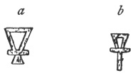
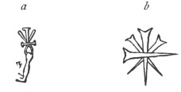

  
[Intangible Textual Heritage](../../index)  [Symbolism](../index) 
[Index](index)  [Previous](mosy13)  [Next](mosy15) 

------------------------------------------------------------------------

[Buy this Book at
Amazon.com](https://www.amazon.com/exec/obidos/ASIN/048641437X/internetsacredte)

------------------------------------------------------------------------

  
*The Migration of Symbols*, by Goblet d'Alviella, \[1894\], at
Intangible Textual Heritage

------------------------------------------------------------------------

p. 177

### CHAPTER V.

#### ON THE TRANSMUTATION OF SYMBOLS.

Theory of the blending of symbolic forms.—Fusion of
equivalent symbols.—Production of intermediate types.—Axe and
Drum.—Wheel and Rosette.—Chrism, Wheel, and *crux
ansata*—Transformations of the *triscèle*—Symbols which have had an
influence upon the representation of the conical *bethels* among the
Semites.—Permutations between the triangle, Winged Globe, *crux ansata*,
human profile, table of offerings, cuneiform Star, and Sacred
Tree.

Whilst inquiring into the cause of the
changes occurring in the forms of symbols, sufficient importance is not
always attached to the attraction which certain figures exercise upon
one another. We might almost state it as a law that, when two symbols
express the same or approximate ideas, they display a tendency to
amalgamate, and even to combine in such a manner as to produce an
intermediate type.

Through not taking into consideration that a symbol may thus unite with
several figures differing greatly in origin and even in appearance, many
archæologists have wasted their time in debating upon the origins of a
sign or image which both sides were right in connecting with different
antecedents—like those knights in the legend who broke a lance over the
colour of a shield of two hues, one of the adversaries having only seen
the front and the other the back.

When the necessity of seeking known or extremely simple antecedents in
complex figures is not lost sight of, the study of symbols often results

p. 178

in the most singular verifications, especially in countries like India,
where all the manifestations of art have a symbolical import. One should
note in Moor's *Hindu Pantheon* how the Disk, the Conch, the Lotus, the
Flame, the Axe, and so forth, frequently assume each other's forms—each
of these symbols going part of the way to meet the others. Take, for
example, two of the attributes which oftenest figure in the hands of
Siva, the Axe and the Drum, and see them merge into one another:

 

Fig. 84. Hindu
Symbols.  
(Moor. *Hindu Pantheon*, pl. vii., xiv.,
xvi., xlvii.)

Sir George Birdwood, one of the authors most conversant with the
industrial arts of India, records how the principal decorative and
symbolical types of India combine and interchange, regardless even of
the distinction between the animal and vegetable kingdom. An identical
phenomenon may be noticed in Phœnician art. There is a symbol inscribed
on Cyprian pottery and Syrian coins which recalls at the same time the
Winged Disk of Asia Minor, the Sacred Tree of Assyria, the *trisula* of
the Buddhists, the Bee of Ephesus, and certain patterns of the Greek
Thunderbolt (see below, [fig. 114](mosy15.htm#img_fig114)).

Are these mere coincidences? To answer this question we must seek, in
each particular case, not

p. 179

only the antecedents of the figures which impress us by their
complexity, but also the communications which may have taken place
between their prototypes, and, if need be, we must reconstitute the
successive stages of these symbolic transmutations.

Let us take, for instance, the image of the Wheel. This figure, which
offers the twofold advantage of possessing a circular form, and
suggesting the idea of motion, is one of the commonest symbolical
representations of the sun.

Now different nations, amongst whom the sun is likewise symbolised by an
expanded flower, have attempted to blend the two images. Thus it is that
in Buddhist bas-reliefs we find Wheels whose spokes are replaced by
petals of the Lotus-flower, while in the island of Cyprus some coins
bear Roses whose leaves are hemmed in by bent spokes, or are even
arranged in the form of a wheel.

In the same way the solar *rouelle*—that amulet *par excellence* of the
Gauls—readily became the monogram of Christ, either in the form of the
combined initials Ι and Χ (Ιησοῦς Χριστός)

 

Fig. 85. Rouelle and
Chrism.  
(Roller. *Catacombes*, vol. ii., pl.
xliii. and lxxxvii.)

\[paragraph continues\] ([fig.
85a](#img_fig085)), or Χ and Ρ (ΧΡιστός) ([fig. 85b](#img_fig085)). In
the latter case it is only necessary to add a loop to the top of one
spoke to get the commonest type of the Chrism, which M. Gaidoz has
accurately defined

p. 180

as "a six-rayed wheel without the rim, and with a loop at the top of the
middle spoke." [1](#fn_357)

Thus, again, in Egypt the Chrism was combined with the Key of Life
through a whole series of modifications which have been found in
inscriptions on the island of Philæ dating from the first Christians of
Nubia, who were anxious to make the sacred sign of their new faith
correspond with the principal emblem of their former religion.

 

Fig. 86. Egyptian Chrisms of
Philæ. [2](#fn_358)

We have seen how, amongst the Gauls, the steeds of the solar *quadriga*
had combined with the arms of the *gammadion* in such a manner as to
produce the complex figure of four horses’ busts radiating round a
disk. [3](#fn_359) The transformations of the
*triscèle* exhibit no less singular instances of similar combinations,
whilst permitting us to ascertain, so to speak, the different stages of
the operation.

The sun, which, as I have had occasion to point out, was often typified
in Asia Minor by a disk from which radiated three legs united at the
thighs, was likewise symbolised there by different animals, such as the
lion, the wild boar, the dragon, the eagle, and the cock. Now some
Asiatic coins exhibit the cock beside the *triscèle* ([fig.
87](#img_fig087)); on

p. 181

others, the *triscèle* is superposed upon, or rather stuck to the body
of, a bird, or a lion, without the aspect of the latter being changed on
that account

 

Fig. 87. Coin of
Aspendus.  
(Hunter, pl. vii., No. 15.)

\[paragraph continues\] ([fig.
88](#img_fig088)); elsewhere, finally, the two parallel symbols, first
placed near and then upon each other,

 

Fig. 88. Coin of
Aspendus.  
(Hunter, pl. vii., No. 16.)

literally blend together, the three legs of the *triscèle* being
transformed into cocks’ heads, or

 

Fig. 89. Lycian
Coin.  
(Barclay V. Head, pl. iii., No.
35.)

monsters’ busts, which revolve in the same direction round a central
point ([fig. 89](#img_fig089)).

One's thoughts turn involuntarily to those figures drawn, in different
positions, or with different

p. 182

faces, on cardboard disks, which are spun quickly in the hand to produce
the illusion of a single image animated by a motion of its own.

On some coins of Magna Græcia and of Sicily the *triscèle* is composed
of three Crescents ranged round a Disk. Certain archæologists have
concluded from this that the *triscèle* had a lunar significance. It is
quite admissible that the *triscèle*, as a symbol of astronomical
movement, was sometimes used—like the *tétrascèle* and *gammadion*.—to
typify the circular course, or even the phases of the moon. The Gobineau
collection possesses a Persian cylinder exhibiting a *triscèle* formed
of three monsters, which seem about to swallow as many Crescents.

 

Fig. 90. Lunar
Triskelion.  
(*Revue archéologique*, vol. xvii., 1874, pl. iv., No. 56.)

Are we, however, to infer from this, as Mr. Robert Brown does, that the
*triscèle* originated in the intentional grouping together of three
Crescents? [1](#fn_360) At first sight, this
hypothesis would seem to find its confirmation in the comparison of
certain coins which establish an actual transition from the *triscèle*
to symbols that are undeniably lunar.

But these coins belong unquestionably to a later period than the oldest
Lycian coins, on which, as I have above shown, the *triscèle* has a
solar import. Instead of exhibiting the antecedents

p. 183

of the *triscèle*, the witnesses, and the stages of its independent
development, is it not more likely that they represent lunar symbols
gradually modified by the plastic attraction of the *triscèle*; or, to
put it plainer, that little by little

 

Fig. 91. Triscèle and
Crescents. [1](#fn_361)

they so arranged their component parts as to assume the form of the
*triscèle* whilst preserving their original meaning?

This adaptation of the *triscèle* to the lunar movements is the more
easily explained since the ancients seem especially to have
distinguished in the queen of the night her three phases of crescent,
half-moon, and full-moon, whence the *Hecate triformis*, depicted with
three faces. [2](#fn_362)

If it be desired to find the antecedents of the *triscèle* they must
rather be sought for, like those of the *tétrascèle*, in the figure of
the Disk which projects three curved rays indicating motion. [3](#fn_363) Under this form it is already met with
amongst the "whorls" of Hissarlik. At Mycenæ it may be referred to the
following type:

p. 184

 

Fig. 92. Triscèle from
Mycenæ.

It is easy to understand how a figure of this kind may have sometimes
assumed the form of three crescents, and sometimes that of three legs,
according to the vagaries of art, or the dictates of symbolism.

 

Another symbol, whose history gives perhaps a still better explanation
of how an image may undergo in its development the influence of several
distinct symbols, and react in its turn on the form of these latter
through a real phenomenon of transmutation, is to be found in those
conical stones whose figurative representation plays such an important
part in the graphic arts of the western Semites. We know that they were
*simulacra* of the Great Goddess, at once telluric and lunar, who was
worshipped under different names by all the Semitic nations. Tacitus
informs us that Aphrodite was represented at Paphos by a stone of this
kind, shaped like a pyramid. [1](#fn_364) His
description, corroborated by other ancient writers, is illustrated, so
to speak, on coins of Paphos, Byblos, Sidon, and other places, which
exhibit several kinds of conical stones erected in the midst of the
sanctuary.

p. 185

On other monuments—coins, slabs, and amulets—the same symbol is found by
itself with

 

Fig. 93. Sacred Stone of
Byblos.  
(*Corpus inscript. semitic*, vol. i., fasc. i., pl. vi.)

changes of form in which is revealed the influence, the *attraction*, of
figures belonging to another class of images.

M. Renan reproduces, in his *Mission de Phénicie*, the following symbol
taken from a stone which was found near Damascus:

 

Fig. 94. Stone of
Damascus.  
(Renan. *Mission de Phénicie*, p.
351.)

"This sign," M. Renan adds, "is common on Phœnician monuments; it seems
to come from the image of a person praying, a figure no less frequent on
the top of Phœnician *stelai*."

We shall see that the supposed "persons praying" are merely a slightly
altered form of the Sacred Cone. The relation of the sign on the
Damascus stone to the *simulacrum* of Paphos is not to be questioned; it
is even visible in the two small circles on either side of the
triangle. [1](#fn_365) On the other hand we at
once recognize the general similarity of this figure to certain
ornithomorphic Globes of Asia Minor, with their triangular

p. 186

tails, outstretched wings, and rectilinear horns (see next chapter).

The secret of this twofold resemblance is discovered in the engraving of
a Moabite cylinder

 

Fig. 95. Moabite
Cylinder.  
(De Vogué. *Mil. d’archéol. orient.*, p.
89.)

published by M. de Vogué, and attributed by M. J. Menant to the
beginnings of Phœnician art.

We have here unquestionably in their separate state the two symbols
which are combined on the stone of Damascus, *i.e.*, the Cone and the
Winged Globe, one suspended over the other, with the same pair of small
circles which flank the sides of the Cone.

Another combination which occurs fairly often on monuments of Phœnician
origin exhibits on the point of the *bethel*, or rather of its
triangular representation, a horizontal cross-bar, on the middle of
which rests a Disk, or a handle.

 

Fig. 96. Ansated
Cones [1](#fn_366)

It seems to me difficult to call in question the resemblance of the Cone
thus modified to the

p. 187

\[paragraph continues\] Egyptian symbol of
the *crux ansata* or Key of Life. Widen the foot of the latter somewhat,
or contract the base of the former, and the resulting images will be
identical.

To such a degree, indeed, do these figures resemble one another, that it
is impossible to determine to which of the two symbols belong

 

Fig. 97. Key of
Life.  
(Lepsius. Denkmäler, Abth., ii., Bl.
86.)

certain intermediate figures, such as, for instance, the representation
of the object erected behind the principal person on the famous seal of
Abibal, father of Hiram ([fig. 96 d](#img_fig096)). The narrowness of
its base recalls the Key of Life, but the Disk, encircled by the
Crescent, which takes the place of the handle, as well as the position
of the object on the ground, suggest rather a modification of the Sacred
Cone.

How is this resemblance of forms to be accounted for if not by the
attraction which one of the two symbols will have exercised upon the
other? Now the Key of Life was certainly not formed under the influence
of the Sacred Cone, if we may judge from their relative ages. There were
*cruces ansatæ* upon the monuments of Egypt long before the Phœnicians
had learnt to manipulate the chisel, perhaps even before the Semites had
reached the shores of the Mediterranean.

The *crux ansata* has alternately been taken for a Nilometer (Plucke), a
key for regulating the inundations of the Nile (Zoëga), a vase placed on
an altar (Ungarelli), a perversion of the Winged Globe (Lajard), a
*phallus* (Jablonski), and the sort of apron

p. 188

which the Egyptians wound round themselves by way of a waist-band
(Sayce). Regarding its meaning, however, there is no diversity of
opinion.

In the hieroglyphic writings it forms an ideogram, which renders the
sound *anχ*, and means *to live*, *living*. [1](#fn_367) On inscribed monuments it seems to be
used by the gods as an instrument for awakening the dead to a new life.
A bas-relief of the twelfth dynasty, which shows the goddess Anuke-t
holding the Key of Life to the nostrils of King Usertesen III., is
accompanied by this inscription: "I give unto thee life, stability, and
purity, like Ra for ever."

It follows from this that, amongst the Egyptians, the *crux ansata*
represented life, conceived of in its widest and most abstract
meaning. [2](#fn_368) But is not the
dispensation of life precisely one of the essential attributes of the
Great Goddess, Virgin and Mother, destructive and prolific by turns, who
appears amongst all Semitic nations as the highest personification of
Nature under her twofold aspect, cruel and beneficent?

Plautus does nothing more than render the Phœnician conception of
Astarte when, in the fourth act of *Mercator*, he defines her as:

*Diva Astarte hominum deorumque vis, vita, salus:
rursus eadem quæ est,  
Pernicies, mors, interitus, mare, tellus, cœlum, sidera*.

Among the Assyro-Babylonians Nanat-Anaïta

p. 189

is called the "strength of the living;" [1](#fn_369) Zarpanit is termed the "generatrix;
" [2](#fn_370) Allât guards jealously, in the
world below, the Well of Life, which could revive the dead. [3](#fn_371) An inscription on a Mesopotamian
cylinder, accompanying the image of a goddess, probably Istar, runs
thus: "O thou who art adorable, who givest salvation, life, and justice,
vivify my name." [4](#fn_372) Lastly, although
Tanit, the *Virgo Cœlestis* of Carthage, assimilated to Juno by the
Romans, is generally held to represent the virgin and austere side of
Astarte's nature, it is probable that she combined the double character
of her Semitic sisters. [5](#fn_373) On a
*stele* of Carthage she is depicted on a triangular pediment with a
child on one arm; and the geometric figure which serves as her symbol is
frequently associated with Lotuses, [6](#fn_374) which are flowers of Life, symbolical
representations of the universal matrix.

In these circumstances the Sacred Cone must necessarily receive, among
the Semites, the same import as the *crux ansata* among the Egyptians,
in the capacity of a symbol of life, or even as a talisman of high
power, exclusive of the phallic signification of which its triangular
form admitted. [7](#fn_375)

p. 190

On the other hand, as [is](errata.htm#3) shown by the monuments, the
*crux ansata*, together with the principal symbols of Egypt, was not
long in spreading first among the Phœnicians, and then through the rest
of the Semitic world. It has been found on bas-reliefs, tombs, pottery,
gems, and coins in the whole region which stretches from Sardinia to
Susiana, including the coast of Africa, Cyprus, Palestine, and
Mesopotamia. Everywhere, seemingly, it had a religious, or prophylactic,
meaning; perhaps it is a sign similar to the *tau* with which were
marked, in Ezekiel's vision, the foreheads of the just who will be
spared. [1](#fn_376) On some monuments the
divine, or sacerdotal, personages hold it in one hand, as in
Egypt; [2](#fn_377) or, again, as we have seen
([pl. v., fig. b](mosy11.htm#img_pl05)), it is associated with the
Sacred Tree and the Lotus-flower.

Thus, between the two symbols, there was a frequent proximity; a
similarity of meaning, and perhaps of use; and, lastly, the possibility
of passing from one to the other without material alteration in their
respective features. Is anything more needed to explain why the
Phœnicians, possessing these two signs to express the idea of life as a
supernatural dispensation, sought to blend the two figures in a third
which preserved the essentials of its double antecedent? It would,
indeed, have been singular if they had not done so.

Have we not seen, at a later period, how the Christians of Egypt in
their turn adopted the *crux ansata*, not only to replace the Greek or
Latin form of the Cross, but also to portray the monogram of Christ,
which the Greeks had transmitted to them? The latter identification
implies a much more perceptible alteration of these two signs than

p. 191

was the modification necessary for amalgamating the *crux ansata* with
the symbol of Astarte. [1](#fn_378)

It is proper to mention a coincidence which, though quite accidental,
may have also helped to bring together the Sacred Cone and the Key of
Life. The Egyptian monuments sometimes exhibit in front of the image of
the divinity invoked thereon an isosceles triangle placed above a *crux
ansata* These two superposed signs, which read *ti anx*, render the
prayer: "Bestow life." [2](#fn_379) Now it was
the fulfilment of this very prayer which, among the Semites, devolved
upon Astarte and her rivals.

The fact, perhaps, will be pointed out that the Phœnicians were not able
to read the hieroglyphs. This assertion must not be made in too positive
a manner, for, after all, it was in the Egyptian writing that the very
characters of the Phœnician alphabet originated. Moreover, in this, as
in similar cases, there were not wanting interpreters, sailors, traders,
soldiers, and travellers of every class, to explain to the inhabitants
of the Mediterranean littoral the meaning of the graphic legends which
were diffused with the scarabs, gems, and amulets of Egypt throughout
the whole Eastern and Semitic world. Local imagination did the rest, and
in this manner popular symbolism was enriched by a new type. [3](#fn_380)

It is rather singular that this influence of the *crux ansata* upon the
figurative representations of Sacred Cone is met with even amongst the
Greeks. The great goddesses of the Asiatic littoral were early
introduced into the Greek Pantheon, under their double form of
divinities virgin and warlike,

p. 192

such as Artemis, or voluptuous and prolific like Aphrodite. With their
forms of worship came also their symbols, particularly the Conical Stone
which already had its equivalent in the rude *cippi* of the Pelasgic
*simulacra*. [1](#fn_381) Under the influence
of Greek genius the Sacred Cone was not long in developing in a
direction which made it approach the human profile. Among the
terra-cottas of Bœotia we find a species of cone with the outlines of a
head and the rudiments of arms, which represents a goddess, Aphrodite,
or Harmonia.

This is unquestionably the transition from the Sacred Cone to the human
form. M. François Lenormant, however, adduces, as more ancient, a
specimen where we merely see the Cone with its rudiments of arms. [2](#fn_382) It may be questioned if these

 

Fig. 98. Ephesian
Artemis.  
(P. Decharme. *Mythologie de la Grèce
antique*, fig. 145.)

are really arms, and even if these shapeless stumps were not prior to
any desire to recognize in this image the human figure. I would be all
the more inclined to seek herein the trace of a modification due to the
influence of the *crux ansata*, since

p. 193

another type of the classic Pantheon carries us back still more directly
to the image of the Egyptian symbol. This is the Ephesian Artemis who,
with her head encircled by a halo, her fore-arms projecting from either
side of the body, and her lower members wedged into a case, most
strikingly recalls, so to speak, an anthropomorphized Key of Life ([fig.
98](#img_fig098)). The resemblance, perhaps, is still stronger on some
coins of Cyzicus, where the

 

Fig. 99. Coin of
Cyzicus.  
(*Revue de Numismatique*, 1892, vol. ii., pl. ii., fig. 4.)

goddess appeared with chains hanging from the arms ([fig.
99](#img_fig099)).

Strange as this comparison may appear at first sight, it finds its
counterpart in an amulet belonging, to be sure, to the latter times of
paganism, which was discovered amongst the ruins of the Serapeum at
Alexandria.

 

Fig. 100.  
(*The Antiquary*, 1881, p. 98.)

We have here, very probably, no longer a representation of the
nourishing Artemis, modified by the intervention of the Key of Life, but
a *crux ansata* altered by coming in contact with the

p. 194

*simulacra* of the Ephesian Artemis, or some allied goddess. [1](#fn_383)

The influence of the Key of Life is again visible in the following image
of a Hermes consecrated

 

Fig. 101.  
(*Mém. de l’Acad. des inscr. et bel.-let.*, vol. xvii., 2nd. part, pl.
ix., fig. 12.)

to the Chthonian Mercury, god of fertility and of life.

M. Raoul Rochette draws attention to another *stele* of the same shape
in an inscription of Thessaly concerning funeral games. [2](#fn_384)

 

The combination of the *crux ansata* with the Sacred Cone seems to have
penetrated as far as India, if this conclusion may be drawn from an
enigmatical figure to be seen amongst the symbols carved, at Amaravati,
on the feet of Buddha ([fig. 102 a](#img_fig102)).

To be sure, the Disk, or oval handle, which surmounts the Cone, is
replaced, in the Buddhist symbol, by a triangular handle, or the section
of a second cone inverted. But this difference is another presumption in
favour of our thesis. In fact, it is precisely this substitution of a
triangular

p. 195

for an oval handle which characterizes the *crux ansata* of India, or at
least the figure connected by Indian scholars with the Egyptian symbol
of the

 

Fig.
102. [1](#fn_385)

\[paragraph continues\] Key of Life ([fig.
102 b](#img_fig102)), which reached India by way of Syria and Persia.

The symbol of Astarte, thus modified by the influence of the Key of
Life, seems to have continued its development amongst the Semitic
nations in a twofold direction.

On the one hand, upon the *stelai* of Carthage, consecrated to Tanit,
the two extremities of the cross-bar which stretches out between the
handle

 

Fig. 103.  
(*Corpus inscr. semitic*, fasc. iv. (1889), tab. lii., fig. 138.)

and the Cone are generally turned upwards at right angles.

On the other hand, it must be noted, that in Cyprus and Asia Minor the
base of the triangle completely disappears ([fig. 104](#img_fig104)).

We can hardly find out, in these figures, the outlines of the original
Cone. Yet the most competent writers who have expressed an opinion on
this subject, MM. Lenormant, Berger, Tyler,

p. 196

\[paragraph continues\] Perrot, and
others, have had no hesitation in recognizing therein the symbol of
Astarte-Tanit. Here, however, there was one Egyptologist who

 

Fig.
104. [1](#fn_386)

lost patience. M. Eug. Revillout, the learned professor of the Ecole du
Louvre, points out that these figures were merely the reproduction, more
or less altered, of an Egyptian character, the sign *sa*, which means
"protection" ([fig. 105 a](#img_fig105)). Similarly, if he is to be
believed, the so-called "Sacred Cone with arms and a head" would be
nothing but "an Egyptian altar of a common shape," a table of offerings
([fig. 105 b](#img_fig105)).

 

Fig.
105. [2](#fn_387)

I am of opinion that M. Revillout is not mistaken; still those whom he
accuses of being at

p. 197

fault are none the less right. It is certainly the Great Goddess who is
symbolized by the ansated Cones, at least, when they appear on *stelai*
with inscriptions dedicated to Tanit, when on coins, they accompany the
head of Astarte, or when they combine either with the lunar Crescent, or
with the Disk encircled by the Crescent ([fig. 104 c](#img_fig104)). On
a *stele* of Libya a Disk between two upright horns surmounts the Cone
([fig. 107](#img_fig107)), in exactly the same manner as, in a bronze of
Syria reproduced by MM. Perrot et Chipiez, it forms the head-dress of an
image of Astarte. [1](#fn_388) On the other
hand, why should we refuse to admit that the Semitic artist, when he
reproduced the old *simulacrum* of the Phœnician Goddess, already
altered by what it had borrowed from the Key of Life, may have clung
still more closely to the imitation of symbols emanating from Egypt?

M. Revillout, observing that the figure *f* in our illustration [No.
104](#img_fig104) is placed, in the field of a Hittite cylinder, at the
feet of a goddess "with prominent ears and an enormous body," does not
fail to add that, "in this description every Egyptologist will at once
recognize the goddess Taouer or Thoueris, with the body of a
hippopotamus, with the head of the same animal, or of a lioness, and
having in front of her feet—as was the prevalent custom—the sign *sa*."

Far be it from me to call this in question. Since, however, neither the
Hittites nor the Phœnicians worshipped, so far as I am aware, the
goddess Tauer, it is probable that the author of the cylinder wished to
represent one or other of the great Asiatic goddesses—in association
with their usual symbol—under forms taken from the Egyptian imagery; as
in other instances, the Phœnician artists derived the features, and even
the costume

p. 198

of their Astarte from the Egyptian type of Hathor. [1](#fn_389)

Thus the worshippers of Tanit were able, without the slightest
misgiving, to bend upwards the two branches of their ansated triangle in
order to make it resemble the image exhibited by the Egyptian altar. We
must not, therefore, unreservedly accept an explanation which makes us
invariably see, in the Carthaginian development of the ansated Cone, an
attempt to depict Tanit under the human form. It was in this manner
doubtlessly that the shapeless *simulacra* by which the Greeks were long
content to symbolize their gods began to draw nearer to the human body
in appearance; and I am far from denying that the Semites did not
occasionally attempt to develop the representations of their Sacred Cone
in the direction of the human figure, or, on the other hand, to lend to
the images of their great goddesses features which recalled the symbolic
Cone. An intention of this kind is plainly disclosed in one of those
singular figures engraved on the

 

Fig. 106.  
(*Gazette archéologique* for 1879, pl. 21).

silver frontlet, found at Batna, which M. Renan has described and
discussed in the *Gazette archéologique*.

This, however, is an exception, and in most existing specimens the
emblem of Tanit remains a geometric figure which can in no way be
likened to the human profile even when rudely outlined.

On the other hand, there is nothing to prevent

p. 199

the Conical Stone, whilst representing Tanit, from serving itself as an
altar at the same time as a *simulacrum*,—like the Phœnician *bethel*
and the Arabian *ansab*. At least, it is quite possible that its
figurative representation may have absorbed the image of the altar on
which it stood in the sanctuary. Has it been noticed that on some Libyan
*stelai* the symbol of Tanit seems to be made up of two distinct parts:
the Cone properly

 

Fig. 107. (Genesius. *Monumenta*, tab. 17.)

so called with its usual appendages, and a kind of stand or pedestal?

In most cases the sculptor will not have gone to such a length, but will
have contented himself with turning up the two extremities of the
cross-bar in such a manner as to produce the so-called fore-arms which
recall the two vases of the Egyptian altar. On a *stele* of Carthage
these two extremities are replaced by two Caducei, perhaps with a view
to symbolize the two male divinities who composed, with Tanit, the great
divine Triad of the Carthaginians. [1](#fn_390)

 

I will also draw attention to the fact that the symbol of the Sacred
Cone, after being confounded with the Key of Life, and then transformed
into an altar, seems to have again united with the *crux ansata*.
Indeed, on a hematite cylinder of Hittite

p. 200

origin, now in the Bibliothèque Nationale in Paris, a personage is seen
who holds the object depicted below ([fig. 108 a](#img_fig108)).

This sign is unquestionably held like a Key of Life, and we may add that
it exhibits the essential features of the latter. Moreover, it also
includes

 

Fig. 108.

the outlines of what might be called the symbol of the ansated table.
Finally, it may be questioned if it is not likewise influenced by yet a
third figure. In his memoir, which dates from the year 1847, M. Lajard
had already grasped its resemblance to the cuneiform sign which
frequently accompanies the names of the divinities in the archaic
inscriptions of Mesopotamia ([fig. 108 b](#img_fig108)). [1](#fn_391)

The parallel is all the more ingenious as at that time, now almost half
a century ago, they did not know the exact meaning of this character,
which has since been found to be an ideogram of the divinity amongst the
Assyrians. It is quite likely that, through its constant association
with the names of the gods, this sign may have acquired, even beyond
Mesopotamia, a general symbolic or talismanic import, and that,
consequently, there was a wish to detect its likeness in the object
destined to represent the Key of Life, and recall the Sacred Cone, or at
least its latest modification. When engaged in investigating the
pre-Hellenic

p. 201

arts, or forms of worship, of Asia Minor we must never forget that the
recently discovered Hittite civilization was the complex product of an
intermixture between the influences of Egypt and those of Mesopotamia,
engrafted perhaps on an old Semitic stock, and, at all events,
impregnated with Phœnician elements.

It ought, however, to be remarked that a figure identical with the
cuneiform sign given above, is found amongst the characters of Cyprian
writing, which characters are considered to be more or less related to
the Hittite hieroglyphs; this is the letter which renders the sound of
the vowel *a* [1](#fn_392), and which, on a
coin of Cyprus, reproduced by the Duc de Luynes, actually appears near
the ansated table.

 

Fig. 109.  
(De Luynes. *Numismatique cypriote*, pl.
v., fig. 12.)

Lastly we have seen that Istar-Astarte had also as a *simulacrum* an
actual, or conventional, tree, often represented between personages
facing one another. It seems as if a conical stone and a plant, even
conventional, might be indefinitely placed in juxtaposition without
their respective representations being prompted to borrow each other's
forms. Yet this is what occurred in Syria, if we may judge from this
amulet, of recent manufacture perhaps, but certainly of a very ancient
pattern ([fig. 110 a](#img_fig110)).

This image belongs undeniably to the symbolism of the Sacred Tree. On
the other hand the triangular shape which the central object (plant,
fruit

p. 202

or leaf) approaches in appearance, the handle or elongated disk
surmounting its top, the two small cross-bars which give the finishing
touch to its resemblance to a cross, and especially an ansated

 

Fig. 110. Syrian
Amulet.

cross,—all these features agree no less certainly with some Phœnician
representations of the *simulacrum* of Astarte ([fig. 110
b](#img_fig110)).

That this symbol should have come down to the Syrian of our days has
nothing to surprise us, when we hear from a recent notice sent by a
French military surgeon, Doctor Vercouvre, to the *Académie des
inscriptions et belles-lettres*, that a still more authentic form of the
same sign is to be found among the modern inhabitants of Tunisia. [1](#fn_393) He traces back the marks which tattoo
the face and hands of the aborigines to one and the same type, "a doll
with outstretched arms," and he adds: "It is a reproduction of the
anthropomorphic figure with outstretched arms, which, among the antique
monuments of Phœnicia and Carthage, represent what is called by
archæologists the

p. 203

symbol of the Punic trinity,"—viz., our old ansated Cone with the
extremities of the cross-bar turned upwards (see [fig.
103](#img_fig103)). [1](#fn_394)

The line separating the animal from the vegetable kingdom is not drawn
so hard and fast in symbolism as it is in nature. Viewing the
unceremonious manner in which such dissimilar objects as the Conical
Stone, the solar Disk, the bird, the horns, the *crux ansata*, the table
of offerings, the human profile, the cuneiform star, and the sacred
plant come to borrow their respective forms and to blend one with
another as in a transformation scene, we must perforce conclude that no
hybrid combination is unacceptable to symbolism, when an amalgamation of
ideas, or beliefs, is to be strengthened through blending the images by
which they are expressed.

------------------------------------------------------------------------

### Footnotes

[180:1](mosy14.htm#fr_357) *Le dieu gaulois du
soleil et le symbolisme de la roue*. Paris, 1886, p. 77.

[180:2](mosy14.htm#fr_358) *a*, Greek chrism;
*b*, *c*, *d*, monograms of Christ at Philæ (Letronne. *La croix ansée a-t-elle été employée
pour exprimer le monogramme du Christ?* in the *Mémoires de l’Académie
des inscriptions et belles-lettres*, vol. xvi., pl. i., fig. 47, 48,
49); *e*. key of life.

[180:3](mosy14.htm#fr_359) See above, [fig.
28](mosy08.htm#img_fig028), [p. 57](mosy08.htm#page_57).

[182:1](mosy14.htm#fr_360) R. Brown, junior. *The Unicorn, a mythological
investigation*, London, 1881, p. 66.

[183:1](mosy14.htm#fr_361) *a*, R. Brown, fig. 73 (coin of Metapontum); *b*,
Hunter, pl. 22, fig. 13 (coin of Croton);
*c*, Id., pl. 36, fig. 22 (coin of
Megarsus).

[183:2](mosy14.htm#fr_362) "She was depicted
with three faces," says Cleomedes, "because the ancients observed the
moon under her three aspects of bicornous, half, and full" (*cf.* Montfaucon, i., pl. i., p. 252).

[183:3](mosy14.htm#fr_363) See above, chap.
ii., § 3.

[184:1](mosy14.htm#fr_364) Tacitus, speaking of
the *simulacrum* placed in the sanctuary of Paphos, says: *Simulacrum
deæ … continuos orbis latiore initio tenuem in ambitu metæ modo
exsurgens* (*Hist*., ii., 3).—Similar cones of stone have been
discovered in the ruins of the Gigantea, in the island of Malta, as also
about the site of the temple of Tanit at Carthage (*cf*. Fr. Lenormant, in the *Gazette archéologique*
for 1876, p. 130).

[185:1](mosy14.htm#fr_365) See above, the stone
of Paphos ([fig. 41](mosy10.htm#img_fig041), [p.
92](mosy10.htm#page_92)).

[186:1](mosy14.htm#fr_366) *a*, On a coin of
Paphos. *Corpus inscript. semitic*, vol. i., fasciculus i., p. 6; *b*,
on a coin of Carthage (Barclay V. Head.
*Coins in the British Museum*, pl. xxxv., No. 38); *c*, on intaglios of
Sardinia (J. Menant. *Pierres gravées de
la Haute-Asia*, vol. ii., Paris, 1886, pp. 256 and 258); d, on a
Phœnician seal (*Idem*., p. 234).

[188:1](mosy14.htm#fr_367) Em. Coemans. *Manuel de langue égyptienne*,
Ghent, 1887, 1st part, p. 46.

[188:2](mosy14.htm#fr_368) Perhaps it
represented symbolically the vital germ, the spark of life; indeed, on
some monuments, it appears to be hurled from the divine hand towards the
nostrils of the dead person, and, in a bas-relief of the New Empire,
Horus and Toth are seen to pour from a jar over the head of King
Amenophis II., Keys of Life interlaced in the form of a chain (Champollion. *Monuments de l’Égypte et de la
Nubie*, vol. i., pl. xlv., fol. I).

[189:1](mosy14.htm#fr_369) De Vogué, in the *Journal Asiatique* for 1867
(vol. x., 6th series), p. 222.

[189:2](mosy14.htm#fr_370) G. Maspero. *Histoire ancienne des peuples de
l’Orient*. Paris, 1886, p. 141.

[189:3](mosy14.htm#fr_371) A. H. Sayce. *Religion of the ancient
Babylonians*. London, 1887, p. 221 *et seq.*

[189:4](mosy14.htm#fr_372) J. Menant. *Op. cit.*, vol. i., p. 196.

[189:5](mosy14.htm#fr_373) Ph. Berger. *Représentations figurées des
stèles puniques*, in the *Gazette archéoligique* for 1876, p. 123.

[189:6](mosy14.htm#fr_374) Berger. Idem., p. 124.

[189:7](mosy14.htm#fr_375) M. Renan has pointed
out, amongst inscriptions of Gebal, and of Sidon, in the vicinity of
Tyre, numbers of inverted isosceles triangles which he believes to have
been connected with the worship of Astarte. It is the same image that M.
Schliemann noticed on the *vulva* of the Trojan Venus (Renan. *Mission de Phénicie*. Paris, 1864, pp.
523, 649–653.—Schliemann). *Ilios*, fig.
226.

[190:1](mosy14.htm#fr_376) Ezek. ix., 4–6.

[190:2](mosy14.htm#fr_377) Raoul Rochette. *Sur la croix ansée asiatique*,
in the *Mémoires de l’Académie des inscriptions et belles-lettres*, vol.
xvii., p. 375 *et seq.*, pl. xvii., 2nd part.

[191:1](mosy14.htm#fr_378) See above, fig. 86,
p. 180.

[191:2](mosy14.htm#fr_379) Eug. Révillout, in the *Gazette archéologique*
for 1888, p. 3.

[191:3](mosy14.htm#fr_380) It is noteworthy
that our astronomical sign of the planet Venus is a veritable *crux
ansata*.

[192:1](mosy14.htm#fr_381) Max Collignon. *Mythologie figurée de la Grèce*
antique, p. to *et seq.*

[192:2](mosy14.htm#fr_382) Fr. Lenormant, in the *Gazette archéologique*
for 1876, p. 68.

[194:1](mosy14.htm#fr_383) Perhaps the
influence of the Sacred Cone might also be discovered, as Herr Hugo von
Lomnitz has already pointed out, in certain images of the Virgin,
derived from the popular art of Spain and Sicily, where the body,
enveloped in a robe which widens towards the foot, forms a veritable
triangle surmounted by a head and flanked by two small arms bent
horizontally.

[194:2](mosy14.htm#fr_384) Raoul, Rochette. *Sur la croix ansée asiatique*. *Loc.
cit.*, pl. ix., fig. 11.

[195:1](mosy14.htm#fr_385) *a*, See
[frontispiece](mosy00.htm#img_pl01); *b*, on a silver ingot (Edw. Thomas, in the *Numismatic Chronicle*,
vol. iv. (new series), pl. xi.).

[196:1](mosy14.htm#fr_386) *a*, On a coin of
Cilicia (Genesius. *Scripturæ Phœniciae
Monumenta*, tab. xxxvii.).

*b*, On a coin of Cyprus (De Luynes,
*Numismatique et Inscriptions cypriotes*. Paris, 1852, p. v., fig. 12).

*c*, On a votive *stele* of Carthage (Ph.
Berger, in the *Gaz. archéol.* for 1876, p. 125).

*d*, On a Hittite seal (Perrot et Chipiez. *Op. cit.*, vol. iv., fig. 384).

*e* and *f*, On a Hittite cylinder (Tyler, *Babylonian and Oriental Record*, vol.
i., No. 10, p. 151, London, 1887).

[196:2](mosy14.htm#fr_387) Eug. Revillout. *Sur un prétendu sceau
hittite*, in the *Gazette archéologique* for 1888, p. 1 *et seq.*

[197:1](mosy14.htm#fr_388) Vol. iii., fig. 26.

[198:1](mosy14.htm#fr_389) *Corpus inscript.
semitic*, vol. i., fasc. i. (1881), p. 2.

[199:1](mosy14.htm#fr_390) Genesius, tab. 47.

[200:1](mosy14.htm#fr_391) Lajard. *Origin et signification de la croix
ansée*, in the *Mémoires de l’Académie des inscriptions et
belles-lettres*, vol. xvii., 1st part, p. 361.

[201:1](mosy14.htm#fr_392) M. Bréal. *Déchiffrement des Inscriptions
cypriotes*, in the *Journal des savants*, 1877, p. 560.

[202:1](mosy14.htm#fr_393) *Acad. des
inscriptions et belles-lettres*. Proceedings of Dec. 9th, 1892.

[203:1](mosy14.htm#fr_394) Dr. Vercouvre's
interpretation has been confirmed, at a subsequent meeting of the
Academy, by M. Philippe Berger, who has shown, moreover, how this old
symbol has become, in some cases, a flower and a cross. (*Cf*. *Revue de
l’histoire des Religions*, 1893, t. xxvii., p. 382.)

------------------------------------------------------------------------

[Next: I. The Winged Globe Outside Egypt](mosy15)
