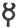

  
[Intangible Textual Heritage](../../index)  [Symbolism](../index) 
[Index](index)  [Previous](mosy15)  [Next](mosy17) 

------------------------------------------------------------------------

[Buy this Book at
Amazon.com](https://www.amazon.com/exec/obidos/ASIN/048641437X/internetsacredte)

------------------------------------------------------------------------

  
*The Migration of Symbols*, by Goblet d'Alviella, \[1894\], at
Intangible Textual Heritage

------------------------------------------------------------------------

#### II. The Origins of the Caduceus.

The Caduceus is one of the symbolic figures which have tried in the
highest degree the patience of scholars. Its classic appearance of a
winged rod, round which two serpents are symmetrically entwined, is very
far removed from its primitive form.

Greek monuments make known to us a period when it consisted of a circle,
or a disk, placed on

p. 227

the top of a stick, and surmounted by a crescent, making thus a kind of
figure 8 open at the top, 
.

In a still more remote age it seems to have formed a flowered bar with
three leaves, τριπέταλος, as Homer says.

Through what influence were these three leaves transformed into a disk,
surmounted by an incomplete circle?

The latter form appears so often on the Phœnician monuments that we are
forced to wonder, with M. Perrot, "whether the Caduceus was borrowed by
the Phœnicians from Greece and its Hermes, or whether the latter did not
rather

<table data-border="0">
<colgroup>
<col style="width: 50%" />
<col style="width: 50%" />
</colgroup>
<tbody>
<tr class="odd">
<td data-valign="top" width="463">
 

Fig. 129. Greek Caduceus. 
(Overbeck. <em>Kunstmythologie</em>, pl. xxxvi., fig. 6.)
</td>
<td data-valign="top" width="463">
 

Fig. 130. Punic Caduceus. 
(Perrot et Chipiez, vol. iii., p. 232.)
</td>
</tr>
</tbody>
</table>

appropriate this attribute from some eastern god, his elder by many
centuries." [1](#fn_434)

MM\. Perrot and Chipiez seem themselves to give a decisive answer to
their question when, in a later volume, they show us the Caduceus on
Hittite monuments of Asia Minor, where no one can dream of importations
from Greece. [2](#fn_435)

At Carthage the Caduceus is nearly always associated with the Sacred
Cone on *stelai* dedicated

p. 228

either to Tanit "the face of Baal," or conjointly to Baal Hamman and
Tanit. If it is likely that this Cone stands for the symbol of Tanit,
would it be rash to assume that the Caduceus represents either the
companion of the Great Goddess of Carthage, the Phœnician god of the
sun, or of the solar heat, Baal Hamman—or the usual hypostasis of Baal
Hamman, his "messenger" or "angel," Malac Baal [1](#fn_436)—or, finally, the third personage of the
triad composed of Baal, Tanit, and Iol or Iolaüs, the divine solar
infant, lost and found by turns like Atys and Adonis elsewhere? [2](#fn_437)

In all these cases the Caduceus might form the symbol of a solar
divinity, and what strengthens this assumption is the fact that on some
Libyan *stelai* the two Caducei which flank the Cone are sometimes
replaced by Wheels arranged in the same manner. [3](#fn_438)

Does not the Caduceus of the Greeks seem likewise to have been an
essentially solar emblem? According to the words of Homer it was a rod
of gold which alternately "charms the eyes of men and calls them from
their slumbers;" [4](#fn_439) it lures the dead
to Hades, and can bring them back to the light of day; lastly, like a
real magic wand, it changes all it touches into gold. I in no wise infer
therefrom that Hermes was a solar god, or even a god of the sun when
below the horizon. With the Greeks themselves, however, tradition makes
out that the Caduceus had been given him by Apollo in return for the
lyre.

Perhaps the Phœnician Caduceus passed to the hand of Hermes amongst
those Greek colonists

p. 229

of Cyrenaica who contributed more or less towards introducing Punic, and
even Egyptian elements into the religion as into the mythology of the
Hellenes. [1](#fn_440) Perhaps, too, the
transmission was brought about on Greek soil through direct intercourse
with Phœnician traders, who cannot but have diffused, with their
religious and artistic products, the attributes of their own national
divinities. [2](#fn_441)

 

Is it possible to retrace still further the history of the Caduceus?

Numerous origins and manifold antecedents

p. 230

have been attributed to it. It has alternately been considered to be an
equivalent of the Thunderbolt, a form of the Sacred Tree, a contraction
of the Scarab, a combination of the solar Globe and the Crescent of the
moon, and so forth. All these derivations may have some foundation in
fact. I once attempted to connect it with the Winged Globe, as a mere
hypothesis, to be sure, but in terms perhaps too affirmative for want of
having taken sufficiently into consideration the intervention of other
figures in the genesis of its forms. [1](#fn_442) I would now be more inclined to admit
that it was first of all an instrument, a weapon, a religious, or
military, ensign, gradually modified by coming into contact with other
figured representations, amongst which was the Winged Globe.

Bas-reliefs of Assyria exhibit military ensigns, prototypes, perhaps, of
the Constantinian *labarum*, which consist of a large ring placed on the
top of a staff, and girt with two loose bandelets ([fig.
131](#img_fig131)).

 

Fig. 131. Assyrian
Standard.

On the top of this ring—which M. Perrot has no hesitation in comparing
with the circle forming the girdle of Assur in certain solar adaptations
of the Winged Globe (see above, [fig. 118](mosy15.htm#img_fig118))—place
either the horns symbolical of divine power

p. 231

amongst the Mesopotamians, or the Crescent, so frequently coupled with
the Globe in the religious imagery of the Phœnicians, and the result
will be unquestionably the image of the Punic Caduceus.

On Hittite monuments Caducei are noticed which are terminated by a Globe
in relief, surmounted by a real pair of horns—a peculiarity which we
again meet with on a Tyrian amphora reproduced in

<table data-border="0">
<colgroup>
<col style="width: 50%" />
<col style="width: 50%" />
</colgroup>
<tbody>
<tr class="odd">
<td data-valign="top" width="463">
 

Fig. 132. Hittite Caduceus. 
(Perrot et Chipiez, vol. iv., fig. 353.)
</td>
<td data-valign="top" width="463">
 

Fig. 133. Variety of Greek Caduceus. 
(<em>Monuments céramogr.</em>, vol. iii., pl. 36 a.)
</td>
</tr>
</tbody>
</table>

\[paragraph continues\] De Witte and
Lenormant’s *Monuments céramographiques*.

The result is the same if we invert certain solar

 

Fig. 134 [1](#fn_443)

\[paragraph continues\] Globes of
Phœnicia, which are merely an abbreviation of the Winged Globe of Egypt,
as is easily seen from the two *uræus* snakes which encircle them,

p. 232

and the tufts of feathers by which they are surmounted ([fig.
134](#img_fig134)).

The very *uræi* here form the counterpart of the loose scrolls below the
Phœnician Caduceus ([fig. 135 a and b](#img_fig135)), as also underneath
the Assyrian ensign ([fig. 130](#img_fig130), and which are still
noticeable in the *stemmata* of some Greek Caducei.

We find, on a Sardinian cylinder, reproduced by MM. Perrot et Chipiez, a
curious alteration of the Winged Globe, in which the ornithomorphic
appendages are reduced to a reticular or pennated tail ([fig. 134
b](#img_fig134)). Putting aside the horns, which have at the same time
assumed the aspect of a fork, we cannot but be struck by the resemblance
of this symbol to those of the Phœnician Caducei, where the Disk seems
to be supported by a conical stem ([fig. 135 a](#img_fig135)). In other
places the horns are wanting,

 

Fig. 135. Caducées
Libyques.  
(A. W. S. Vaux. *Phœnician inscript.*,
pi. i., fig. 2, and pl. vii., fig. 20.)

notably in a Globe of Persepolis, which also rests on a triangular tail;
here, however, the *uræi* are lowered in such a manner as to form more
plainly the transition from the bandelets ([fig. 136](#img_fig136)). It
is worth while remarking that the Winged Globe was sometimes borne as a
standard at the

p. 233

end of a staff ([figs. 138](#img_fig138) and [139](#img_fig139)), in the
manner of the Caduceus and the Assyrian ensign.

 

Fig. 136. Persepolitan
Sculpture.  
(Guigniaut. *Op. cit.*, t. iv., pl.
xxii., fig. 117 *a*.)

Does it follow that the Caduceus was necessarily a derivation of the
Winged Globe? One might equally admit—and it is on this point I want to
insist—that it had an independent origin, and, at a later date, carne
under the influence of the Winged Globe, or, reciprocally, that certain
reproductions of the Winged Globe were modified on coming into contact
with it. [1](#fn_444)

It must indeed be mentioned that M. Ph. Berger was able, with the same
degree of likelihood, to connect the antecedents of the Caduceus among
the Phœnicians with the *ashêrah*, *i.e.*, with the stake entwined with
bandelets ([figs. 63](mosy11.htm#img_fig063),
[79](mosy12.htm#img_fig079)), and with the other analogous *simulacra*
which we saw representing among the Syrians the goddess of the earth, or
of Nature. [2](#fn_445)

In support of this opinion, or rather of the assumption that there is a
transition from the Sacred Tree surmounted by the solar Disk to the
Caduceus of the Phœnicians and the Hittites, I have here brought
together three figures taken from cylinders found in Asia Minor.

p. 234

In the first ([fig. 137](#img_fig137)) the Sacred Tree is still plainly
recognizable below the solar Disk; in the

<table data-border="0">
<colgroup>
<col style="width: 33%" />
<col style="width: 33%" />
<col style="width: 33%" />
</colgroup>
<tbody>
<tr class="odd">
<td data-valign="top" width="218">
 

Fig. 137.
</td>
<td data-valign="top" width="218">
 

Fig. 138.
</td>
<td data-valign="top" width="218">
 

Fig. 139. <a href="#fn_446">1</a>
</td>
</tr>
</tbody>
</table>

second ([fig. 138](#img_fig138)) it supports the latter; in the third
([fig. 139](#img_fig139)) we find nothing more than a stick supporting
the Winged Disk in the manner of a standard.

Let us now place side by side with these symbolic representations the
following figures taken from Mesopotamian cylinders.

 

Fig. 140. Mesopotamian
Cylinders. [2](#fn_447)

The wings of the Globe have here disappeared: on the other hand the
figures *a* and *b*, which are unquestionably connected with the
rudimentary forms of the Sacred Tree (*cf*. above, [fig.
61](mosy11.htm#img_fig061)) draw

p. 235

nearer at the same time to the Caduceus, as this last emblem appears in
fig. c under the form of a mace.

Whether we have here at last the prototype of the Caduceus, or whether
we are once again in the presence of other figurative representations
which had merely felt the influence of this mysterious emblem, is a
question which the relative age of the monuments concerned can alone
decide. If, however, as everything goes to prove, it is to Mesopotamia
that we must go for the earliest types of the Caduceus, nothing prevents
us from assuming that the latter came directly from Asia Minor to
Greece, without passing through the medium of the Libyan Caduceus.

As for the latest transformation which Greek art caused the Caduceus to
undergo, it may be questioned if the introduction of the serpents and
wings is not here evidence of a phenomenon of symbolic atavism, a return
to old, or foreign, forms; or even of the persistency of a plastic
tradition whose intermediate links have not come down to us. According
to some writers the serpents of the classic Caduceus would be due to a
transformation of the *stemmata* or scrolls which hang beneath the
Circle. Now, as I have above shown, these latter, in the Winged Globes
of Western Asia, are themselves a metamorphosis of the Egyptian *uræi*.
It must be also borne in mind that the serpent twined round the end of a
pole forms the symbol of Baal Hamman in the Punic imagery. [1](#fn_448) On the other hand, Fergusson alleges
having noticed live serpents intertwined in this manner; the Greek
artist would therefore have done nothing more than adjust to the
Caduceus an image provided by real life. [2](#fn_449)

p. 236

At any rate, it is owing to this æsthetic transformation that the
Caduceus was preserved until our own times to represent two functions of
the ancient Hermes, which are more in vogue than ever with the human
race, industry and commerce. Even in the matter of symbols nothing dies
which deserves to live, and is capable of transformation.

In India, likewise, the Caduceus has survived to the present time under
the form of two serpents intertwined. M. Guimet has found numerous
specimens amongst the carvings placed as *ex voto* in the Vishnu temples
of southern India. [1](#fn_450) It is probable
that this symbol was introduced into India in the track of Alexander. It
is found, indeed, on the coins of Sophytes, a native prince who copied
the monetary types of the Seleucid kings, and it continued to be
reproduced without interruption in the coinage of the Indo-Scythic
sovereigns. But it is also met with in India under a simpler form which,
like the earlier type of the Greek Caduceus, seems to be connected with
the

 

Fig. 141. Varieties of
Indian Caducei. [2](#fn_451)

\[paragraph continues\] Asiatic Caduceus
formed of a Disk surmounted by a Crescent. This combination, which is
sometimes

p. 237

placed on the top of a staff, and sometimes isolated like our
astronomical sign  ,
appears to have been confounded at an early date with the Buddhist
*trisula*, whose manifold transformations deserve a chapter for
themselves.

------------------------------------------------------------------------

### Footnotes

[226:1](mosy15.htm#fr_432) *Revue
archéologique* for 1865, vol. xi. (new series), p. 490.

[226:2](mosy15.htm#fr_433) See above, figs.
[117](mosy15.htm#img_fig117), [118](mosy15.htm#img_fig118),
[121](mosy15.htm#img_fig121), [123](mosy15.htm#img_fig123), also
[134B](#img_fig134), and [136](#img_fig136).

[227:1](mosy16.htm#fr_434) Perrot et Chipiez, vol. iii., p. 463.

[227:2](mosy16.htm#fr_435) Perrot et Chipiez, vol. iv., (*Judée*, *Syrie*, etc.,
figs. 274 and 353).

[228:1](mosy16.htm#fr_436) Ph. Berger *L’ange d’Astarté*, in the *Faculté
de théologie protestante à M. Edouard Reuss*. Paris, 1879, pp. 52–54.

[228:2](mosy16.htm#fr_437) Fr. Lenormant. *Gazette archéologique*, 1876,
p. 127.

[228:3](mosy16.htm#fr_438) *Corpus
inscriptionum semitic.*, fasc. iv., 1889; tab. liv., fig. 368.

[228:4](mosy16.htm#fr_439) *Odyssey*, v., lines
47, 48.

[229:1](mosy16.htm#fr_440) Maury. *Histoire des religions de la Grèce
antique*. Paris, 1859, vol. iii., p. 265 *et seq.*

[229:2](mosy16.htm#fr_441) It is not even
necessary for the Greeks to have believed in the identity of Hermes with
the foreign divinity from whom they thus derived the Caduceus. It is,
however, proper to point out that the analogies between Hermes and Baal
Hamman were too numerous not to have struck their respective worshippers
when once these gods came into contact with one another. Both are united
to the goddess of love, Aphrodite-Astarte. Both have the ram as their
sacred animal; this latter feature belongs to them in common with the
Ammon of the Libyans and the Ammon-Ra of the Egyptians. The divinity who
patronized the business dealings of the Phœnicians must have easily
passed, in the eyes of the Greeks, for the god of commerce, and we know
that Hermes appropriated this function in post Homeric times.

As for Malac Baal, M. Ph. Berger reminds us that he was, like Hermes, an
initiator, an intermediate agent between mankind, and the superior
divinity (*L’ange d’Astarte*, *loc. cit.*, pp. 52–54). Both are
represented and even personified by *stelai* and *hermata*, or
*bethels*. Both assume, at times, the human figure with wings, save that
Greek art placed the latter on the heels of its god; just as, in the
Caduceus, it changed the position of the wings of the Winged Globe.

It may be added that the Greeks themselves had been impressed with this
analogy between the messenger of Zeus and the hypostasis of Baal Hamman,
for Pausanias (Elis, xv.) informs us that in the prytaneum of Olympia
they rendered homage to Hera-Ammonia (probably Tanit), and to Parammon,
divinities of Libya. "Parammon," he adds, "is a surname of Hermes."

[230:1](mosy16.htm#fr_442) *Bulletin de l’Acad.
roy. de Belgique*, vol. xvi. (1888), p. 638 *et seq.*

[231:1](mosy16.htm#fr_443) *a*, See above,
[fig. 113](mosy15.htm#img_fig113); *b*, Sardinian scarab (Perrot et Chipiez, vol. iii., fig. 464).

[233:1](mosy16.htm#fr_444) On some coins of
Carthage the Caduceus alternates with the Winged Globe above the horse.
(Hunter, tab. xv., No. 14, and Lajard, pl. xlv., No. 5.)

[233:2](mosy16.htm#fr_445) *Gazette
archéologique* for 1880, p. 127.

[234:1](mosy16.htm#fr_446) Lajard. *Mithra*, pl. xxxiii., fig. 4.—Id., *Ibid*., pl. lvii., fig. 5.—J. Menant. *Pierres gravées*, fig. 112.

[234:2](mosy16.htm#fr_447) *a*, *Collection de
Clerq*, vol. i., pl. xxxi., fig. 330; *b*, Perrot et Chipiez, vol. ii., p. 342; c, Lajard. *Mithra*, pl. xxxviii., fig. 2.

[235:1](mosy16.htm#fr_448) Ph. Berger. *La Trinité carthaginoise* in the
*Gazette archéologique* for 1879, p. 135.

[235:2](mosy16.htm#fr_449) *Tree and Serpent
Worship*. Appendix.

[236:1](mosy16.htm#fr_450) *Huit jours aux
Indes*, in the *Tour du Monde* for 1885, 1st part, p. 244.—See also
Rivett Carnac. *The Snake Symbol in
India*, in the *Proceedings of the Asiatic Society of Bengal* 1879, part
i., pl. vi., fig. 4.

[236:2](mosy16.htm#fr_451) *a*, Percy Gardner. *Coins in the British Museum*.
*Greek and Scythic Kings of India and Bactria*, pl. xxii., fig. 9.

*b*, Senart. *Journal asiatique*, 1875,
vol. vi., p. 137.

*c*, Rivett Carnac. *Coins of the Sunga
or Mitra dynasty*, in the *Proceedings of the Asiatic Society of
Bengal*, 1880, vol. xlix., pl. ix., fig. 19.

------------------------------------------------------------------------

[Next: III. The Transformations of the Trisula](mosy17)
