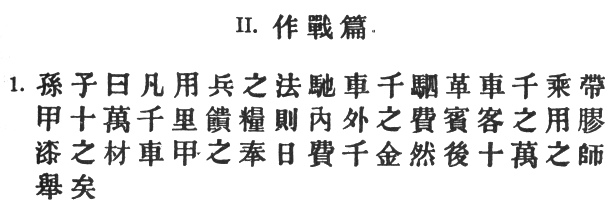
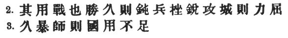
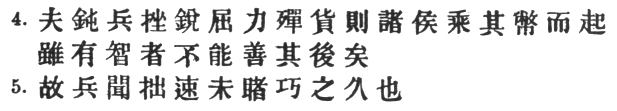
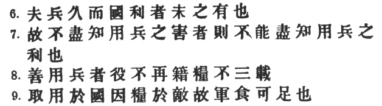
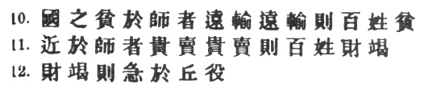
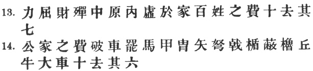
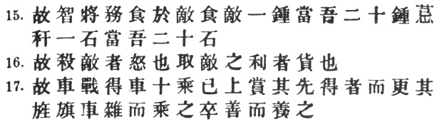
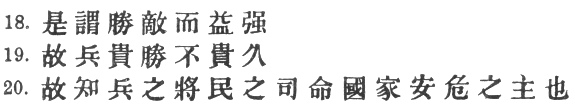

  
[Intangible Textual Heritage](../../index)  [Taoism](../index) 
[Confucianism](../../cfu/index)  [Index](index)  [Previous](aow09) 
[Next](aow11) 

------------------------------------------------------------------------

[Buy this Book at
Amazon.com](https://www.amazon.com/exec/obidos/ASIN/1934255122/internetsacredte)

------------------------------------------------------------------------

  
*The Art of War*, by Lionel Giles, \[1910\], at Intangible Textual
Heritage

------------------------------------------------------------------------

p. 9

 

### II. WAGING WAR [1](#fn_194).

1\. Sun Tzŭ said: In the operations of war, where there are in the field
a thousand swift chariots, as many heavy chariots, and a hundred
thousand mail-clad soldiers, [2](#fn_195) with
provisions enough to carry them a thousand *li*, [3](#fn_196) the expenditure at home and at the
front, including entertainment of guests, small items such as glue and
paint,

p. 10

 

and sums spent on chariots and armour, will reach the total of a
thousand ounces of silver per day. [1](#fn_197)
Such is the cost of raising an army of 100,000 men. [2](#fn_198)

2\. When you engage in actual fighting, if victory is long in coming,
the men's weapons will grow dull and their ardour will be damped. [3](#fn_199) If you lay siege to a town, you will
exhaust your strength. [4](#fn_200)

3\. Again, if the campaign is protracted, the resources of the State
will not be equal to the strain. [5](#fn_201)

p. 11

 

4\. Now, when your weapons are dulled, your ardour damped, your strength
exhausted and your treasure spent, other chieftains will spring up to
take advantage of your extremity. Then no man, however wise, will be
able to avert the consequences that must ensue. [1](#fn_202)

5\. Thus, though we have heard of stupid haste in war, cleverness has
never been seen associated with long delays. [2](#fn_203)

p. 12

 

6\. There is no instance of a country having benefited from prolonged
warfare. [1](#fn_204)

7\. It is only one who is thoroughly acquainted with the evils of war
that can thoroughly understand the profitable way of carrying it
on. [2](#fn_205)

8\. The skilful soldier does not raise a second levy, neither are his
supply-waggons loaded more than twice. [3](#fn_206)

9\. Bring war material with you from home, but forage on the enemy. Thus
the army will have food enough for its needs. [4](#fn_207)

p. 13

 

10\. Poverty of the State exchequer causes an army to be maintained by
contributions from a distance. Contributing to maintain an army at a
distance causes the people to be impoverished. [1](#fn_208)

11\. On the other hand, the proximity of an army causes prices to go up;
and high prices cause the people's substance to be drained away. [2](#fn_209)

12\. When their substance is drained away, the peasantry will be
afflicted by heavy exactions. [3](#fn_210)

p. 14

 

13, 14. With this loss of substance and exhaustion of strength, the
homes of the people will be stripped bare, and three-tenths of their
incomes will be dissipated; [1](#fn_211) while
Government expenses for broken chariots, worn-out horses, breast-plates
and helmets, bows and arrows, spears and shields, protective mantlets,
draught-oxen and heavy waggons, will amount to four-tenths of its total
revenue. [2](#fn_212)

p. 15

 

15\. Hence a wise general makes a point of foraging on the enemy. One
cartload of the enemy's provisions is equivalent to twenty of one's own,
and likewise a single picul of his provender is equivalent to twenty
from one's own store. [1](#fn_213)

16\. Now in order to kill the enemy, our men must be roused to anger;
that there may be advantage from defeating the enemy, they must have
their rewards. [2](#fn_214)

17\. Therefore in chariot fighting, when ten or more chariots have been
taken, those should be rewarded who took the first. [3](#fn_215)

p. 16

 

\[paragraph continues\] Our own flags
should he substituted for those of the enemy, and the chariots mingled
and used in conjunction with ours. The captured soldiers should be
kindly treated and kept.

18\. This is called, using the conquered foe to augment one's own
strength.

19\. In war, then, let your great object be victory, not lengthy
campaigns. [1](#fn_216)

20\. Thus it may be known that the leader of armies is the arbiter of
the people's fate, the man on whom it depends whether the nation shall
be in peace or in peril. [2](#fn_217)

------------------------------------------------------------------------

### Footnotes

[9:1](aow10.htm#fr_195) Ts‘ao Kung has the
note: \# "He who wishes to fight must first count the cost," which
prepares us for the discovery that the subject of the chapter is not
what we might expect from the title, but is primarily a consideration of
ways and means.

[9:2](aow10.htm#fr_196) The \# were lightly
built and, according to Chang Yü, used for the attack; the \# were
heavier, and designed for purposes of defence. Li Ch‘üan, it is true,
says that the latter were light, but this seems hardly. probable. Capt.
Calthrop translates "chariots" and "supply wagons" respectively, but is
not supported by any commentator. It is interesting to note the
analogies between early Chinese warfare and that of the Homeric Greeks.
In each case, the war-chariot was the important factor, forming as it
did the nucleus round which was grouped a certain number of
foot-soldiers. With regard to the numbers given here, we are informed
that each swift chariot was accompanied by 75 footmen, and each heavy
chariot by 25 footmen, so that the whole army would be divided up into a
thousand battalions, each consisting of two chariots and a hundred men.

[9:3](aow10.htm#fr_197) 2.78 modern *li* go to
a mile. The length may have varied slightly since Sun Tzŭ's time.

[10:1](aow10.htm#fr_198) \#, which follows \#
in the *textus receptus*, is important as indicating the apodosis. In
the text adopted by Capt. Calthrop it is omitted, so that he is led to
give this meaningless translation of the opening sentence: "Now the
requirements of War are such that we need 1,000 chariots," etc. The
second, which is redundant, is omitted in the *Yü Lan*. \#, like \#
above, is meant to suggest a large but indefinite number. As the Chinese
have never possessed gold coins, it is incorrect to translate it "1000
pieces of gold."

[10:2](aow10.htm#fr_199) Capt. Calthrop adds:
"You have the instruments of victory," which he seems to get from the
first five characters of the next sentence.

[10:3](aow10.htm#fr_200) The *Yü Lan* omits \#;
but though \# is certainly a bold phrase, it is more likely to be right
than not. Both in this place and in § 4, the *T‘ung Tien* and *Yü Lan*
read \# (in the sense of "to injure") instead of \#.

[10:4](aow10.htm#fr_201) As synonyms to \# are
given \#, \#, \# and \#.

[10:5](aow10.htm#fr_202) \# means literally,
"If there is long exposure of the army." Of \# in this sense K‘ang Hsi
cites an instance from the biography of \# Tou Jung in the *Hou Han
Shu*, where the commentary defines it by \#. Cf. also the following from
the \#: \# "General, you have long been exposed to all weathers."

[11:1](aow10.htm#fr_203) Following Tu Yu, I
understand \# in the sense of "to make good," i.e. to mend. But Tu Mu
and Ho Shih explain it as "to make good plans"—for the future.

[11:2](aow10.htm#fr_204) This concise and
difficult sentence is not well explained by any of the commentators.
Ts‘ao Kung, Li Ch‘üan, Mêng Shih, Tu Yu, Tu Mu and Mei Yao-ch‘ên have
notes to the effect that a general, though naturally stupid, may
nevertheless conquer through sheer force of rapidity. Ho Shih says:
"Haste may be stupid, but at any rate it saves expenditure of energy and
treasure; protracted operations may be very clever, but they bring
calamity in their train." Wang Hsi evades the difficulty by remarking:
"Lengthy operations mean an army growing old, wealth being expended, an
empty exchequer and distress among the people; true cleverness insures
against the occurrence of such calamities." Chang Yü says: "So long as
victory can be attained, stupid haste is preferable to clever
dilatoriness." Now Sun Tzŭ says nothing whatever, except possibly by
implication, about ill-considered haste being better than ingenious but
lengthy operations. What he does say is something much more guarded,
namely that, while speed may sometimes be injudicious, tardiness can
never be anything but foolish—if only because it means impoverishment to
the nation. Capt. Calthrop indulges his imagination with the following:
"Therefore it is acknowledged that war cannot be too short in duration.
But though conducted with the utmost art, if long continuing,
misfortunes do always appear." It is hardly worth while to note the
total disappearance of \# in this precious concoction. In considering
the point raised here by Sun Tzŭ, the classic example of Fabius
Cunctator will inevitably occur td the mind. That general deliberately
measured the endurance of Rome against that of Hannibal's isolated army,
because it seemed to him that the latter was more likely to suffer from
a long campaign in a strange country. But it is quite a moot question
whether his tactics would have proved successful in the long run. Their
reversal it is true, led to Cannae; but this only establishes a negative
presumption in their favour.

[12:1](aow10.htm#fr_205) The *Yü Lan* has \#
instead of \#—evidently the mistake of a scribe.

[12:2](aow10.htm#fr_206) That is, with
rapidity. Only one who knows the disastrous effects of a long war can
realise the supreme importance of rapidity in bringing it to a close.
Only two commentators seem to favour this interpretation, but it fits
well into the logic of the context, whereas the rendering, "He who does
not know the evils of war cannot appreciate its benefits," is distinctly
pointless.

[12:3](aow10.htm#fr_207) Once war is declared,
he will not waste precious time in waiting for reinforcements, nor will
he turn his army back for fresh supplies, but crosses the enemy's
frontier without delay. This may seem an audacious policy to recommend,
but with all great strategists, from Julius Caesar to Napoleon
Buonaparte, the value of time—that is, being a little ahead of your
opponent—has counted for more than either numerical superiority or the
nicest calculations with regard to commissariat. \# is used in the sense
of \#. The *T‘ung Tien* and *Yü Lan* have the inferior reading \#. The
commentators explain \# by saying that the waggons are loaded once
before passing the frontier, and that the army is met by a further
consignment of supplies on the homeward march. The *Yü Lan*, however,
reads \# here as well.

[12:4](aow10.htm#fr_208) \#, "things to be
used," in the widest sense. It includes all the impedimenta of an army,
apart from provisions.

[13:1](aow10.htm#fr_209) The beginning of this
sentence does not balance properly with the next, though obviously
intended to do so. The arrangement, moreover, is so awkward that I
cannot help suspecting some corruption in the text. It never seems to
occur to Chinese commentators that an emendation may be necessary for
the sense, and we get no help from them here. Sun Tzŭ says that the
cause of the people's impoverishment is \#; it is clear, therefore, that
the words have reference to some system by which the husbandmen sent
their contributions of corn to the army direct. But why should it fall
on them to maintain an army in this way, except because the State or
Government is too poor to do so? Assuming then that \# ought to stand
first in the sentence in order to balance \# (the fact that the two
words rhyme is significant), and thus getting rid of \#, we are still
left with \#, which latter word seems to me an obvious mistake for \#.
"Poverty in the army" is an unlikely expression, especially as the
general has just been warned not to encumber his army with a large
quantity of supplies. If we suppose that \# somehow got written here
instead of \# (a very simple supposition, as we have \# in the next
sentence), and that later on somebody, scenting a mistake, prefixed the
gloss \# to \#, without however erasing \#, the whole muddle may be
explained. My emended text then would be \#, etc.

[13:2](aow10.htm#fr_210) \#, that is, as Wang
Hsi says, before the army has left its own territory. Ts‘ao Kung
understands it of an army that has already crossed the frontier. Capt.
Calthrop drops the \#, reading \#, but even so it is impossible to
justify his translation "Repeated wars cause high prices."

[13:3](aow10.htm#fr_211) p.
14 Cf. Mencius VII. 2. xiv. 2, where \# has the same meaning as
\#. \# was an ancient measure of land. The full table, as given by \#,
may not be out of place here: 6 \# = 1 ; 100 \# = 1 \#; 100 \# = \#; 3
\# = 1 \#; 3 \# = \#; 4 \# = 1 \#; 4 \# =1 \#; 4 \# = 1 \#. According to
the *Chou Li*, there were nine husbandmen to a \#, which would assign to
each man the goodly allowance of 100 \# (of which 6.6 now go to an
acre). What the values of these measures were in Sun Tzŭ's time is not
known with any certainty. The lineal \# however, is supposed to have
been about 20 cm., \# may include levies of men, as well as other
exactions.

[14:1](aow10.htm#fr_212) The *Yü Lan* omits \#.
I would propose the emended reading \#, etc. In view of the fact that we
have \# in the two preceding paragraphs, it seems probable that \# is a
scribe's mistake for \#, having been added afterwards to make sense. \#,
literally: "Within the middle plains there is emptiness in the homes."
For \# cf. *Shih Ching* II. 3. vi. 3 and II. 5. 11. 3. With regard to
\#, Tu Mu says: \#, and Wang Hsi: \# ; that is, the people are mulcted
not of 3/10, but of 7/10, of their income. But this is hardly to be
extracted from our text. Ho Shih has a characteristic tag: \# "The
*people* being regarded as the essential part of the State, and *food*
as the people's heaven, is it not right that those in authority should
value and be careful of both?"

[14:2](aow10.htm#fr_213) p.
15 The *Yü Lan* has several various readings here, the more
important of which are for the less common \# (read *p‘i*2),
\# for \#, and \# for \#, which latter, if right, must mean "oxen from
the country districts" (cf. *supra*, § 12). For the meaning of \#, see
note on III, § 4. Capt. Calthrop omits to translate \#.

[15:1](aow10.htm#fr_214) Because twenty
cartloads will be consumed in the process of transporting one cartload
to the front. According to Ts‘ao Kung, \# = 6 \# 4, or 64 \#, but
according to Mêng Shih, 10 \# make a \#. The \# picul consisted of 70 \#
catties (Tu Mu and others say 120). \#, literally, "beanstalks and
straw."

[15:2](aow10.htm#fr_215) These are two
difficult sentences, which I have translated in accordance with Mei
Yao-ch‘ên's paraphrase. We may incontinently reject Capt. Calthrop's
extraordinary translation of the first: "Wantonly to kill and destroy
the enemy must be forbidden." Ts‘ao Kung quotes a jingle current in his
day: \#. Tu Mu says: "Rewards are necessary in order to make the
soldiers see the advantage of beating the enemy; thus, when you capture
spoils from the enemy, they must be used as rewards, so that all your
men may have a keen desire to fight, each on his own account. Chang Yü
takes \# as the direct object of \#; which is not so good.

[15:3](aow10.htm#fr_216) p.
16 Capt. Calthrop's rendering is: "They who are the first to lay
their hands on more than ten of the enemy's chariots, should be
encouraged." We should have expected the gallant captain to see that
such Samson-like prowess deserved something more substantial than mere
encouragement. T. omits \#, and has \# in place of the more archaic \#.

[16:1](aow10.htm#fr_217) As Ho Shih remarks: \#
"War is not a thing to be trifled with." Sun Tzŭ here reiterates the
main lesson which this chapter is intended to enforce.

[16:2](aow10.htm#fr_218) In the original text,
there is a \# before the \#.

------------------------------------------------------------------------

[Next: III. Attack By Stratagem](aow11)
