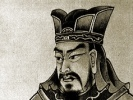
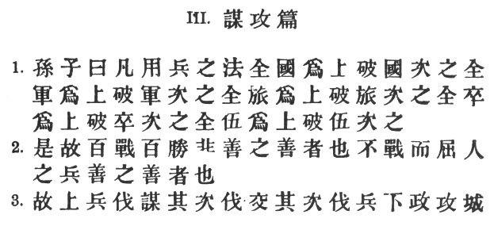
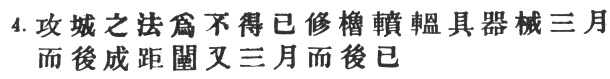
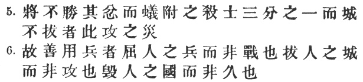
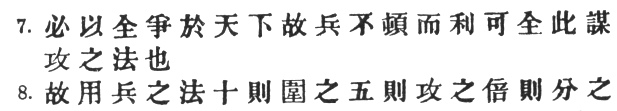
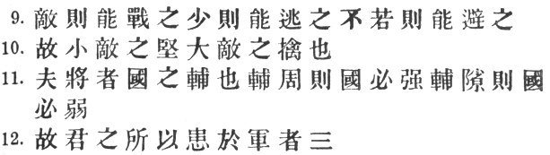
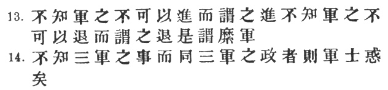
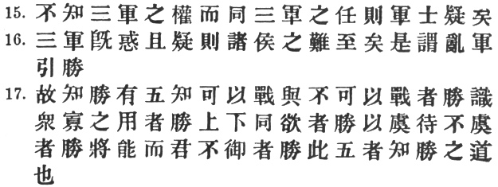
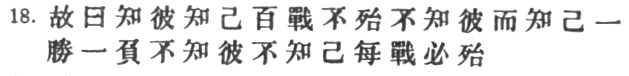

  
[Intangible Textual Heritage](../../index)  [Taoism](../index) 
[Confucianism](../../cfu/index)  [Index](index)  [Previous](aow10) 
[Next](aow12) 

------------------------------------------------------------------------

[Buy this Book at
Amazon.com](https://www.amazon.com/exec/obidos/ASIN/1934255122/internetsacredte)

------------------------------------------------------------------------

  
*The Art of War*, by Lionel Giles, \[1910\], at Intangible Textual
Heritage

------------------------------------------------------------------------

p. 17

 

### III. ATTACK BY STRATAGEM.

1\. Sun Tzŭ said: In the practical art of war, the best thing of all is
to take the enemy's country whole and intact; to shatter and destroy it
is not so good. So, too, it is better to capture an army entire than to
destroy it, to capture a regiment, a detachment or a company entire than
to destroy them. [1](#fn_218)

2\. Hence to fight and conquer in all your battles is not supreme
excellence; supreme excellence consists in breaking the enemy's
resistance without fighting. [2](#fn_219)

3\. Thus the highest form of generalship is to baulk the enemy's
plans; [3](#fn_220)

p. 18

 

the next best is to prevent the junction of the enemy's forces; [1](#fn_221) the next in order is to attack the
enemy's army in the field; [2](#fn_222) and the
worst policy of all is to besiege walled cities. [3](#fn_223)

4\. The rule, is, not to besiege walled cities if it can possibly be
avoided. [4](#fn_224)

The preparation of mantlets, movable shelters, and various implements of
war, will take up three whole months; [5](#fn_225)

p. 19

 

and the piling up of mounds over against the walls will take three
months more. [1](#fn_226)

5\. The general, unable to control his irritation, will launch his men
to the assault like swarming ants, [2](#fn_227)
with the result that one-third of his men are slain, while the town
still remains untaken. Such are the disastrous effects of a siege. [3](#fn_228)

6\. Therefore the skilful leader subdues the enemy's troops without any
fighting; he captures their cities without

p. 20

 

laying siege to them; he overthrows their kingdom without lengthy
operations in the field. [1](#fn_229)

7\. With his forces intact he will dispute the mastery of the Empire,
and thus, without losing a man, his triumph will be complete. [2](#fn_230)

This is the method of attacking by stratagem.

8\. It is the rule in war, if our forces are ten to the enemy's one, to
surround him; if five to one, to attack him; [3](#fn_231) if twice as numerous, to divide our army
into two. [4](#fn_232)

p. 21

 

9\. If equally matched, we can offer battle; [1](#fn_233) if slightly inferior in numbers, we can
avoid the enemy; [2](#fn_234) if quite unequal
in every way, we can flee from him.

10\. Hence, though an obstinate fight may be made by a small force, in
the end it must be captured by the larger force. [3](#fn_235)

11\. Now the general is the bulwark of the State: if the bulwark is
complete at all points, the State will be strong; if the bulwark is
defective, the State will be weak. [4](#fn_236)

12\. There are three ways in which a ruler can bring misfortune upon his
army:—

p. 22

 

13\. (1) By commanding the army to advance or to retreat, being ignorant
of the fact that it cannot obey. This is called hobbling the army. [1](#fn_237)

14\. (2) By attempting to govern an army in the same way as he
administers a kingdom, being ignorant of the conditions which obtain in
an army. This causes restlessness in the soldier's minds. [2](#fn_238)

p. 23

 

15\. (3) By employing the officers of his army without
discrimination, [1](#fn_239) through ignorance
of the military principle of adaptation to circumstances. This shakes
the confidence of the soldiers. [2](#fn_240)

16\. But when the army is restless and distrustful, trouble is sure to
come from the other feudal princes. This is simply bringing anarchy into
the army, and flinging victory away. [3](#fn_241)

17\. Thus we may know that there are five essentials

p. 24

 

for victory: (1) He will win who knows when to fight and when not to
fight. [1](#fn_242)

\(2\) He will win who knows how to handle both superior and inferior
forces. [2](#fn_243)

\(3\) He will win whose army is animated by the same spirit throughout
all its ranks. [3](#fn_244)

\(4\) He will win who, prepared himself, waits to take the enemy
unprepared.

\(5\) He will win who has military capacity and is not interfered with
by the sovereign. [4](#fn_245)

Victory lies in the knowledge of these five points. [5](#fn_246)

18\. Hence the saying: If you know the enemy and know yourself, you need
not fear the result of a hundred

p. 25

battles. If you know yourself but not the enemy, for every victory
gained you will also suffer a defeat. [1](#fn_247) If you know neither the enemy nor
yourself, you will succumb in every battle. [2](#fn_248)

------------------------------------------------------------------------

### Footnotes

[17:1](aow11.htm#fr_219) A \# "army corps,"
according to Ssŭ-ma Fa, consisted nominally of t2500 men; according to
Ts‘ao Kung, a \# contained 500 men, a \# any number between 100 and 500,
and a \# any number between 5 and 100. For the last two, however, Chang
Yü gives the exact figures of 100 and 5 respectively.

[17:2](aow11.htm#fr_220) Here again, no modern
strategist but will approve the words of the old Chinese general.
Moltke's greatest triumph, the capitulation of the huge French army at
Sedan, was won practically without bloodshed.

[17:3](aow11.htm#fr_221) p.
18 *I.e.*, as Li Ch‘üan says (\#), in their very inception.
Perhaps the word "baulk" falls short of expressing the full force of \#,
which implies not an attitude of defence, whereby one might be content
to foil the enemy's stratagems one after another, but an active policy
of counter-attack. Ho Shih puts this very clearly in his note: "When the
enemy has made a plan of attack against us, we must anticipate him by
delivering our own attack first."

[18:1](aow11.htm#fr_222) Isolating him from his
allies. We must not forget that Sun Tzŭ, in speaking of hostilities,
always has in mind the numerous states or principalities into which the
China of his day was split up.

[18:2](aow11.htm#fr_223) When he is already in
full strength.

[18:3](aow11.htm#fr_224) The use of the word \#
is somewhat unusual, which may account for the reading of the modern
text: \#.

[18:4](aow11.htm#fr_225) Another sound piece of
military theory. Had the Boers acted upon it in 1899, and refrained from
dissipating their strength before Kimberley, Mafeking, or even
Ladysmith, it is more than probable that they would have been masters of
the situation before the British were ready seriously to oppose them.

[18:5](aow11.htm#fr_226) It is not quite clear
what \# were. Ts‘ao Kung simply defines them as \# "large shields," but
we get a better idea of them from Li Ch‘üan, who says they were to
protect the heads of those who were assaulting the city walls at close
quarters. This seems to suggest a sort of Roman *testudo*, ready made.
Tu Mu says they were "what are now termed \#" (wheeled vehicles used in
repelling attacks, according to K‘ang Hsi), but this is denied by Ch‘ên
Hao. See *supra*, II. 14. The name is also applied to turrets on city
walls. Of \# (*fên yün*) we get p. 19 a fairly
clear description from several commentators. They were wooden
missile-proof structures on four wheels, propelled from within, covered
over with raw hides, and used in sieges to convey parties of men to and
from the walls, for the purpose of filling up the encircling moat with
earth. Tu Mu adds that they are now called \# "wooden donkeys." Capt.
Calthrop wrongly translates the term, "battering-rams." I follow Ts‘ao
Kung in taking \# as a verb, co-ordinate and synonymous with \#. Those
commentators who regard \# as an adjective equivalent to \# "long," make
presumably \# into a noun.

[19:1](aow11.htm#fr_227) The \# (or \#, in the
modern text) were great mounds or ramparts of earth heaped up to the
level of the enemy's walls in order to discover the weak points in the
defence, and also to destroy the \# fortified turrets mentioned in the
preceding note. Tu Yu quotes the *Tso Chuan*: \#.

[19:2](aow11.htm#fr_228) Capt. Calthrop
unaccountably omits this vivid simile, which, as Ts‘ao Kung says, is
taken from the spectacle of an army of ants climbing a wall. The meaning
is that the general, losing patience at the long delay, may make a
premature attempt to storm the place before his engines of war are
ready.

[19:3](aow11.htm#fr_229) We are reminded of the
terrible losses of the Japanese before Port Arthur, in the most recent
siege which history has to record. The *T‘ung Tien* reads \#. For \# the
*Yü Lan* has \#. Capt. Calthrop does not translate \#, and mistranslates
\#.

[20:1](aow11.htm#fr_230) Chia Lin notes that he
only overthrows the \#, that is, the Government, but does no harm to
individuals. The classical instance is Wu Wang, who after having put an
end to the Yin dynasty was acclaimed "Father and mother of the people."

[20:2](aow11.htm#fr_231) Owing to the double
meanings of \#, \# \[= \#\] and \#, the latter part of the sentence is
susceptible of quite a different meaning: "And thus, the weapon not
being blunted by use, its keenness remains perfect." Chang Yü says that
\# is "the advantage of a prosperous kingdom and a strong army."

[20:3](aow11.htm#fr_232) Straightaway, without
waiting for any further advantage.

[20:4](aow11.htm#fr_233) Note that \# does not
refer to the enemy, as in the two preceding clauses. This sudden change
of object is quite common in Chinese. Tu Mu takes exception to the
saying; and at first sight, indeed, it appears to violate a fundamental
principle of war. Ts‘ao Kung, however, gives a clue to Sun Tzŭ's
meaning: \# "Being two to the enemy's one, we may use one part of our
army in the regular way, and the other for some special diversion."
\[For explanation of \# and \#, see V. 3, note.\] Chang Yü thus further
elucidates the point: "If our force is twice as numerous as that of the
enemy, it should be split up into two divisions, one to meet the enemy
in front, and one to fall upon his rear; if he replies to the frontal
attack, he may be crushed from behind; if to the rearward attack, he may
be crushed in front. This is what is meant by saying that "one part may
be used in the regular way, and the other for some special diversion."
Tu Mu does not understand that dividing one's army is simply an
irregular, just as concentrating it is the regular, strategical method,
and he is too hasty in calling this a mistake."

[21:1](aow11.htm#fr_234) Li Ch‘üan, followed by
Ho Shih, gives the following paraphrase: \# "If attackers and attacked
are equally matched in strength, only the able general will fight." He
thus takes \# as though it were \#, which is awkward.

[21:2](aow11.htm#fr_235) The *T‘u Shu* has \#
instead of \#, which is hardly distinguishable in sense from \# in the
next clause. The meaning, "we can *watch* the enemy," is certainly a
great improvement on the above; but unfortunately there appears to be no
very good authority for the variant. Chang Yü reminds us that the saying
only applies if the other factors are equal; a small difference in
numbers is often more than counterbalanced by superior energy and
discipline.

[21:3](aow11.htm#fr_236) In other words: "C’est
magnifique; mais ce n’est pas la guerre."

[21:4](aow11.htm#fr_237) \# cannot be
restricted to anything so particular as in Capt. Calthrop's translation,
"divided in his allegiance." It is simply keeping up the metaphor
suggested by \#. As Li Ch‘üan tersely puts it: \# "*Ch‘i*, gap,
indicates deficiency; if the general's ability is not perfect (i.e. if
he is not thoroughly versed in his profession), his army will lack
strength."

[22:1](aow11.htm#fr_238) Ts‘ao Kung weakly
defines \# as \# "control," "direct." Cf. § 17 *ad fin*. But in reality
it is one of those graphic metaphors which from time to time illuminate
Sun Tzŭ's work, and is rightly explained by Li Ch‘üan as = \#. He adds
the comment: \# "It is like tying together the legs of a thoroughbred,
so that it is unable to gallop." One would naturally think of "the
ruler" in this passage as being at home, and trying to direct the
movements of his army from a distance. But the commentators understand
just the reverse, and quote the saying of T‘ai Kung: \# "A kingdom
should not be governed from without, an army should not be directed from
within." Of course it is true that, during an engagement, or when in
close touch with the enemy, the general should not be in the thick of
his own troops, but a little distance apart. Otherwise, he will be
liable to misjudge the position as a whole, and give wrong orders.

[22:2](aow11.htm#fr_239) Ts‘ao Kung's note is:
\#, which may be freely translated: "The military sphere and the civil
sphere are wholly distinct; you can't handle an army in kid gloves." And
Chang Yü says: "Humanity and justice (\#) are the principles on which to
govern a state, but not an army; opportunism and flexibility (\#), on
the other hand, are military rather than civic virtues." \#, "to
assimilate the governing of an army"—to that of a State, understood. The
*T‘ung Tien* has \# inserted before \#, here and in §15.

[23:1](aow11.htm#fr_240) That is, he is not
careful to use the right man in the right place.

[23:2](aow11.htm#fr_241) I follow Mei Yao-ch‘ên
here. The other commentators make \# etc. refer, not to the ruler, as in
§§ 13, 14, but to the officers he employs. Thus Tu Yu says: \# "If a
general is ignorant of the principle of adaptability, he must not be
entrusted with a position of authority." Tu Mu quotes \#: "The skilful
employer of men will employ the wise man, the brave man, the covetous
man, and the stupid man. For the wise man delights in establishing his
merit, the brave man likes to show his courage in action, the covetous
man is quick at seizing advantages, and the stupid man has no fear of
death." The *T‘ung Tien* reads \#, which Tu Yu explains as \# "is
utterly defeated." Capt. Calthrop gives a very inaccurate rendering:
"Ignorant of the situation of the army, to interfere in its
dispositions."

[23:3](aow11.htm#fr_242) Most of the
commentators take \# in the sense of \#, which it seems to bear also in
the *Li Chi*, \#, I. 18. \[\# is there given as its equivalent, but
Legge tries notwithstanding to retain the more usual sense, translating
"draw … back," which is hardly defensible.\] Tu Mu and Wang Hsi,
however, think \# means "leading up to the *enemy's* victory."

[24:1](aow11.htm#fr_243) Chang Yü says: "If he
can fight, he advances and takes the offensive; if he cannot fight, he
retreats and remains on the defensive. He will invariably conquer who
knows whether it is right to take the offensive or the defensive."

[24:2](aow11.htm#fr_244) This is not merely the
general's ability to estimate numbers correctly, as Li Ch‘üan and others
make out. Chang Yü expounds the saying more satisfactorily: "By applying
the art of war, it is possible with a lesser force to defeat a greater,
and *vice versâ*. The secret lies in an eye for locality, and in not
letting the right moment slip. Thus Wu Tzŭ says: 'With a superior force,
make for easy ground; with an inferior one, make for difficult ground.'"

[24:3](aow11.htm#fr_245) Ts‘ao Kung refers \#
less well to sovereign and subjects.

[24:4](aow11.htm#fr_246) Tu Yu quotes \# as
saying: \# "It is the sovereign's function to give broad instructions,
but to decide on battle is the function of the general." It is needless
to dilate on the military disasters which have been caused by undue
interference with operations in the field on the part of the home
government. Napoleon undoubtedly owed much of his extraordinary success
to the fact that he was not hampered by any central authority,—that he
was, in fact, \# and \# in one.

[24:5](aow11.htm#fr_247) Literally, "These five
things are knowledge of the principle of victory."

[25:1](aow11.htm#fr_248) Li Ch‘üan cites the
case of \# Fu Chien, prince of \# Ch‘in, who in 383 A.D. marched with a
vast army against the \# Chin Emperor. When warned not to despise an
enemy who could command the services of such men as \# Hsieh An and \#
Huan Ch‘ung, he boastfully replied: "I have the population of eight
provinces at my back, infantry and horsemen to the number of one
million; why, they could dam up the Yangtsze River itself by merely
throwing their whips into the stream. What danger have I to fear?"
Nevertheless, his forces were soon after disastrously routed at the \#
Fei River, and he was obliged to beat a hasty retreat.

[25:2](aow11.htm#fr_249) The modern text,
represented by the \# and *T‘u Shu*, has \#, which I should be inclined
to adopt in preference to here, though the *T‘ung Tien* and *Yü Lan*
both have the latter. Chang Yü offers the best commentary on \#. He says
that these words "have reference to attack and defence: knowing the
enemy enables you to take the offensive, knowing yourself enables you to
stand on the defensive." He adds: \# "Attack is the secret of defence;
defence is the planning of an attack." It would be hard to find a better
epitome of the root-principle of war.

------------------------------------------------------------------------

[Next: IV. Tactical Dispositions](aow12)
