  
[Intangible Textual Heritage](../../index)  [Taoism](../index) 
[Confucianism](../../cfu/index)  [Index](index)  [Previous](aow14) 
[Next](aow16) 

------------------------------------------------------------------------

[Buy this Book at
Amazon.com](https://www.amazon.com/exec/obidos/ASIN/1934255122/internetsacredte)

------------------------------------------------------------------------

  
*The Art of War*, by Lionel Giles, \[1910\], at Intangible Textual
Heritage

------------------------------------------------------------------------

p. 55

 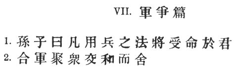

### VII. MANŒUVRING [1](#fn_345).

1\. Sun Tzŭ said: In war, the general receives his commands from the
sovereign. [2](#fn_346)

2\. Having collected an army and concentrated his forces, he must blend
and harmonise the different elements thereof before pitching his
camp. [3](#fn_347)

p. 56

 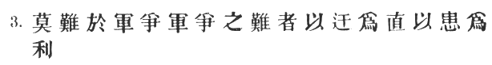

3\. After that, comes tactical manœuvring, than which there is nothing
more difficult. [1](#fn_348)

The difficulty of tactical manœuvring consists in turning the devious
into the direct, and misfortune into gain. [2](#fn_349)

p. 57

 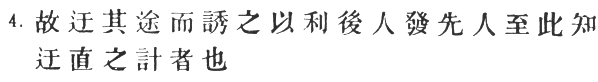

4\. Thus, to take a long and circuitous route, after enticing the enemy
out of the way, and though starting after him, to contrive to reach the
goal before him, shows knowledge of the artifice of *deviation*. [1](#fn_350)

p. 58

 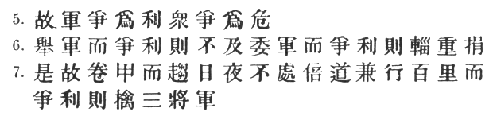

5\. Manœuvring with an army is advantageous; with an undisciplined
multitude, most dangerous. [1](#fn_351)

6\. If you set a fully equipped army in march in order to snatch an
advantage, the chances are that you will be too late. [2](#fn_352) On the other hand, to detach a flying
column for the purpose involves the sacrifice of its baggage and
stores. [3](#fn_353)

7\. Thus, if you order your men to roll up their buff-coats, [4](#fn_354)

p. 59

 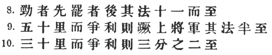

and make forced marches without halting day or night, covering double
the usual distance at a stretch, [1](#fn_355)
doing a hundred *li* in order to wrest an advantage, the leaders of all
your three divisions will fall into the hands of the enemy.

8\. The stronger men will be in front, the jaded ones will fall behind,
and on this plan only one-tenth of your army will reach its
destination. [2](#fn_356)

9\. If you march fifty *li* in order to outmanœuvre the enemy, you will
lose the leader of your first division, and only half your force will
reach the goal. [3](#fn_357)

10\. If you march thirty *li* with the same object, two-thirds of your
army will arrive. [4](#fn_358)

p. 60

 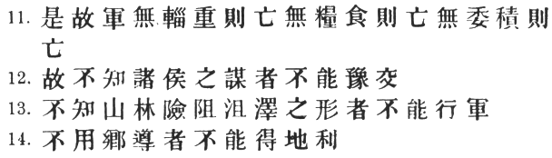

11\. We may take it then that an army without its baggage-train is lost;
without provisions it is lost; without bases of supply it is lost. [1](#fn_360)

12\. We cannot enter into alliances until we are acquainted with the
designs of our neighbours. [2](#fn_361)

13\. We are not fit to lead an army on the march unless we are familiar
with the face of the country—its mountains and forests, its
pitfalls [3](#fn_362) and precipices, [4](#fn_363) its marshes [5](#fn_364) and swamps. [6](#fn_365)

14\. We shall be unable to turn natural advantages to account unless we
make use of local guides. [7](#fn_366)

 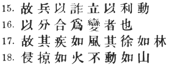

p. 61

15\. In war, practise dissimulation. and you will succeed. [1](#fn_367) Move only if there is a real advantage
to be gained. [2](#fn_368)

15\. Whether to concentrate or to divide your troops, must be decided by
circumstances.

16\. Let your rapidity be that of the wind, [3](#fn_369) your compactness that of the
forest. [4](#fn_370)

17\. In raiding and plundering be like fire, [5](#fn_371) in immovability like a mountain. [6](#fn_372)

p. 62

 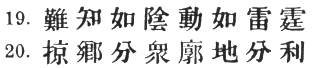

19\. Let your plans be dark and impenetrable as night, and when you
move, fall like a thunderbolt. [1](#fn_374)

20\. When you plunder a countryside, let the spoil be divided amongst
your men; [2](#fn_375) when you capture new
territory, cut it up into allotments for the benefit of the
soldiery. [3](#fn_376)

p. 63

 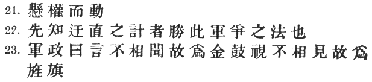

21\. Ponder and deliberate [1](#fn_377) before
you make a move. [2](#fn_378)

22\. He will conquer who has learnt the artifice of deviation. [3](#fn_379) Such is the art of manœuvring. [4](#fn_380)

23\. The Book of Army Management says: [5](#fn_381)

p. 64

 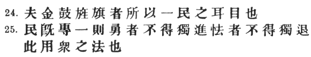

On the field of battle, [1](#fn_382) the spoken
word does not carry far enough: hence the institution of gongs and
drums. [2](#fn_383) Nor can ordinary objects be
seen clearly enough: hence the institution of banners and flags.

24\. Gongs and drums, banners and flags, are means whereby the ears and
eyes of the host [3](#fn_384) may be focussed
on one particular point. [4](#fn_385)

25\. The host thus forming a single united body, it is impossible either
for the brave to advance alone, or for the cowardly to retreat
alone. [5](#fn_386)

p. 65

 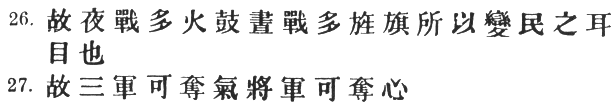

\[paragraph continues\] This is the art of
handling large masses of men.

26\. In night-fighting, then, make much use of signal-fires and drums,
and in fighting by day, of flags and banners, as a means of influencing
the ears and eyes of your army. [1](#fn_387)

27\. A whole army may be robbed of its spirit; [2](#fn_388)

p. 66

 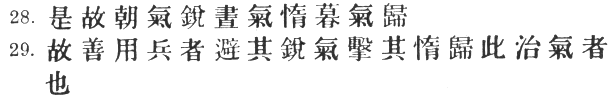

a commander-in-chief may be robbed of his presence of mind. [1](#fn_389)

28\. Now a soldier's spirit is keenest in the morning; [2](#fn_390) by noonday it has begun to flag; and in
the evening, his mind is bent only on returning to camp.

29\. A clever general, therefore, [3](#fn_391)

p. 67

 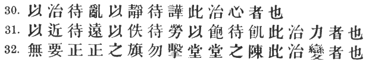

avoids an army when its spirit is keen, but attacks it when it is
sluggish and inclined to return. This is the art of studying
moods. [1](#fn_392)

30\. Disciplined and calm, to await the appearance of disorder and
hubbub amongst the enemy:—this is the art of retaining self-possession.

31\. To be near the goal while the enemy is still far from it, to wait
at ease [2](#fn_393) while the enemy is toiling
and struggling, to be well-fed while the enemy is famished:—this is the
art of husbanding one's strength.

32\. To refrain from intercepting [3](#fn_394)
an enemy whose banners are in perfect order, to refrain from attacking
an army drawn up in calm and confident array: [4](#fn_395)

p. 68

 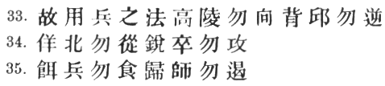

\[paragraph continues\] —this is the art
of studying circumstances. [1](#fn_396)

33\. It is a military axiom not to advance uphill against the enemy, nor
to oppose him when he comes downhill. [2](#fn_397)

34\. Do not pursue an enemy who simulates flight; do not attack soldiers
whose temper is keen.

35\. Do not swallow a bait offered by the enemy. [3](#fn_398) Do not interfere with an army that is
returning home. [4](#fn_399)

p. 69

 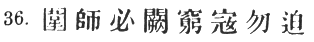

36\. When you surround an army, leave an outlet free. [1](#fn_400) Do not press a desperate foe too
hard. [2](#fn_401)

p. 70

 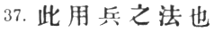

37\. Such is the art of warfare. [1](#fn_402)

------------------------------------------------------------------------

### Footnotes

[55:1](aow15.htm#fr_346) The commentators, as
well as the subsequent text, make it clear that this is the real meaning
of \#: Thus, Li Ch‘üan says that \# means \# "marching rapidly to seize
an advantage"; Wang Hsi says: \# "'Striving' means striving for an
advantage; this being obtained, victory will follow;" and Chang Yü: \#
"The two armies face to face, and each striving to obtain a tactical
advantage over the other." According to the latter commentator, then,
the situation is analogous to that of two wrestlers manœuvring for a
"hold," before coming to actual grips. In any case, we must beware of
translating \# by the word "fighting" or "battle," as if it were
equivalent to \#. Capt. Calthrop falls into this mistake.

[55:2](aow15.htm#fr_347) For \# there is
another reading \#, which Li Ch‘üan explains as \# "being the reverent
instrument of Heaven's chastisement."

[55:3](aow15.htm#fr_348) Ts‘ao Kung takes \# as
referring to the \# or main gate of the military camp. This, Tu Mu tells
us, was formed with a couple of flags hung across. \[Cf. *Chou Li*, ch.
xxvii. fol. 31 of the Imperial edition: \#.\] \# would then mean
"setting up his \# opposite that of the enemy." But Chia Lin's
explanation, which has been adopted p. 56
above, is on the whole simpler and better. Chang Yü, while following
Ts‘ao Kung, adds that the words may also be taken to mean "the
establishment of harmony and confidence between the higher and lower
ranks before venturing into the field;" and he quotes a saying of Wu Tzŭ
(chap. 1 *ad init*.): "Without harmony in the State, no military
expedition can be undertaken; without harmony in the army, no battle
array can be formed." In the historical romance \#, chap. 75, Sun Tzŭ
himself is represented as saying to \# Wu Yüan: \# "As a general rule,
those who are waging war should get rid of all domestic troubles before
proceeding to attack the external foe." \# is defined as \#. It here
conveys the notion of encamping after having taken the field.

[56:1](aow15.htm#fr_349) I have departed
slightly from the traditional interpretation of Ts‘ao Kung, who says: \#
"From the time of receiving the sovereign's instructions until our
encampment over against the enemy, the tactics to be pursued are most
difficult." It seems to me that the \# tactics or manœuvres can hardly
be said to begin until the army has sallied forth and encamped, and
Ch‘ên Hao's note gives colour to this view: "For levying, concentrating,
harmonising and intrenching an army, there are plenty of old rules which
will serve. The real difficulty comes when we engage in tactical
operations." Tu Yu also observes that "the great difficulty is to be
beforehand with the enemy in seizing favourable positions."

[56:2](aow15.htm#fr_350) \# is one of those
highly condensed and somewhat enigmatical expressions. of which Sun Tzŭ
is so fond. This is how it is explained by Ts‘ao Kung: \# "Make it
appear that you are a long way off, then cover the distance rapidly and
arrive on the scene before your opponent." Tu Mu says: "Hoodwink the
enemy, so that he may be remiss and leisurely while you are dashing
along with the utmost speed." Ho Shih gives a slightly different turn to
the sentence: "Although you may have difficult ground to traverse and
natural obstacles to encounter, this is a drawback which p. 57 can be turned into actual advantage by
celerity of movement." Signal examples of this saying are afforded by
the two famous passages across the Alps—that of Hannibal, which laid
Italy at his mercy, and that of Napoleon two thousand years later, which
resulted in the great victory of Marengo.

[57:1](aow15.htm#fr_351) Chia Lin understands
\# as the *enemy's* line of march, thus: "If our adversary's course is
really a short one, and we can manage to divert him from it (\#) either
by simulating weakness or by holding out some small advantage, we shall
be able to beat him in the race for good positions." This is quite a
defensible view, though not adopted by any other commentator. \# of
course = \#, and \# and \# are to be taken as verbs. Tu Mu cites the
famous march of \# Chao She in 270 B.C. to relieve the town of \# O-yü,
which was closely invested by a \# Ch‘in army. \[It should be noted that
the above is the correct pronunciation of \#, as given in the commentary
on the *Ch‘ien Han Shu*, ch. 34. Giles’ dictionary gives "Yü-yü," and
Chavannes, I know not on what authority, prefers to write "Yen-yü." The
name is omitted altogether from Playfair's "Cities and Towns."\] The
King of Chao first consulted \# Lien P‘o on the advisability of
attempting a relief, but the latter thought the distance too great, and
the intervening country too rugged and difficult. His Majesty then
turned to Chao Shê, who fully admitted the hazardous nature of the
march, but finally said: "We shall be like two rats fighting in a
hole—and the pluckier one will win!" So he left the capital with his
army, but had only gone a distance of 30 *li* when he stopped and began
throwing up intrenchments. For 28 days he continued strengthening his
fortifications, and took care that spies should carry the intelligence
to the enemy. The Ch‘in general was overjoyed, and attributed his
adversary's tardiness to the fact that the beleaguered city was in the
Han State, and thus not actually part of Chao territory. But the spies
had no sooner departed than Chao Shê began a forced march lasting for
two days and one night, and arrived on the scene of action with such
astonishing rapidity that he was able to occupy a commanding position on
the \# "North hill" before the enemy p. 58 had
got wind of his movements. A crushing defeat followed for the Ch‘in
forces, who were obliged to raise the siege of O-yü in all haste and
retreat across the border. \[See \#, chap. 81.\]

[58:1](aow15.htm#fr_352) I here adopt the
reading of the *T‘ung Tien*, Chêng Yu-hsien and the *T‘u Shu*, where \#
appears to supply the exact *nuance* required in order to make sense.
The standard text, on the other hand, in which \# is repeated, seems
somewhat pointless. The commentators take it to mean that manœuvres may
be profitable, or they may be dangerous: it all depends on the ability
of the general. Capt. Calthrop translates \# "the wrangles of a
multitude"!

[58:2](aow15.htm#fr_353) The original text has
\# instead of \#; but a verb is needed to balance \#.

[58:3](aow15.htm#fr_354) \# evidently
unintelligible to the Chinese commentators, who paraphrase the sentence
as though it began with \#. Absolute tautology in the apodosis can then
only be avoided by drawing an impossibly fine distinction between \# and
\#. I submit my own rendering without much enthusiasm, being convinced
that there is some deep-seated corruption in the text. On the whole, it
is clear that Sun Tzŭ does not approve of a lengthy march being
undertaken without supplies. Cf. *infra*, § 11.

[58:4](aow15.htm#fr_355) \# does not mean "to
discard one's armour," as Capt. Calthrop translates, but implies on the
contrary that it is to be carried with you. Chang Yü says: \# "This
means, in full panoply."

[59:1](aow15.htm#fr_356) The ordinary day's
march, according to Tu Mu, was 30 *li*; but on one occasion, when
pursuing \# Liu Pei, Ts‘ao Ts‘ao is said to have covered the incredible
distance of 300 *li* within twenty-four hours.

[59:2](aow15.htm#fr_357) For \#, see II. § 14.
The moral is, as Ts‘ao Kung and others point out: Don't march a hundred
*li* to gain a tactical advantage, either with or without impedimenta.
Manœuvres of this description should be confined to short distances.
Stonewall Jackson said: "The hardships of forced marches are often more
painful than the dangers of battle." He did not often call upon his
troops for extraordinary exertions. It was only when he intended a
surprise, or when a rapid retreat was imperative, that he sacrificed
everything to speed. [\*](#fn_359)

[59:3](aow15.htm#fr_359) \# is explained as
similar in meaning to \#: literally, "the leader of the first division
will be *torn away*." Cf. *Tso Chuan*, 19th year: \# "This is
a case of \[the falling tree\] tearing up its roots."

[59:4](aow15.htm#fr_360) In the *T‘ung Tien* is
added: \# "From this we may know the difficulty of manœuvring."

[59:\*](aow15.htm#fr_358) *See* Col. Henderson,
*op. cit.* vol. I. p. 426.

[60:1](aow15.htm#fr_361) \# explained by Tu Yu
as \# "fodder and the like;" by Tu Mu and Chang Yü as \# "goods in
general;" and by Wang Hsi as \# "fuel, salt, foodstuffs, etc." But I
think what Sun Tzŭ meant was "stores accumulated in dépôts," as
distinguished from \# and \#, the various impedimenta accompanying an
army on its march. Cf. *Chou Li*, ch. xvi. fol. 10: \#.

[60:2](aow15.htm#fr_362) \# = \#. Li Ch‘üan
understands it as \# "guard against," which is hardly so good. An
original interpretation of \# is given by Tu Mu, who says it stands for
\# or \# "join in battle."

[60:3](aow15.htm#fr_363) \#, defined as \#
(Ts‘ao Kung) or \# (Chang Yü).

[60:4](aow15.htm#fr_364) \#, defined as \#.

[60:5](aow15.htm#fr_365) \#, defined as \#.

[60:6](aow15.htm#fr_366) \#, defined as \#.

[60:7](aow15.htm#fr_367) §§ 12–54 are repeated
in chap. XI. § 52.

[61:1](aow15.htm#fr_368) According to Tu Mu, \#
stands for \#. Cf. I. § 18. In the tactics of Turenne, deception of the
enemy, especially as to the numerical strength of his troops, took a
very prominent position. [\*](#fn_373)

[61:2](aow15.htm#fr_369) This is the
interpretation of all the commentators except Wang Hsi, who has the
brief note \# "Entice out the enemy" (by offering him some apparent
advantage).

[61:3](aow15.htm#fr_371) The simile is doubly
appropriate, because the wind is not only swift but, as Mei Yao-ch‘ên
points out, \#; "invisible and leaves no tracks."

[61:4](aow15.htm#fr_372) It is hardly possible
to take \# here in its ordinary sense of "sedate," as Tu Yu tries to do.
Mêng Shih comes nearer the mark in his note \# "When slowly marching,
order and ranks must be preserved"—so as to guard against surprise
attacks. But natural forests do not grow in rows, whereas they do
generally possess the quality of density or compactness. I think then
that Mei Yao-ch‘ên uses the right adjective in saying \#.

[61:5](aow15.htm#fr_373) Cf. *Shih Ching*, IV.
3. iv. 6: \# "Fierce as a blazing fire which no man can check."

[61:6](aow15.htm#fr_374) That is, when holding
a position from which the, enemy is trying to dislodge you, or perhaps,
as Tu Yu says, when he is trying to entice you into a trap.

[61:\*](aow15.htm#fr_370) For a number of
maxims on this head, see "Marshal Turenne" (Longmans, 1907), p. 29.

[62:1](aow15.htm#fr_375) The original text has
\# instead of \#. Cf. IV. § 7. Tu Yu quotes a saying of T‘ai Kung which
has passed into a proverb: \# "You cannot shut your ears to the thunder
or your eyes to the lightning—so rapid are they." Likewise, an attack
should be made so quickly that it cannot be parried.

[62:2](aow15.htm#fr_376) The reading of Tu Yu,
Chia Lin, and apparently Ts‘ao Kung, is \#, which is explained as
referring to the subdivision of the army, mentioned in V. §§ 1, 2, by
means of banners and flags, serving to point out (\#) to each man the
way he should go (\#). But this is very forced, and the ellipsis is too
great, even for Sun Tzŭ. Luckily, the *T‘ung Tien* and *Yü Lan* have the
variant \#, which not only suggests the true reading \#, but affords
some clue to the way in which the corruption arose. Some early
commentator having inserted \# as the sound of \#, the two may
afterwards nave been read as one character; and this being
interchangeable with \#, \# must finally have disappeared altogether.
Meanwhile, \# would have been altered to \# in order to make sense. As
regards \#, I believe that Ho Shih alone has grasped the real meaning,
the other commentators understanding it as "dividing the men into
parties" to search for plunder. Sun Tzŭ wishes to lessen the abuses of
indiscriminate plundering by insisting that all booty shall be thrown
into a common stock, which may afterward. be fairly divided amongst all.

[62:3](aow15.htm#fr_377) That this is the
meaning, may be gathered from Tu Mu's note: \# The \# gives the same
advice: \#. \# means "to enlarge" or "extend"—at the expense of the
enemy, understood. Cf. *Shih Ching*, III. 1. vii. 1:  \# "hating all the
great States." Ch‘ên Hao also says \# "quarter your soldiers on the
land, and let them sow and plant p. 63 it." It
is by acting on this principle, and harvesting the lands they invaded,
that the Chinese have succeeded in carrying out some of their most
memorable and triumphant expeditions, such as that of \#, Pan Ch‘ao who
penetrated to the Caspian, and in more recent years, those of \#
Fu-k‘ang-an and \# Tso Tsung-t‘ang.

[63:1](aow15.htm#fr_378) Note that both these
words, like the Chinese, are really metaphors derived from the use of
scales.

[63:2](aow15.htm#fr_379) Chang Yü quotes \# as
saying that we must not break camp until we have gauged the resisting
power of the enemy and the cleverness of the opposing general. Cf. the
"seven comparisons" in I. § 53. Capt. Calthrop omits this sentence.

[63:3](aow15.htm#fr_380) See *supra*, §§ 3, 4.

[63:4](aow15.htm#fr_381) With these words, the
chapter would naturally come to an end. But there now follows a long
appendix in the shape of an extract from an earlier book on War, now
lost, but apparently extant at the time when Sun Tzŭ wrote. The style of
this fragment is not noticeably different from that of Sun Tzŭ himself,
but no commentator raises a doubt as to its genuineness.

[63:5](aow15.htm#fr_382) It is perhaps
significant that none of the earlier commentators give us any
information about this work Mei Yao-Ch‘ên calls it \#: "an ancient
military classic," and Wang Hsi, \# "an old book on war." Considering
the enormous amount of fighting that had gone on for centuries before
Sun Tzŭ's time between the various kingdoms and principalities of China,
it is not in itself improbable that a collection of military maxims
should have been made and written down at some earlier period.

[64:1](aow15.htm#fr_383) Implied, though not
actually in the Chinese.

[64:2](aow15.htm#fr_384) I have retained the
words \# of the original text, which recur in the next paragraph, in
preference to the other reading \# "drums and bells," which is found in
the *T‘ung Tien*, *Pei T‘ang Shu Ch‘ao* and *Yü Lan*. \# is a bell with
a clapper. See *Lun Yü* III. 24, *Chou Li* XXIX. 15, 29. \# of course
would include both gongs and bells of every kind. The *T‘u Shu* inserts
a \# after each \#.

[64:3](aow15.htm#fr_385) The original text,
followed by the *T‘u Shu*, has \# for \# here and in the next two
paragraphs. But, as we have seen, \# is generally used in Sun Tzŭ for
the enemy.

[64:4](aow15.htm#fr_386) Note the use of \# as
a verb. Chang Yü says: \# "If sight and hearing converge simultaneously
on the same object, the evolutions of as many as a million soldiers will
be like those of a single man"!

[64:5](aow15.htm#fr_387) Chang quotes a saying:
\# "Equally guilty are those who advance against orders and those who
retreat against orders." Tu Mu tells a story in this connection of \# Wu
Ch‘i, when he was fighting against the Ch‘in State. Before the battle
had begun, one of his soldiers, a man of matchless daring, sallied forth
by himself, captured two heads from the enemy, and p.
65 returned to camp. Wu Ch‘i had the man instantly executed,
whereupon an officer ventured to remonstrate, saying: "This man was a
good soldier, and ought not to have been beheaded." Wu Ch‘i replied: "I
fully believe he was a good soldier, but I had him beheaded because he
acted without orders."

[65:1](aow15.htm#fr_388) The *T‘ung Tien* has
the bad variant \# for \#. With regard to the latter word, I believe I
have hit off the right meaning, the whole phrase being slightly
elliptical for "influencing the movements of the army through their
senses of sight and hearing." Li Ch‘üan, Tu Mu and Chia Lin certainly
seem to understand it thus. The other commentators, however, take \# (or
\#) as the enemy, and as equivalent to \# or \# "to perplex" or
"confound." This does not agree so well with what has gone before,
though on the other hand it renders the transition to § 27 less abrupt.
The whole question, I think, hinges on the alternative readings \# and
\#. The latter would almost certainly denote the enemy. Ch‘ên Hao
alludes to \# Li Kuang-pi's night ride to \# Ho-yang at the head of 500
mounted men; they made such an imposing display with torches, that
though the rebel leader \# Shih Ssŭ-ming had a large army, he did not
dare to dispute their passage. \[Ch‘ên Hao gives the date as \# A.D.
956; but according to the \# New T‘ang History, \# 61, it must have been
later than this, probably 760.\]

[65:2](aow15.htm#fr_389) "In war," says Chang
Yü, "if a spirit of anger can be made to pervade all ranks of an army at
one and the same time, its onset will be irresistible. Now the spirit of
the enemy's soldiers will be keenest when they have newly arrived on the
scene, and it is therefore our cue not to fight at once, but to wait
until their ardour and enthusiasm have worn off, and then strike. It is
in this way that they may be robbed of their keen spirit." Li Ch‘üan and
others tell an anecdote (to be found in the *Tso Chuan*, p. 66 \# year 10, § 1) of \# Ts‘ao Kuei, a *protégé*
of Duke Chuang of Lu. The latter State was attacked by Ch‘i, and the
Duke was about to join battle at \# Ch‘ang-cho, after the first roll of
the enemy's drums, when Ts‘ao said: "Not just yet." Only after their
drums had beaten for the third time, did he give the word for attack.
Then they fought, and the men of Ch‘i were utterly defeated. Questioned
afterwards by the Duke as to the meaning of his delay, Ts‘ao Kuei
replied: "In battle, a courageous spirit is everything. Now the first
roll of the drum tends to create this spirit, but with the second it is
already on the wane, and after the third it is gone altogether. I
attacked when their spirit was gone and ours was at its height. Hence
our victory." \# (chap. 4) puts "spirit" first among the "four important
influences" in war, and continues: \# "The value of a whole army—a
mighty host of a million men—is dependent on one man alone: such is the
influence of spirit!"

[66:1](aow15.htm#fr_390) Capt. Calthrop goes
woefully astray with "defeat his general's ambition." Chang Yü says: \#
"Presence of mind is the general's most important asset. It is the
quality which enables him to discipline disorder and to inspire courage
into the panic-stricken." The great general \# Li Ching (A.D. 571–649)
has a saying: \# "Attacking does not merely consist in assaulting walled
cities or striking at an army in battle array; it must include the art
of assailing the enemy's mental equilibrium." \[\#., pt. 3.\]

[66:2](aow15.htm#fr_391) Always provided, I
suppose, that he has had breakfast. At the battle of the Trebia, the
Romans were foolishly allowed to fight fasting, whereas Hannibal's men
had breakfasted at their leisure. See Livy, XXI, liv. 8, lv. 1 and 8.

[66:3](aow15.htm#fr_392) p.
67 The \#, which certainly seems to be wanted here, is omitted in
the *T‘u Shu*.

[67:1](aow15.htm#fr_393) The *T‘ung Tien*, for
reasons of \# "avoidance of personal names of the reigning dynasty,"
reads \# for \# in this and the two next paragraphs.

[67:2](aow15.htm#fr_394) The *T‘ung Tien* has
\# for \#. The two characters are practically synonymous, but according
to the commentary, the latter is the form always used in Sun Tzŭ.

[67:3](aow15.htm#fr_395) \# is the reading of
the original text. But the \# quotes the passage with \#
*yao*1 (also meaning "to intercept"), and this is supported
by the *Pei T‘ang Shu Ch‘ao*, the *Yü Lan*, and Wang Hsi's text.

[67:4](aow15.htm#fr_396) For this translation
of \#, I can appeal to the authority of Tu Mu, who defines the phrase as
\#. The other commentators mostly follow Ts‘ao Kung, who says \#,
probably meaning "grand and imposing". Li Ch‘üan, however, has \# "in
subdivisions," which is somewhat strange.

[68:1](aow15.htm#fr_397) I have not attempted a
uniform rendering of the four phrases \#, \#, \# and \#, though \#
really bears the same meaning in each case. It is to be taken, I think,
not in the sense of "to govern" or "control," but rather, as K‘ang Hsi
defines it, = \# "to examine and practise," hence "look after," "keep a
watchful eye upon." We may find an example of this use in the *Chou Li*,
XVIII. vol. 46: \#. Sun Tzŭ has not told us to control or restrain the
quality which he calls \#, but only to observe the time at which it is
strongest. As for \#, it is important to remember that in the present
context it can only mean "presence of mind." To speak of "controlling
presence of mind" is absurd, and Capt. Calthrop's "to have the heart
under control" is hardly less so. Thee whole process recommenced here is
that of VI. § 2: \#.

[68:2](aow15.htm#fr_398) The *Yü Lan* reads \#
for \#.

[68:3](aow15.htm#fr_399) Li Ch‘üan and Tu Mu,
with extraordinary inability to see a metaphor take these words quite
literally of food and drink that have been poisoned by the enemy. Ch‘ên
Hao and Chang Yü carefully point out that the saying has a wider
application. The *T‘ung Tien* reads \# "to covet" instead of \#. The
similarity of the two characters sufficiently accounts for the mistake.

[68:4](aow15.htm#fr_400) The commentators
explain this rather singular piece of advice by saying that a man whose
heart is set on returning home will fight to the death against any
attempt to bar his way, and is therefore too dangerous an opponent to be
tackled. Chang Yü quotes the words of Han Hsin: \# "Invincible is the
soldier who hath his desire and returneth homewards." A marvellous tale
is told of p. 69 Ts‘ao Ts‘ao's courage and
resource in ch. 1 of the *San Kuo Chih*, In 198 A.D. he was besieging \#
Chang Hsiu in \# Jang, when \# Liu Piao sent reinforcements with a view
to cutting off Ts‘ao's retreat. The latter was obliged to draw off his
troops, only to find himself hemmed in between two enemies, who were
guarding each outlet of a narrow pass in which he had engaged himself.
In this desperate plight Ts‘ao waited until nightfall, when he bored a
tunnel into the mountain side and laid an ambush in it. Then he marched
on with his baggage-train, and when it grew light, Chang Hsiu, finding
that the bird had flown, pressed after him in hot pursuit. As soon as
the whole army had passed by, the hidden troops fell on its rear, while
Ts‘ao himself turned and met his pursuers in front, so that they were
thrown into confusion and annihilated. Ts‘ao Ts‘ao said afterwards: \#
"The brigands tried to check my army in its retreat and brought me to
battle in a desperate position: hence I knew how to overcome them."

[69:1](aow15.htm#fr_401) This does not mean
that the enemy is to be allowed to escape. The object, as Tu Mu puts it,
is \# "to make him believe that there is a road to safety, and thus
prevent his fighting with the courage of despair." Tu Mu adds
pleasantly: \# "After that, you may crush him."

[69:2](aow15.htm#fr_402) For \#, the *T‘u Shu*
reads "pursue." Ch‘ên Hao quotes the saying: \# "Birds and beasts when
brought to bay will use their claws and teeth." Chang Yü says: \# "If
your adversary has burned his boats and destroyed his cooking-pots, and
is ready to stake all on the issue of a battle, he must not be pushed to
extremities." The phrase \# doubtless originated with Sun Tzŭ. The *P‘ei
Wên Yün Fu* gives four examples of its use, the earliest being from the
*Ch‘ien Han Shu*, and I have found another in chap. 34 of the same work.
Ho Shih illustrates the meaning by a story taken from the life of \# Fu
Yen-ch‘ing in ch. 251 of the \#. That general, together with his
colleague \# Tu Chung-wei, was surrounded by a vastly superior army of
Khitans in the year 945 A.D. The country was bare and desert-like, and
the little Chinese force was soon in dire straits for want of p. 70 water. The wells they bored ran dry, and the
men were reduced to squeezing lumps of mud and sucking out the moisture.
Their ranks thinned rapidly, until at last Fu Yen-ch‘ing
[exclaimed](errata.htm#5): "We are desperate men. Far better to die for
our country than to go with fettered hands into captivity!" A strong
gale happened to be blowing from the northeast and darkening the air
with dense clouds of sandy dust. Tu Chung-wei was for waiting until this
had abated before deciding on a final attack; but luckily another
officer, \# Li Shou-chêng by name, was quicker to see an opportunity,
and said: "They are many and we are few, but in the midst of this
sandstorm our numbers will not be discernible; victory will go to the
strenuous fighter, and the wind will be our best ally." Accordingly, Fu
Yen-ch‘ing made a sudden and wholly unexpected onslaught with his
cavalry, routed the barbarians and succeeded in breaking through to
safety. \[Certain details in the above account have been added from the
\#, ch. 78.\]

[70:1](aow15.htm#fr_403) Chêng Yu-hsien in his
\# inserts \# after \#. I take it [that](errata.htm#6) these words
conclude the extract from the \# which began at § 23

------------------------------------------------------------------------

[Next: VIII. Variation of Tactics](aow16)
