  
[Intangible Textual Heritage](../../index)  [Taoism](../index) 
[Confucianism](../../cfu/index)  [Index](index)  [Previous](aow17) 
[Next](aow19) 

------------------------------------------------------------------------

[Buy this Book at
Amazon.com](https://www.amazon.com/exec/obidos/ASIN/1934255122/internetsacredte)

------------------------------------------------------------------------

  
*The Art of War*, by Lionel Giles, \[1910\], at Intangible Textual
Heritage

------------------------------------------------------------------------

p. 100

 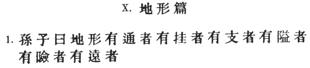

### X. TERRAIN [1](#fn_517).

1\. Sun Tzŭ said: We may distinguish six kinds of terrain, to wit: (1)
Accessible ground; [2](#fn_518) (2) entangling
ground; [3](#fn_519) (3) temporising
ground; [4](#fn_520) (4) narrow passes; (5)
precipitous heights; [5](#fn_521) (6) positions
at a great distance from the enemy. [6](#fn_522)

p. 101

 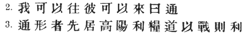

2\. Ground which can be freely traversed by both sides is called
*accessible*. [1](#fn_523)

3\. With regard to ground of this nature, [2](#fn_524) be before the enemy in occupying the
raised and sunny spots, [3](#fn_525) and
carefully guard your line of supplies. [4](#fn_526)

Then you will be able to fight with advantage. [5](#fn_527)

p. 102

 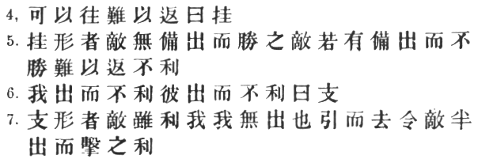

4\. Ground which can be abandoned but is hard to re-occupy is called
*entangling*. [1](#fn_530)

5\. From a position of this sort, if the enemy is unprepared, you may
sally forth and defeat him. But if the enemy is prepared for your
coming, and you fail to defeat him, then, return being impossible,
disaster will ensue. [2](#fn_531)

6\. When the position is such that neither side will gain by making the
first move, it is called *temporising* ground. [3](#fn_532)

7\. In a position of this sort, even though the enemy should offer us an
attractive bait, [4](#fn_533) it will be
advisable not to stir forth, but rather to retreat, thus enticing the
enemy in his turn; then, when part of his army has come out, we may
deliver our attack with advantage. [5](#fn_534)

p. 103

 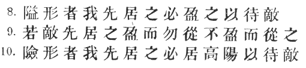

8\. With regard to *narrow passes*, if you can occupy them first, [1](#fn_535) let them be strongly garrisoned and
await the advent of the enemy. [2](#fn_536)

9\. Should the enemy forestall you in occupying a pass, do not go after
him if the pass is fully garrisoned, but only if it is weakly
garrisoned.

10\. With regard to *precipitous heights*, if you are beforehand with
your adversary, you should occupy the raised and sunny spots, and there
wait for him to come up. [3](#fn_537)

p. 104

 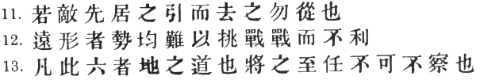

11\. If the enemy has occupied them before you, do not follow him, but
retreat and try to entice him away. [1](#fn_538)

12\. If you are situated at a great distance from the enemy, and the
strength of the two armies is equal, [2](#fn_539) it is not easy to provoke a
battle, [3](#fn_540) and fighting will be to
your disadvantage.

13\. These six are the principles connected with Earth. [4](#fn_541) The general who has attained a
responsible post must be careful to study them. [5](#fn_542)

p. 105

 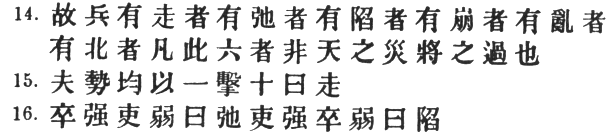

14\. Now an army is exposed to six several calamities, not arising from
natural causes, [1](#fn_543) but from faults
for which the general is responsible. These are: (1) Flight; (2)
insubordination; (3) collapse; (4) ruin; (5) disorganisation; (6)
rout. [2](#fn_544)

15\. Other conditions being equal, if one force is hurled against
another ten times its size, the result will be the *flight* of the
former. [3](#fn_545)

16\. When the common soldiers are too strong and their officers too
weak, the result is *insubordination*. [4](#fn_546)

p. 106

 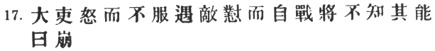

\[paragraph continues\] When the officers
are too strong and the common soldiers too weak, the result is
*collapse*. [1](#fn_547)

17\. When the higher officers [2](#fn_548) are
angry and insubordinate, and on meeting the enemy give battle on their
own account from a feeling of resentment, before the commander-in-chief
can tell whether or no he is in a position to fight, the result is
*ruin*. [3](#fn_549)

p. 107

 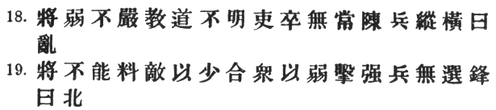

18\. When the general is weak and without authority; when his orders are
not clear and distinct; [1](#fn_550) when there
are no fixed duties assigned to officers and men, [2](#fn_551) and the ranks are formed in a slovenly
haphazard manner, the result is utter *disorganisation*.

19\. When a general, unable to estimate the enemy's strength, allows an
inferior force to engage a larger one, or hurls a weak detachment
against a powerful one, and neglects to place picked soldiers in the
front rank, the result must be a *rout*. [3](#fn_552)

p. 108

 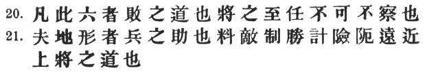

20\. These are six ways of courting defeat, [1](#fn_554) which must be carefully noted by the
general who has attained a responsible post. [2](#fn_555)

21\. The natural formation of the country is the soldier's best
ally; [3](#fn_556) but a power of estimating
the adversary, [4](#fn_557) of controlling the
forces of victory, [5](#fn_558) and of shrewdly
calculating difficulties, dangers and distances, [6](#fn_559)

p. 109

 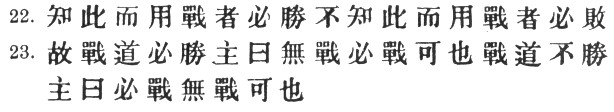

constitutes the test of a great general. [1](#fn_560)

22\. He who knows these things, and in fighting puts his knowledge into
practice, will win his battles. He who knows them not, nor practises
them, will surely be defeated.

2 3. If fighting is sure to result in victory, then you must fight, even
though the ruler forbid it; if fighting will not result in victory, then
you must not fight even at the ruler's bidding. [2](#fn_561)

p. 110

 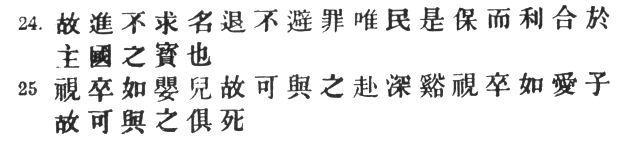

24\. The general who advances without coveting fame and retreats without
fearing disgrace, [1](#fn_563) whose only
thought is to protect his country and do good service for his
sovereign, [2](#fn_564) is the jewel of the
kingdom. [3](#fn_565)

25\. Regard your soldiers as your children, and they will follow you
into the deepest valleys; look on them as your own beloved sons, and
they will stand by you even unto death. [4](#fn_566)

p. 111

 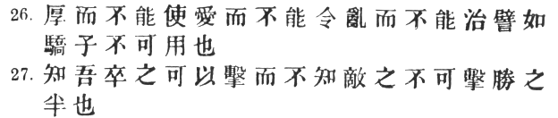

26\. If, however, you are indulgent, but unable to make your authority
felt; kind-hearted, but unable to enforce your commands; and incapable,
moreover, of quelling disorder: [1](#fn_567)
then your soldiers must be likened to spoilt children; they are useless
for any practical purpose. [2](#fn_568)

27\. If we know that our own men are in a condition to attack, but are
unaware that the enemy is not open to attack, we have gone only halfway
towards victory. [3](#fn_569)

p. 112

 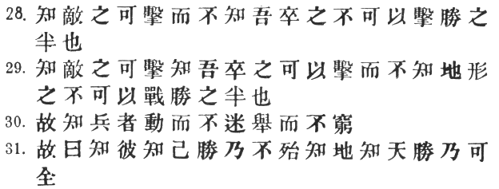

28\. If we know that the enemy is open to attack, but are unaware that
our own men are not in a condition to attack, we have gone only halfway
towards victory. [1](#fn_570)

29\. If we know that the enemy is open to attack, and also know that our
men are in a condition to attack, but are unaware that the nature of the
ground makes fighting impracticable, we have still gone only halfway
towards victory. [2](#fn_571)

30\. Hence the experienced soldier, once in motion, is never bewildered;
once he has broken camp, he is never at a loss [3](#fn_572)

31\. Hence the saying: If you know the enemy and know yourself, your
victory will not stand in doubt; [4](#fn_573)

p. 113

if you know Heaven and know Earth, [1](#fn_574)
you may make your victory complete. [2](#fn_575)

------------------------------------------------------------------------

### Footnotes

[100:1](aow18.htm#fr_518) Only about a third of
the chapter, comprising §§ 1–13, deals with \#, the subject being more
fully treated in ch. XI. The "six calamities" are discussed in §§ 14–20,
and the rest of the chapter is again a mere string of desultory remarks,
though not less interesting, perhaps, on that account.

[100:2](aow18.htm#fr_519) Mei Yao-ch‘ên says:
"plentifully provided with roads and means of communication."

[100:3](aow18.htm#fr_520) The same commentator
says: \# "Net-like country, venturing into which you become entangled."

[100:4](aow18.htm#fr_521) Tu Yu explains \# as
\#. This meaning is still retained in modern phrases such as \#, \#
"stave off," "delay." I do not know why Capt. Calthrop calls \#
"suspended ground," unless he is confusing it with \#.

[100:5](aow18.htm#fr_522) The root idea in \#
is narrowness; in \#, steepness.

[100:6](aow18.htm#fr_523) It is hardly
necessary to point out the faultiness of this classification. A strange
lack of logical perception is shown in the Chinaman's unquestioning
acceptance of glaring cross-divisions such as the above.

[101:1](aow18.htm#fr_524) Generally speaking,
\# "level country" is meant. Cf. IX. § 9: \#.

[101:2](aow18.htm#fr_525) The T‘ung Tien reads
\#.

[101:3](aow18.htm#fr_526) See IX. § 2. The
*T‘ung Tien* reads \#.

[101:4](aow18.htm#fr_527) A curious use of \#
as a verb, if our text is right. The general meaning is doubtless, as Tu
Yu says,\# "not to allow the enemy to cut your communications." Tu Mu,
who was not a soldier and can hardly have had any practical experience
of fighting, goes more into detail and speaks of protecting me line of
communications by a wall (\#), or enclosing it by embankments on each
side (\#)! In view of Napoleon's dictum, "the secret of war lies in the
communications," [\*](#fn_528) we could wish
that Sun Tzŭ had done more than skirt the edge of this important subject
here and in I. § 10, VII. § 11. Col. Henderson says: "The line of supply
may be said to be as vital to the existence of an army as the heart to
the life of a human being. Just as the duellist who finds his
adversary's point menacing him with certain death, and his own guard
astray, is compelled to conform to his adversary's movements, and to
content himself with warding off his thrusts, so the commander whose
communications are suddenly threatened finds himself in a false
position, and he will be fortunate if he has not to change all his
plans, to split up his force into more or less isolated detachments, and
to fight with inferior numbers on ground which he has not had time to
prepare, and where defeat will not he an ordinary failure, but will
entail the ruin or the surrender of his whole army." [\*\*](#fn_529)

[101:5](aow18.htm#fr_530) Omitted by Capt.
Calthrop.

[101:\*](aow18.htm#fr_528) See "Pensées de
Napoléon Ier," no. 47.

[101:\*\*](aow18.htm#fr_529) "The Science of
War," chap. 2.

[102:1](aow18.htm#fr_531) Capt. Calthrop is
wrong in translating \#, "retreat from it."

[102:2](aow18.htm#fr_532) \# (an example of
litotes) is paraphrased by Mei Yao-ch‘ên as \#, "you will receive a
check."

[102:3](aow18.htm#fr_533) \# "Each side finds
it inconvenient to move, and the situation remains at a deadlock" (Tu
Yu).

[102:4](aow18.htm#fr_534) Tu Yu says \#
"turning their backs on us and pretending to flee." But this is only one
of the lures which might induce us to quit our position. Here again \#
is used as a verb, but this time in a different sense: "to hold out an
advantage to."

[102:5](aow18.htm#fr_535) Mei Yao-ch‘ên
paraphrases the passage in a curious jingle, the scheme of rhymes being
*abcbdd:* \#

[103:1](aow18.htm#fr_536) Capt. Calthrop says:
"Defiles, make haste to occupy." But this is a conditional clause,
answering to \# in the next paragraph.

[103:2](aow18.htm#fr_537) Because then, as Tu
Yu observes, \# "the initiative will lie with us, and by making sudden
and unexpected attacks we shall have the enemy at our mercy." The
commentators make a great pother about the precise meaning of \#, which
to the foreign reader seems to present no difficulty whatever.

[103:3](aow18.htm#fr_538) Ts‘ao Kung says: \#
"The particular advantage of securing heights and defiles is that your
actions cannot then be dictated by the enemy." \[For the enunciation of
the grand principle alluded to, see VI. § 2\]. Chang Yü tells the
following anecdote of \# P‘ei Hsing-chien (A.D. 619–682), who was sent
on a punitive expedition against the Turkic tribes. "At nightfall he
pitched his camp as usual, and it had already been completely fortified
by wall and ditch, when suddenly he gave orders that the army should
shift its quarters to a hill near by. This was highly displeasing to his
officers, who protested loudly against the extra fatigue which it would
entail on the men. P‘ei Hsing-chien, however, paid no heed to their
remonstrances and had the camp moved as quickly as possible. The same
night, a terrific storm came on, which flooded their former place of
encampment to the depth of over twelve feet. The recalcitrant officers
were amazed at the sight, and owned that they had been in the wrong.
'How did you know what was going to happen?' they asked. P‘ei
Hsing-chien replied: 'From this time forward be content to obey orders
without asking p. 14 unnecessary questions.'
\[See *Chiu T‘ang Shu*, ch. 84, fol. 12 *r*°., and *Hsin T‘ang Shu* ch.
108, fol. 5 *v*°.\] From this it may be seen," Chang Yü continues, "that
high and sunny places are advantageous not only for fighting, but also
because they are immune from disastrous floods."

[104:1](aow18.htm#fr_539) The turning-point of
\# Li Shih-min's campaign in 621 A.D. against the two rebels, \# Tou
Chien-tê, King of \# Hsia, and \# Wang Shih-ch‘ung, Prince of \# Chêng,
was his seizure of the heights of \# Wu-lao, in spite of which Tou
Chien-tê persisted in his attempt to relieve his ally in Lo-yang, was
defeated and taken prisoner. \[See *Chiu T‘ang Shu*, ch. 2, fol. 5
*v*°., and also ch. 54.\]

[104:2](aow18.htm#fr_540) The *T‘ung Tien*
reads \#.

[104:3](aow18.htm#fr_541) Ts‘ao Kung says that
\# means \# "challenging the enemy." But the enemy being far away, that
plainly involves, as Tu Yu says, \# "going to meet him." The point of
course is, that we must not think of undertaking a long and wearisome
march, at the end of which \# "we should be exhausted and our adversary
fresh and keen."

[104:4](aow18.htm#fr_542) Or perhaps, "the
principles relating to ground." See, however, I. § 8.

[104:5](aow18.htm#fr_543) Capt. Calthrop omits
\#. Out of the foregoing six \#, it will be noticed that nos. 3 and 6
have really no reference to the configuration of the country, and that
only 4 and 5 can be said to convey any definite geographical idea.

[105:1](aow18.htm#fr_544) The *T‘u Shu* reads
\#.

[105:2](aow18.htm#fr_545) I take exception to
Capt. Calthrop's rendering of \# and \# as "distress" and
"disorganisation," respectively.

[105:3](aow18.htm#fr_546) Cf. III. § 10. The
general's fault here is that of \# "not calculating the enemy's
strength." It is obvious that \# cannot have the same force as in § 12,
where it was equivalent to \#. I should not be inclined, however, to
limit it, with Chang Yü, to \# "the wisdom and valour of the general and
the sharpness of the weapons." As Li Ch‘üan very justly remarks, \#
"Given a decided advantage in position, or the help of some stratagem
such as a flank attack or an ambuscade, it would be quite possible \[to
fight in the ratio of one to ten\]."

[105:4](aow18.htm#fr_547) \# "laxity"—the
metaphor being taken from an unstrung bow. Capt. Calthrop's "relaxation"
is not good, on account of its ambiguity. Tu Mu cites the unhappy case
of \# T‘ien Pu \[Hsin Tang Shu, ch. 148\], who was sent to \# Wei in 821
A.D. with orders to lead an army against \# Wang T‘ing-ts‘ou. But the
whole time he was in command, his soldiers treated him with the utmost
contempt, and openly flouted his authority by riding about the camp on
donkeys, several thousands at a time. T‘ien Pu was powerless to put a
stop to this conduct, and when, p. 106 after
some months had passed, he made an attempt to engage the enemy, his
troops turned tail and dispersed in every direction. After that, the
unfortunate man committed suicide by cutting his throat.

[106:1](aow18.htm#fr_548) Ts‘ao Kung says: \#
"The officers are energetic and want to press on, the common soldiers
are feeble and suddenly collapse." Note that \# is to be taken literally
of physical weakness, whereas in the former clause it is figurative. Li
Ch‘üan makes \# equivalent to \#, and Tu Mu explains it as \# "stumbling
into a death-trap."

[106:2](aow18.htm#fr_549) \#, according to
Ts‘ao Kung, are the \# "generals of inferior rank." But Li Ch‘üan, Ch‘ên
Hao and Wang Hsi take the term as simply convertible with \# or \#.

[106:3](aow18.htm#fr_550) Ts‘ao Kung makes \#,
understood, the subject of \#, which seems rather far-fetched. Wang
Hsi's note is: \# "This means, the general is angry without just cause,
and at the same time does not appreciate the ability of his subordinate
officers; thus he arouses fierce resentment and brings an avalanche of
ruin upon his head." He takes \#, therefore, in the sense of \#; but I
think that Ch‘en Hao is right in his paraphrase \# "they don't care if
it be possible or no." My interpretation of the whole passage is that of
Mei Yao-ch‘ên and Chang Yü. Tu Mu gives a long extract from the *Tso
Chuan*, \#, XII. 3, showing how the great battle of \# Pi \[597 B.C.\]
was lost for the Chin State through the contumacy of \# Hsien Hu and the
resentful spite of \# Wei I and \# Chao Chan. Chang Yü also alludes to
the mutinous conduct of \# Luan Yen \[*ibid*. \#, XIV. 3\].

[107:1](aow18.htm#fr_551) Wei Liao Tzŭ (ch. 4)
says: \# "If the commander gives his orders with decision, the soldiers
will not wait to hear them twice; if his moves are made without
vacillation, the soldiers will not be in two minds about doing their
duty." General Baden-Powell says, italicising the words: "The secret of
getting successful work out of your trained men lies in one nutshell—in
the clearness of the instructions they receive." [\*](#fn_553) Assuming that clear instructions beget
confidence, this is very much what Wei Liao Tzŭ (*loc. cit.*) goes on to
say: \#. Cf. also Wu Tzŭ ch. 3: \# "the most fatal defect in a military
leader is diffidence; the worst calamities that befall an army arise
from hesitation."

[107:2](aow18.htm#fr_552) \# "Neither officers
nor men have any regular routine" \[Tu Mu\].

[107:3](aow18.htm#fr_554) Chang Yü paraphrases
the latter part of the sentence \#, and continues: \# "Whenever there is
fighting to be done, the keenest spirits should be p. 108 appointed to serve in the front ranks, both
in order to strengthen the resolution of our own men and to demoralise
the enemy." Cf. the *primi ordines* of Caesar ("De Bello Gallico," V.
28, 44 *et al*.). There seems little to distinguish \# from \# in § 15,
except that \# is a more forcible word.

[107:\*](aow18.htm#fr_553) "Aids to Scouting,"
p. xii.

[108:1](aow18.htm#fr_555) Ch‘ên Hao makes them
out to be: (1) \# "neglect to estimate the enemy's strength;" (2) \#
"want of authority;" (3) \# "defective training;" (4) \# "unjustifiable
anger;" (5) \# "non-observance of discipline;" (6) \# "failure to use
picked men."

[108:2](aow18.htm#fr_556) See *supra*, § 53.

[108:3](aow18.htm#fr_557) Chia Lin's text has
the reading \# for \#. Ch‘ên Hao says: \# "The advantages of weather and
season are not equal to those connected with ground."

[108:4](aow18.htm#fr_558) The insertion of a
"but" is necessary to show the connection of thought here. A general
should always utilise, but never rely wholly on natural advantages of
terrain.

[108:5](aow18.htm#fr_559) \# is one of those
condensed expressions which mean so much in Chinese, and so little in an
English translation. What it seems to imply is complete mastery of the
situation from the beginning.

[108:6](aow18.htm#fr_560) The *T‘ung Tien* and
*Yü Lan* read \#. I am decidedly puzzled by Capt. Calthrop's
translation: "an eye for steepness, *command* and distances." Where did
he find the word which I have put in italics?

[109:1](aow18.htm#fr_561) A somewhat free
translation of \#. As Chang Yü remarks, these are \# "the essentials of
soldiering," ground being only a helpful accessory.

[109:2](aow18.htm#fr_562) Cf. VIII. § 3 *fin*.
Huang Shih-kung of the Chin dynasty, who is said to have been the patron
of \# Chang Liang and to have written the \#, has these words attributed
to him: \# "The responsibility of setting an army in motion must devolve
on the general alone; if advance and retreat are controlled from the
Palace, brilliant results will hardly be achieved. Hence the god-like
ruler and the enlightened monarch are content to play a humble part in
furthering their country's cause \[*lit.*, kneel down to push the
chariot wheel\]." This means that \# "in matters lying outside the
zenana, the decision of the military commander must be absolute." Chang
Yü also quotes the saying: \# "Decrees of the Son of Heaven do not
penetrate the walls of a camp." Napoleon, who has been accused of
allowing his generals too little independence of action, speaks in the
same sense: "Un général en chef n’est pas à couvert de ses fautes à la
guerre par un ordre de son souverain ou du ministre, quand celui qui le
donne est éloigné du champ d’opération, et qu’il connaît mal, ou ne
connaît pas du tout le dernier état des choses." [\*](#fn_562)

[109:\*](aow18.htm#fr_563) "Maximes de Guerre,"
no. 72.

[110:1](aow18.htm#fr_564) It was Wellington, I
think, who said that the hardest thing of all for a soldier is to
retreat.

[110:2](aow18.htm#fr_565) \#, which is omitted
by the *T‘u Shu*, is said by Ch‘ên Hao to be equivalent to \#. If it had
to be separately translated, it would be something like our word
"accrue."

[110:3](aow18.htm#fr_566) A noble presentment,
in few words, of the Chinese "happy warrior." Such a man, says Ho Shih,
\# "even if he had to suffer punishment, would not regret his conduct."

[110:4](aow18.htm#fr_567) Cf. I. § 6. In this
connection, Tu Mu draws for us an engaging picture of the famous general
Wu Ch‘i, from whose treatise on war I have frequently had occasion to
quote: "He wore the same clothes and ate the same food as the meanest of
his soldiers, refused to have either a horse to ride or a mat to sleep
on, carried his own surplus rations wrapped in a parcel, and shared
every hardship with his men. One of his soldiers was suffering from an
abscess, and Wu Ch‘i himself sucked out the virus. The soldier's mother,
hearing this, began wailing and lamenting. Somebody asked her, saying:
'Why do you cry? Your son is only a common soldier, and yet the
commander-in-chief himself has sucked the poison from his sore.' The
woman replied: 'Many years ago, Lord Wu performed a similar service for
my husband, who never left him afterwards, and finally met his death at
the hands of the enemy. And now that he has done the same for my son, he
too will fall fighting I know not where'." Li Ch‘üan mentions \# the
Viscount of Ch‘u, who invaded the small state of \# Hsiao during the
winter. \# The Duke of Shên said to him: "Many of p.
111 the soldiers are suffering severely from the cold." So he
made a round of the whole army, comforting and encouraging the men; and
straightway they felt as if they were clothed in garments lined with
floss silk. \[*Tso Chuan*, \#, XII. 5\] \# Chang Yü alludes to the same
passage, saying: \#.

[111:1](aow18.htm#fr_568) Capt. Calthrop has
got these three clauses quite wrong. The last he translates:
"overindulgence may produce disorder."

[111:2](aow18.htm#fr_569) Cf. IX. § 42. We read
in the \#, pt. 2: \# "Injury comes out of kindness." Li Ching once said
that if you could make your soldiers afraid of you, they would not be
afraid of the enemy. Tu Mu recalls an instance of stern military
discipline which occurred in 219 A.D., when \# Lü Mêng was occupying the
town of a \# Chiang-ling. He had given stringent orders to his army not
to molest the inhabitants nor take anything from them by force.
Nevertheless, a certain officer serving under his banner, who happened
to be a fellow-townsman, ventured to appropriate a bamboo hat (\#)
belonging to one of the people, in order to wear it over his regulation
helmet as a protection against the rain. La Mêng considered that the
fact of his being also a native of \# Ju-nan should not be allowed to
palliate a clear breach of discipline, and accordingly he ordered his
summary execution, the tears rolling down his face, however, as he did
so. This act of severity filled the army with wholesome awe, and from
that time forth even articles dropped in the highway were not picked up.
\[*San Kuo Chih*, ch. 54, f. 13 *r*°. & *v*°.\].

[111:3](aow18.htm#fr_570) That is, as Ts‘ao
Kong says, "the issue in this case is uncertain."

[112:1](aow18.htm#fr_571) Cf. III. § 13 (1).

[112:2](aow18.htm#fr_572) I may take this
opportunity of pointing out the rather nice distinction in meaning
between \# and \#. The latter is simply "to attack" without any further
implication, whereas \# is a stronger word which in nine cases out of
ten means "to attack with expectation of victory," "to fall upon," as we
should say, or even "to crush." On the other hand, \# is not quite
synonymous with \#, which is mostly used of operations on a larger
scale, as of one State *making war* on another, often with the added
idea of invasion. \#, finally, has special reference to the subjugation
of rebels. See Mencius, VII. 2. ii. 2.

[112:3](aow18.htm#fr_573) The reason being,
according to Tu Mu, that he has taken his measures so thoroughly as to
ensure victory beforehand. "He does not move recklessly," says Chang Yü,
"so that when he does move, he makes no mistakes." Another reading
substitutes \# for \# and \# for \#. The latter variant only is adopted
by the *T‘ung Tien* and *Yü Lan*. Note that \# here means "at the end of
his *mental* resources."

[112:4](aow18.htm#fr_574) p. 113 Capt. Calthrop makes the saying end here,
which cannot be justified.

[113:1](aow18.htm#fr_575) \# and \# are
transposed for the sake of the jingle between \# and \#. The original
text, however, has \#, and the correction has been made from the *T‘ung
Tien*.

[113:2](aow18.htm#fr_576) As opposed to \#,
above. The original text has \#, the corruption being perhaps due to the
occurrence of \# in the preceding sentence. Here, however \# would not
be synonymous with \#, but equivalent to \# "inexhaustible," "beyond
computation." Cf. V. § 11. The *T‘ung Tien* has again supplied the true
reading. Li Ch‘üan sums up as follows: \# "Given a knowledge of three
things—the affairs of man, the seasons of heaven and the natural
advantages of earth—, victory will invariably crown your battles."

------------------------------------------------------------------------

[Next: XI. The Nine Situations](aow19)
